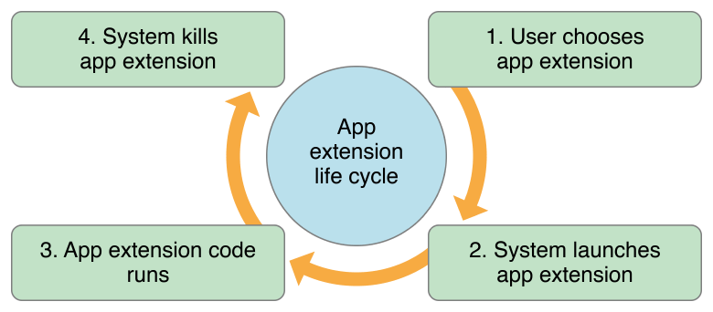

# AppExtension

App Extension是 `iOS 8` 中引入的一个非常重要的新特性, extension并不是一个独立的app，它有一个包含在app bundle中的独立bundle，extension的bundle后缀名是.appex。其生命周期也和普通app不同，extension不能单独存在，必须有一个包含它的containing app     

应用扩展允许开发者扩展应用的自定义功能和内容，能够让用户在使用其他应用程序时使用该项功能，从而实现各个应用程序间的功能和资源共享。可以将扩展理解为一个轻量级（nimble and lightweight）的分身  

---------------------------------------------------------

### 一些关键词 

**containing app**  
containing app我们可以把它理解为容器App, 尽管苹果开放了extension，但是在iOS中extension并不能单独存在，要想提交到AppStore，必须将extension包含在一个app中提交，并且app的实现部分不能为空,这个包含extension的app就叫containing app。
extension会随着containing app的安装而安装，同时随着containing app的卸载而卸载

**extension point**  
系统中支持extension的区域叫做extension point(扩展点)，extension的类别也是据此区分的，iOS上共有以下几种: 
- Today(又被称为widget)
- Share
- Action
- Photo Editing
- Storage Provider
- Custom keyboard

每种extension point的使用方式和适合干的活都不一样，因此不存在通用的extension  

---------------------------------------------------------

### 激活方式  

extension的激活方式：不同的extension激活方式也不同，有的extension需要用户手动激活而有的可以在任何应用里被激活，比如：Today中的widget需要在Today中激活和关闭；Custom keyboard需要在设置中进行相关设置；Photo Editing需要在使用照片时在照片管理器中激活或关闭；Storage Provider可以在选择文件时出现；Share和Action可以在任何应用里被激活，但前提是开发者需要设置Activation Rules，以确定extension需要在合适出现 

---------------------------------------------------------

### 生命周期  

以下是苹果官方提供的图片：

1. 用户选择要使用的App extension
2. 系统启动App Extension
3. App Extension 代码运行
4. 运行完之后系统kill掉App Extension

这就是App Extension的生命周期，举个例子：

一个Share Extension，在图库里面你选择了一张图片，然后点击分享，选择你的Share Extension(第一步)，此时系统会启动你的Share Extension（第二步）。然后你将选择的图片分享到指定的程序（例如微信的发送给朋友）（第三步）。接下来分享页面关闭，系统kill掉了Share Extension

---------------------------------------------------------

### App Extension的通信方式  

App Extension主要的通信是和他的host app   
Host app (如微信)  ； App extension （safari里面分享点击出来的微信extension）；Containing app (safari)  

  

