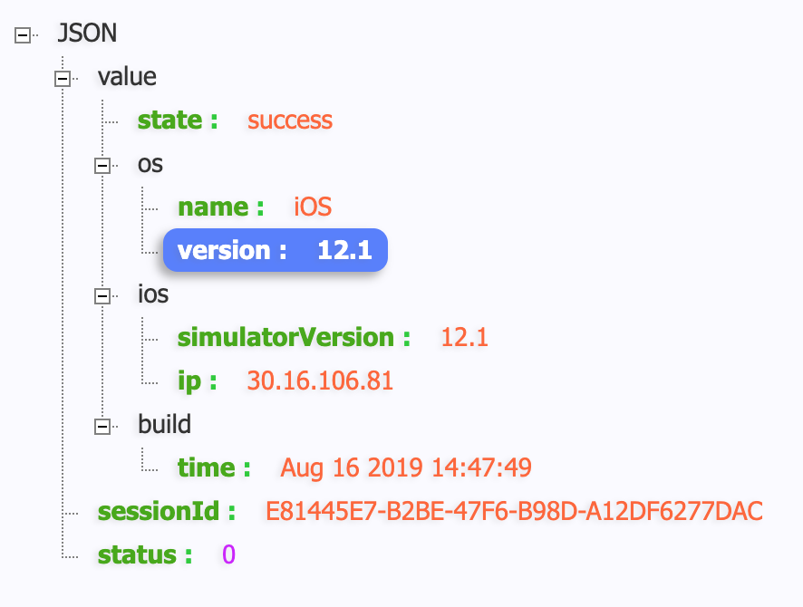
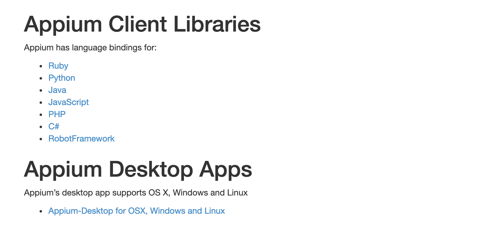
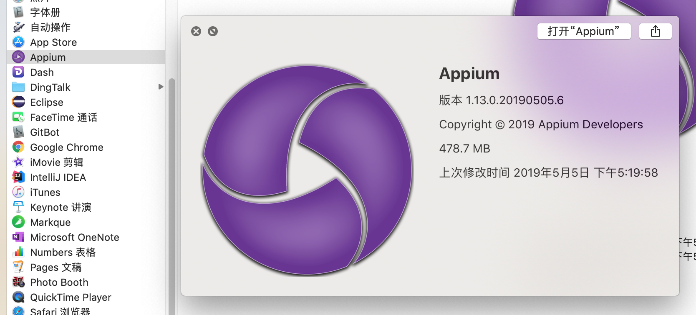
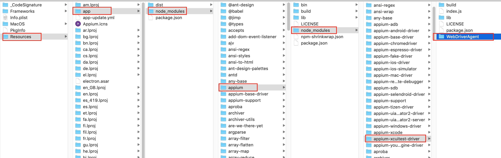
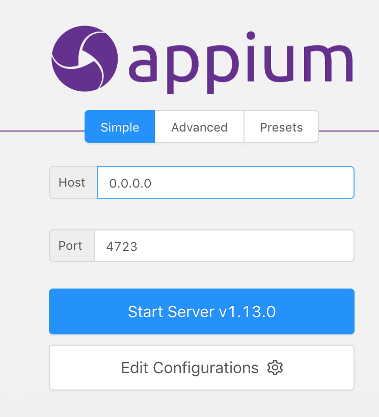
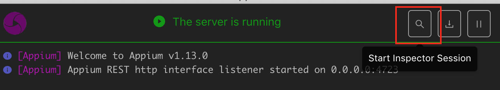
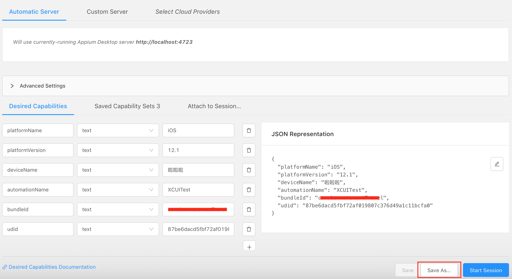
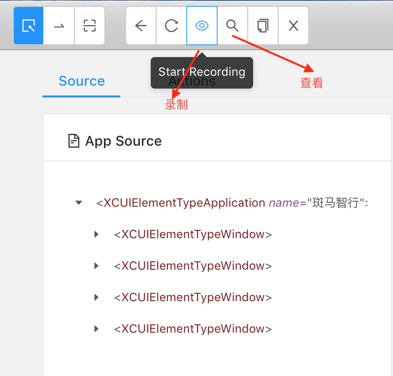
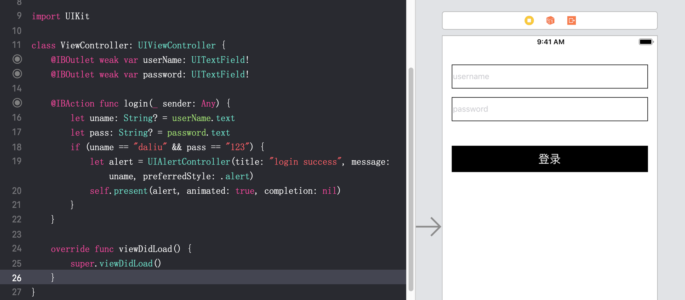

# Appium测试

在[上一篇单元测试中](./单元测试.md)，我们简要说明了在XCode中书写测试用例的方法，此处我们讨论自动测试。
Apple给出的对UI界面的模拟测试实在不够友好，网上的[Appium官网](http://appium.io)可以帮助我们通过运行我们的脚本自动完成模拟测试。

要学习Appium之前，要对WebDriverAgent先有所了解。[WebDriverAgent](https://github.com/facebookarchive/WebDriverAgent)是Facebook推出的开源框架：
> WebDriverAgent is a WebDriver server implementation for iOS that can be used to remote control iOS devices. It allows you to launch & kill applications, tap & scroll views or confirm view presence on a screen. This makes it a perfect tool for application end-to-end testing or general purpose device automation. It works by linking XCTest.framework and calling Apple's API to execute commands directly on a device. WebDriverAgent is developed and used at Facebook for end-to-end testing and is successfully adopted by Appium.

WebDriverAgent简称WDA，Facebook推出，在iOS客户端实现了WebDriver大部分协议的Server，多用于自动化测试，WebDriverAgent已经锁版，其中的一些代码是Appium团队贡献的。
WDA基于Accessibility、XCTest.framework和UIAutomation.framework，实现了对APP的各种操作。

### 体验WebDriverAgent

[GitHub](https://github.com/facebookarchive/WebDriverAgent)中有使用的教程，在运行了脚本`./Scripts/bootstrap.sh`和下载依赖包之后，可以使用XCode打开项目，配置好profile并运行在手机上，如果是模拟器体验，不需要profile等配置, 然后使用Product > Test运行或者Cmd + U. 运行起来之后，XCode会log出server的地址，形如：`ServerURLHere->http://30.16.106.81:8100<-ServerURLHere`, 然后在浏览器中键入`http://30.16.106.81:8100/status`即可看到真机或模拟器信息。
以下是使用模拟器测试，通过chrome访问的结果：

如果某个浏览器不可以正常访问，可以换用其他浏览器或使用`curl http://30.16.106.81:8100/status`查看。

真机测试需要配置profile等证书信息，我这里使用wildcard profile配置，通过浏览器或`curl http://30.16.106.81:8100/status`访问结果如下：

```
{
  "value" : {
    "state" : "success",
    "os" : {
      "name" : "iOS",
      "version" : "12.1.4"
    },
    "ios" : {
      "simulatorVersion" : "12.1.4",
      "ip" : "30.16.106.61"
    },
    "build" : {
      "time" : "Aug 15 2019 10:51:59"
    }
  },
  "sessionId" : "090A6E9F-6652-4F92-A2BF-A666524E9091",
  "status" : 0
}
```

### 体验Appium

[Appium官网](http://appium.io)
WebDriverAgent作为底层服务，被成功集成在了Appium上，[这里](http://appium.io/docs/en/about-appium/getting-started/index.html#getting-started)是Appium的使用教程。Appium 是一款用于测试 Mobile App 的开源自动化测试框架，分为 UI 版本与命令行版本两种. 无论采用哪一种，需先安装依赖库，首先，`XCode, homebrew, carthage, node, npm`这些基本工具需要安装。[这里](https://www.jianshu.com/p/efa9ac4900a6)也有一些安装教程。

- 安装 libimobiledevice：

```
brew install libimobiledevice --HEAD
npm install -g ios-deploy #如果是iOS10以上的系统才需要安装
```

- 安装 appium-doctor

```
npm install appium-doctor -g
appium-doctor --ios // appium-doctor 安装完成后执行，查看 iOS 相关配置是否成功。如果存在红叉情况，安装对应的工具就可以了
```

这些东西安装好之后，建议安装appium-desktop，即appium的UI版，否则打appium的各种命令实在太过烦琐。可在 [这里](http://appium.io/downloads.html)下载最新版本。



这里面Appium Client Libraries是针对不同语言的代码示例，这里下载Python示例，AppiumDesktop Apps就是我们先要下载的桌面客户端，根据appium要求，下载解压后，需要把app放在Application目录下。




这个Appium应用自带了WebDriverAgent, 但是我多次运行出错，网上同学说appium自带的WebDriverAgent 有缺陷，所以这里我把Appium中的WebDriverAgent替换成了上面下载好并配置好profile证书的WebDriverAgent, 右键Appium > 显示包内容 > `Contents/Resources/app/node_modules/appium/node_modules/appium-xcuitest-driver/WebDriverAgent`



接下来就可以打开appium:

点击Start Server > Start Inspector Session


之后点击"+"需要填写一些key-value值，从而让appium启动起来，这里以真机测试为例：



根据[官网的信息](http://appium.io/docs/en/about-appium/getting-started/?lang=zh#setting-up-the-appium-client)，这些字段意义：

- platformName: the name of the platform to automate
- platformVersion: the version of the platform to automate
- deviceName: the kind of device to automate
- app: the path to the app you want to automate (but use the browserName capability instead in the case of automating a web browser), 注，app是ipa包的地址，但是一般我们测试时使用的是bundleId, 前提是我们要测试的app已安装在手机或模拟器上了，app or bundleId： specifies the application (local path or url referencing your signed .ipa file) , or, if it is already installed, simply the bundle identifier of the app so that Appium can launch it.
- automationName: the name of the driver you wish to use， `automationName`是driver的名字，appium为测试不同的端，使用了不同的driver, 对于iOS, driver填写`XCUITest`即可

这些字段被称为`Capabilities`，appium的官网[在这里](http://appium.io/docs/en/writing-running-appium/caps/index.html)有一个针对Capabilities的详细的列表说明. 

点击Start Session运行成功之后会出现我们的被测app的界面。

我们可以通过录制，查找让appium生成一些代码。下面通过一个示例演示，界面上有一个用户名和密码输入框，和一个登录按钮，我们让脚本输入用户名和密码，点击登录。



[官网](http://appium.io/docs/en/about-appium/getting-started/index.html)
[简书文章](https://www.jianshu.com/p/1cd188457bf4)
[WebDriverAgent的使用](https://www.jianshu.com/p/ee40fb29a137)
[CSDN](https://www.cnblogs.com/zhanggui/archive/2018/06/28/9239827.html)

