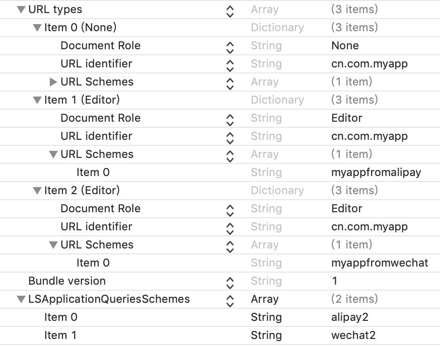
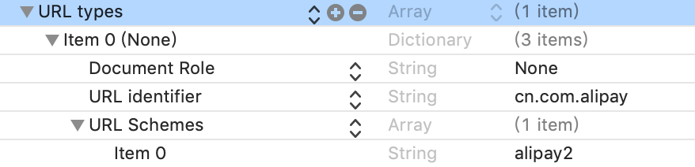
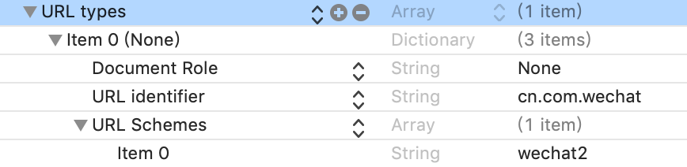

# App之间跳转

先看代码：

```Objective-C
NSURL *url = [NSURL URLWithString:@"SomeApp://xxx"];
if ([[UIApplication sharedApplication] canOpenURL:url]) {
    [[UIApplication sharedApplication] openURL:url];
}
```

1. `[[UIApplication sharedApplication] canOpenURL:url]`： 查找`Info.plist`下`LSApplicationQueriesSchemes`选项中是否存在`SomeApp`，如果存在则表示`can open`，通常配置在 `LSApplicationQueriesSchemes`选项中的Schema名字即白名单。
2. `[[UIApplication sharedApplication] openURL:url]`： 打开url, 即打开schema为`SomeApp`的应用。这个`SomeApp`需要在其Info.plist中的URL types中配置形如：
- URL types
  - item0
    - URL identifier: 此应用的identififier
    - URL Schemes
      - item0: SomeApp

思路明确，要从A打开B，需要:
1. 在A的Plist文件的LSApplicationQueriesSchemes选项中配置Schema名称
2. 在B的Plist文件的URL type选项中配置Schema.

同理，如果要从B打开A，需要：
1. 在B的Plist文件的LSApplicationQueriesSchemes选项中配置Schema名称
2. 在A的Plist文件的URL type选项中配置Schema.

另外，比如从B跳回A，则会回调方式：

```Objective-C
+ (BOOL)application:(UIApplication *)application openURL:(NSURL *)url sourceApplication:(NSString *)sourceApplication annotation:(id)annotation
```

接下来我们写三个App: `MyApp`，`AliPay`，`WeChat`, 从MyApp里可以分别跳转到AliPay和WeChat中完成支付，然后再跳转回来并传一些参数。

我们先在这三个APP里编辑URL Types以表示自己的Schema，可以在Info.plist中添加`URL types`，也可以在TARGETS->Info->URL Types中直接编辑。
这个三APP配置如下：

MyApp


AliPay


WeChat


MyApp

```Objective-C
// AppDelegate.m
- (BOOL)application:(UIApplication *)app openURL:(NSURL *)url options:(NSDictionary<UIApplicationOpenURLOptionsKey, id> *)options {
    NSLog(@"从%@回到MyApp", url);
    return YES;
}

// ViewController.m
#import "ViewController.h"

@interface ViewController ()

@end

@implementation ViewController

- (void)viewDidLoad {
    [super viewDidLoad];
}

- (void)showAlert:(NSString *)identifier scheme:(NSString *)scheme {
    UIAlertController *controller = [UIAlertController alertControllerWithTitle:@"AliPay" message:@"支付完成" preferredStyle:UIAlertControllerStyleAlert];
    [controller addAction:[UIAlertAction actionWithTitle:@"OK" style:UIAlertActionStyleDefault handler:^(UIAlertAction * _Nonnull action) {
    }]];
    [self presentViewController:controller animated:YES completion:nil];
}


- (IBAction)aliPay:(id)sender {
    NSURL *url = [NSURL URLWithString:@"alipay2://toalipay"]; // 这里的scheme即`alipay`，scheme一般不推荐大写，而且不允许带_等特殊字符，否则会被认为是非法的scheme
    if ([[UIApplication sharedApplication] canOpenURL:url]) {
        // UIApplicationOpenURLOptionsKey
        [[UIApplication sharedApplication] openURL:url options:@{UIApplicationOpenURLOptionUniversalLinksOnly:@(NO)} completionHandler:^(BOOL success) {
            if (success) {
                NSLog(@"open success");
            }
        }];
    }
}

- (IBAction)wechatPay:(id)sender {
    NSURL *url = [NSURL URLWithString:@"wechat2://towechat"];
    if ([[UIApplication sharedApplication] canOpenURL:url]) {
        [[UIApplication sharedApplication] openURL:url options:@{UIApplicationOpenURLOptionUniversalLinksOnly:@(NO)} completionHandler:^(BOOL success) {
            if (success) {
                NSLog(@"open success");
            }
        }];
    }
}

@end
```

AliPay

```Objective-C
// AppDelegate.m

// 其他APP打开自己时触发
- (BOOL)application:(UIApplication *)app openURL:(NSURL *)url options:(NSDictionary<UIApplicationOpenURLOptionsKey, id> *)options NS_AVAILABLE_IOS(9_0) {
    NSLog(@"-- url: %@", url);
    NSLog(@"-- bundle identifier: %@", [options objectForKey:UIApplicationOpenURLOptionsSourceApplicationKey]);
    [self showAlert:[options objectForKey:UIApplicationOpenURLOptionsSourceApplicationKey] scheme:url.host];
    return YES;
}

- (void)showAlert:(NSString *)identifier scheme:(NSString *)scheme {
    if ([identifier isEqualToString:@"cn.com.myapp"]) {
        UIAlertController *controller = [UIAlertController alertControllerWithTitle:@"AliPay" message:@"支付完成" preferredStyle:UIAlertControllerStyleAlert];
        [controller addAction:[UIAlertAction actionWithTitle:@"留在alipay" style:UIAlertActionStyleDefault handler:^(UIAlertAction * _Nonnull action) {
        }]];
        [controller addAction:[UIAlertAction actionWithTitle:@"返回MyApp" style:UIAlertActionStyleDefault handler:^(UIAlertAction * _Nonnull action) {
            [self returnMyApp];
        }]];
        [self.window.rootViewController presentViewController:controller animated:YES completion:nil];
    }
}

- (void)returnMyApp {
    NSURL *url = [NSURL URLWithString:@"myappfromalipay://paysuccess"];
    [[UIApplication sharedApplication] openURL:url options:@{UIApplicationOpenURLOptionUniversalLinksOnly:@(NO)} completionHandler:^(BOOL success) {
        if (success) {
            NSLog(@"open success");
        }
    }];
}
```

WeChat

```Objective-C

// 其他APP打开自己时触发
- (BOOL)application:(UIApplication *)app openURL:(NSURL *)url options:(NSDictionary<UIApplicationOpenURLOptionsKey, id> *)options NS_AVAILABLE_IOS(9_0) {
    NSLog(@"-- url: %@", url);
    NSLog(@"-- bundle identifier: %@", [options objectForKey:UIApplicationOpenURLOptionsSourceApplicationKey]);
    [self showAlert:[options objectForKey:UIApplicationOpenURLOptionsSourceApplicationKey] scheme:url.host];
    return YES;
}

- (void)showAlert:(NSString *)identifier scheme:(NSString *)scheme {
    if ([identifier isEqualToString:@"cn.com.myapp"]) {
        UIAlertController *controller = [UIAlertController alertControllerWithTitle:@"WeChatPay" message:@"微信支付完成" preferredStyle:UIAlertControllerStyleAlert];
        [controller addAction:[UIAlertAction actionWithTitle:@"留在微信" style:UIAlertActionStyleDefault handler:^(UIAlertAction * _Nonnull action) {
        }]];
        [controller addAction:[UIAlertAction actionWithTitle:@"返回MyApp" style:UIAlertActionStyleDefault handler:^(UIAlertAction * _Nonnull action) {
            [self returnMyApp];
        }]];
        [self.window.rootViewController presentViewController:controller animated:YES completion:nil];
    }
}

- (void)returnMyApp {
    NSURL *url = [NSURL URLWithString:@"myappfromwechat://paysuccess"];
    [[UIApplication sharedApplication] openURL:url options:@{UIApplicationOpenURLOptionUniversalLinksOnly:@(NO)} completionHandler:^(BOOL success) {
        if (success) {
            NSLog(@"open success");
        }
    }];
}
```


