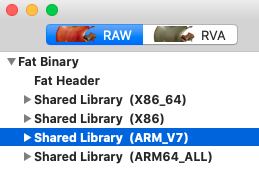
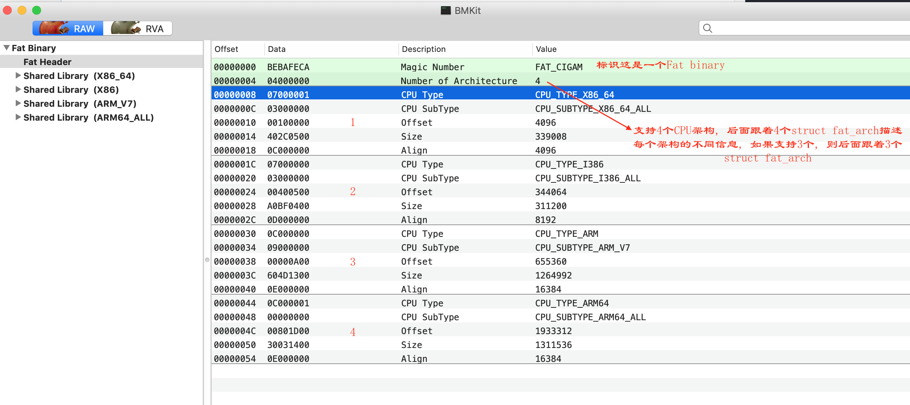
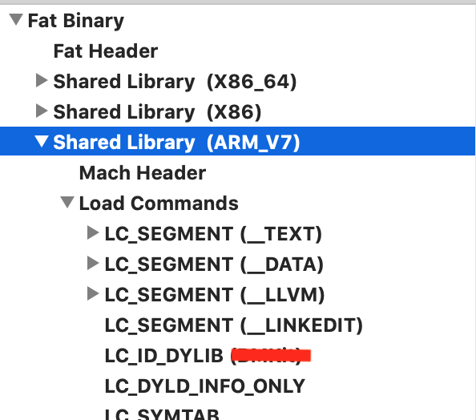

# MacO文件分析

参考: 

### What is Mach-O file  

Brief description taken from Wikipedia:

> Mach-O, short for Mach object file format, is a file format for executables, object code, shared libraries, dynamically-loaded code, and core dumps. A replacement for the a.out format, Mach-O offers more extensibility and faster access to information in the symbol table.

> Mach-O is used by most systems based on the Mach kernel. NeXTSTEP, OS X, and iOS are examples of systems that have used this format for native executables, libraries and object code.

Mach-O格式全称为Mach Object文件格式的缩写，是mac上可执行文件的格式，类似于windows上的PE格式 (Portable Executable ), linux上的elf格式 (Executable and Linking Format)。可以使用MachOView软件打开查看Mach-O格式的文件: 

- MachOView下载地址：[http://sourceforge.net/projects/machoview/](https://link.jianshu.com?t=http://sourceforge.net/projects/machoview/)
- MachOView源码地址：[https://github.com/gdbinit/MachOView](https://link.jianshu.com?t=https://github.com/gdbinit/MachOView)

### 常见的 Mach-O 文件类型

Mach-O是Mach object的缩写，是Mac\iOS上用于存储程序、库的标准格式
属于Mach-O格式的文件类型有:

| MH_OBJECT      | MH_EXECUTE | MH_DYLIB   | MH_DYLINKER    | MH_DSYM                        |
| -------------- | ---------- | ---------- | -------------- | ---------- |
| 目标文件（.o） | 可执行文件 | 动态库文件 DSO或DLL | 动态链接编辑器 | 存储着二进制文件符号信息的文件 |

简记为：  
1、Executable：应用的主要二进制  
2、Dylib Library：动态链接库（又称DSO或DLL）  
3、Static Library：静态链接库  
4、Bundle：不能被链接的Dylib，只能在运行时使用dlopen( )加载，可当做**macOS**的插件  
5、Relocatable Object File ：可重定向文件类型  

---------------------------------------------




| Section  | 用途 |
| ------------- | ------------- |
| `__TEXT.__tex`  | 主程序代码  |
| `__TEXT.__cstring`  | C 语言字符串  |
| `__TEXT.__const` | const 关键字修饰的常量 |
| `__TEXT.__stubs` | 用于 Stub 的占位代码，很多地方称之为桩代码 |
| `__TEXT.__stubs_helper` | 当 Stub 无法找到真正的符号地址后的最终指向 |
| `__TEXT.__objc_methname` | Objective-C 方法名称 |
| `__TEXT.__objc_methtype` | Objective-C 方法类型 |
| `__TEXT.__objc_classname` | Objective-C 类名称 |
| `__DATA.__data` | 初始化过的可变数据 |
| `__DATA.__la_symbol_ptr` | lazy binding 的指针表，表中的指针一开始都指向 `__stub_helper` |
| `__DATA.__const` | 没有初始化过的常量  |
| `__DATA.__cfstring` | 程序中使用的 Core Foundation 字符串（CFStringRefs） |
| `__DATA.__bss` | BSS，存放为初始化的全局变量，即常说的静态内存分配 |
| `__DATA.__common` | 没有初始化过的符号声明 |
| `__DATA.__objc_classlist` | objc类列表 |
| `__DATA.__objc_protolist` | objc协议列表 |
| `__DATA.__objc_imginfo` | objc 镜像信息 |
| `__DATA.__objc_selfrefs` | 引用到的objc方法 |
| `__DATA.__objc_protorefs` | 引用到的objc协议 |
| `__DATA.__objc_superrefs` | objc超类引用 |

上图是使用MacOView软件打开的一个Fat binary动态库, 这是典型的一个Mac-O文件, 上面显示的"Fat header"是"Fat binary"的header, "Fat binary"实质上是说支持了不同CPU架构的二进制文件, 看上面此动态库同时支持X86_64, X86, ARM_V7, ARM64_ALL这四种CPU架构, 因此它是"Fat binary"的. [这里](https://en.wikipedia.org/wiki/Fat_binary)也解释了什么是"Fat binary": A fat binary (or multiarchitecture binary) is a computer executable program which has been expanded (or "fattened") with code native to multiple instruction sets which can consequently be run on multiple processor types. This results in a file larger than a normal one-architecture binary file, thus the name.  Every Multi-Architecture Binary starts with a structure (struct fat_header) containing two unsigned integers. The first integer ("magic") is used as a [magic number](https://en.wikipedia.org/wiki/File_format#Magic_number) to identify this file as a Fat Binary. The second integer ("nfat_arch") defines how many Mach-O Files the archive contains (how many instances of the same program for different architectures). After this header, there are *nfat_arch* number of fat_arch structures (struct fat_arch). This structure defines the offset (from the start of the file) at which to find the file, the alignment, the size and the CPU type and subtype which the Mach-O binary (within the archive) is targeted at.



- Mach-O 被划分成一些 segement，每个 segement 又被划分成一些 section 
- segment 的名字都是大写的，且空间大小为页的整数, 页的大小跟硬件有关，在 arm64 架构一页是 16KB，其余为 4KB. - section 虽然没有整数倍页大小的限制，但是 section 之间不会有重叠  

几乎所有 Mach-O 都包含这三个段（segment）： `__TEXT`,`__DATA` 和 `__LINKEDIT`：

- `__TEXT` 包含 Mach header，被执行的代码和只读常量（如C 字符串）。只读可执行（r-x）。
- `__DATA` 包含全局变量，静态变量等。可读写（rw-）。
- `__LINKEDIT` 包含了加载程序的『元数据』，比如函数的名称和地址。只读（r–）



在多个进程加载 Mach-O 镜像时 `__TEXT` 和 `__LINKEDIT` 因为只读，都是可以共享内存的。而 `__DATA` 因为可读写，就会产生 dirty page。当 dyld 执行结束后，`__LINKEDIT` 就没用了，对应的内存页会被回收  

上面使用MachOView这个软件可以方便直接的查看到Mac-O文件的内部结构，Apple也提供了一些命令用于查看Mac-O的一些信息，比如下图是一个动态库：


这里的动态库DaLiuBase.framework里的DaLiuBase就是一个Mac-O文件：  

```
# 通过file命令查看Mac-O文件类型
$ file DaLiuBase

DaLiuBase: Mach-O universal binary with 4 architectures: [i386:Mach-O dynamically linked shared library i386] [x86_64:Mach-O 64-bit dynamically linked shared library x86_64] [arm_v7] [arm64]
DaLiuBase (for architecture i386):	Mach-O dynamically linked shared library i386
DaLiuBase (for architecture x86_64):	Mach-O 64-bit dynamically linked shared library x86_64
DaLiuBase (for architecture armv7):	Mach-O dynamically linked shared library arm_v7
DaLiuBase (for architecture arm64):	Mach-O 64-bit dynamically linked shared library arm64

# 通过lipo查看此Mac-O支持的cpu架构
% lipo -info DaLiuBase 
Architectures in the fat file: DaLiuBase are: i386 x86_64 armv7 arm64 
也可以导出某种特定架构：lipo 文件路径 -thin 架构类型 -output 输出文件路径
合并多种架构：lipo 文件路径1 文件路径2 -output 输出文件路径
```

比较常用的是XCode自带的otool命令 [参考](https://www.jianshu.com/p/fc67f95eee41)：  

```
$ otool --help  

Usage: /Applications/Xcode.app/Contents/Developer/Toolchains/XcodeDefault.xctoolchain/usr/bin/otool [-arch arch_type] [-fahlLDtdorSTMRIHGvVcXmqQjCP] [-mcpu=arg] [--version] <object file> ...
	-f print the fat headers # 打印fat header
	-a print the archive header
	-h print the mach header # 查看头结构
	-l print the load commands # 打印load command信息
	-L print shared libraries used # 查看引用的其他库
	-D print shared library id name
	-t print the text section (disassemble with -v)
	-x print all text sections (disassemble with -v)
	-p <routine name>  start dissassemble from routine name
	-s <segname> <sectname> print contents of section
	-d print the data section
	-o print the Objective-C segment
	-r print the relocation entries
	-S print the table of contents of a library (obsolete)
	-T print the table of contents of a dynamic shared library (obsolete)
	-M print the module table of a dynamic shared library (obsolete)
	-R print the reference table of a dynamic shared library (obsolete)
	-I print the indirect symbol table
	-H print the two-level hints table (obsolete)
	-G print the data in code table
	-v print verbosely (symbolically) when possible
	-V print disassembled operands symbolically
	-c print argument strings of a core file
	-X print no leading addresses or headers
	-m don't use archive(member) syntax
	-B force Thumb disassembly (ARM objects only)
	-q use llvm's disassembler (the default)
	-Q use otool(1)'s disassembler
	-mcpu=arg use `arg' as the cpu for disassembly
	-j print opcode bytes
	-P print the info plist section as strings
	-C print linker optimization hints
	--version print the version of /Applications/Xcode.app/Contents/Developer/Toolchains/XcodeDefault.xctoolchain/usr/bin/otool
```

比如查看上面Mac-O文件DaLiuBase的fat header:  

```
% otool -f DaLiuBase 
Fat headers
fat_magic 0xcafebabe
nfat_arch 4
architecture 0
    cputype 7
    cpusubtype 3
    capabilities 0x0
    offset 4096
    size 729792
    align 2^12 (4096)
architecture 1
    cputype 16777223
    cpusubtype 3
    capabilities 0x0
    offset 737280
    size 782416
    align 2^12 (4096)
architecture 2
    cputype 12
    cpusubtype 9
    capabilities 0x0
    offset 1523712
    size 2587044
    align 2^14 (16384)
architecture 3
    cputype 16777228
    cpusubtype 0
    capabilities 0x0
    offset 4112384
    size 2662136
    align 2^14 (16384)
```

---------------------------------------------

## Mach-O format 

Mach-O doesn’t have any special format like XML/YAML/JSON/whatnot, it’s just a binary stream of bytes grouped in meaningful data chunks. These chunks contain a meta-information, e.g.: byte order, cpu type, size of the chunk and so on.  

Typical Mach-O file ([Copy of offical document](https://github.com/aidansteele/osx-abi-macho-file-format-reference)) consists of a three regions:   

1. Header - contains general information about the binary: byte order (magic number), cpu type, amount of load commands etc.
2. Load Commands - it’s kind of a table of contents, that describes position of segments, symbol table, dynamic symbol table etc. Each load command includes a meta-information, such as type of command, its name, position in a binary and so on.
3. Data - usually the biggest part of object file. It contains code and data, such as symbol tables, dynamic symbol tables and so on.  

Here is a simplified graphical representation:  

  

There are two types of object files on OS X: Mach-O files and Universal Binaries, also so-called Fat files. The difference between them: Mach-O file contains object code for one architecture (i386, x86_64, arm64, etc.) while Fat binaries might contain several object files, hence contain object code for different architectures (i386 and x86_64, arm and arm64, etc.)  

The structure of a Fat file is pretty straightforward: fat header followed by Mach-O files:  

  

## Parse Mach-O file  

大致了解些Mac-O的文件结构，接下来手动解析一下， Apple并没有提供解析Mach-O文件的工具, 因此我们需要自己解析.  下面内容根据[这篇文章](https://lowlevelbits.org/parsing-mach-o-files/)来简单用代码解析一下Mac-O文件
首先要获取Mac-O文件中对应的一些数据结构, 在[这里](https://github.com/opensource-apple/dyld)可以下载Apple 的 dyld源码, 我们可以在`/usr/include/mach-o/*`中获取一系列用于描述Mach-O文件的C结构体   


### Memory Representation  

Before we start with parsing let’s look at detailed representation of a Mach-O file. For simplicity the following object file is a Mach-O file (not a fat file) for i386 with just two data entries that are segments.  


The only structures we need to represent the file: (From source code of dyld: usr/includes/loader.h)  

```c
// 注: 此处是32-bit mac header为例, 64-bit多了一个uint32_t reserved;字段
struct mach_header {
	uint32_t	magic;		/* mach magic number identifier */
	cpu_type_t	cputype;	/* cpu specifier */
	cpu_subtype_t	cpusubtype;	/* machine specifier */
	uint32_t	filetype;	/* type of file */
	uint32_t	ncmds;		/* number of load commands */
	uint32_t	sizeofcmds;	/* the size of all the load commands */
	uint32_t	flags;		/* flags */
};

struct segment_command { /* for 32-bit architectures */
	uint32_t	cmd;		/* LC_SEGMENT */
	uint32_t	cmdsize;	/* includes sizeof section structs */
	char		segname[16];	/* segment name */
	uint32_t	vmaddr;		/* memory address of this segment */
	uint32_t	vmsize;		/* memory size of this segment */
	uint32_t	fileoff;	/* file offset of this segment */
	uint32_t	filesize;	/* amount to map from the file */
	vm_prot_t	maxprot;	/* maximum VM protection */
	vm_prot_t	initprot;	/* initial VM protection */
	uint32_t	nsects;		/* number of sections in segment */
	uint32_t	flags;		/* flags */
};
```


