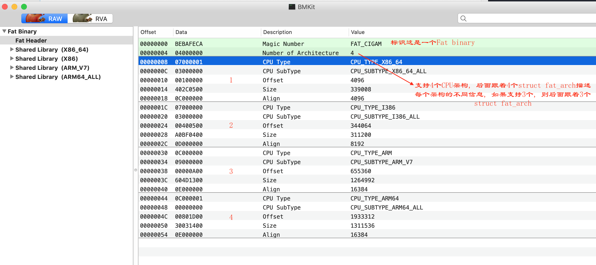
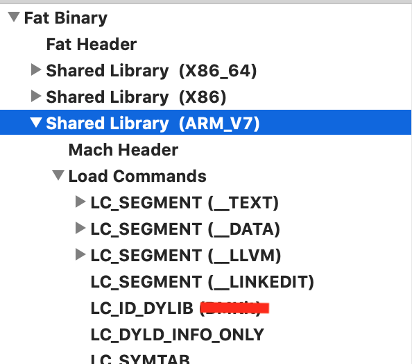

# MachOView

参考:
- [https://www.jianshu.com/p/175925ab3355](https://www.jianshu.com/p/175925ab3355)  
- [http://yulingtianxia.com/blog/2016/10/30/Optimizing-App-Startup-Time/#dyld-%E5%8A%A0%E8%BD%BD-dylib-%E6%96%87%E4%BB%B6](http://yulingtianxia.com/blog/2016/10/30/Optimizing-App-Startup-Time/#dyld-%E5%8A%A0%E8%BD%BD-dylib-%E6%96%87%E4%BB%B6)

Mach-O格式全称为Mach Object文件格式的缩写，是mac上可执行文件的格式，类似于windows上的PE格式 (Portable Executable ), linux上的elf格式 (Executable and Linking Format)。可以使用MachOView软件打开查看Mach-O格式的文件: 

- MachOView下载地址：[http://sourceforge.net/projects/machoview/](https://link.jianshu.com?t=http://sourceforge.net/projects/machoview/)
- MachOView源码地址：[https://github.com/gdbinit/MachOView](https://link.jianshu.com?t=https://github.com/gdbinit/MachOView)

**mach-o文件类型分为：**

1、Executable：应用的主要二进制  
2、Dylib Library：动态链接库（又称DSO或DLL）  
3、Static Library：静态链接库  
4、Bundle：不能被链接的Dylib，只能在运行时使用dlopen( )加载，可当做**macOS**的插件  
5、Relocatable Object File ：可重定向文件类型  

Image镜像： executable，dylib 或 bundle
Framework： 包含 Dylib 以及资源文件和头文件的文件夹

上图是通过MachOView打开的一个我本机上的一个动态库, 此动态库依赖了其他动态库, 上面显示的"Fat header"是"Fat binary"的header, "Fat binary"实质上是说支持了不同CPU架构的二进制文件, 看上面此动态库同时支持X86_64, X86, ARM_V7, ARM64_ALL这四种CPU架构, 因此它是"Fat binary"的. [这里](https://en.wikipedia.org/wiki/Fat_binary)也解释了什么是"Fat binary": A fat binary (or multiarchitecture binary) is a computer executable program which has been expanded (or "fattened") with code native to multiple instruction sets which can consequently be run on multiple processor types. This results in a file larger than a normal one-architecture binary file, thus the name.  Every Multi-Architecture Binary starts with a structure (struct fat_header) containing two unsigned integers. The first integer ("magic") is used as a [magic number](https://en.wikipedia.org/wiki/File_format#Magic_number) to identify this file as a Fat Binary. The second integer ("nfat_arch") defines how many Mach-O Files the archive contains (how many instances of the same program for different architectures). After this header, there are *nfat_arch* number of fat_arch structures (struct fat_arch). This structure defines the offset (from the start of the file) at which to find the file, the alignment, the size and the CPU type and subtype which the Mach-O binary (within the archive) is targeted at.

------------------------------------

- Mach-O 被划分成一些 segement，每个 segement 又被划分成一些 section 
- segment 的名字都是大写的，且空间大小为页的整数, 页的大小跟硬件有关，在 arm64 架构一页是 16KB，其余为 4KB. - section 虽然没有整数倍页大小的限制，但是 section 之间不会有重叠  

几乎所有 Mach-O 都包含这三个段（segment）： `__TEXT`,`__DATA` 和 `__LINKEDIT`：

- `__TEXT` 包含 Mach header，被执行的代码和只读常量（如C 字符串）。只读可执行（r-x）。
- `__DATA` 包含全局变量，静态变量等。可读写（rw-）。
- `__LINKEDIT` 包含了加载程序的『元数据』，比如函数的名称和地址。只读（r–）

在多个进程加载 Mach-O 镜像时 `__TEXT` 和 `__LINKEDIT` 因为只读，都是可以共享内存的。而 `__DATA` 因为可读写，就会产生 dirty page。当 dyld 执行结束后，`__LINKEDIT` 就没用了，对应的内存页会被回收

------------------------------------

### 从 `exec()` 到 `main()`

`exec()` 是一个系统调用。系统内核把应用映射到新的地址空间，且每次起始位置都是随机的（因为使用 ASLR）。并将起始位置到 `0x000000` 这段范围的进程权限都标记为不可读写不可执行。如果是 32 位进程，这个范围**至少**是 4KB；对于 64 位进程则**至少**是 4GB。NULL 指针引用和指针截断误差都是会被它捕获

------------------------------------

###`dyld` 加载 dylib 文件

Unix 的前二十年很安逸，因为那时还没有发明动态链接库。有了动态链接库后，一个用于加载链接库的帮助程序被创建。在苹果的平台里是 `dyld`，其他 Unix 系统也有 [`ld.so`](https://zh.wikipedia.org/wiki/Ld.so)。 当内核完成映射进程的工作后会将名字为 `dyld` 的Mach-O 文件映射到进程中的随机地址，它将 PC 寄存器设为 `dyld` 的地址并运行。`dyld` 在应用进程中运行的工作是加载应用依赖的所有动态链接库，准备好运行所需的一切，它拥有的权限跟应用一样。

下面的步骤构成了 `dyld` 的时间线：

Load dylibs -> Rebase -> Bind -> ObjC -> Initializers

------------------------------------

#### Fix-ups

在加载所有的动态链接库之后，它们只是处在相互独立的状态，需要将它们绑定起来，这就是 Fix-ups, `dyld` 做的事情就是修正（fix-up）指针和数据。Fix-up 有两种类型，rebasing 和 binding, Rebasing：在镜像内部调整指针的指向
Binding：将指针指向镜像外部的内容

------------------------------------

#### ObjC Runtime

Objective-C 中有很多数据结构都是靠 Rebasing 和 Binding 来修正（fix-up）的，比如 `Class` 中指向超类的指针和指向方法的指针。

ObjC 是个动态语言，可以用类的名字来实例化一个类的对象。这意味着 ObjC Runtime 需要维护一张映射类名与类的全局表。当加载一个 dylib 时，其定义的所有的类都需要被注册到这个全局表中。 

------------------------------------

Objective-C 中有很多数据结构都是靠 Rebasing 和 Binding 来修正（fix-up）的，比如 `Class` 中指向超类的指针和指向方法的指针。

ObjC 是个动态语言，可以用类的名字来实例化一个类的对象。这意味着 ObjC Runtime 需要维护一张映射类名与类的全局表。当加载一个 dylib 时，其定义的所有的类都需要被注册到这个全局表中。

C++ 中有个问题叫做易碎的基类（fragile base class）。ObjC 就没有这个问题，因为会在加载时通过 fix-up 动态类中改变实例变量的偏移量。

在 ObjC 中可以通过定义类别（Category）的方式改变一个类的方法。有时你想要添加方法的类在另一个 dylib 中，而不在你的镜像中（也就是对系统或别人的类动刀），这时也需要做些 fix-up。

ObjC 中的 selector 必须是唯一的。

#### Initializers

C++ 会为静态创建的对象生成初始化器。而在 ObjC 中有个叫 `+load` 的方法，然而它被废弃了，现在建议使用 `+initialize`。对比详见：http://stackoverflow.com/questions/13326435/nsobject-load-and-initialize-what-do-they-do

现在有了主执行文件，一堆 dylib，其依赖关系构成了一张巨大的有向图，那么执行初始化器的顺序是什么？自底向上！按照依赖关系，先加载叶子节点，然后逐步向上加载中间节点，直至最后加载根节点。这种加载顺序确保了安全性，加载某个 dylib 前，其所依赖的其余 dylib 文件肯定已经被预先加载。

最后 `dyld` 会调用 `main()` 函数。`main()` 会调用 `UIApplicationMain()`。

------------------------------------

### 改善启动时间  

可以针对 App 启动前的每个步骤进行相应的优化工作。

#### 加载 Dylib

之前提到过加载系统的 dylib 很快，因为有优化。但加载内嵌（embedded）的 dylib 文件很占时间，所以尽可能把多个内嵌 dylib 合并成一个来加载，或者使用 static archive。使用 `dlopen()` 来在运行时懒加载是不建议的，这么做可能会带来一些问题，并且总的开销更大。

#### Rebase/Binding

之前提过 Rebaing 消耗了大量时间在 I/O 上，而在之后的 Binding 就不怎么需要 I/O 了，而是将时间耗费在计算上。所以这两个步骤的耗时是混在一起的。

之前说过可以从查看 `__DATA` 段中需要修正（fix-up）的指针，所以减少指针数量才会减少这部分工作的耗时。对于 ObjC 来说就是减少 `Class`,`selector` 和 `category` 这些元数据的数量。从编码原则和设计模式之类的理论都会鼓励大家多写精致短小的类和方法，并将每部分方法独立出一个类别，其实这会增加启动时间。对于 C++ 来说需要减少虚方法，因为虚方法会创建 vtable，这也会在 `__DATA` 段中创建结构。虽然 C++ 虚方法对启动耗时的增加要比 ObjC 元数据要少，但依然不可忽视。最后推荐使用 Swift 结构体，它需要 fix-up 的内容较少

#### ObjC Setup

针对这步所能事情很少，几乎都靠 Rebasing 和 Binding 步骤中减少所需 fix-up 内容。因为前面的工作也会使得这步耗时减少。

#### Initializer

**显式初始化**

- 使用 `+initialize` 来替代 `+load`
- 不要使用 `__atribute__((constructor))` 将方法显式标记为初始化器，而是让初始化方法调用时才执行。比如使用 `dispatch_once()`,`pthread_once()` 或 `std::once()`。也就是在第一次使用时才初始化，推迟了一部分工作耗时

