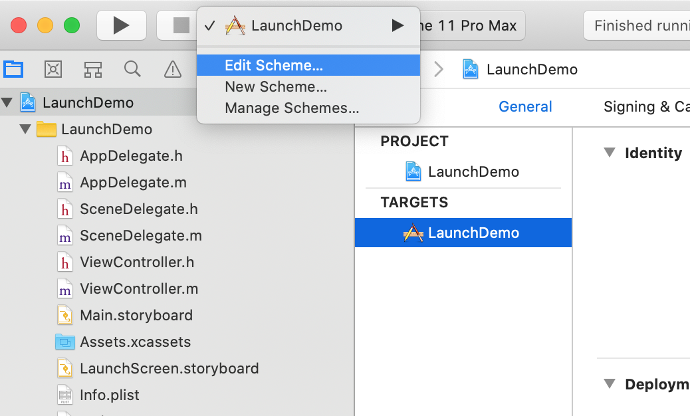
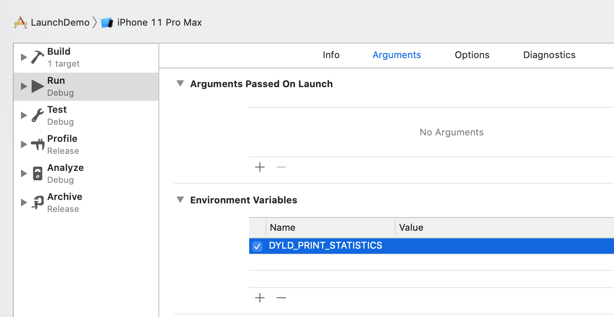
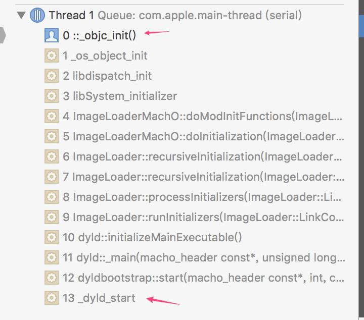

# 优化


参考: 
- [https://www.jianshu.com/p/c9406eff7b89](https://www.jianshu.com/p/c9406eff7b89)  
- [http://www.programmersought.com/article/7495806493/](http://www.programmersought.com/article/7495806493/)
- [mikeash.com](https://www.mikeash.com/pyblog/friday-qa-2012-11-09-dyld-dynamic-linking-on-os-x.html)
- [WWDC](https://developer.apple.com/videos/play/wwdc2016/406/)
- [dyld源码](https://github.com/opensource-apple/dyld)
- [https://blog.csdn.net/cxaa21/article/details/82857740](https://blog.csdn.net/cxaa21/article/details/82857740)
- [https://stackoverflow.com/questions/57750580/does-ios-load-all-the-system-dynamic-framework-into-memory-when-an-app-launches](https://stackoverflow.com/questions/57750580/does-ios-load-all-the-system-dynamic-framework-into-memory-when-an-app-launches)

要优化APP启动， 必须首先明白APP启动都做了什么，APP启动分为热启动和冷启动，热启动是指APP在后台，并未退出，然后从后台进入前台，一般这种情况下APP启动很快，我们也做不了太多事情；这里我们只讨论冷启动：即用户点击ICON进入的APP的启动。  

启动时间主要包括两部分，main函数之前(pre-main)和main函数执行之后到`-(BOOL)Application:(UIApplication *)Application didFinishLaunchingWithOptions:(NSDictionary *)launchOptions`方法执行完成, 也常被称为首屏渲染完成。    

其中main函数执行之后优化主要是让上面的方法尽快执行完，不要有什么block主线程的操作。所以我们可以看出，其实在main里面处理的事情还是比较简单的。所以针对APP启动优化一般指的是在main函数执行之前的启动优化。  

大致流程是：系统先读取App的可执行文件，从里面获得dyld的路径，然后加载dyld，当所有依赖库的初始化后，runtime会对项目中所有类进行类结构初始化，然后调用所有的load方法。最后dyld返回main函数地址，main函数被调用，我们便来到了熟悉的程序入口     

- 加载可执行文件（App 的.o 文件的集合）；
- 加载动态链接库，进行 rebase 指针调整和 bind 符号绑定；
- Objc 运行时的初始处理，包括 Objc 相关类的注册、category 注册、selector 唯一性检查等；
- 初始化，包括了执行 +load() 方法、attribute((constructor)) 修饰的函数的调用、创建 C++ 静态全局变量。

总结起来, App启动一共有三个大的阶段: 

#### 第一阶段dyld（dynamic link editor）
Apple的动态链接器，可以用来装载Mach-O文件（可执行文件、动态库等）  
启动APP时，dyld所做的事情有:

- 装载APP的可执行文件，同时会递归加载所有依赖的动态库
- 当dyld把可执行文件、动态库都装载完毕后，会通知Runtime进行下一步的处理   

Unix 的前二十年很安逸，因为那时还没有发明动态链接库。有了动态链接库后，一个用于加载链接库的帮助程序被创建。在苹果的平台里是 `dyld`，其他 Unix 系统也有 [`ld.so`](https://zh.wikipedia.org/wiki/Ld.so)。 当内核完成映射进程的工作后会将名字为 `dyld` 的Mach-O 文件映射到进程中的随机地址，它将 PC 寄存器设为 `dyld` 的地址并运行。`dyld` 在应用进程中运行的工作是加载应用依赖的所有动态链接库，准备好运行所需的一切，它拥有的权限跟应用一样。

  下面的步骤构成了 `dyld` 的时间线：

  Load dylibs -> Rebase -> Bind -> ObjC -> Initializers

#### 第二阶段 runtime  
启动APP时，runtime所做的事情有:  
- 调用map_images进行可执行文件内容的解析和处理
- 在load_images中调用call_load_methods，调用所有Class和Category的+load方法 (先调用Class的load方法, 再调用Category的) ， 
C++ 会为静态创建的对象生成初始化器。而在 ObjC 中有个叫 `+load` 的方法，然而它被废弃了，现在建议使用 `+initialize`。对比详见：http://stackoverflow.com/questions/13326435/nsobject-load-and-initialize-what-do-they-do
- 进行各种objc结构的初始化（注册Objc类，初始化类对象等等）
- 调用C++静态初始化器和__attribute__((constructor))修饰的函数  

到此为止，可执行文件和动态库中所有的符号（Class，Protocol，Selector，IMP，...)都已经按格式成功加载到内存中，被runtime所管理 

现在有了主执行文件，一堆 dylib，其依赖关系构成了一张巨大的有向图，那么执行初始化器的顺序是什么？自底向上！按照依赖关系，先加载叶子节点，然后逐步向上加载中间节点，直至最后加载根节点。这种加载顺序确保了安全性，加载某个 dylib 前，其所依赖的其余 dylib 文件肯定已经被预先加载。

最后 `dyld` 会调用 `main()` 函数。`main()` 会调用 `UIApplicationMain()`

#### 第三阶段 main  
完成上述二阶段工作后, dyld调用main函数, 接下来就是UIApplicationMain函数，APPDelegate的`application:didFinishLaunchingWithOptions:`方法

----------------------------------------------------------------------------

### 查看启动时间  

可以在XCode中设置`DYLD_PRINT_STATISTICS`环境变量来查看App启动时间   



 

运行项目:  

```
Total pre-main time: 207.95 milliseconds (100.0%)
         dylib loading time: 160.42 milliseconds (77.1%)
        rebase/binding time: 126687488.9 seconds (280621408.4%)
            ObjC setup time:  13.74 milliseconds (6.6%)
           initializer time:  44.93 milliseconds (21.6%)
           slowest intializers :
             libSystem.B.dylib :  10.27 milliseconds (4.9%)
   libBacktraceRecording.dylib :   4.85 milliseconds (2.3%)
    libMainThreadChecker.dylib :  25.16 milliseconds (12.1%)
```

从上面可以看出时间区域主要分为下面几个部分：

- dylib loading time
- rebase/binding time
- ObjC setup time
- initializer time  

----------------------------------------------------------------------------

### dyld

dyld, the dynamic link editor, 动态链接器, 是一个专门用来加载动态链接库的库, [开源代码](https://github.com/opensource-apple/dyld)   
[这里](https://github.com/hwzss/Runtime_load)是网友提供的一个可以调试的runtime源码(经测试不可直接运行)  
在`_objc_init`打个断点, 可以查看到call stack, `_objc_init`是runtime的初始化方法:  
  

ImageLoader是用于加载可执行文件格式的类，程序中对应实例可简称为image(如程序可执行文件macho，Framework，bundle等), 通常说"加载映像"  

----------------------------------------------------------------------------

### Rebasing 和 Binding  

ASLR（Address Space Layout Randomization），[地址空间布局随机化](https://link.jianshu.com?t=https://en.wikipedia.org/wiki/Address_space_layout_randomization)。在ASLR技术出现之前，程序都是在固定的地址加载的，这样hacker可以知道程序里面某个函数的具体地址，植入某些恶意代码，修改函数的地址等，带来了很多的危险性。ASLR就是为了解决这个的，程序每次启动后地址都会随机变化，这样程序里所有的代码地址都需要需要重新对进行计算修复才能正常访问。rebasing这一步主要就是调整镜像内部指针的指向。

Binding：将指针指向镜像外部的内容  

----------------------------------------------------------------------------

### ObjC setup  

上面最后一步调用的`_objc_init()`方法，是runtime的初始化方法，在这个方法里面主要的操作就是加载类：  

```c
// 源码位于 objc-os.mm
void _objc_init(void)
{
    // 保证此方法只会被调用一次
    static bool initialized = false;
    if (initialized) return;
    initialized = true;
    
    // fixme defer initialization until an objc-using image is found?
    environ_init();
    tls_init();
    static_init();
    lock_init();
    exception_init();

    _dyld_objc_notify_register(&map_images, load_images, unmap_image);
}
```

`_dyld_objc_notify_register(&map_images, load_images, unmap_image);`向dyld注册了一个通知事件，当有新的image加载到内存的时候，就会触发load_images方法，这个方法里面就是加载对应image里面的类，并调用load方法

```c
// 源码位于: objc-runtime-new.mm
// 有新的镜像被加载到 runtime 时，调用 load_images 方法
// __unused: 我们定义了变量后，如果不使用就会出现警告，如果在变量前加__unused前缀，就可以免除警告。其原理是告诉编译器，如果变量未使用就不参与编译
void
load_images(const char *path __unused, const struct mach_header *mh)
{
    // Return without taking locks if there are no +load methods here.
    // 1. 快速查询有没有load方法, 如果没有, 直接返回
    if (!hasLoadMethods((const headerType *)mh)) return;

    recursive_mutex_locker_t lock(loadMethodLock);

    // Discover load methods
    {
        rwlock_writer_t lock2(runtimeLock);
        // 2. 这个方法会load方法加入到表中
        // 其中class中的load方法加入到loadable_classes表
        // category中的load方法加入到loadable_categories表
        prepare_load_methods((const headerType *)mh);
    }

    // 3. Call +load methods (without runtimeLock - re-entrant)
    call_load_methods();
}
```

```c
// objc-runtime-new.mm
// 1.1 Quick scan for +load methods that doesn't take a lock.
bool hasLoadMethods(const headerType *mhdr)
{
    size_t count;
    // 如果Class和Category都没有load方法, 返回false, 否则返回true
    // 先查找Class中的load方法是否存在, 如果不存在, 再找到Category中是否存在load方法
    if (_getObjc2NonlazyClassList(mhdr, &count)  &&  count > 0) return true;
    if (_getObjc2NonlazyCategoryList(mhdr, &count)  &&  count > 0) return true;
    return false;
}

// 2.1
void prepare_load_methods(const headerType *mhdr)
{
    size_t count, i;

    runtimeLock.assertWriting();

    // _getObjc2NonlazyClassList获取class列表
    classref_t *classlist = 
        _getObjc2NonlazyClassList(mhdr, &count);
    for (i = 0; i < count; i++) {
        // 遍历每一个class
        // 然后把class中的所有的load方法加入到loadable_lis表中
        // 这个方法会先把class的superclass的load方法加入list中, 然后把class的load方法加入到list中
        schedule_class_load(remapClass(classlist[i]));
    }

    // 然后再把category中的load方法加入到表中
    category_t **categorylist = _getObjc2NonlazyCategoryList(mhdr, &count);
    for (i = 0; i < count; i++) {
        // 遍历每一个category
        category_t *cat = categorylist[i];
        Class cls = remapClass(cat->cls);
        if (!cls) continue;  // category for ignored weak-linked class
        realizeClass(cls);
        assert(cls->ISA()->isRealized());
        // 把category中的load方法加入到loadable_categories表中
        add_category_to_loadable_list(cat);
    }
}

/***********************************************************************
* prepare_load_methods
* Schedule +load for classes in this image, any un-+load-ed 
* superclasses in other images, and any categories in this image.
**********************************************************************/
// Recursively schedule +load for cls and any un-+load-ed superclasses.
// cls must already be connected.
static void schedule_class_load(Class cls)
{
    if (!cls) return;
    assert(cls->isRealized());  // _read_images should realize

    if (cls->data()->flags & RW_LOADED) return;

    // Ensure superclass-first ordering
    // schedule的意思是 计划（表）；时间表；一览表
    // schedule_class_load是把load方法加入到load表中
    // 可以看到先加入的是class的superclass的load方法
    // 然后加入的才是class的load方法
    // 这就是为什么调用一个class的load方法会先调用superclass的load方法的原因
    schedule_class_load(cls->superclass);
    add_class_to_loadable_list(cls);
    cls->setInfo(RW_LOADED); 
}

/***********************************************************************
* add_class_to_loadable_list
* Class cls has just become connected. Schedule it for +load if
* it implements a +load method.
**********************************************************************/
void add_class_to_loadable_list(Class cls)
{
    IMP method;

    loadMethodLock.assertLocked();

    method = cls->getLoadMethod();
    if (!method) return;  // Don't bother if cls has no +load method
    
    if (PrintLoading) {
        _objc_inform("LOAD: class '%s' scheduled for +load", 
                     cls->nameForLogging());
    }
    
    if (loadable_classes_used == loadable_classes_allocated) {
        loadable_classes_allocated = loadable_classes_allocated*2 + 16;
        loadable_classes = (struct loadable_class *)
            realloc(loadable_classes,
                              loadable_classes_allocated *
                              sizeof(struct loadable_class));
    }
    
    // loadable_classes[0].clas = cls (Class 0 对象)
    // loadable_classes[0].method = method (Class 0 的load方法)
    // loadable_classes[1].clas = cls (Class 1 对象)
    // loadable_classes[1].method = method (Class 1 的load方法)
    // ...
    loadable_classes[loadable_classes_used].cls = cls;
    loadable_classes[loadable_classes_used].method = method;
    loadable_classes_used++;
}

/***********************************************************************
* add_category_to_loadable_list
* Category cat's parent class exists and the category has been attached
* to its class. Schedule this category for +load after its parent class
* becomes connected and has its own +load method called.
**********************************************************************/
void add_category_to_loadable_list(Category cat)
{
    IMP method;

    loadMethodLock.assertLocked();

    // 获取category中的load方法
    method = _category_getLoadMethod(cat);

    // Don't bother if cat has no +load method
    // 如果category中不存在load方法什么都不做
    if (!method) return;

    if (PrintLoading) {
        _objc_inform("LOAD: category '%s(%s)' scheduled for +load", 
                     _category_getClassName(cat), _category_getName(cat));
    }
    
    if (loadable_categories_used == loadable_categories_allocated) {
        loadable_categories_allocated = loadable_categories_allocated*2 + 16;
        loadable_categories = (struct loadable_category *)
            realloc(loadable_categories,
                              loadable_categories_allocated *
                              sizeof(struct loadable_category));
    }
    
    // loadable_categories[0].cat = cat (Category 0 结构体对象)
    // loadable_categories[0].method = method (category 0 的load方法)
    // loadable_categories[1].cat = cat (Category 1 结构体对象)
    // loadable_categories[1].method = method (category 1 的load方法)
    // ...
    loadable_categories[loadable_categories_used].cat = cat;
    loadable_categories[loadable_categories_used].method = method;
    loadable_categories_used++;
}
```

再来看`call_load_methods()`方法:  

```c
// 源码位于objc-loadmethod.mm
/***********************************************************************
* call_load_methods
* Call all pending class and category +load methods.
* Class +load methods are called superclass-first. // 先调superclass的load方法
* Category +load methods are not called until after the parent class's +load. // Category的load方法在父类load方法之后调用
* 
* This method must be RE-ENTRANT(重入), because a +load could trigger
* more image mapping. In addition, the superclass-first ordering 
* must be preserved in the face of re-entrant calls. Therefore, 
* only the OUTERMOST call of this function will do anything, and 
* that call will handle all loadable classes, even those generated 
* while it was running.
*
* The sequence below preserves +load ordering in the face of 
* image loading during a +load, and make sure that no 
* +load method is forgotten because it was added during 
* a +load call.
* Sequence: 流程如下:
* 1. Repeatedly call class +loads until there aren't any more
* 2. Call category +loads ONCE.
* 3. Run more +loads if:
*    (a) there are more classes to load, OR
*    (b) there are some potential category +loads that have 
*        still never been attempted.
* Category +loads are only run once to ensure "parent class first" 
* ordering, even if a category +load triggers a new loadable class 
* and a new loadable category attached to that class. 
*
* Locking: loadMethodLock must be held by the caller 
*   All other locks must not be held.
**********************************************************************/
void call_load_methods(void)
{
    static bool loading = NO;
    bool more_categories;

    loadMethodLock.assertLocked();

    // Re-entrant calls do nothing; the outermost call will finish the job.
    if (loading) return;
    loading = YES;

    void *pool = objc_autoreleasePoolPush();

    do {
        // 1. Repeatedly call class +loads until there aren't any more
        // 调用完所有的class的load方法
        while (loadable_classes_used > 0) {
            call_class_loads();
        }

        // 2. Call category +loads ONCE
        // class的load方法调完后, 再调category的load方法
        more_categories = call_category_loads();

        // 3. Run more +loads if there are classes OR more untried categories
    } while (loadable_classes_used > 0  ||  more_categories);

    objc_autoreleasePoolPop(pool);

    loading = NO;
}
```

----------------------------------------------------------------------------

### C++ initializer
在这一步，如果我们代码里面使用了clang的__attribute__((constructor))构造方法，都会调用到  

----------------------------------------------------------------------------

### Launch stages

In most apps, the total launch time that a user experiences, from tapping your app’s icon to actually using the app, includes two major stages:

1. Pre-main time, which is everything that happens before your application’s entry point in `main()`. This includes loading dynamic libraries, rebasing and binding symbols, Objective-C runtime setup, and running Objective-C `+load` methods.
2. Actual launch code, which includes a lot of Apple code that runs down in `UIApplicationMain()`, but also everything that you do in your app delegate’s `application:willFinishLaunchingWithOptions:` and `application:didFinishLaunchingWithOptions:` methods. As soon as `didFinishLaunchingWithOptions` returns, unless you block the main thread with other code, your app’s UI is visible and the user can start using the app.

### 优化点  

那么问题来了, 对于启动优化来说: 
- 第一阶段dyld（dynamic link editor), 这是pre-main在main方法调用之前的事, 可以优化的就是对动态库加载的时间优化
  - 每个App都进行动态库加载,其中系统级别的动态库占据了绝大数,而针对系统级别的动态库都是经过系统高度优化的,不用担心时间的花费。开发者应该关注于自己集成到App的那些动态库,这也是最能消耗加载时间的地方
- 第二阶段 runtime, 会调用所有的load方法
- 第三阶段main之后, main方法然后调用`application:didFinishLaunchingWithOptions:`这一块如果优化, 可以尽可能少的逻辑代码和不要出现同步耗时线程

[这里](https://techblog.izotope.com/2018/03/08/improving-your-ios-apps-launch-time/)的博文描述了如何对App的启动进行优化, Improving Your iOS App’s Launch Time, 可能要翻墙  
根据博文, 首先, [WWDC](https://developer.apple.com/videos/play/wwdc2016/406/) 描述, 如果App在后台, 并没有杀死的情况下, 启动很快, `your app launches much more quickly if the app and its data are still sitting in memory in the kernel (warm launch.)` 这就是我们常说的热启动, 所以热启动的情况不必考虑, 主要考虑的是冷启动, 即: you should measure your app’s launch time immediately after rebooting the iOS device (cold launch), rather than just relaunching your app.

针对冷启动, 可以先看一下启动的两个阶段:  

In most apps, the total launch time that a user experiences, from tapping your app’s icon to actually using the app, includes two major stages:

1. Pre-main time, which is everything that happens before your application’s entry point in `main()`. This includes loading dynamic libraries, rebasing and binding symbols, Objective-C runtime setup, and running Objective-C `+load` methods.
2. Actual launch code, which includes a lot of Apple code that runs down in `UIApplicationMain()`, but also everything that you do in your app delegate’s `application:willFinishLaunchingWithOptions:` and `application:didFinishLaunchingWithOptions:` methods. As soon as `didFinishLaunchingWithOptions` returns, unless you block the main thread with other code, your app’s UI is visible and the user can start using the app.  

### **Measuring pre-main time**

To measure pre-main time, [edit your scheme](http://nshipster.com/launch-arguments-and-environment-variables/) and add the `DYLD_PRINT_STATISTICS` environment variable with a value of 1. When you run your app, the first thing you’ll see in the logs is something like this:

```objective-c
Total pre-main time: 1.2 seconds (100.0%)
         dylib loading time: 888.01 milliseconds (68.9%)
        rebase/binding time: 108.64 milliseconds (8.4%)
            ObjC setup time:  76.06 milliseconds (5.9%)
           initializer time: 215.06 milliseconds (16.6%)
           slowest intializers [sic] :
             libSystem.B.dylib :   9.35 milliseconds (0.7%)
    libMainThreadChecker.dylib :  31.34 milliseconds (2.4%)
                  AFNetworking : 52.25 milliseconds (4.0%)
                       YourApp : 69.85 milliseconds (5.4%)
```

### **Measuring launch code time**

There are a number of ways to measure your application’s launch code time, but my favorite is the Time Profiler in Instruments. In Xcode, choose Product > Profile, select Time Profiler, and start recording. Stop as soon as you see your app enter the Foreground – Active state in the Life Cycle lane, and then select the entire time range. Now you can interact with the call tree and see the time that your app spent in each method or function call. Clicking the Call Tree button in the bottom toolbar gives you some useful options, including the most important one for our purposes here: Hide System Libraries, which lets us focus only on the code that we can actually change. ([This user guide](https://developer.apple.com/library/content/documentation/DeveloperTools/Conceptual/InstrumentsUserGuide/NavigatingInstruments.html) has detailed instructions on navigating Instruments.)

Chances are, if you have a slow launch, your app delegate methods are taking a good chunk of the total time, and you can unfold them to see the heaviest calls that they’re making.

接下来是重点: 优化  

## **Then improve it**  

下面的优化方案分两块, 一块是pre-main, 即main之前的优化, 一块是launch code, 即main后调用的方法, 先来看pre-main

### **Improving pre-main time**

- **Load fewer dynamic libraries.**
This can be one of the longest parts of an app’s total launch time. Apple recommends using only up to six non-system frameworks, but for most modern apps, including ours, this is unrealistic. See if you can remove any of the dynamic libraries you’re using by replacing them with static versions or compiling their sources directly. If that isn’t feasible, you still have a few options:
  - We use CocoaPods, and were able to significantly improve our launch time by using a plugin called [Amimono](https://github.com/Ruenzuo/cocoapods-amimono), which copies symbols from our pods into the main app executable.
  - If you’re using Carthage or managing dynamic libraries manually, you could try a strategy like [this one](https://blog.automatic.com/how-we-cut-our-ios-apps-launch-time-in-half-with-this-one-cool-trick-7aca2011e2ea) described by Eric Horacek: convert individual libraries into static frameworks, and then link them in the app through a single dynamic framework. (把library转成静态库, 然后在App中只使用一个动态库链接它们)
- **Use** **+initialize** **instead of** **+load** for initialization of Objective-C classes. This defers(推迟) the code in question until the first message is actually sent to the class, rather than running it during the initial Objective-C runtime configuration. Note that you need to be careful since `+initialize` will be called by subclasses. To solve that, you can check the calling class as described [here](https://stackoverflow.com/a/13326633/378418), or use `dispatch_once()` for one-off initialization. In our case, we now use `+initialize` to create shared objects like dispatch queues with calls like the following:

```objective-c
+ (void)initialize {
    static dispatch_once_t token;
    dispatch_once(&token, ^{
        queue = dispatch_queue_create("name", DISPATCH_QUEUE_SERIAL);
    });
}
```

- **Kill dead Objective-C code.** Every class you’ve compiled into your app slows down rebase/binding and Objective-C initialization time, so get rid of the ones you aren’t using anymore.

英文比较简单,  不译, 不过上面提到了一个把library转成静态库, 然后在App中只使用一个动态库链接它们的做法, 对应博文在 [这里](https://blog.automatic.com/how-we-cut-our-ios-apps-launch-time-in-half-with-this-one-cool-trick-7aca2011e2ea) 

大致流程是:

1. 把App中的动态库通过配置 Build Settings 里的Mach-o Type为Static Library编译成静态库
2. 然后新建一个动态库, 这个动态库中添加所有的静态库 (Frameworks and Libraries 点击 +)
3. 让项目依赖于这个动态库, Build Phases > Embed Frameworks, 点击 +, 这样保持App中一个动态库

上面说明了APP启动流程和一些优化方案，接下来我们继续进行APP启动优化，比例找出APP中所有的无用类和方法，找出所有可能出现的循环引用情况，在此之前我们需要先知道Mac-O文件的一些细节，见下一篇

