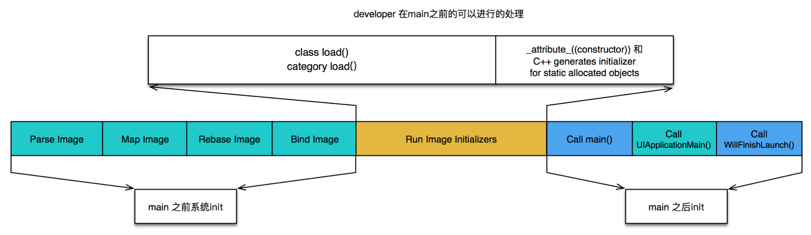

# 启动时间

参考: 

- https://www.jianshu.com/p/c14987eee107  


图是 Apple 在 WWDC 上展示的 PPT，是对 main 之前启动所做事的一个简单总结。  

## Xcode 测量 pre-main 时间

对于如何测试启动时间，Xcode 提供了一个很赞的方法，只需要在 Edit scheme -> Run -> Arguments 中将环境变量 DYLD_PRINT_STATISTICS 设为 1，就可以看到 main 之前各个阶段的时间消耗

```
Total pre-main time: 341.32 milliseconds (100.0%)
         dylib loading time: 154.88 milliseconds (45.3%)
        rebase/binding time:  37.20 milliseconds (10.8%)
            ObjC setup time:  52.62 milliseconds (15.4%)
           initializer time:  96.50 milliseconds (28.2%)
           slowest intializers :
               libSystem.dylib :   4.07 milliseconds (1.1%)
    libMainThreadChecker.dylib :  30.75 milliseconds (9.0%)
                  AFNetworking :  19.08 milliseconds (5.5%)
                        LDXLog :  10.06 milliseconds (2.9%)
                        Bigger :   7.05 milliseconds (2.0%)
```

还有一个方法获取更详细的时间，只需将环境变量 DYLD_PRINT_STATISTICS_DETAILS 设为 1 就可以

```
total time: 1.0 seconds (100.0%)
  total images loaded:  243 (0 from dyld shared cache)
  total segments mapped: 721, into 93608 pages with 6173 pages pre-fetched
  total images loading time: 817.51 milliseconds (78.3%)
  total load time in ObjC:  63.02 milliseconds (6.0%)
  total debugger pause time: 683.67 milliseconds (65.5%)
  total dtrace DOF registration time:   0.07 milliseconds (0.0%)
  total rebase fixups:  2,131,938
  total rebase fixups time:  37.54 milliseconds (3.5%)
  total binding fixups: 243,422
  total binding fixups time:  29.60 milliseconds (2.8%)
  total weak binding fixups time:   1.75 milliseconds (0.1%)
  total redo shared cached bindings time:  29.32 milliseconds (2.8%)
  total bindings lazily fixed up: 0 of 0
  total time in initializers and ObjC +load:  93.76 milliseconds (8.9%)
                           libSystem.dylib :   2.58 milliseconds (0.2%)
               libBacktraceRecording.dylib :   3.06 milliseconds (0.2%)
                            CoreFoundation :   1.85 milliseconds (0.1%)
                                Foundation :   2.61 milliseconds (0.2%)
                libMainThreadChecker.dylib :  42.73 milliseconds (4.0%)
                                   ModelIO :   1.93 milliseconds (0.1%)
                              AFNetworking :  18.76 milliseconds (1.7%)
                                    LDXLog :   9.46 milliseconds (0.9%)
                        libswiftCore.dylib :   1.16 milliseconds (0.1%)
                   libswiftCoreImage.dylib :   1.51 milliseconds (0.1%)
                                    Bigger :   3.91 milliseconds (0.3%)
                              Reachability :   1.48 milliseconds (0.1%)
                             ReactiveCocoa :   1.56 milliseconds (0.1%)
                                SDWebImage :   1.41 milliseconds (0.1%)
                             SVProgressHUD :   1.23 milliseconds (0.1%)
total symbol trie searches:    133246
total symbol table binary searches:    0
total images defining weak symbols:  30
total images using weak symbols:  69
```

## 线上如何度量 pre-main 时间

如果不依靠 Xcode 我们也是可以对 main 之前的时间进行一个考量的。当然，这个时间的度量更多关注的是开发者可控的启动段。也就是上面图展示的 Initializer 段，在这段时间里处理 C++ 静态对象的 initializer、ObjC Load 方法的执行



