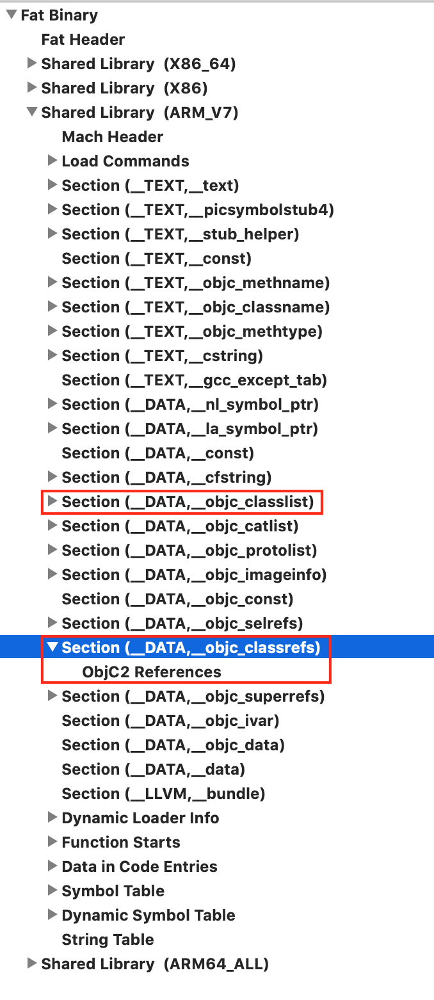

# 获取无用代码和类

参考: 
- [https://www.jianshu.com/p/b1a851de2409](https://www.jianshu.com/p/b1a851de2409)   

有很多方式可以查找App中无用的类和方法，比如:  
- 可以使用开源框架工具 fui: [fui](https://github.com/dblock/fui#find-unused-classes-in-the-current-directory)   
- [Stackoverflow](https://stackoverflow.com/questions/14631204/finding-unused-files-in-xcode) 上也有问到怎么可以清理无用的资源文件，[这里](https://github.com/alaksh10/xcodeutils)对应了一个小工具可以帮助查看  
但是，由于OC是一门非常动态的语言，因此所有的工具只是列出来文件列表，需要我们自己手动确认是否删除  
- 通过otool工具分析
- 通过XCode的BuildSettings中的LinkMap分析
- 自编写代码实现查找无用代码和类

-----------------------------------------------------------------------------------------

### 通过otool工具分析  

Mach-o文件中 __DATA __objc_classrefs段记录了引用类的地址，__DATA __objc_classlist段记录了所有类的地址，取差集可以得到未使用的类的地址，然后进行符号化，就可以得到未被引用的类信息

https://www.jianshu.com/p/b1a851de2409

