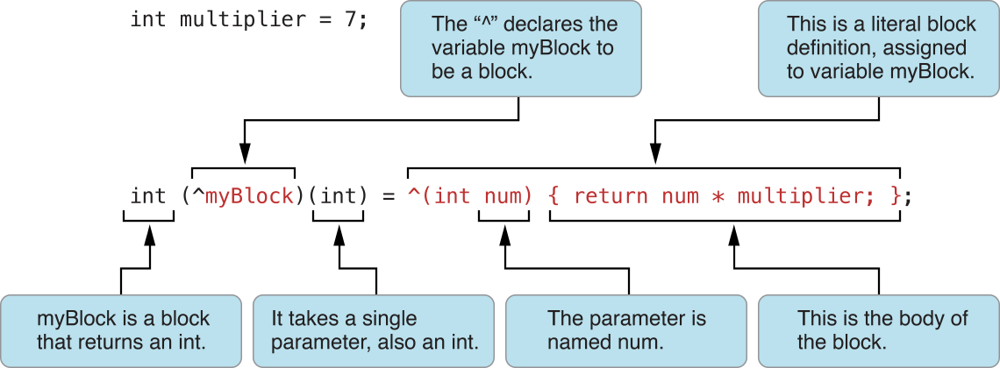

# Block

[http://www.devtalking.com/articles/you-should-know-block/](http://www.devtalking.com/articles/you-should-know-block/)

block是iOS4.0之后新增的程序语法. 使用`^`运算符来声明一个Block变量, 类型于C的函数指针:  



```c
// 声明语法: 数据返回值类型  (^变量名) (参数列表) = XXX;
int (^block)( int ) = NULL;
```

赋值:  

```objective-c
block = ^(int m) {   
    return m * m; 
};
```

也可以声明block属性:  

```objective-c
@interface Person : NSObject

@property (nonatomic, copy) void (^learn)(NSString *book);

@end

#import <Foundation/Foundation.h>
#import "Person.h"

int main(int argc, const char * argv[]) {
    @autoreleasepool {
        Person *p = [[Person alloc] init];
        [p setLearn:^(NSString * _Nonnull book) {
            
        }];
    }
    return 0;
}
```

