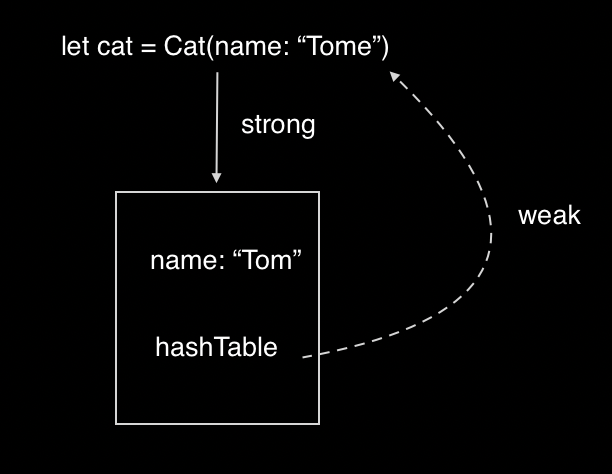

# NSHashTable

NSHashMap也是集合的一种, 常用集合区分: 

**NSArray和NSSet** 

- NSSet， NSMutableSet类声明编程接口对象，无序的集合，在内存中存储方式是不连续  
- NSArray是有序的，在内存中的存储是连续的
- 内存管理方面, NSSet和NSArray都对其持有对象强引用
- 子元素方面, NSSet，NSArray只能添加cocoa对象  

**NSSet和NSHashTable**  

其区别主要体现在内存管理方面, NSSet强引用其元素, NSHashTable可以弱引用其元素(也可以强引用)，由初始化时的NSHashTableOptions枚举来确定, 因此使用NSHashTable的场景多是希望对其管理的元素弱引用的情况  

```swift
@available(iOS 6.0, *)
open class NSHashTable<ObjectType> : NSObject, NSCopying, NSSecureCoding, NSFastEnumeration where ObjectType : AnyObject {

    public init(options: NSPointerFunctions.Options = [], capacity initialCapacity: Int)

    public init(pointerFunctions functions: NSPointerFunctions, capacity initialCapacity: Int)
    
    // conveniences
    
    public /*not inherited*/ init(options: NSPointerFunctions.Options = [])

    
    @available(iOS 6.0, *)
    open class func weakObjects() -> NSHashTable<ObjectType> // entries are not necessarily purged right away when the weak object is reclaimed

    
    /* return an NSPointerFunctions object reflecting the functions in use.  This is a new autoreleased object that can be subsequently modified and/or used directly in the creation of other pointer "collections". */
    @NSCopying open var pointerFunctions: NSPointerFunctions { get }

    
    open var count: Int { get }

    open func member(_ object: ObjectType?) -> ObjectType?

    open func objectEnumerator() -> NSEnumerator
    
    open func add(_ object: ObjectType?)
    open func remove(_ object: ObjectType?)
    open func removeAllObjects()
    open var allObjects: [ObjectType] { get } // convenience
    open var anyObject: ObjectType? { get }
    open func contains(_ anObject: ObjectType?) -> Bool
    open func intersects(_ other: NSHashTable<ObjectType>) -> Bool
    open func isEqual(to other: NSHashTable<ObjectType>) -> Bool
    open func isSubset(of other: NSHashTable<ObjectType>) -> Bool
    open func intersect(_ other: NSHashTable<ObjectType>)
    open func union(_ other: NSHashTable<ObjectType>)
    open func minus(_ other: NSHashTable<ObjectType>)
    open var setRepresentation: Set<AnyHashable> { get } // create a set of the contents
}
```


示例:  

```swift
import UIKit

class Cat: NSObject {
    public var name = ""
    public var hashTable: NSHashTable = NSHashTable<Cat>.init(options: .weakMemory)
    
    init(name: String) {
        self.name = name
    }
    
    deinit {
        print("Cat `\(name)` did released")
    }
}

class ViewController: UIViewController {

    override func viewDidLoad() {
        super.viewDidLoad()
        
        test()
    }
    
    func test() {
        let cat: Cat = Cat(name: "Tom")
        cat.hashTable.add(cat)
    }
}
```

程序运行结果打印: Cat `Tom` did released



NSHashTable也支持强引用, 比如上面把`.weakMemory`改为`.strongMemory`就会引起循环引用, Cat对象不会被释放 