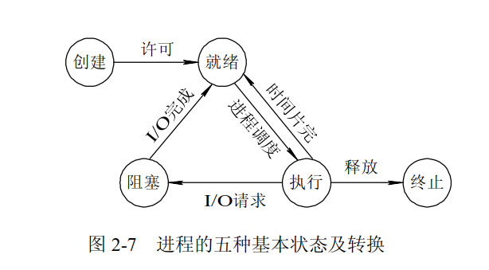
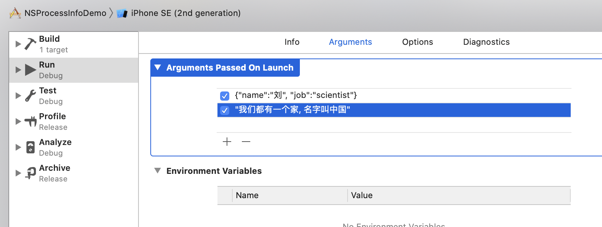

# NSProcessInfo

进程是正在运行中的程序, 一般有5大状态:

  

- 新建状态：系统为进程分配资源
- 就绪状态：进程创建完成，等待CPU调度
- 运行状态：得到CPU调度运行
- 阻塞状态：等待某事件执行
- 终止状态：进程终止  

在iOS中可以通过系统提供的进程信息类获取当前进程的信息:  
```swift
Objective-C: NSProcessInfo
Swift: ProcessInfo
```

### 试验环境, iPhone Simulator

```swift
import UIKit

class ViewController: UIViewController {

    override func viewDidLoad() {
        super.viewDidLoad()
     
        let processInfo: ProcessInfo = ProcessInfo.processInfo
        print("---- 当前进程环境 ----")
        print(processInfo.environment)
        print("---- 命令行参数 ----")
        print(processInfo.arguments) // 命令行参数
        print("---- 进程名称 ----")
        print(processInfo.processName) // 默认同项目名称, 可更改 NSProcessInfoDemo
        print("---- 进程ID ----")
        print(processInfo.processIdentifier) // 比如: 12020
        print("---- 全球唯一码 ----")
        print(processInfo.globallyUniqueString) // 进程每启动一次，生成的globallyUniqueString都不同 3B1C4252-8AA3-4F6F-B4D4-D70B678FEAC1-12020-0000D969A9B6DFF7
        print("---- 操作系统版本号: 主版本号，次版本号，补丁版本号 ----")
        print(processInfo.operatingSystemVersion) // NSOperatingSystemVersion(majorVersion: 13, minorVersion: 5, patchVersion: 0)
        print("---- 操作系统版本号字符串 ----")
        print(processInfo.operatingSystemVersionString) // Version 13.5 (Build 17F61)
        print("---- 系统启动时间 ----")
        print(processInfo.systemUptime) // 239200.409383552
        print("---- 是否开启低电量模式 --")
        print(processInfo.isLowPowerModeEnabled) // false or true
    }
}
```

命令行参数是一个String数组类型: `open var arguments: [String] { get }`, 可以在Schema环境中设置:  



```swift
print(processInfo.arguments)  

["/Users/liu/Library/Developer/CoreSimulator/Devices/8C1C0F7F-CC58-4FA2-BB45-BE7B18C6301F/data/Containers/Bundle/Application/E7D5FA34-0A76-43F6-A932-6567B6FB5669/NSProcessInfoDemo.app/NSProcessInfoDemo", "{name:刘,", "job:scientist}", "我们都有一个家, 名字叫中国"]
```