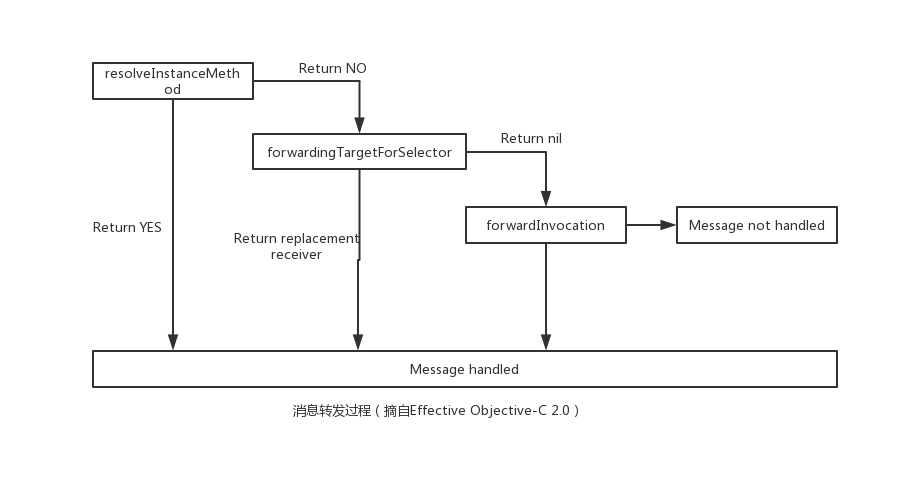

# NSProxy

Proxy被称为代理人, 是一个抽象基类, 一般用于做消息转发, 发送给代理的消息被转发给一个真实的对象  
如何转发，取决于派生类到底如何实现的。比如我们可以在内部hold住（或创建）一个对象，然后把消息转发给该对象。那我们就可以在转发的过程中做些手脚了。甚至也可以不去创建这些对象，去做任何你想做的事情，但是必须要实现他的forwardInvocation:和methodSignatureForSelector:方法  

NSProxy实现了包括NSObject协议在内基类所需的基础方法，但是作为一个抽象的基类并没有提供初始化的方法。它接收到任何自己没有定义的方法他都会产生一个异常，所以一个实际的子类必须提供一个初始化方法或者创建方法，并且重载forwardInvocation:方法和methodSignatureForSelector:方法来处理自己没有实现的消息  

```Objective-C
NS_ROOT_CLASS
@interface NSProxy <NSObject>{
    Class   isa;
}
```

### AOP与NSProxy  

NSProxy的使用场景之一就是AOP（Aspect Oriented Programming），它是可以通过预编译方式和运行期动态代理实现再不修改源代码的情况下给程序动态添加功能的一种技术。   

在来看示例之前, 先了解下面这张图:  

