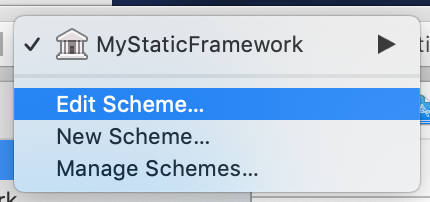
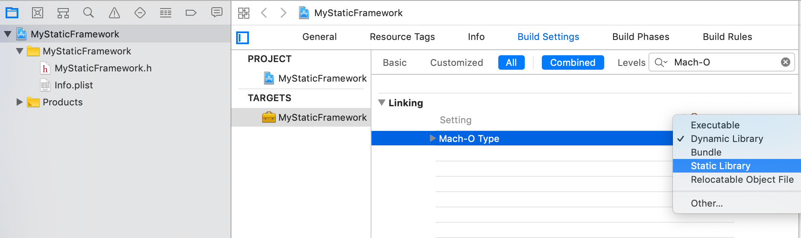

# Frameworks的创建和使用

库是程序代码的集合, 是封装和共享程序代码的一种方式，根据源代码的公开情况,库可以分为2种类型：
- 开源库
  - 公开源代码,能看到具体实现
  - 如SDWebImage, AFNetworking
- 闭源库
  - 不公开源代码,是经过编译后的二进制文件,看不到具体实现
  - 主要分为: 静态库, 动态库

静态库常见后缀名：
- .a
- .framework

动态库常见后缀名：
.dylib
.tbd
.framework

使用上的区别：
- 静态库：链接时,静态库会被完整的复制到可执行文件中,被多次使用就有多份拷贝
- 动态库：链接时不复制,程序运行时由系统动态的加载到内存, 供程序调用, 系统只加载一次, 多个程序共用, 节省内存

需要注意的是，目前swift并不支持静态库

### .a静态库的的创建和使用
Cocoa Touch Framework, 即.framework有动态库和静态库之分，Cocoa Touch Static Library，即.a是静态库


示例：
File -> new -> Cocoa Touch Static Library, 设命名为`MyStaticFramework`
```Objective-C
@interface MyStaticFramework : NSObject

- (void)sayHello;

@end

@implementation MyStaticFramework

- (void)sayHello {
    Person *p = [[Person alloc] init];
    [p sayHello];
    
    Cat *cat = [[Cat alloc] init];
    [cat sayHello];
}

@end

@interface Person : NSObject

- (void)sayHello;

@end

@implementation Person

- (void)sayHello {
    NSLog(@"Person say hello");
}

@end

@interface Cat : NSObject

- (void)sayHello;

@end

@implementation Cat

- (void)sayHello {
    NSLog(@"Cat say hello");
}

@end

```

Command+B编译后会生成libMyStaticFramework.a文件，右键show in Finder

光有.a文件不行, 还需要把头文件暴露出去供别人使用，暴露头文件可以：
- 直接把头文件copy过去,但是一般不会这么做
- 第二种工程内配置，把需要暴露的头文件添加进去, 如下所示：


比如我们把Person.h添加进去，这样Command+B编译后，再show in Finder查看：


**静态库的合并**
真机和模拟器的静态库不一样, 要满足同时适用在真机和模拟器上, 就要对编译好真机和模拟器的两个静态库进行合并：
lipo -create path_of_lib_1 path_of_lib_2 dest_path，示例：

```shell
$ lipo -create Debug-iphoneos/libMyStaticFramework.a Debug-iphonesimulator/libMyStaticFramework.a -output ./libMyStaticFramework.a
```


这个新的libMyStaticFramework.a可同时运行在模拟机和真机上，但缺点是合并后的包会变大，因此一些第三方的静态库.a区分不同的包.
我们可以使用lipo -info查看一下这个合并后的包：

```shell
$ lipo -info libMyStaticFramework.a 
Architectures in the fat file: libMyStaticFramework.a are: x86_64 arm64  #可以看到同时支持x86体系和arm体系
```

**.a静态库的使用**

静态库的使用很简单，把.a和头文件拖入工程使用即可：

```Objective-C
#import "ViewController.h"
#import "MyStaticFramework.h"

@interface ViewController ()

@end

@implementation ViewController

- (void)viewDidLoad {
    [super viewDidLoad];
 
    MyStaticFramework *f = MyStaticFramework.new;
    [f sayHello];
    Person *p = [[Person alloc] init];
    [p sayHello];
}

@end
```

最后，制作静态库.a的Release版本，只需要改一下Build Configuration为Release即可：




**坑**

刚创建的.a静态库支持的cpu架构为：`x86_64 arm64`，如果一个模拟器或真机不是使用的`x86_64`或`arm64`就可能跑不起来。比如:
- iPhone simulator 4s ~ iPhone simulator 5: `i386`
- iPhone simulator 5s ~ iPhone simulator 7plus: `x86_64`
- iPhone 3gs ~ iPhone 4s: `armv7`
- iPhone 5 ~ iPhone 5c: `armv7s`

为了尽可能的支持更多平台，建议把Build Active Architecture Only（只针对当前活跃架构编译）设置为NO


### .framework

.framework可为动态库和静态库，先来看动态库

新建一个Single View App的iOS工程：TestWeakLink, 然后在工程主目录下建一module文件夹，引入这个module文件夹到工程。
再建一个叫MyFramework的库(File -> New -> Project -> Cocoa Touch Framework)，放入module目录中，右键module -> Add files to 'TestWeakLink' -> 把MyFramework/MyFramwork.xcodeproj引入进去


我们新建一个Person类，然后测试：

```Objective-C
@interface Person : NSObject

- (void)eat:(NSString *)food;

@end

@implementation Person

- (void)eat:(NSString *)food {
    NSLog(@"Person eat: %@", food);
}

@end
```

要使用Framework，需要做以下配置：

1. 把Person.h头文件引入MyFramework.h
```Objective-C
#if __has_include(<MyFramwork/MyFramwork.h>)
#import <MyFramwork/Person.h>
#else
#import "Person.h"
#endif
```

2. 把Person.h这个头文件放入Public中


3. 主项目中 -> TARGETS -> Build Phases -> Link Binary With Libraries -> click "+" 加入MyFramework.framework。同理在Target Dependencies中也加入，另外在General下面的Embedded Binaries中也加入


4. 使用：

```Objective-c
#import <MyFramework/MyFramework.h>


@implementation ViewController

- (void)viewDidLoad {
    [super viewDidLoad];
    
    Person *p = Person.new;
    [p eat:@"Fruit"];
}

@end
```

我们这样建的Framework是动态库，可以进入到MyFramework目录，找到MyFramework, 使用file命令查看：
```bash
$ file MyFramework
MyFramework: Mach-O 64-bit dynamically linked shared library x86_64 # dynamically linked代表是动态链接, 也可以使用lipo -info MyFramework 查看架构信息
```

注意这仍旧存在一个CPU架构的问题，同上面.a类似，设置Build Active Architecture Only -> Debug 改为No并且使用lipo -create 合并成真机和模拟器都可使用的包

**注：** 动态库里可以引入一些静态库，如果这些静态库不暴露在外面，则不会和外面项目中的库引起冲突。

**.framework静态库**

.framework静态库和.framework动态库的制作类似，区分有两个：
- 更改TARGETS -> Build Settings -> Mach-O Type为`Static Library`
- 由于不是动态库，因此没有必要在Embedded Binaries中引入



----------------------

参考链接：

- http://www.cnblogs.com/mtystar/p/6082363.html
- https://www.cnblogs.com/mtystar/p/6083288.html


