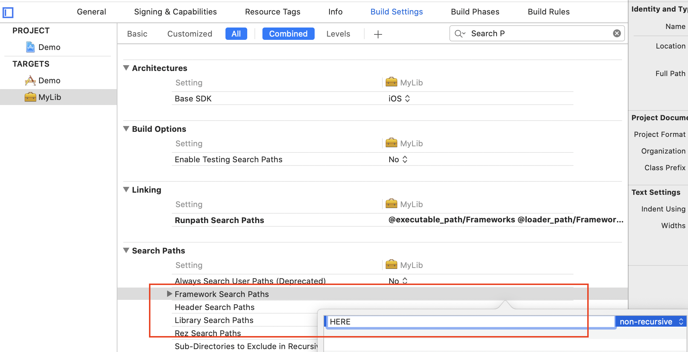

# 动态库和静态库

Copy from [Here](https://www.infoworld.com/article/2920333/swift-vs-objective-c-10-reasons-the-future-favors-swift.html)

> The developer submits the app along with the libraries, both of which are digitally signed with the development certificate to ensure integrity (hello, NSA). This means Swift can evolve faster than iOS, which is a requirement for a modern programming language. Changes to the libraries can all be included with the latest update of an app on the App Store, and everything simply works.

> Dynamic libraries have never been supported on iOS until the launch of Swift and iOS 8, even though dynamic libraries have been supported on Mac for a very long time. Dynamic libraries are external to the app executable, but are included within the app bundle downloaded from the App Store. It reduces the initial size of an app as it is loaded into memory, since the external code is linked only when used.

如果在项目中建立了多个库, 比如A, B, C, 主工程叫做Main, 而这三个库有两个或两个以上都使用了同一个第三方的库, 如果都引入就会造成冲突, 不引入又不行. 于是需要在Main中引入, 而通过build setting告诉A, B, C去哪里找, 这样就可以了, 就像使用了UIKit一样, 只要知道哪里去找, 主工程维护一份就可以.  

在Build Settings中告诉A, B, C, 如果依赖的这个三方库是.a静态库, 需要设置Library Search Path, 如果是Framework, 则需要设置Framework search path 

