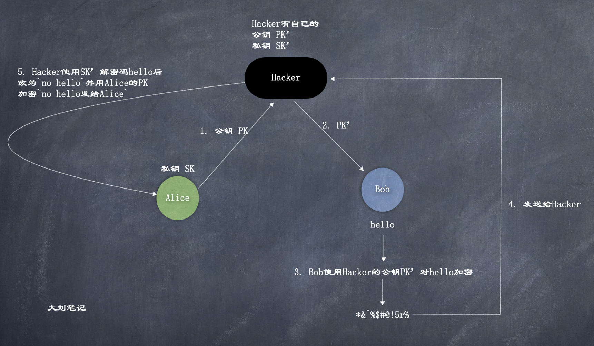

# CertificatePin

参考  
[https://blog.csdn.net/ptwh0608/article/details/44155255](https://blog.csdn.net/ptwh0608/article/details/44155255)
[https://www.netguru.com/codestories/certificate-pinning-in-ios](https://www.netguru.com/codestories/certificate-pinning-in-ios)

pin的英文释义是钉; 别针, 扣住. Certificate pin可以理解为证书锁定; 

在SSL/TLS通信中，客户端通过数字证书判断服务器是否可信，并采用证书的公钥与服务器进行加密通信.   
然而在很多移动应用中,开发者不检查服务器证书的有效性，或选择接受所有的证书,这样就会导致中间人攻击.  

举个例子:  

在正常的交流中, Alice(server)把公钥给到Bob(client), Bob使用公钥对数据加密再发给Alice, Alice用自己的私钥进行解密:  

  

但是, 如果Bob不检查服务器Alice送过来的公钥证书, 就很容易出现中间人攻击:  

    

比如在钓鱼WiFi网络中，攻击者可以通过设置DNS服务器使客户端与指定的服务器进行通信。攻击者在服务器上部署另一个证书，在会话建立阶段，客户端会收到这张证书。如果客户端忽略这个证书的异常，或者接受这个证书，就会成功建立会话、开始加密通信。因为攻击者拥有私钥，他可以解密得到客户端发来数据的明文。攻击者还可以模拟客户端，与真正的服务器联系，充当中间人做监听.   

解决问题的一种方法是从可信CA申请一个证书.但在移动软件开发中,不推荐这种方法.这种验证只判断了证书是否CA可信的，并没有验证服务器本身是否可信. 攻击者可以盗用其他可信证书，或者盗取CA私钥为自己颁发虚假证书.

事实上,移动软件大多只和固定的服务器通信，因此可以用代码更精确地直接验证某张特定的证书，这种方法称为“证书锁定”（certificatepinning）  

### 代码示例  

1. 首先服务器端使用RSA算法生成一对公钥私钥对，服务器端持有私钥，线下将公钥传给客户端。App中将这个值硬编码到本地。
2. App端可以自己实现一个X509TrustManager接口,在其中的CheckServerTrusted()方法里通过证书链拿到PublicKey,
3. 比较1和2中进行md5的值，如果匹配则服务器验证通过，否则立即终止与此服务器的通信

```java
public final class PubKeyManager implements X509TrustManager
{
  private static String PUB_KEY = "xxx";

  public void checkServerTrusted(X509Certificate[] chain, String authType) throws CertificateException
  {
    if (chain == null) {
      throw new IllegalArgumentException("checkServerTrusted: X509Certificate array is null");
    }

    if (!(chain.length > 0)) {
      throw new IllegalArgumentException("checkServerTrusted: X509Certificate is empty");
    }

    if (!(null != authType && authType.equalsIgnoreCase("RSA"))) {
      throw new CertificateException("checkServerTrusted: AuthType is not RSA");
    }

    // Perform customary SSL/TLS checks
    try {
      TrustManagerFactory tmf = TrustManagerFactory.getInstance("X509");
      tmf.init((KeyStore) null);
      
      for (TrustManager trustManager : tmf.getTrustManagers()) {
        ((X509TrustManager) trustManager).checkServerTrusted(chain, authType);
      }
    } catch (Exception e) {
      throw new CertificateException(e);
    }

    // Hack ahead: BigInteger and toString(). We know a DER encoded Public Key begins
    // with 0x30 (ASN.1 SEQUENCE and CONSTRUCTED), so there is no leading 0x00 to drop.
    RSAPublicKey pubkey = (RSAPublicKey) chain[0].getPublicKey();
    String encoded = new BigInteger(1 /* positive */, pubkey.getEncoded()).toString(16);

    // Pin it!
    final boolean expected = PUB_KEY.equalsIgnoreCase(encoded);
    if (!expected) {
      throw new CertificateException("checkServerTrusted: Expected public key: "
                + PUB_KEY + ", got public key:" + encoded);
      }
    }
  }
}
```

### 多个后台, 多个证书     

在实际应用中，一款移动应用往往不止一个后台，尤其是在支付类产品中，经常需要去集成第三方支付网关。

但是第三方的服务什么时候会更改证书，这个就说不准了。初期，我们会把所有的这些第三方的服务提供的PublicKey都硬编码在本地，但是有次其中一个服务商自己改掉了，造成用户手上的产品直接不能使用了， 这个就给我们带来了不必要的麻烦。

解决方案：

1. 自己的服务端使用RSA算法生成一对公钥私钥对，服务器端持有私钥，线下将公钥传给客户端。App中将这个值硬编码到本地。
2. 自己的服务端提供API,获得当前所有服务器（包括第三方）公钥的SHASUM值.当然这个值必须通过1中存在本地PublicKey签名验证得到
3. 再通过最基本CertificatePinning的办法（第二章提到的），直接从各服务端拿到各自公钥， 连同本地PublicKey一起计算SHASUM。
比较2和3中的值，如果相同则CertificatePinning通过，否则终止app.

---------------------------------------


