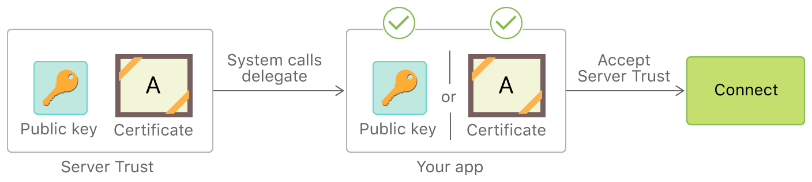

# ManualServerTrustAuthentication

参考:   
- [Apple: Performing Manual Server Trust Authentication](https://developer.apple.com/documentation/foundation/url_loading_system/handling_an_authentication_challenge/performing_manual_server_trust_authentication)

在HTTPS握手流程中有一步Authentication: The client verifies the server's SSL certificate with the certificate authority that issued it. This confirms that the server is who it says it is, and that the client is interacting with the actual owner of the domain.    

这一步就是我们可以手动参与Authentication的地方, 在撸代码之前, 先阅读一下Apple的文档

From Apple:  

## Performing Manual Server Trust Authentication  

Evaluate the server’s security credentials( [krəˈdenʃlz] 证书, 得到信用) in your app.

### Overview

When you use a secure connection (such as `https`) with a URL request, your [`URLSessionDelegate`](https://developer.apple.com/documentation/foundation/urlsessiondelegate) receives an authentication challenge(挑战, 质疑, 怀疑)  with an authentication type of [`NSURLAuthenticationMethodServerTrust`](https://developer.apple.com/documentation/foundation/nsurlauthenticationmethodservertrust). Unlike other challenges where the server is asking your app to authenticate itself, this is an opportunity for you to authenticate the server’s credentials.

### Determine When Manual Server Trust Evaluation Is Appropriate

In most cases, you should let the URL Loading System’s default handling evaluate the server trust. You get this behavior when you either don’t have a delegate or don’t handle authentication challenges. However, performing your own evaluation may be useful for scenarios [si'na:riəu 情节；脚本；情景介绍（scenario的复数）] like the following:

- You want to accept server credentials that would otherwise be rejected by the system. For example, your app makes a secure connection to a development server that uses a self-signed certificate, which would ordinarily not match anything in the system’s trust store.
- You want to reject credentials that would otherwise be accepted by the system. For example, you want to “pin” your app to a set of specific keys or certificates under your control, rather than accept any valid credential.

[Figure 1](https://developer.apple.com/documentation/foundation/url_loading_system/handling_an_authentication_challenge/performing_manual_server_trust_authentication#2959678) illustrates how an app performs manual credential evaluation by providing a delegate method to handle the authentication challenge. This bypasses the default handling. Instead, the delegate directly compares the server certificate or its public key against a copy of the certificate or key (or a hash of either of these) stored in the app bundle itself. If the delegate decides the server credential is valid, it accepts the server trust and allows the connection to continue.

  

> Note
>
> `URLSession` enforces [App Transport Security (ATS)](https://developer.apple.com/documentation/foundation/urlsession#1776695), if it is enabled for the domain you are connecting to. This applies security requirements for the certificates, TLS version, and cipher used by the connection. You cannot loosen server trust requirements for an ATS-protected domain, but you can tighten them, using the manual evaluation technique shown in this article. See [NSAppTransportSecurity](https://developer.apple.com/library/archive/documentation/General/Reference/InfoPlistKeyReference/Articles/CocoaKeys.html#//apple_ref/doc/plist/info/NSAppTransportSecurity) in [Information Property List Key Reference](https://developer.apple.com/library/archive/documentation/General/Reference/InfoPlistKeyReference/Introduction/Introduction.html#//apple_ref/doc/uid/TP40009247) for further details. 对Plist的配置在 [这里](./Plist配置.md)讨论  

### Handle Server Trust Authentication Challenges

To perform manual server trust authentication, implement the `URLSessionDelegate` method [`urlSession(_:didReceive:completionHandler:)`](https://developer.apple.com/documentation/foundation/urlsessiondelegate/1409308-urlsession). When this method is called, the first things your implementation needs to do are to check that:

- The challenge type is server trust, and not some other kind of challenge. 是server trust认证, 而不是其他认证
- The challenge’s host name matches the host that you want to perform manual credential evaluation for. 认证的域名和要评估的域名一致

在继续进行之前, 先来看一下什么是[protectionSpace](https://developer.apple.com/documentation/foundation/urlauthenticationchallenge/1410012-protectionspace): 

```swift
@NSCopying var protectionSpace: URLProtectionSpace { get }
```

A protection space object provides additional information about the authentication request, such as the host, port, authentication realm (领域，范围), and so on. The protection space also tells you whether the authentication challenge is asking you to provide the user’s credentials or to verify the TLS credentials provided by the server.

上面提到的check challenge的两点, 下面的代码demo展示如何进行check: 

The below codes shows how to test these conditions, given the `challenge` parameter passed to the `urlSession(_:didReceive:completionHandler:)` callback.  It gets the challenge's [`protectionSpace`](https://developer.apple.com/documentation/foundation/urlauthenticationchallenge/1410012-protectionspace) and uses it to perform the two checks listed above. First, it gets the [`authenticationMethod`](https://developer.apple.com/documentation/foundation/urlprotectionspace/1415028-authenticationmethod) from the protection space and checks that the type of authentication is [`NSURLAuthenticationMethodServerTrust`](https://developer.apple.com/documentation/foundation/nsurlauthenticationmethodservertrust). Then it makes sure the protection space’s [`host`](https://developer.apple.com/documentation/foundation/urlprotectionspace/1418205-host) matches the expected name `example.com`. If either of these conditions are not met, it calls the `completionHandler` with the [`URLSession.AuthChallengeDisposition.performDefaultHandling`](https://developer.apple.com/documentation/foundation/urlsession/authchallengedisposition/performdefaulthandling) disposition to allow the system to handle the challenge.  

```swift
// Testing the challenge type and host name of a server trust authentication challenge.
let protectionSpace = challenge.protectionSpace
guard protectionSpace.authenticationMethod ==
    NSURLAuthenticationMethodServerTrust,
    protectionSpace.host.contains("example.com") else {
        completionHandler(.performDefaultHandling, nil)
        return
}
```

### Evaluate the Credential in the Challenge

To access the server’s credential, get the [`serverTrust`](https://developer.apple.com/documentation/foundation/urlprotectionspace/1409926-servertrust) property (an instance of the [`SecTrust`](https://developer.apple.com/documentation/security/sectrust) class) from the protection space. [Listing 2](https://developer.apple.com/documentation/foundation/url_loading_system/handling_an_authentication_challenge/performing_manual_server_trust_authentication#2948636) shows how to access the server trust and accept or reject it. The listing starts by attempting to get the `serverTrust` property from the protection space, and falls back to default handling if the property is `nil`. Next, it passes the server trust to a private helper method `checkValidity(of:)` that compares the certificate or public key in the server trust to known-good values stored in the app bundle.

```swift
// 在访问资源的时候，如果服务器需要client鉴权(提供一个URLCredential对象)
// URL Loading System就会调用此方法（这个是URLSessionDelegate代理方法）
// From Apple https://developer.apple.com/documentation/foundation/url_loading_system/handling_an_authentication_challenge/performing_manual_server_trust_authentication#2956147
func urlSession(_ session: URLSession, didReceive challenge: URLAuthenticationChallenge, completionHandler: @escaping (URLSession.AuthChallengeDisposition, URLCredential?) -> Void) {
   
    print("在此验证服务器证书是否合法")
    
    let protectionSpace = challenge.protectionSpace
    guard protectionSpace.authenticationMethod ==
        NSURLAuthenticationMethodServerTrust,
        protectionSpace.host.contains("baidu.com") else {
            completionHandler(.performDefaultHandling, nil)
            return
    }
    
    guard let serverTrust = protectionSpace.serverTrust else {
        completionHandler(.performDefaultHandling, nil)
        return
    }
    if checkValidity(of: serverTrust) {
        let credential = URLCredential(trust: serverTrust)
        completionHandler(.useCredential, credential)
    } else {
        // Show a UI here warning the user the server credentials are
        // invalid, and cancel the load.
        completionHandler(.cancelAuthenticationChallenge, nil)
    }
}

func checkValidity(of serverTrust: SecTrust) -> Bool {
    // let certification = SecTrustGetCertificateAtIndex(serverTrust, 0)!
    return true
}
```

Once the code determines the validity of the server trust, it takes one of two actions:

- If the server trust’s credential is valid, create a new [`URLCredential`](https://developer.apple.com/documentation/foundation/urlcredential) instance from the server trust. Then call the `completionHandler` with the [`URLSession.AuthChallengeDisposition.useCredential`](https://developer.apple.com/documentation/foundation/urlsession/authchallengedisposition/usecredential) disposition, passing in the newly-created credential. This tells the system to accept the server’s credentials.
- If the challenge’s credential is invalid, call the `completionHandler` with the [`URLSession.AuthChallengeDisposition.cancelAuthenticationChallenge`](https://developer.apple.com/documentation/foundation/urlsession/authchallengedisposition/cancelauthenticationchallenge) disposition. This tells the system to reject the server’s credentials.

Tip

See [Certificate, Key, and Trust Services](https://developer.apple.com/documentation/security/certificate_key_and_trust_services) to learn more about how to evaluate a `SecTrust` instance or access certificates or public keys from it.

### Create a Long-Term Server Authentication Strategy

If you determine that you need to evaluate server trust manually in some or all cases, plan for what your app will do if you need to change your server credentials. Keep the following guidelines in mind:

- Compare the server’s credentials against a public key, instead of storing a single certificate in your app bundle. This will allow you to reissue a certificate for the same key and update the server, rather than needing to update the app.
- Compare the issuing certificate authority’s (CA’s) keys, rather than using the leaf key. This way, you can deploy certificates containing new keys signed by the same CA.
- Use a set of keys or CAs, so you can rotate server credentials more gracefully.


// TLS Chain: https://developer.apple.com/documentation/foundation/nsurlauthenticationmethodservertrust