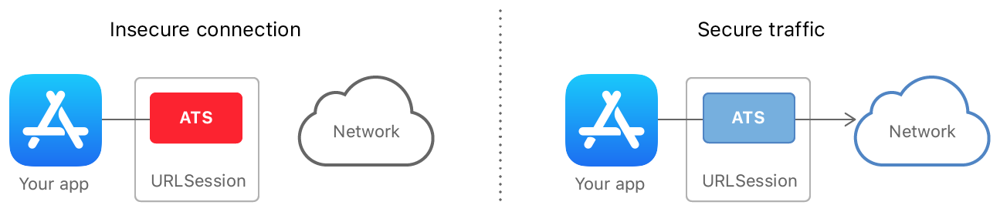
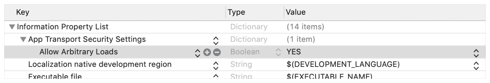

# Plist配置

- [Apple](https://developer.apple.com/documentation/bundleresources/information_property_list/nsapptransportsecurity)
- [InformationProperty List](https://developer.apple.com/documentation/bundleresources/information_property_list)
- [Apple: Preventing Insecure Network Connections](https://developer.apple.com/documentation/security/preventing_insecure_network_connections)
- [URL Loading System](https://developer.apple.com/documentation/foundation/url_loading_system)

### NSAppTransportSecurity
- A description of changes made to the default security for HTTP connections.
- Type: Dictionary

On Apple platforms, a networking feature called App Transport Security (ATS) improves privacy and data integrity for all apps and app extensions.

You can circumvent or augment these protections by adding the NSAppTransportSecurity key to your app’s [Information Property List](https://developer.apple.com/documentation/bundleresources/information_property_list) file and providing an ATS configuration dictionary as the value. For example, you can:

- Allow insecure loads for web views while maintaining ATS protections elsewhere in your app using the [`NSAllowsArbitraryLoadsInWebContent`](https://developer.apple.com/documentation/bundleresources/information_property_list/nsapptransportsecurity/nsallowsarbitraryloadsinwebcontent) key.
- Enable additional security features like Certificate Transparency using the [NSRequiresCertificateTransparency](https://developer.apple.com/documentation/security/preventing_insecure_network_connections/nsapptransportsecurity/nsexceptiondomains#3141616) key.
- Reduce or remove security requirements for communication with particular servers using the [NSExceptionDomains](https://developer.apple.com/documentation/bundleresources/information_property_list/nsapptransportsecurity/nsexceptiondomains) key.

### Preventing Insecure Network Connections

Just copy from [Apple](https://developer.apple.com/documentation/security/preventing_insecure_network_connections)

On Apple platforms, a networking security feature called App Transport Security (ATS) improves privacy and data integrity for all apps and app extensions. It does this by requiring that network connections made by your app are secured by the Transport Layer Security (TLS) protocol using reliable certificates and ciphers. ATS blocks connections that don’t meet minimum security requirements.



The system enforces ATS when you use the standard URL Loading System. Instances of URLSession automatically negotiate [nɪˈɡoʊʃieɪt 谈判，商议；转让] the most secure connection available from the server. The only action your app must take is to use secure URLs, like those beginning with https. Otherwise, ATS denies the connection and prints a console message:

```
App Transport Security has blocked a cleartext HTTP (http://) resource
load since it is insecure. Temporary [ˈtempəreri 暂时的；短期的, 临时雇员] exceptions can be configured via
your app's Info.plist file.
```

```
	<key>NSAppTransportSecurity</key>
	<dict>
		<key>NSAllowsArbitraryLoads</key>
		<true/>
	</dict>
```

ATS doesn’t apply to calls your app makes to lower-level networking interfaces like the [Network](https://developer.apple.com/documentation/network) framework or [CFNetwork](https://developer.apple.com/documentation/cfnetwork). In these cases, you take responsibility for ensuring the security of the connection. You can construct a secure connection this way, but mistakes are both easy to make and costly. It’s typically safest to rely on the [URL Loading System](https://developer.apple.com/documentation/foundation/url_loading_system) instead.

### Ensure the Network Server Meets (相遇, 接触, 满足, 这里应是满足的意思) Minimum Requirements

A secure server establishes its identity using an X.509 digital certificate. A connecting client examines this certificate to perform default server trust evaluation, which includes checking that the certificate:

- Has an intact (完整的；原封不动的) digital signature, showing that the certificate hasn’t been tampered (干扰，破坏；篡改) with.
- Isn’t expired.
- Has a name that matches the server’s DNS name.
- Is signed by another valid certificate, which is in turned signed by another, and so on back to (依附, 依靠) a trusted anchor (锚, 根) certificate, which must be issued (发布, 出版) by a Certificate Authority (CA). The anchor certificate must be part of the client operating system, as indicated in [Lists of available trusted root certificates in iOS](https://support.apple.com/en-us/HT204132), or be installed on the client by the user or a system administrator.

ATS requires all of these things, and then provides extended security checks:

- The server certificate must be signed with either a Rivest-Shamir-Adleman (RSA) key of at least 2048 bits, or an Elliptic-Curve Cryptography (ECC) key of at least 256 bits.
- The certificate must use the Secure Hash Algorithm 2 (SHA-2) with a digest length, sometimes called a *fingerprint*, of at least 256 bits (that is, SHA-256 or greater).
- The connection must use Transport Layer Security (TLS) protocol version 1.2 or later.
- Data must be exchanged using either the AES-128 or the AES-256 symmetric cipher.
- The link must support perfect forward secrecy (PFS) through Elliptic Curve Diffie-Hellman Ephemeral (ECDHE) key exchange.

### Configure Exceptions Only When Needed; Prefer Server Fixes

ATS disallows a connection if the server fails to meet one of the security checks discussed in the previous section. Your best response is to update the server. If you can’t do that for some reason, you can specify exceptions in your app to disable one or more aspects of ATS.  

> Important
>
> It’s always better to fix the server when faced with an ATS failure. Exceptions reduce the security of your app. Some also require justification (理由；辩护) when submitting an app to the App Store, as described in the next section. 

You configure ATS exceptions by providing a dictionary as the value for the optional [NSAppTransportSecurity](https://developer.apple.com/documentation/bundleresources/information_property_list/nsapptransportsecurity) key in your app’s [Information Property List](https://developer.apple.com/documentation/bundleresources/information_property_list) file. The dictionary has the following structure, where all keys are optional: 

```objective-c
NSAppTransportSecurity : Dictionary {
    NSAllowsArbitraryLoads : Boolean
    NSAllowsArbitraryLoadsForMedia : Boolean
    NSAllowsArbitraryLoadsInWebContent : Boolean
    NSAllowsLocalNetworking : Boolean
    NSExceptionDomains : Dictionary {
        <domain-name-string> : Dictionary {
            NSIncludesSubdomains : Boolean
            NSExceptionAllowsInsecureHTTPLoads : Boolean
            NSExceptionMinimumTLSVersion : String
            NSExceptionRequiresForwardSecrecy : Boolean
            NSRequiresCertificateTransparency : Boolean
        }
    }
}
```

For example, by setting [`NSAllowsArbitraryLoads`](https://developer.apple.com/documentation/bundleresources/information_property_list/nsapptransportsecurity/nsallowsarbitraryloads) set to `YES`, you completely disable ATS for all network connections:



Depending on your use case, you can provide narrower exceptions. For example, by setting [`NSAllowsArbitraryLoadsInWebContent`](https://developer.apple.com/documentation/bundleresources/information_property_list/nsapptransportsecurity/nsallowsarbitraryloadsinwebcontent) to `YES`, you can disable ATS restrictions on calls made from within web views, like instances of [`WKWebView`](https://developer.apple.com/documentation/webkit/wkwebview):


> Note
>
> Global exceptions don’t apply to any domains that you add to the [NSExceptionDomains](https://developer.apple.com/documentation/bundleresources/information_property_list/nsapptransportsecurity/nsexceptiondomains) dictionary. So you can invert the previous example—allowing insecure traffic on all domains *except* `example.com`—by placing [`NSAllowsArbitraryLoads`](https://developer.apple.com/documentation/bundleresources/information_property_list/nsapptransportsecurity/nsallowsarbitraryloads) at the top level, and including an empty `example.com` dictionary as an exception domain.

You can use the `nscurl` command line tool to connect to a server using different combinations of ATS exceptions. This helps you quickly narrow down the source of any ATS failures you have and figure out what exceptions you need. See [Identifying the Source of Blocked Connections](https://developer.apple.com/documentation/security/preventing_insecure_network_connections/identifying_the_source_of_blocked_connections) for details. 可以使用nsurl命令查看是否和Server交互ATS失败, 在下一节 [nsurl命令使用](./nsurl命令使用.md)中讨论  

### Provide Justification (理由；辩护) for Exceptions

Adding certain ATS exceptions to your app’s [Information Property List](https://developer.apple.com/documentation/bundleresources/information_property_list) file requires you to provide justification, and might trigger additional App Store review for your app. Exceptions that require justification are:

- Arbitrary connection exceptions ([`NSAllowsArbitraryLoads`](https://developer.apple.com/documentation/bundleresources/information_property_list/nsapptransportsecurity/nsallowsarbitraryloads))
- Media streaming exceptions ([`NSAllowsArbitraryLoadsForMedia`](https://developer.apple.com/documentation/bundleresources/information_property_list/nsapptransportsecurity/nsallowsarbitraryloadsformedia))
- Web content loads ([`NSAllowsArbitraryLoadsInWebContent`](https://developer.apple.com/documentation/bundleresources/information_property_list/nsapptransportsecurity/nsallowsarbitraryloadsinwebcontent))
- Per-domain nonsecure connections ([NSExceptionAllowsInsecureHTTPLoads](https://developer.apple.com/documentation/security/preventing_insecure_network_connections/nsapptransportsecurity/nsexceptiondomains#3141618))
- Per-domain minimum TLS version ([NSExceptionMinimumTLSVersion](https://developer.apple.com/documentation/security/preventing_insecure_network_connections/nsapptransportsecurity/nsexceptiondomains#3141615))

Some examples of justifications eligible for consideration are:

- The app must connect to a server managed by another entity that doesn’t support secure connections.
- The app must support connecting to devices that cannot be upgraded to use secure connections, and that must be accessed using public host names.
- The app must display embedded web content from a variety of sources, but can’t use a class supported by the web content exception.
- The app loads media content that is encrypted and that contains no personalized information.

When submitting your app to the App Store, provide sufficient information for the App Store to determine why your app cannot make secure connections by default.

