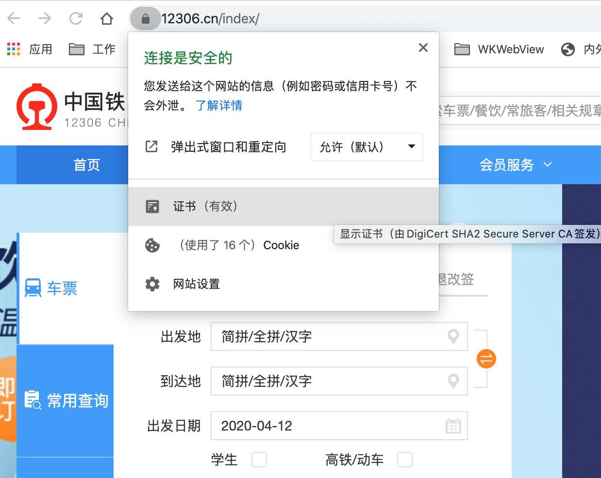
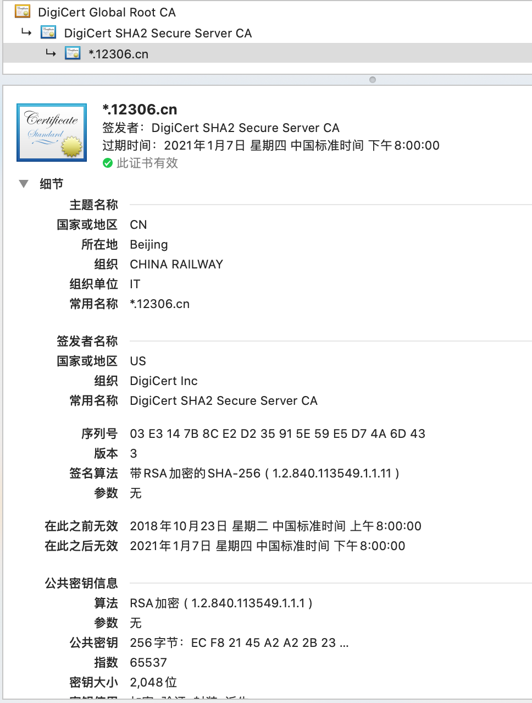

# SSL原理

参考 
- 需翻墙 [https://www.netguru.com/codestories/certificate-pinning-in-ios](https://www.netguru.com/codestories/certificate-pinning-in-ios)  
- 需翻墙 [https://cheapsslsecurity.com/blog/what-is-ssl-tls-handshake-understand-the-process-in-just-3-minutes/](https://cheapsslsecurity.com/blog/what-is-ssl-tls-handshake-understand-the-process-in-just-3-minutes/)
-  需翻墙 [https://www.cloudflare.com/learning/ssl/what-happens-in-a-tls-handshake/](https://www.cloudflare.com/learning/ssl/what-happens-in-a-tls-handshake/)

### What is TLS?   

TLS is an extended version of the SSL protocol. It is a cryptographic[,kriptə'ɡræfik adj. 关于暗号的，用密码写的] protocol used to encrypt network traffic. Your browser uses an implementation of that protocol - HTTPS. It is usually displayed next to the website address as a padlock ['pədlɔk 挂锁；关闭；禁止进入] icon.    
注: 加密的方式可以分为对通信链路的加密和对报文的加密, SSL/TLS是对整个通信链路加密处理, 而不是对报文主体进行加密处理, 

查看12306的Https的证书(公钥)

  
  

### Formal definition. 

TLS uses asymmetric cryptography to provide secure data transportation. Asymmetric cryptography uses two keys, a public key and a private key. The public key is used to encrypt data and the private key decrypts previously encrypted data. When you make a connection with a server you exchange public keys with it. You receive the public key to encrypt data before sending it. The server receives your public key so you can decrypt the data received from it with your private key. The keys are uniquely generated for each connection and are based on a shared secret negotiated at the beginning of the session, also known as a TLS handshake.   

### When does a TLS handshake occur? 

SSL的握手发生在TCP握手之后: 
 

A TLS handshake takes place whenever a user navigates to a website over HTTPS and the browser first begins to query the website's origin server. A TLS handshake also happens whenever any other communications use HTTPS, including API calls and DNS over HTTPS queries.  
TLS handshakes occur after a TCP connection has been opened via a TCP handshake.

### SSL/TLS handshake
[参见, 翻墙](https://cheapsslsecurity.com/blog/what-is-ssl-tls-handshake-understand-the-process-in-just-3-minutes/)  
The SSL/TLS handshake involves a series of steps through which both the parties – client and server, validate each other and start communicating through the secure SSL/TLS tunnel.

The reason it’s called a handshake is that it’s when two parties – client and server come across each other for the first time. The handshake involves a number of steps that start from validating the identity of the other party and concludes with(以...结束) the generation(产生) of a common(共同的) key – secret key if you may call it.

Fundamentally(本质上), the SSL handshake is nothing but a conversation between two parties (client and server) wanting to accomplish the same purpose – securing the communication with the help of symmetric [sɪ'mɛtrɪk对称的] encryption.

### What is a cipher suite?

先来认识一个名词: cipher suite  
A cipher suite is a set of encryption algorithms for use in establishing a secure communications connection. (An encryption algorithm is a set of mathematical operations performed on data for making data appear random.) There are a number of cipher suites in wide use, and an essential part of the TLS handshake is agreeing upon which cipher suite will be used for that handshake.

**What happens during a TLS handshake?**  

大致上分为四大步:  
- Specify which version of TLS (TLS 1.0, 1.2, 1.3, etc.) they will use
- Decide on which cipher suites (see below) they will use
- Authenticate the identity of the server via the server’s public key and the SSL certificate authority’s digital signature
- Generate session keys in order to use symmetric encryption after the handshake is complete 

来看一下具体步骤:  
The exact steps within a TLS handshake will vary depending upon the kind of key exchange algorithm used and the cipher suites supported by both sides. The RSA key exchange algorithm is used most often. It goes as follows:  

**1. The 'client hello' message:** The client initiates the handshake by sending a "hello" message to the server. The message will include which TLS version the client supports, the cipher suites supported, and a string of random bytes known as the "client random."

**2. The 'server hello' message:** In reply to the client hello message, the server sends a message containing the server's [SSL certificate](https://www.cloudflare.com/learning/ssl/what-is-an-ssl-certificate/), the server's chosen cipher suite, and the "server random," another random string of bytes that's generated by the server.

**3. Authentication:** The client verifies the server's SSL certificate with the certificate authority that issued it. This confirms that the server is who it says it is, and that the client is interacting with the actual owner of the domain.

**4. The premaster secret:** The client sends one more random string of bytes, the "premaster secret." The premaster secret is encrypted with the public key and can only be decrypted with the private key by the server. (The client gets the public key from the server's SSL certificate.)

**5. Private key used:** The server decrypts the premaster secret.

**6. Session keys created:** Both client and server generate session keys from the client random, the server random, and the premaster secret. They should arrive at the same results.

**7. Client is ready:** The client sends a "finished" message that is encrypted with a session key.

**8. Server is ready:** The server sends a "finished" message encrypted with a session key.

**9. Secure symmetric encryption achieved:** The handshake is completed, and communication continues using the session keys.

上面是使用RSA密钥交换算法的流程, 大部分都采用这种形式.  
注意第三步Authentication, 这一步是给客户端一个机会校验从server过来的公钥证书, 鉴定此证书是否是合法的server证书, 这一步就是client要编写代码的地方, 下一节讨论iOS代码  

不同的算法可能流程上不一致, 比如:  
All TLS handshakes make use of asymmetric encryption (the public and private key), but not all will use the private key in the process of generating session keys. For instance, an ephemeral [ɪˈfemərəl, 短暂的, 朝生暮死的] Diffie-Hellman (迪菲-赫尔曼密钥交换) handshake proceeds as follows:

1. **Client hello:** The client sends a client hello message with the protocol version, the client random, and a list of cipher suites.
2. **Server hello:** The server replies with its SSL certificate, its selected cipher suite, and the server random. In contrast to the RSA handshake described above, in this message the server also includes the following (step 3):
3. **Server's digital signature:** The server uses its private key to encrypt the client random, the server random, and its DH parameter*. This encrypted data functions as the server's digital signature, establishing that the server has the private key that matches with the public key from the SSL certificate.
4. **Digital signature confirmed:** The client decrypts the server's digital signature with the public key, verifying that the server controls the private key and is who it says it is. Client DH parameter: The client sends its DH parameter to the server.
5. **Client and server calculate the premaster secret:** Instead of the client generating the premaster secret and sending it to the server, as in an RSA handshake, the client and server use the DH parameters they exchanged to calculate a matching premaster secret separately.
6. **Session keys created:** Now, the client and server calculate session keys from the premaster secret, client random, and server random, just like in an RSA handshake.
7. **Client is ready:**
8. Same as an RSA handshake.
9. **Server is ready**
10. **Secure symmetric encryption achieved**

*DH parameter: DH stands for Diffie-Hellman. The Diffie-Hellman algorithm uses exponential calculations to arrive at the same premaster secret. The server and client each provide a parameter for the calculation, and when combined they result in a different calculation on each side, with results that are equal.  

