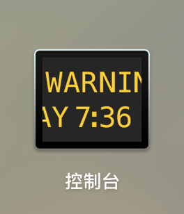
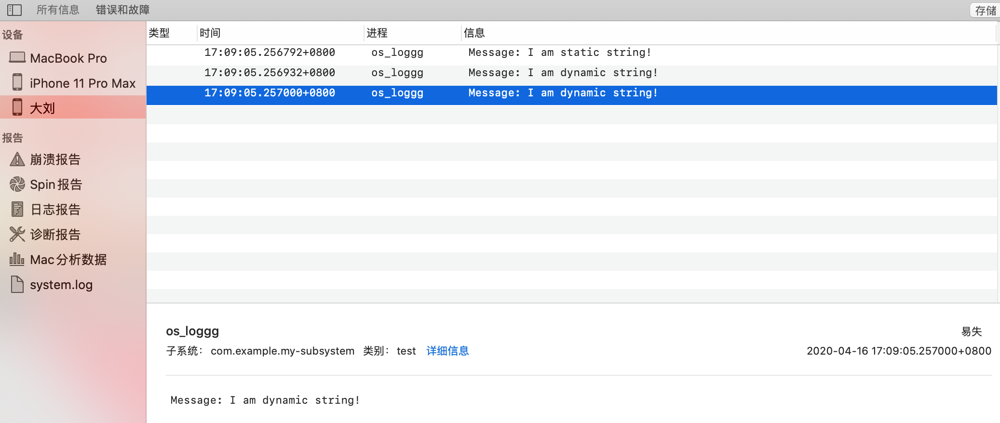

# os_log

- [Apple](https://developer.apple.com/documentation/os/os_log)
- [JianShu](https://www.jianshu.com/p/8663a854d37d)

os10 之前只要使用了NSLog我们就能通过Xcode-->Window-->Devices能够查看我们的应用或者别人的应用打印的日志信息，ios10以后苹果更新了日志记录系统，上面的方式现在行不通了。在ios10以后我们可以使用os_log这个新提供的api来打印我们的日志。

使用方法：

```objective-c
#import "ViewController.h"
#import <os/log.h>
// In Swift:
// import os
// os_log("Some message")

// In Objective-C:
// #import <os/log.h>
// os_log(OS_LOG_DEFAULT, "Some message");

@interface ViewController ()

@end

@implementation ViewController

- (void)viewDidLoad {
    [super viewDidLoad];
        
    os_log_t log = os_log_create("com.example.my-subsystem", "test");
    const char *staticString = "I am static string!";
    const char *dynamicString = [[NSString stringWithFormat:@"I am %@!", @"dynamic string"] cStringUsingEncoding:NSUTF8StringEncoding];
    os_log(log, "Message: %s", staticString);
    os_log(log, "Message: %s", dynamicString); //动态字符串format不添加public的情况下，根据日志系统的规则会打印出<private>
    os_log(log, "Message: %{public}s", dynamicString); //这样就可以正常的打印日志了
}

@end
```

输出:  

```objective-c
[test] Message: I am static string!
[test] Message: I am dynamic string!
[test] Message: I am dynamic string!
```

应用在之前可能有很多的地方使用了NSLog，可以修改NSLog：

```
#define NSLog(FORMAT, ...) os_log(OS_LOG_DEFAULT,"%{public}@", [NSString stringWithFormat:FORMAT, ##__VA_ARGS__])
```

  
