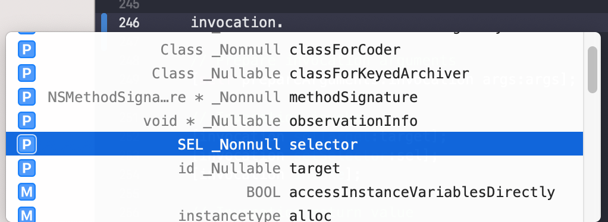

# NSInvocation

> From Apple: 
>
> `NSInvocation` objects are used to store and forward messages between objects and between applications, primarily by [`NSTimer`](dash-apple-api://load?topic_id=1412393&language=occ) objects and the distributed objects system. An `NSInvocation`object contains all the elements of an Objective-C message: a target, a selector, arguments, and the return value. Each of these elements can be set directly, and the return value is set automatically when the `NSInvocation` object is dispatched.
>
> An `NSInvocation` object can be repeatedly dispatched to different targets; its arguments can be modified between dispatch for varying results; even its selector can be changed to another with the same method signature (argument and return types). This flexibility makes `NSInvocation` useful for repeating messages with many arguments and variations; rather than retyping a slightly different expression for each message, you modify the `NSInvocation` object as needed each time before dispatching it to a new target.
>
> `NSInvocation` does not support invocations of methods with either variable numbers of arguments or `union` arguments. You should use the [`invocationWithMethodSignature:`](dash-apple-api://load?request_key=hcjVj4h-wP#dash_1437844) class method to create `NSInvocation` objects; you should not create these objects using [`alloc`](dash-apple-api://load?topic_id=1571958&language=occ) and [`init`](dash-apple-api://load?topic_id=1418641&language=occ).
>
> This class does not retain the arguments for the contained invocation by default. If those objects might disappear between the time you create your instance of `NSInvocation` and the time you use it, you should explicitly retain the objects yourself or invoke the `retainArguments` method to have the invocation object retain them itself.

由上可得到三样重要信息：

1. NSInvocation用于消息传递，使用`invocationWithMethodSignature:`创建NSInvocation对象，不要使用`alloc init`创建
2. NSInvocation对象含有OC消息的所有东西：target, selector, arguments, return value, 而且可以动态设置
3. NSInvocation默认对其参数不做强引用，因此需要自己负责引用或调用`retainArguments`方法让invocation对象对他们强引用
4. NSInvocation不定数量的参数（可变参），也不支持union（联合体）作为参数

### 配置Invocation对象



**`@property SEL selector;`**
Receier的方法，如果未设置，默认为0.

**`@property(readonly) NSUInteger numberOfArguments;`**
参数个数， 至少有两个参数，因为NSMethodSignature对象隐式包含了两个参数：`self和_cmd`，这是每一个方法实现的前两个参数

**`target`**
默认为nil, target是消息message的接收者，使用invoke或invokeWithTarget给target发送消息： `The target is the receiver of the message sent by invoke`

**`argumentsRetained`**
如果receiver对参数强引用，返回YES, 否则返回NO

**- (void)setArgument:(void *)argumentLocation atIndex:(NSInteger)idx;**
Sets an argument of the receiver.
这里的index是参数的索引，其中0代码`self`, 1代表`_cmd`, 为普通的参数传值应从2开始。
如果index的值大于方法的实际参数的个数， 会触发一个`NSInvalidArgumentException`异常。

**`- (void)getArgument:(void *)argumentLocation atIndex:(NSInteger)idx;`**
参数argumentLocation是：`An untyped buffer to hold the returned argument.`
参数idx，是指定要获取索引为多少的参数。其中索引0和1对应的参数是self和_cmd, 这两个参数也可以通过target和selector方法获取，要获取其他参数， 索引要大于等于2。
此方法会把idx索引对应的参数拷贝到argumentLocation这个buffer中，因此buffer要足够大以便容纳参数的值。如果参数是一个对象，需要传递一个拂指针：

```
NSArray *anArray;
[invocation getArgument:&anArray atIndex:3];
```
如果索引idx的值大于方法中实际参数的个数，会触发一个NSInvalidArgumentException异常.

**`- (void)setReturnValue:(void *)retLoc;`**
设置返回值，这里的retLoc是：`An untyped buffer whose contents are copied as the receiver's return value.`

This value is normally set when you send an [`invoke`](dash-apple-api://load?topic_id=1437850&language=occ) or [`invokeWithTarget:`](dash-apple-api://load?topic_id=1437854&language=occ) message.

**`- (void)getReturnValue:(void *)retLoc;`**
获取返回值，buffer: An untyped buffer into which the receiver copies its return value. It should be large enough to accommodate the value.
buffer的大小可以通过NSMethodSignature的方法[`methodReturnLength`](dash-apple-api://load?topic_id=1519666&language=occ)获取：

```Objective-C
NSUInteger length = [[myInvocation methodSignature] methodReturnLength];
buffer = (void *)malloc(length);
[invocation getReturnValue:buffer];
```

> When the return value is an object, pass a pointer to the variable (or memory) into which the object should be placed:

```Objective-C
id anObject;
NSArray *anArray;
[invocation1 getReturnValue:&anObject];
[invocation2 getReturnValue:&anArray];
```

需要注意的是，调用getReturnValue:一定要在调用invoke方法之后，否则: undefined

### Dispatching an Invocation

**`- (void)invoke;`**
在调用这个方法之前，必须已设置了receiver的target, selector, argument values
Sends the receiver’s message (with arguments) to its target and sets the return value.

**`- (void)invokeWithTarget:(id)target;`**
同invoke, 不过带个target参数

### Getting the Method Signature

The receiver’s method signature. 方法签名
`@property(readonly, retain) NSMethodSignature *methodSignature;`

### forwardInvocation:

`- (void)forwardInvocation:(NSInvocation *)anInvocation;`
> Overridden by subclasses to forward messages to other objects.

forwardInvocation是NSObject的实例方法： 
> When an object is sent a message for which it has no corresponding method, the runtime system gives the receiver an opportunity to delegate the message to another receiver. It delegates the message by creating an NSInvocation object representing the message and sending the receiver a forwardInvocation: message containing this NSInvocation object as the argument. 

当给一个对象发送一个消息，该该对象无法响应(比如未实现方法)，系统会创建一个代表该消息的NSInvocation对象，然后向receiver发送forwardInvocation:消息，并把NSInvocation对象作为参数传入。The receiver’s forwardInvocation: method can then choose to forward the message to another object. (If that object can’t respond to the message either, it too will be given a chance to forward it.)

**注：** 为了响应对象不识别的方法，除了覆写方法`forwardInvocation:`之外，还必须覆写方法`methodSignatureForSelector:`，系统使用`methodSignatureForSelector:`的信息创建NSInvocation对象然后forward。示例：

```Objective-C
- (void)forwardInvocation:(NSInvocation *)invocation {
    SEL aSelector = [invocation selector];

     if ([friend respondsToSelector:aSelector])
        [invocation invokeWithTarget:friend];
    else
        [super forwardInvocation:invocation];
}
```

需要被forward的message必须有固定的参数个数，可变数量的参数（比如printf（）形式）不被支持。

NSObject对`forwardInvocation:`的默认实现是invoke `doesNotRecognizerSelector:`方法，它不会forward任何messge， 如果我们不实现forwardInvocation, 触发doesNotRecognizerSelector:会引起crash.

### 代码示例

接下来我们写一个Person类，有两个实例方法:

```Objective-C
- (void)go;
- (void)work;
```

Person实现了go方法，但没有work方法，我们通过NSInvocation实现消息转发

```Objective-C
@interface Computer : NSObject
@end

@implementation Computer

- (void)go {
    NSLog(@"Computer go");
}

- (void)work {
    NSLog(@"Computer work");
}

@end
```

```Objective-C
@interface Person : NSObject
- (void)go;
- (void)work;
@end

#import "Person.h"
#import "Computer.h"

@interface Person ()

@property (nonatomic, strong) Computer *computer;

@end

@implementation Person

- (instancetype)init {
    self = [super init];
    self.computer = [[Computer alloc] init];
    return self;
}

- (NSMethodSignature *)methodSignatureForSelector:(SEL)aSelector {
    // 系统在触发forwardInvocation:之前会先调用此方法
    // 然后根据此方法返回的NSMethodSignature对象创建NSInvocation对象
    // 再把这个NSInvocation对象传递给forwardInvocation:方法
    NSMethodSignature *sig;
    
    sig = [self.computer methodSignatureForSelector:aSelector];
    if (sig) {
        return sig;
    }
    return [super methodSignatureForSelector:aSelector];
}

- (void)forwardInvocation:(NSInvocation *)anInvocation {
    SEL selector = anInvocation.selector;
    if ([self.computer respondsToSelector:selector]) {
        [anInvocation invokeWithTarget:self.computer];
    }
    else {
        [super forwardInvocation:anInvocation];
    }
}

/**
 // 在调用methodSignatureForSelector之前，系统会先调用此方法
 // 用于确认要foward的target
 // 此方法不必实现，不影响invocation
 
- (id)forwardingTargetForSelector:(SEL)aSelector {
    return self;
}
 */

- (void)go {
    NSLog(@"go");
}

@end
```

```Objective-C
#import <Foundation/Foundation.h>
#import "Person.h"

int main(int argc, const char * argv[]) {
    @autoreleasepool {
        Person *p = [[Person alloc] init];
        [p go];
        [p work];
    }
    return 0;
}
```

Person实现了go方法，因此调用`[p go]`的时候，直接调到了Person的方法，没有走到`methodSignatureForSelector:`和`forwardInvocation:`，但是由于没有实现work方法，当调用`[p work]`时，会先走到`methodSignatureForSelector:`, 然后系统生成NSInvocation对象传给`forwardInvocation:`，我们在此方法中把消息转给了computer对象，就走到了computer对象的work方法。


