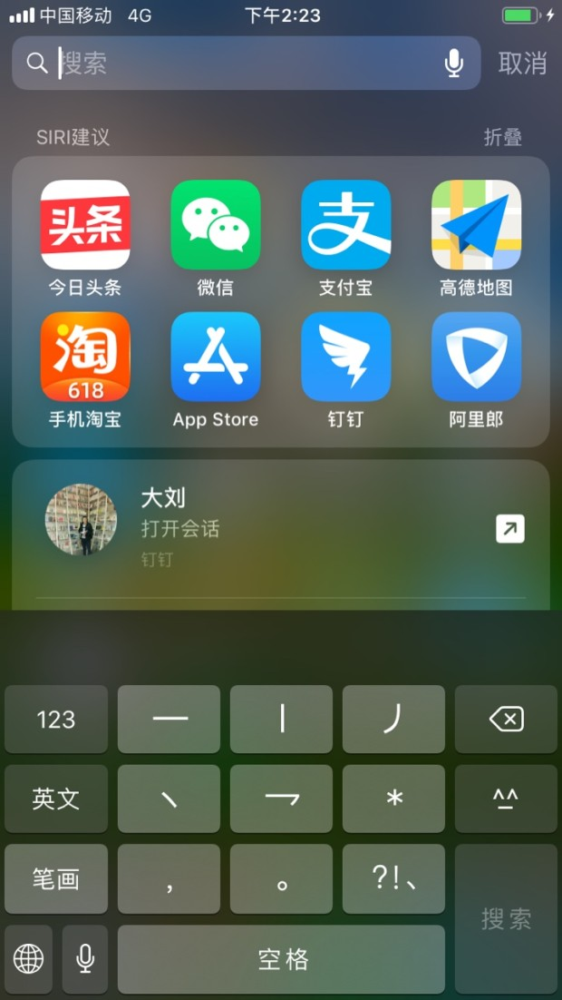

# NSUserActivity

[这里](https://developer.apple.com/documentation/foundation/nsuseractivity)是Apple官网的说明。

> A representation of the state of your app at a moment in time.

`NSUserActivity`是Apple在iOS8之后推出来做Handoff的，它主要用于对app记录用户的操作，后来`NSUserActivity`主要用来支持：
- Handoff
- SiriKit
- Spolight search results

创建`NSUserActivity`的流程：
1. 使用app支持的合适的type创建并初始化`NSUserActivity`对象， 类型一般约定为`reverse-DNS`格式，比如`com.myCompany.myApp`, type需要在Info.plist中使用key为[NSUserActivityTypes](https://developer.apple.com/library/archive/documentation/General/Reference/InfoPlistKeyReference/Articles/CocoaKeys.html#//apple_ref/doc/uid/TP40009251-SW28)配置
2. 设置title
3. 为对象设置合适的属性以让它支持不同的业务 [isEligibleForHandoff](https://developer.apple.com/documentation/foundation/nsuseractivity/1410971-iseligibleforhandoff)、[isEligibleForSearch](https://developer.apple.com/documentation/foundation/nsuseractivity/1417761-iseligibleforsearch)、[isEligibleForPublicIndexing](https://developer.apple.com/documentation/foundation/nsuseractivity/1414701-iseligibleforpublicindexing)
4. 配置其他属性
5. 对于配置了search或public indexing的对象，配置 contentAttributeSet, keywords, or webpageURL
6. 调用`becomeCurrent()`向系统注册

**支持Handoff**
设置`isEligibleForHandoff`属性为true

**支持SiriKit**
当SiriKit需要开启app的时候，它会创建一个user activity对象，并且设置userActivityObj.[interaction](https://developer.apple.com/documentation/foundation/nsuseractivity/1690346-interaction) = [INInteraction对象](https://developer.apple.com/documentation/sirikit/ininteraction)，具体可以参见[SiriKit Programming Guide.](https://developer.apple.com/library/archive/documentation/Intents/Conceptual/SiriIntegrationGuide/index.html#//apple_ref/doc/uid/TP40016875)

**支持Search Results**
在未打开任何app的时候，由上往下拖会启用Spotlight:

需要深一步了解Core Spotlight，可以参见：是官网对Core Spotlight的说明。

我们做一个简单示例，当在Spotlight中搜索`One or two or three`的时候启用我们的App, 并使用User activity做一些事情。
新建一个iOS 工程：

```swift
class RootViewController: UITableViewController {

    private let items: Array<String> = ["One", "Two", "Three"]
    private let activity: NSUserActivity = NSUserActivity(activityType: "daliu")

    override func viewDidLoad() {
        super.viewDidLoad()
        // cellClass: AnyClass
        self.tableView.register(UITableViewCell.classForCoder(), forCellReuseIdentifier: "cellID")
        self.addActivity()
    }

    func addActivity() -> Void {
        // title和keywords都可以在Spotlight搜索结果中出现
        self.activity.title = "activity title here"
        self.activity.keywords = Set(arrayLiteral: "One", "Two", "Three")
        // 是否将用户活动转交到其他设备
        // self.activity.isEligibleForHandoff = false
        self.activity.isEligibleForSearch = true
        // 每个控制器的user activity和搜索结果都是仅当应用曾经被打开过时而创建的
        // _activity.eligibleForPublicIndexing = YES;
        // 自动被加入到设备的搜索结果索引中
        self.activity.becomeCurrent()
    }

    // MARK: - Table view data source
    override func tableView(_ tableView: UITableView, numberOfRowsInSection section: Int) -> Int {
        return self.items.count
    }

    override func tableView(_ tableView: UITableView, cellForRowAt indexPath: IndexPath) -> UITableViewCell {
        let cell = tableView.dequeueReusableCell(withIdentifier: "cellID", for: indexPath)
        cell.textLabel?.text = self.items[indexPath.row]
        return cell
    }

    override func tableView(_ tableView: UITableView, didSelectRowAt indexPath: IndexPath) {
        switch indexPath.row {
        case 0:
            let vc = OneViewController()
            self.navigationController?.pushViewController(vc, animated: true)
        case 1:
            let vc = TwoViewController()
            self.navigationController?.pushViewController(vc, animated: true)
        case 2:
            let vc = ThreeViewController()
            self.navigationController?.pushViewController(vc, animated: true)
        default:
            break
        }
    }

    override func restoreUserActivityState(_ activity: NSUserActivity) {
        if activity.title == "One" {
            let vc = OneViewController()
            self.navigationController?.pushViewController(vc, animated: true)
        } else if let _ = activity.title?.elementsEqual("Two") {
            let vc = TwoViewController()
            self.navigationController?.pushViewController(vc, animated: true)
        } else if activity.title?.caseInsensitiveCompare("Three") == ComparisonResult.orderedSame {
            let vc = ThreeViewController()
            self.navigationController?.pushViewController(vc, animated: true)
        }
    }
}
```

AppDelegate.m

```
func application(_ application: UIApplication, didFinishLaunchingWithOptions launchOptions: [UIApplication.LaunchOptionsKey: Any]?) -> Bool {
    // Override point for customization after application launch.
    self.window = UIWindow.init(frame: UIScreen.main.bounds)
    let rootController = UIStoryboard.init(name: "RootViewController", bundle: nil).instantiateInitialViewController() as! RootViewController
    let nivController = UINavigationController(rootViewController: rootController)
    self.window?.rootViewController = nivController
    self.window?.makeKeyAndVisible()
    return true
}

// 监听在Spotlight中的点击
func application(_ application: UIApplication, continue userActivity: NSUserActivity, restorationHandler: @escaping ([UIUserActivityRestoring]?) -> Void) -> Bool {
    let niv: UINavigationController = self.window?.rootViewController as! UINavigationController
    niv.topViewController?.restoreUserActivityState(userActivity)
    return true
}
```

这样，当在Spotlight中搜索one时，就是显示我们的app, 点击进去就进入到了OneViewController.
