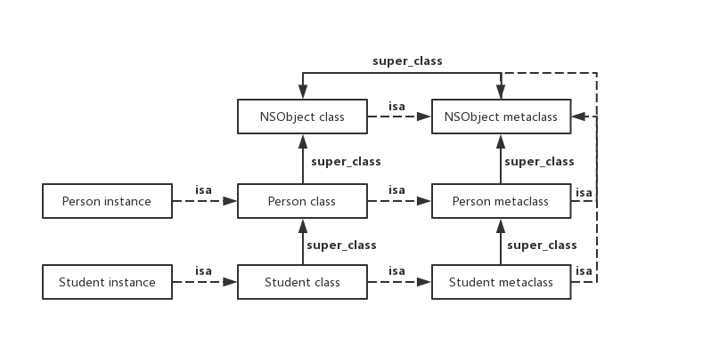

## Understanding of Objective C Runtime

#### Targets

What we will learn?


> Where to start？

#### A brief history of Objective-C

From: [Objective c history](https://www.binpress.com/objective-c-history/)

The Objective-C programming language has had a humble history. Created by Brad Cox in the early 1980s as an extension of the venerated C, pioneered a decade earlier by Dennis Ritchie, the language was based on another called SmallTalk-80.

NeXT Software licensed the language in the 1988, and developed a code library called NeXTSTEP.

When Apple Computer acquired NeXT in 1996, the NeXTSTEP code library was built into the core of Apple’s operating system, Mac OS X. NeXTSTEP provided Apple with a modern OS foundation, which Apple could not produce on its own.

The iPhone’s operating system, currently dubbed iOS, is based off of a reduced version of OS X. Therefore, iOS inherits most of the NeXTSTEP code library, along with extensive modernization and optimizations. Because NeXTSTEP was built from Objective-C, iOS mirrors the language choice. This made it easy for OS X developers to begin creating apps for the iPhone and iPod Touch. 


1985 Larry Tesler [Object Pascal](https://www.tutorialspoint.com/pascal/pascal_object_oriented.htm) , 1991 [C++](http://www.cplusplus.com/doc/tutorial/) , 1996 [NeXTSTEP](https://simson.net/ref/NeXT/aboutnext.htm)


#### Apple Documentation

The Objective-C language defers as many decisions as it can from compile time and link time to runtime. Whenever possible, it does things dynamically. This means that the language requires not just a compiler, but also a runtime system to execute the compiled code. The runtime system acts as a kind of operating system for the Objective-C language; it’s what makes the language work. [Objective-C Runtime Programming Guide](https://developer.apple.com/library/archive/documentation/Cocoa/Conceptual/ObjCRuntimeGuide/Introduction/Introduction.html)


#### Runtime Versions and Platforms

There are different versions of the Objective-C runtime on different platforms.

###### Legacy and Modern Versions

There are two versions of the Objective-C runtime—“modern” and “legacy”. The modern version was introduced with Objective-C 2.0 and includes a number of new features. The programming interface for the legacy version of the runtime is described in *Objective-C 1 Runtime Reference*; the programming interface for the modern version of the runtime is described in *[Objective-C Runtime Reference](https://developer.apple.com/documentation/objectivec/objective_c_runtime)*.

The most notable new feature is that instance variables in the modern runtime are “non-fragile”:

- In the legacy runtime, if you change the layout of instance variables in a class, you must recompile classes that inherit from it.
- In the modern runtime, if you change the layout of instance variables in a class, you do not have to recompile classes that inherit from it.

In addition, the modern runtime supports instance variable synthesis for declared properties (see [Declared Properties](https://developer.apple.com/library/archive/documentation/Cocoa/Conceptual/ObjectiveC/Chapters/ocProperties.html#//apple_ref/doc/uid/TP30001163-CH17) in *[The Objective-C Programming Language](https://developer.apple.com/library/archive/documentation/Cocoa/Conceptual/ObjectiveC/Introduction/introObjectiveC.html#//apple_ref/doc/uid/TP30001163)*).

###### Platforms

iPhone applications and 64-bit programs on OS X v10.5 and later use the modern version of the runtime.

Other programs (32-bit programs on OS X desktop) use the legacy version of the runtime.


#### Resources

###### Apple open source

[https://opensource.apple.com/](https://opensource.apple.com/)

###### Apple Developer Documentation

[Apple Developer Documentation](https://developer.apple.com/documentation)

###### LLVM & Clang

[https://clang.llvm.org/](https://clang.llvm.org/)


#### What does a compiler do?

From: [What does a compiler do?](https://www.objc.io/issues/6-build-tools/compiler/)

> test.cpp

```c
#include <stdio.h>
int main(int argc, const char **argv) {
    printf("Hello World!");
    return 0;
}
```

```bash
clang -ccc-print-phases test.cpp
```

> Output:

```bash
0: input, "test.cpp", c++
1: preprocessor, {0}, c++-cpp-output
2: compiler, {1}, ir
3: backend, {2}, assembler
4: assembler, {3}, object
5: linker, {4}, image
6: bind-arch, "x86_64", {5}, image
```

> Objective c source

```bash
clang -ccc-print-phases main.m
```

> Output:

```bash
0: input, "main.m", objective-c
1: preprocessor, {0}, objective-c-cpp-output
2: compiler, {1}, ir
3: backend, {2}, assembler
4: assembler, {3}, object
5: linker, {4}, image
6: bind-arch, "x86_64", {5}, image
```


#### Dynamic vs Static Languages

From: [Understanding the Objective-C Runtime](https://www.ieasynote.com/site/tech/1/9/understanding+the+objective-c+runtime.html)

Objective-C is a runtime oriented language, which means that when it’s possible it defers decisions about what will actually be executed from compile & link time to when it’s actually executing on the runtime. This gives you a lot of flexibility in that you can redirect messages to appropriate objects as you need to or you can even intentionally swap method implementations, etc. This requires the use of a runtime which can introspect objects to see what they do & don’t respond to and dispatch methods appropriately. If we contrast this to a language like C. In C you start out with a `main()` method and then from there it’s pretty much a top down design of following your logic and executing functions as you’ve written your code. A C struct can’t forward requests to perform a function onto other targets. Pretty much you have a program like so

```c
#include <stdio.h>
int main(int argc, const char **argv) {
		printf("Hello World!");
    return 0;
}
```

which a compiler parses, optimizes and then transforms your optimized code into assembly

```asm
    .section    __TEXT,__text,regular,pure_instructions
    .build_version macos, 10, 15    sdk_version 10, 15
    .globl  _main                   ## -- Begin function main
    .p2align    4, 0x90
_main:                                  ## @main
    .cfi_startproc
## %bb.0:
    pushq   %rbp
    .cfi_def_cfa_offset 16
    .cfi_offset %rbp, -16
    movq    %rsp, %rbp
    .cfi_def_cfa_register %rbp
    subq    $32, %rsp
    movl    $0, -4(%rbp)
    movl    %edi, -8(%rbp)
    movq    %rsi, -16(%rbp)
    leaq    L_.str(%rip), %rdi
    movb    $0, %al
    callq   _printf
    xorl    %ecx, %ecx
    movl    %eax, -20(%rbp)         ## 4-byte Spill
    movl    %ecx, %eax
    addq    $32, %rsp
    popq    %rbp
    retq
    .cfi_endproc
                                        ## -- End function
    .section    __TEXT,__cstring,cstring_literals
L_.str:                                 ## @.str
    .asciz  "Hello World!"

.subsections_via_symbols
```

and then links it together with a library and produces a executable. This contrasts from Objective-C in that while the process is similar the code that the compiler generates depends on the presence of the Objective-C Runtime Library. When we are all initially introduced to Objective-C we are told that (at a simplistic level) what happens to our Objective-C bracket code is something like…

```objc
[self doSomethingWithVar:var1];
```

gets translated to…

```objc
objc_msgSend(self,@selector(doSomethingWithVar:),var1);
```

but beyond this we don’t really know much till much later on what the runtime is doing.


#### What is Objective-C Runtime?

From: [Understanding the Objective-C Runtime](https://www.ieasynote.com/site/tech/1/9/understanding+the+objective-c+runtime.html)

The Objective-C Runtime is a Runtime Library, it’s a library written mainly in C & Assembler that adds the Object Oriented capabilities to C to create Objective-C. This means it loads in Class information, does all method dispatching, method forwarding, etc. The Objective-C runtime essentially creates all the support structures that make Object Oriented Programming with Objective-C Possible.


#### Interact with Runtime

From: [Digging Into the Objective-C Runtime](https://engineering.seagroup.com/digging-into-objective-c-runtime/)

We regularly take advantage of the runtime, without being aware of it. We are told to use classes subclassing from `NSObject` from the very first day of writing iOS application.
Why? Because much of the important and often troublesome functionalities like memory management, are integrated in `NSObject`. As long as we use subclasses of `NSObject`, we get those things for free.

```objc
Student *student = [Student new];
NSLog(@"######## NSObject student: %@", student);
NSLog(@"######## NSObject student.name: %@", student.name);
```


The second way of interaction is through using the runtime library. The runtime library consists of set of C functions. Most of time, we do not need them, but sometimes they can come in very handy. You can use them by importing `<objc/runtime.h>`, or inspecting the source file in [Apple's document](http://www.opensource.apple.com/source/objc4/objc4-437/runtime/runtime.h).

```objc
id student = ((Student *(*)(id, SEL))(void *)objc_msgSend
              )((id)objc_getClass("Student"), sel_registerName("new"));
NSLog(@"######## Runtime student: %@", student);

id name = ((NSString * (*)(id, SEL))(void *)objc_msgSend
           )((id)student, sel_registerName("name"));
NSLog(@"######## Runtime student.name: %@", name);
```


> #### Objective-C Dynamic means 3 things
>
> 1. ##### Dynamic types (Class/Instance prototype)
>
> 2. ##### Dynamic binding (Messaging)
>
> 3. ##### Dynamic loading (Swizzle Method, Category etc.)


#### 1. Dynamic type

##### Class

> objc-new-runtime.h `objc_class *`

```objc
struct objc_class : objc_object {
    // Class ISA;
    Class superclass;
    cache_t cache;             // formerly cache pointer and vtable
    class_data_bits_t bits;    // class_rw_t * plus custom rr/alloc flags

    class_rw_t *data() { 
        return bits.data();
    }
    void setData(class_rw_t *newData) {
        bits.setData(newData);
    }
  	// ...
}

struct class_rw_t {
    // Be warned that Symbolication knows the layout of this structure.
    uint32_t flags;
    uint32_t version;

    const class_ro_t *ro;

    method_array_t methods;
    property_array_t properties;
    protocol_array_t protocols;

    Class firstSubclass;
    Class nextSiblingClass;

    char *demangledName;

#if SUPPORT_INDEXED_ISA
    uint32_t index;
#endif

    void setFlags(uint32_t set) 
    {
        OSAtomicOr32Barrier(set, &flags);
    }

    void clearFlags(uint32_t clear) 
    {
        OSAtomicXor32Barrier(clear, &flags);
    }

    // set and clear must not overlap
    void changeFlags(uint32_t set, uint32_t clear) 
    {
        assert((set & clear) == 0);

        uint32_t oldf, newf;
        do {
            oldf = flags;
            newf = (oldf | set) & ~clear;
        } while (!OSAtomicCompareAndSwap32Barrier(oldf, newf, (volatile int32_t *)&flags));
    }
};

struct class_ro_t {
    uint32_t flags;
    uint32_t instanceStart;
    uint32_t instanceSize;
#ifdef __LP64__
    uint32_t reserved;
#endif

    const uint8_t * ivarLayout;
    
    const char * name;
    method_list_t * baseMethodList;
    protocol_list_t * baseProtocols;
    const ivar_list_t * ivars;

    const uint8_t * weakIvarLayout;
    property_list_t *baseProperties;

    // This field exists only when RO_HAS_SWIFT_INITIALIZER is set.
    _objc_swiftMetadataInitializer __ptrauth_objc_method_list_imp _swiftMetadataInitializer_NEVER_USE[0];

    _objc_swiftMetadataInitializer swiftMetadataInitializer() const {
        if (flags & RO_HAS_SWIFT_INITIALIZER) {
            return _swiftMetadataInitializer_NEVER_USE[0];
        } else {
            return nil;
        }
    }

    method_list_t *baseMethods() const {
        return baseMethodList;
    }

    class_ro_t *duplicate() const {
        if (flags & RO_HAS_SWIFT_INITIALIZER) {
            size_t size = sizeof(*this) + sizeof(_swiftMetadataInitializer_NEVER_USE[0]);
            class_ro_t *ro = (class_ro_t *)memdup(this, size);
            ro->_swiftMetadataInitializer_NEVER_USE[0] = this->_swiftMetadataInitializer_NEVER_USE[0];
            return ro;
        } else {
            size_t size = sizeof(*this);
            class_ro_t *ro = (class_ro_t *)memdup(this, size);
            return ro;
        }
    }
};
```


##### id

> objc.h `objc_object *`  a class instance

```objc
#if !OBJC_TYPES_DEFINED
/// An opaque type that represents an Objective-C class.
typedef struct objc_class *Class;

/// Represents an instance of a class.
struct objc_object {
    Class _Nonnull isa  OBJC_ISA_AVAILABILITY;
};

/// A pointer to an instance of a class.
typedef struct objc_object *id;
#endif

/// objc-private.h
struct objc_object {
private:
    isa_t isa;

public:

    // ISA() assumes this is NOT a tagged pointer object
    Class ISA();

    // getIsa() allows this to be a tagged pointer object
    Class getIsa();

    // initIsa() should be used to init the isa of new objects only.
    // If this object already has an isa, use changeIsa() for correctness.
    // initInstanceIsa(): objects with no custom RR/AWZ
    // initClassIsa(): class objects
    // initProtocolIsa(): protocol objects
    // initIsa(): other objects
    void initIsa(Class cls /*nonpointer=false*/);
    void initClassIsa(Class cls /*nonpointer=maybe*/);
    void initProtocolIsa(Class cls /*nonpointer=maybe*/);
    void initInstanceIsa(Class cls, bool hasCxxDtor);
  	// ...
}

inline Class 
objc_object::getIsa() 
{
    if (!isTaggedPointer()) return ISA();

    uintptr_t ptr = (uintptr_t)this;
    if (isExtTaggedPointer()) {
        uintptr_t slot = 
            (ptr >> _OBJC_TAG_EXT_SLOT_SHIFT) & _OBJC_TAG_EXT_SLOT_MASK;
        return objc_tag_ext_classes[slot];
    } else {
        uintptr_t slot = 
            (ptr >> _OBJC_TAG_SLOT_SHIFT) & _OBJC_TAG_SLOT_MASK;
        return objc_tag_classes[slot];
    }
}
```

> TaggedPointer see: [https://www.jianshu.com/p/c9089494fb6c](https://www.jianshu.com/p/c9089494fb6c)


##### isa

> Class `objc_class *`

```objc
/// Definition
union isa_t {
    isa_t() { }
    isa_t(uintptr_t value) : bits(value) { }

    Class cls;
    uintptr_t bits;
#if defined(ISA_BITFIELD)
    struct {
        ISA_BITFIELD;  // defined in isa.h
    };
#endif
};
```


##### SEL

> runtime.h `objc_selector *`

```objc
/// An opaque type that represents a method selector.
typedef struct objc_selector *SEL;
```


> Github [gnustep/libobjc2/selector.h](https://github.com/gnustep/libobjc2/blob/master/selector.h)

```objc
/**
 * Structure used to store selectors in the list.
 */
// begin: objc_selector
struct objc_selector
{
	union
	{
		/**
		 * The name of this selector.  Used for unregistered selectors.
		 */
		const char *name;
		/**
		 * The index of this selector in the selector table.  When a selector
		 * is registered with the runtime, its name is replaced by an index
		 * uniquely identifying this selector.  The index is used for dispatch.
		 */
		uintptr_t index;
	};
	/**
	 * The Objective-C type encoding of the message identified by this selector.
	 */
	const char * types;
};
// end: objc_selector
```


##### IMP

> runtime.h `Function pointer`

```objc
/// A pointer to the function of a method implementation. 
#if !OBJC_OLD_DISPATCH_PROTOTYPES
typedef void (*IMP)(void /* id, SEL, ... */ ); 
#else
typedef id _Nullable (*IMP)(id _Nonnull, SEL _Nonnull, ...); 
#endif
```


##### Method

> runtime.h `objc_method *`

```objc
/// An opaque type that represents a method in a class definition.
typedef struct objc_method *Method;

// Definition
struct objc_method {
    SEL _Nonnull method_name                                 OBJC2_UNAVAILABLE;
    char * _Nullable method_types                            OBJC2_UNAVAILABLE;
    IMP _Nonnull method_imp                                  OBJC2_UNAVAILABLE;
}                                                            OBJC2_UNAVAILABLE;

// Method list
struct objc_method_list {
    struct objc_method_list * _Nullable obsolete             OBJC2_UNAVAILABLE;

    int method_count                                         OBJC2_UNAVAILABLE;
#ifdef __LP64__
    int space                                                OBJC2_UNAVAILABLE;
#endif
    /* variable length structure */
    struct objc_method method_list[1]                        OBJC2_UNAVAILABLE;
}                                                            OBJC2_UNAVAILABLE;
```


##### Ivar

> runtime.h `objc_ivar *`

```objc
/// An opaque type that represents an instance variable.
typedef struct objc_ivar *Ivar;

// Definition
struct objc_ivar {
    char * _Nullable ivar_name                               OBJC2_UNAVAILABLE;
    char * _Nullable ivar_type                               OBJC2_UNAVAILABLE;
    int ivar_offset                                          OBJC2_UNAVAILABLE;
#ifdef __LP64__
    int space                                                OBJC2_UNAVAILABLE;
#endif
}                                                            OBJC2_UNAVAILABLE;

/// ivar list
struct objc_ivar_list {
    int ivar_count                                           OBJC2_UNAVAILABLE;
#ifdef __LP64__
    int space                                                OBJC2_UNAVAILABLE;
#endif
    /* variable length structure */
    struct objc_ivar ivar_list[1]                            OBJC2_UNAVAILABLE;
}                                                            OBJC2_UNAVAILABLE;
```


##### Category

> runtime.h `objc_category *`

```objc
#if !OBJC_TYPES_DEFINED
/// An opaque type that represents a method in a class definition.
typedef struct objc_method *Method;

/// An opaque type that represents an instance variable.
typedef struct objc_ivar *Ivar;

/// An opaque type that represents a category.
typedef struct objc_category *Category;

/// method description list
struct objc_method_description_list {
    int count;
    struct objc_method_description list[1];
};

/// protocol list
struct objc_protocol_list {
    struct objc_protocol_list * _Nullable next;
    long count;
    __unsafe_unretained Protocol * _Nullable list[1];
};

/// Definition
struct objc_category {
    char * _Nonnull category_name                            OBJC2_UNAVAILABLE;
    char * _Nonnull class_name                               OBJC2_UNAVAILABLE;
    struct objc_method_list * _Nullable instance_methods     OBJC2_UNAVAILABLE;
    struct objc_method_list * _Nullable class_methods        OBJC2_UNAVAILABLE;
    struct objc_protocol_list * _Nullable protocols          OBJC2_UNAVAILABLE;
}                                                            OBJC2_UNAVAILABLE;
#endif
```

> objc-runtime-new.h `category_t`

```objc
/// category_t
struct category_t {
    const char *name;
    classref_t cls;
    struct method_list_t *instanceMethods;
    struct method_list_t *classMethods;
    struct protocol_list_t *protocols;
    struct property_list_t *instanceProperties;
    // Fields below this point are not always present on disk.
    struct property_list_t *_classProperties;

    method_list_t *methodsForMeta(bool isMeta) {
        if (isMeta) return classMethods;
        else return instanceMethods;
    }

    property_list_t *propertiesForMeta(bool isMeta, struct header_info *hi);
};
```


##### Instance / Class / MetaClass / RootClass / RootMetaClass

> objc-runtime-new.h

```c++
bool isMetaClass() {
		assert(this);
    assert(isRealized());
    return data()->ro->flags & RO_META;
}

// NOT identical to this->ISA when this is a metaclass
Class getMeta() {
    if (isMetaClass()) return (Class)this;
    else return this->ISA();
}

bool isRootClass() {
    return superclass == nil;
}

bool isRootMetaclass() {
    return ISA() == (Class)this;
}
```


> objc-runtime-new.mm

```objc
Class objc_allocateClassPair(Class superclass, const char *name, 
                             size_t extraBytes)
{
    Class cls, meta;

    // Fail if the class name is in use.
    if (look_up_class(name, NO, NO)) return nil;

    mutex_locker_t lock(runtimeLock);

    // Fail if the class name is in use.
    // Fail if the superclass isn't kosher.
    if (getClassExceptSomeSwift(name)  ||
        !verifySuperclass(superclass, true/*rootOK*/))
    {
        return nil;
    }

    // Allocate new classes.
    cls  = alloc_class_for_subclass(superclass, extraBytes);
    meta = alloc_class_for_subclass(superclass, extraBytes);

    // fixme mangle the name if it looks swift-y?
    objc_initializeClassPair_internal(superclass, name, cls, meta);

    return cls;
}

static void objc_initializeClassPair_internal(Class superclass,
                                              const char *name, Class cls, Class meta)
{
    runtimeLock.assertLocked();

    class_ro_t *cls_ro_w, *meta_ro_w;
    
    cls->setData((class_rw_t *)calloc(sizeof(class_rw_t), 1));
    meta->setData((class_rw_t *)calloc(sizeof(class_rw_t), 1));
    cls_ro_w   = (class_ro_t *)calloc(sizeof(class_ro_t), 1);
    meta_ro_w  = (class_ro_t *)calloc(sizeof(class_ro_t), 1);
    cls->data()->ro = cls_ro_w;
    meta->data()->ro = meta_ro_w;

    // Set basic info

    cls->data()->flags = RW_CONSTRUCTING | RW_COPIED_RO | RW_REALIZED | RW_REALIZING;
    meta->data()->flags = RW_CONSTRUCTING | RW_COPIED_RO | RW_REALIZED | RW_REALIZING;
    cls->data()->version = 0;
    meta->data()->version = 7;

    cls_ro_w->flags = 0;
    meta_ro_w->flags = RO_META;
    if (!superclass) {
        cls_ro_w->flags |= RO_ROOT;
        meta_ro_w->flags |= RO_ROOT;
    }
    if (superclass) {
        uint32_t flagsToCopy = RW_FORBIDS_ASSOCIATED_OBJECTS;
        cls->data()->flags |= superclass->data()->flags & flagsToCopy;
        cls_ro_w->instanceStart = superclass->unalignedInstanceSize();
        meta_ro_w->instanceStart = superclass->ISA()->unalignedInstanceSize();
        cls->setInstanceSize(cls_ro_w->instanceStart);
        meta->setInstanceSize(meta_ro_w->instanceStart);
    } else {
        cls_ro_w->instanceStart = 0;
        meta_ro_w->instanceStart = (uint32_t)sizeof(objc_class);
        cls->setInstanceSize((uint32_t)sizeof(id));  // just an isa
        meta->setInstanceSize(meta_ro_w->instanceStart);
    }

    cls_ro_w->name = strdupIfMutable(name);
    meta_ro_w->name = strdupIfMutable(name);

    cls_ro_w->ivarLayout = &UnsetLayout;
    cls_ro_w->weakIvarLayout = &UnsetLayout;

    meta->chooseClassArrayIndex();
    cls->chooseClassArrayIndex();

    // Connect to superclasses and metaclasses
    cls->initClassIsa(meta);
    if (superclass) {
        meta->initClassIsa(superclass->ISA()->ISA());
        cls->superclass = superclass;
        meta->superclass = superclass->ISA();
        addSubclass(superclass, cls);
        addSubclass(superclass->ISA(), meta);
    } else {
        meta->initClassIsa(meta);
        cls->superclass = Nil;
        meta->superclass = cls;
        addRootClass(cls);
        addSubclass(cls, meta);
    }

    cls->cache.initializeToEmpty();
    meta->cache.initializeToEmpty();
    
    addClassTableEntry(cls);
}
```


##### Class hierarchy

```objc
Student, Person, NSObject
```




#### 2. Dynamic binding

> Message sending

##### objc_msgSend

```assembly
/********************************************************************
 *
 * id objc_msgSend(id self, SEL	_cmd,...);
 *
 ********************************************************************/

	ENTRY	_objc_msgSend
	CALL_MCOUNTER

// load receiver and selector
	movl    selector(%esp), %ecx
	movl	self(%esp), %eax

// check whether receiver is nil 
	testl	%eax, %eax
	je	LMsgSendNilSelf

// receiver (in %eax) is non-nil: search the cache
LMsgSendReceiverOk:
	movl	isa(%eax), %edx		// class = self->isa
	CacheLookup WORD_RETURN, MSG_SEND, LMsgSendCacheMiss
	xor	%edx, %edx		// set nonstret for msgForward_internal
	jmp	*%eax

// cache miss: go search the method lists
LMsgSendCacheMiss:
	MethodTableLookup WORD_RETURN, MSG_SEND
	xor	%edx, %edx		// set nonstret for msgForward_internal
	jmp	*%eax			// goto *imp

// message sent to nil: redirect to nil receiver, if any
LMsgSendNilSelf:
	// %eax is already zero
	movl	$0,%edx
	xorps	%xmm0, %xmm0
LMsgSendDone:
	ret

// guaranteed non-nil entry point (disabled for now)
// .globl _objc_msgSendNonNil
// _objc_msgSendNonNil:
// 	movl	self(%esp), %eax
// 	jmp     LMsgSendReceiverOk

LMsgSendExit:
	END_ENTRY	_objc_msgSend
```


> Why assembly 

See: [http://yulingtianxia.com/blog/2016/06/15/Objective-C-Message-Sending-and-Forwarding/](http://yulingtianxia.com/blog/2016/06/15/Objective-C-Message-Sending-and-Forwarding/)

```assembly
	.long   _objc_msgSend
	.long   _objc_msgSend_stret
	.long   _objc_msgSendSuper
	.long   _objc_msgSendSuper_stret
	.long   _objc_msgSendSuper2
	.long   _objc_msgSendSuper2_stret
	.long   _objc_msgLookup
	.long   _objc_msgLookup_stret
	.long   _objc_msgLookupSuper2
	.long   _objc_msgLookupSuper2_stret
```


#####objc_msgSend  C-Language Implementation

```c
id c_objc_msgSend( struct objc_class /* ahem */ *self, SEL _cmd, ...)  
{  
	struct objc_class *cls;  
	struct objc_cache *cache;  
	unsigned int hash;  
	struct objc_method *method;  
	unsigned int index;  
	  
	if( self)  
	{
		cls = self->isa;
		cache = cls->cache;
		hash = cache->mask;
		index = (unsigned int) _cmd & hash;
		
		do
		{
			method = cache->buckets[ index];
			if( ! method)
				goto recache;
			index = (index + 1) & cache->mask;
		}
		while( method->method_name != _cmd);
			return( (*method->method_imp)( (id) self, _cmd));
	}
	return( (id) self);
	
	recache:  
	/*
	* internal call _class_lookupMethodAndLoadCache to
	* look method and load into cache
	*/
	return( 0);  
}
```


> Example

```objc
id student = ((Student *(*)(id, SEL))(void *)objc_msgSend
              )((id)objc_getClass("Student"), sel_registerName("new"));
NSLog(@"######## Runtime student: %@", student);

id name = ((NSString * (*)(id, SEL))(void *)objc_msgSend
           )((id)student, sel_registerName("name"));
NSLog(@"######## Runtime student.name: %@", name);

// Project Settings
// ENABLE_STRICT_OBJC_MSGSEND = NO
```


> Message forwarding

See: [https://medium.com/@guanshanliu/how-message-passing-works-in-objective-c-9e3d3dd70593](https://medium.com/@guanshanliu/how-message-passing-works-in-objective-c-9e3d3dd70593)

1. If the receiving object is nil, the message is redirected to nil receiver if any. The default behavior is to do nothing.
2. Check the class’s cache. If the implementation is already cached, call it.
3. Compare the selector to the selectors defined in the class. If a match is found, call the matched implementation. Otherwise, check its superclass until there is no superclass.
4. Call *+resolveInstanceMethod:*/*+resolveClassMethod:*. If it returns YES, it means the selector will resolve this time. So go to step 2 and start over. It is the place that you call *class_addMethod* to dynamically provide an implementation for the given selector.
5. Call *-forwardingTargetForSelector:*. If it returns non-nil, send the message to the returned object instead. Note that return *self here* will result in an infinite loop.
6. Call *- methodSignatureForSelector:*. If it returns non-nil, create an instance of *NSInvocation*, and pass it to *-forwardInvocation:*.
7. The implementation of the given selector cannot be found. It will call -*doesNotRecognizeSelector:* on the receiving object. The default implementation throws an exception.

