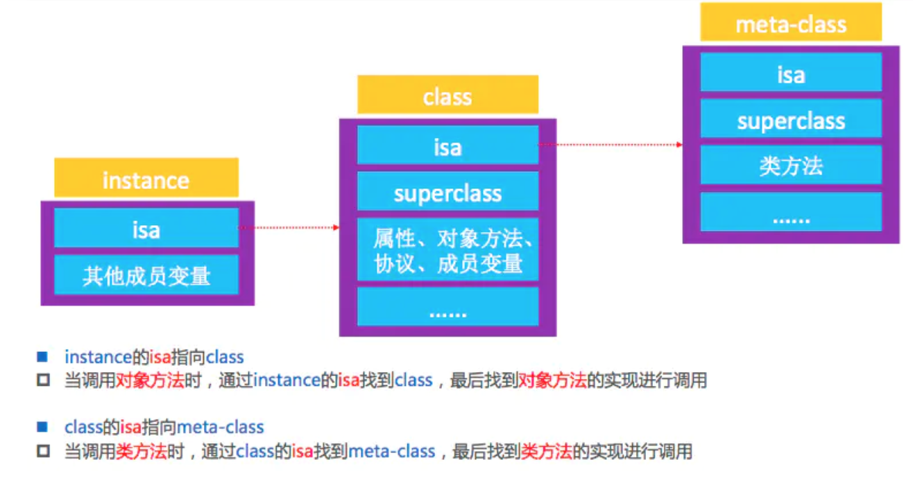
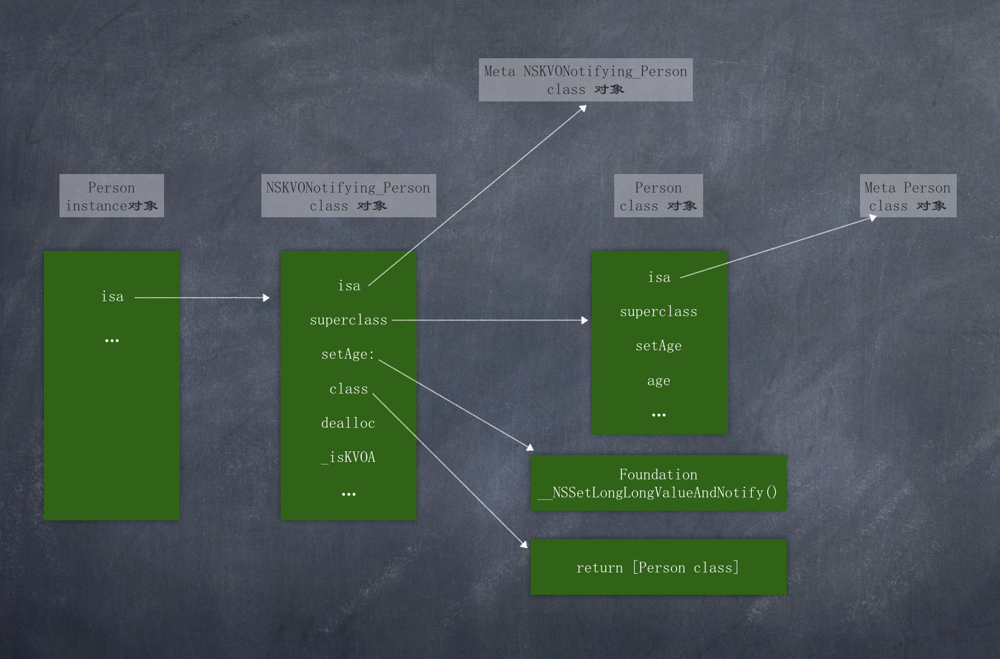

KVO

参考
[简书](https://www.jianshu.com/p/d6faa91a9721)  

### KVO的基本使用

比如: 给 Person 的实例对象 person 添加observer，监听 person 的 age 属性

```objective-c
@interface Person : NSObject

@property (nonatomic, assign) NSInteger age;

@end
```

```objective-c
self.person = [[Person alloc] init];
...
NSKeyValueObservingOptions options = NSKeyValueObservingOptionNew | NSKeyValueObservingOptionOld;
[self.person addObserver:self forKeyPath:@"age" options:options context:@"123"];
```

当 person 的 age 属性发生变化时，会调用 observer 的回调方法(也就是NSObject(NSKeyValueObserving)分类的方法) 

```objective-c
- (void)observeValueForKeyPath:(NSString *)keyPath ofObject:(id)object change:(NSDictionary<NSKeyValueChangeKey,id> *)change context:(void *)context {
    NSLog(@"监听到%@的%@属性值改变了 - %@ - %@", object, keyPath, change, context);
}
```

### 原理

执行 KVO 的person对象，它的 isa 所指向的类对象不再是 Person 类对象，而是 NSKVONotifying_Person 类对象, 证明:   
```objective-c
- (void)viewDidLoad {
    [super viewDidLoad];
    
    self.person = [[Person alloc] init];
    self.person.age = 1;
    [self.person addObserver:self forKeyPath:@"age" options:NSKeyValueObservingOptionOld | NSKeyValueObservingOptionNew context:NULL];
}

- (void)observeValueForKeyPath:(NSString *)keyPath ofObject:(id)object change:(NSDictionary<NSKeyValueChangeKey,id> *)change context:(void *)context {
    NSLog(@"监听到%@的%@属性值发生变化 - %@ - %@", object, keyPath, change, context);
}

- (void)touchesBegan:(NSSet<UITouch *> *)touches withEvent:(UIEvent *)event {
    self.person.age = 3;
}
```

断点和po打印:  
```
KVODemo[11846:666128] 监听到<Person: 0x6000011a8210>的age属性值发生变化 - {
    kind = 1;
    new = 3;
    old = 1;
} - (null)
(lldb) po self.person
<Person: 0x6000011a8210>

(lldb) po self.person->isa
NSKVONotifying_Person
```

也可以这样证明:  

```objective-c
- (void)viewDidLoad {
    [super viewDidLoad];
    
    self.person1 = [[Person alloc] init];
    self.person2 = [[Person alloc] init];
    // runtime的object_getClass()方法获取实例对象对应的类对象, 即对象的isa
    NSLog(@"添加KVO监听之前 - %@ %@", object_getClass(self.person1), object_getClass(self.person2));
    
    [self.person1 addObserver:self forKeyPath:@"age" options:NSKeyValueObservingOptionOld | NSKeyValueObservingOptionNew context:NULL];
    
    NSLog(@"添加KVO监听之后 - %@ %@", object_getClass(self.person1), object_getClass(self.person2));
}

- (void)observeValueForKeyPath:(NSString *)keyPath ofObject:(id)object change:(NSDictionary<NSKeyValueChangeKey,id> *)change context:(void *)context {
}

- (void)touchesBegan:(NSSet<UITouch *> *)touches withEvent:(UIEvent *)event {
    self.person1.age = 1;
    self.person2.age = 2;
}
```

打印结果:  

```objective-c
添加KVO监听之前 - Person Person
添加KVO监听之后 - NSKVONotifying_Person Person
```

对比证明系统会给添加了 KVO 的实例对象动态生成一个NSKVONotifying_Person类，且让该实例对象的 isa 指向这个新生成的类对象

参考《[NSObject 对象占用内存、isa/superclass指向、类信息存放](https://www.jianshu.com/p/397b4684953b)》，可知对象方法信息都是存放在类对象(class object)中的，而`实例对象`调用`实例方法`的流程就是通过实例对象的 isa 找到其指向的类对象，在类对象的实例方法列表内找到实例方法，然后调用。如下图所示



系统改写了执行 KVO 的 person1 实例的 isa指针，让其指向了NSKVONotifying_Person类对象，这就说明，修改 person1的 age 属性时，调用的 setAge: 方法，实际上调用的是 NSKVONotifying_Person类对象里面的setAge:方法，而不是 Person 类对象的setAge:方法  
当使用监机机制时, runtime使用`objc_duplicateClass`生成了新的类,  objc_duplicateClass:

```c
/** 
 * Used by Foundation's Key-Value Observing.
 * 
 * @warning Do not call this function yourself.
 */
OBJC_EXPORT Class _Nonnull
objc_duplicateClass(Class _Nonnull original, const char * _Nonnull name,
                    size_t extraBytes)
    OBJC_AVAILABLE(10.5, 2.0, 9.0, 1.0, 2.0);
```

### NSKVONotifying_Person 中 setAge: 的内部执行逻辑猜想  

```objective-c
- (void)setAge:(int)age {
    _NSSetLongLongValueAndNotify();
}

// 假代码, 猜想
void _NSSetIntValueAndNotify() {
    [self willChangeValueForKey:@"age"];
    [super setAge:age];
    [self didChangeValueForKey:@"age"];
}

- (void)didChangeValueForKey:(NSString *)key {
    // 通知监听器, 某某属性值发生了变化
    [oberser observeValueForKeyPath:key ofObject:XXX change:XXX context:XXX];
}
```

### 证明setAge:方法内部调用的是 _NSSetLongLongValueAndNotify() 方法 

```objective-c
- (void)viewDidLoad {
    [super viewDidLoad];
    
    self.person1 = [[Person alloc] init];
    self.person2 = [[Person alloc] init];
   
    NSLog(@"添加KVO监听之前 - %p %p", [self.person1 methodForSelector:@selector(setAge:)], [self.person2 methodForSelector:@selector(setAge:)]);
    [self.person1 addObserver:self forKeyPath:@"age" options:NSKeyValueObservingOptionNew | NSKeyValueObservingOptionOld context:NULL];
    NSLog(@"添加KVO监听之后 - %p %p", [self.person1 methodForSelector:@selector(setAge:)], [self.person2 methodForSelector:@selector(setAge:)]);
}
```

打印结果:  

```objective-c
添加KVO监听之前 - 0x10fd70010 0x10fd70010
添加KVO监听之后 - 0x7fff257228bc 0x10fd70010
```

可见, 添加监听之后, 对象的方法发生了变化  

可以通过LLDB命令打印出来方法名:  
```
添加KVO监听之前 - 0x10f2eb010 0x10f2eb010
添加KVO监听之后 - 0x7fff257228bc 0x10f2eb010
(lldb) po (IMP)0x10f2eb010
(KVODemo`-[Person setAge:] at Person.h:15)

(lldb) po (IMP)0x7fff257228bc
(Foundation`_NSSetLongLongValueAndNotify)
```

### NSKVONotifying_Person 的 class,  isa, 和 superclass  

```objective-c
[self.person1 addObserver:self forKeyPath:@"age" options:NSKeyValueObservingOptionOld|NSKeyValueObservingOptionNew context:NULL];
NSLog(@"%@", object_getClass(self.person1)); // NSKVONotifying_Person
```

首先, 由上面的代码可知, person1这个对象的isa指针指向的是class对象NSKVONotifying_Person, 那么NSKVONotifying_Person的isa和class是什么呢?   

先来看一下class, 我们知道,  对象instance的.class是它的isa指针指向的对象, 而类的.class是它本身

```objective-c
[self.person1 addObserver:self forKeyPath:@"age" options:NSKeyValueObservingOptionOld|NSKeyValueObservingOptionNew context:NULL]
NSLog(@"######### %p", self.person1.class); // 0x10536a708
NSLog(@"######### %p", self.person1.class.class.class.class); // 0x10536a708
NSLog(@"######### %p", Person.class.class.class.class); // 0x10536a708
NSLog(@"######### %p", Person.class); // 0x10536a708
NSLog(@"######### %p", [object_getClass(self.person1) superclass]); // 0x10536a708
```

上面打印的5个内存地址完全相同, 由此可见:  
NSKVONotifying_Person.class == NSKVONotifying_Person.superclass == Person.class

那么NSKVONotifying_Person的isa指向谁呢?  

做个试验:  

```objective-c
- (void)viewDidLoad {
    [super viewDidLoad];
    
    self.person1 = [[Person alloc] init];
    self.person2 = [[Person alloc] init];
    
    NSLog(@"添加KVO监听之前");
    // person1.class == person2.class == object_getClass(self.person1) == object_getClass(self.person2)
    NSLog(@"类对象 - person1.isa: %p person2.isa: %p", object_getClass(self.person1), object_getClass(self.person2));
    NSLog(@"person2.class: %p", self.person2.class);
    
    // Person.class.isa == person1.isa.isa == person2.isa.isa
    NSLog(@"元类对象 - person1.isa.isa: %p person2.isa.isa: %p", object_getClass(object_getClass(self.person1)), object_getClass(object_getClass(self.person2)));
    NSLog(@"%p", object_getClass(Person.class));
    
    [self.person1 addObserver:self forKeyPath:@"age" options:NSKeyValueObservingOptionOld|NSKeyValueObservingOptionNew context:NULL];
    
    NSLog(@"添加KVO监听之后");
    
    // person1.isa == NSKVONotifying_Person.class
    NSLog(@"类对象 - person1.isa: %p", object_getClass(self.person1));
    NSLog(@"NSKVONotifying_Person.class: %p", NSClassFromString(@"NSKVONotifying_Person"));
    
    // person2.isa == Person.class
    NSLog(@"类对象 - person2.isa: %p", object_getClass(self.person2));
    NSLog(@"Person.class: %p", Person.class);
    
    // person1.isa.isa == NSKVONotifying_Person.class.isa
    // person2.isa.isa == Person.class.isa
    NSLog(@"元类对象 - person1.isa.isa: %p", object_getClass(object_getClass(self.person1)));
    NSLog(@"NSKVONotifying_Person.class.isa: %p", object_getClass(NSClassFromString(@"NSKVONotifying_Person")));
    NSLog(@"元类对象 - person2.isa.isa: %p", object_getClass(object_getClass(self.person2)));
    NSLog(@"Person.class.isa: %p", object_getClass(Person.class));
}
```

可知, 结构图如下:  



### 验证猜想代码  

当监听KVO并给属性赋值时, 我们假想的`__NSSetLongLongValueAndNotify()`代码如下: 

1. 调用 willChangeValueForKey:
2. 调用原来的setter实现
3. 调用didChangeValueForKey:
  - didChangeValueForKey:内部会调用observer的observeValueForKeyPath:ofObject:change:context:方法

验证我们的假设:    

```objective-c
@implementation ViewController

- (void)viewDidLoad {
    [super viewDidLoad];
    
    self.person1 = [[Person alloc] init];
    self.person2 = [[Person alloc] init];
    
    [self.person1 addObserver:self forKeyPath:@"age" options:NSKeyValueObservingOptionOld|NSKeyValueObservingOptionNew context:NULL];
    
    NSLog(@"%p", [self.person1 methodForSelector:@selector(setAge:)]);
}

- (void)observeValueForKeyPath:(NSString *)keyPath ofObject:(id)object change:(NSDictionary<NSKeyValueChangeKey,id> *)change context:(void *)context {
    NSLog(@"监听到%@的%@属性值发生了变化 - %@ - %@", object, keyPath, change, context);
}

- (void)touchesBegan:(NSSet<UITouch *> *)touches withEvent:(UIEvent *)event {
    self.person1.age = 1;
}

@end
```

```objective-c
#import "Person.h"

@implementation Person

- (void)setAge:(NSInteger)age {
    _age = age;
    NSLog(@"setAge:");
}

- (void)willChangeValueForKey:(NSString *)key {
    [super willChangeValueForKey:key];
    NSLog(@"%@\n", NSStringFromSelector(_cmd));
}

- (void)didChangeValueForKey:(NSString *)key {
    [super didChangeValueForKey:key];
    NSLog(@"%@", NSStringFromSelector(_cmd));
}
```

运行并点击屏幕, 打印如下:  

```
willChangeValueForKey:
setAge:
监听到<Person: 0x600001c38410>的age属性值发生了变化 - {
    kind = 1;
    new = 1;
    old = 0;
} - (null)
didChangeValueForKey:
```

KVONotifying_Person的父类为 Person 类，当在 Person 类类中重写了上述方法，那么子类可以通过 superclass 指针优先找到Person类中方法实现, willChangeValueForKey: 和 didChangeValueForKey:方法是属于NSObject 的NSObject(NSKeyValueObserverNotification)分类里的方法，此时的NSObject 是 Person 的父类，按照实例方法的查找调用循序来看，当然会优先调用 Person 中重写的方法，而 Person 中的方法仅仅是重写拦截，内部还会通过 super 调用父类的方法，所以对原有的 NSObject 的分类方法是没有影响的。

由打印结果可知: 

 1. NSObject的willChangeValueForKey: // 因为调用了Person 的 super
 2. Person的willChangeValueForKey:
 3. setAge:
 4. NSObject的didChangeValueForKey: 这一步会让监听方法observeValueForKeyPath:ofObject:得到调用 // 因为调用了Person 的 super
 5. Person的didChangeValueForKey:

### iOS用什么方式实现对一个对象的KVO？(KVO的本质是什么？)  

1. 利用Runtime API动态生成一个子类，并且让instance对象的isa指向这个全新的子类
2. 当修改instance对象的属性时，会调用Foundation的`_NSSetXXXValueAndNotify`函数
3. `_NSSet***ValueAndNotify` 的内部实现为：
4. 调用 `willChangeValueForKey:`
5. 调用原来的setter实现
6. 调用 `didChangeValueForKey:`
    - `didChangeValueForKey:`内部会调用observer的`observeValueForKeyPath:ofObject:change:context:`方法

### 如何手动触发KVO

```objective-c
- (void)viewDidLoad {
    [super viewDidLoad];
    
    self.person1 = [[Person alloc] init];
    
    [self.person1 addObserver:self forKeyPath:@"age" options:NSKeyValueObservingOptionOld|NSKeyValueObservingOptionNew context:NULL];
}

- (void)observeValueForKeyPath:(NSString *)keyPath ofObject:(id)object change:(NSDictionary<NSKeyValueChangeKey,id> *)change context:(void *)context {
    NSLog(@"监听到%@的%@属性值发生了变化 - %@ - %@", object, keyPath, change, context);
}

- (void)touchesBegan:(NSSet<UITouch *> *)touches withEvent:(UIEvent *)event {
    [self.person1 willChangeValueForKey:@"age"];
    [self.person1 didChangeValueForKey:@"age"];
}
```

