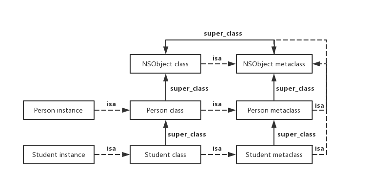

# MessagePassing

参考: 

- [Apple](https://developer.apple.com/library/archive/documentation/Cocoa/Conceptual/ObjCRuntimeGuide/Articles/ocrtForwarding.html#//apple_ref/doc/uid/TP40008048-CH105-SW1)
- [Guanshan Liu(翻墙)](https://medium.com/@guanshanliu/how-message-passing-works-in-objective-c-9e3d3dd70593)
- [Mike Ash's Blog(翻墙)](https://www.mikeash.com/pyblog/)
- [CSDN](https://blog.csdn.net/hello_world_csdn/article/details/46656235)

OC中的消息传机可以用这两张图来表示

 

[Guanshan Liu(翻墙)](https://medium.com/@guanshanliu/how-message-passing-works-in-objective-c-9e3d3dd70593)的Blog写的很清楚, 直接CV大法:  

How Message Passing Works in Objective-C

When an Objective-C method is called, it is converted to *objc_msgSend* function. *objc_msgSend* is a C function defined in objc/message.h file. The first parameter is the receiving Objective-C object itself, the second parameter is the selector, and the rest of parameters are the parameters passed to the Objective-C method. The process is called message passing. It is *objc_msgSend* function that figure out how to handle the message to the receiving object at runtime.

Here is roughly how *objc_msgSend* function works:

1. If the receiving object is nil, the message is redirected to nil receiver if any. The default behavior is to do nothing.
2. Check the class’s cache. If the implementation is already cached, call it.
3. Compare the selector to the selectors defined in the class. If a match is found, call the matched implementation. Otherwise, check its superclass until there is no superclass.
4. Call *+resolveInstanceMethod:*/*+resolveClassMethod:*. If it returns YES, it means the selector will resolve this time. So go to step 2 and start over. It is the place that you call *class_addMethod* to dynamically provide an implementation for the given selector.
5. Call *-forwardingTargetForSelector:*. If it returns non-nil, send the message to the returned object instead. Note that return *self here* will result in an infinite loop.
6. Call *- methodSignatureForSelector:*. If it returns non-nil, create an instance of *NSInvocation*, and pass it to *-forwardInvocation:*.
7. The implementation of the given selector cannot be found. It will call -*doesNotRecognizeSelector:* on the receiving object. The default implementation throws an exception.