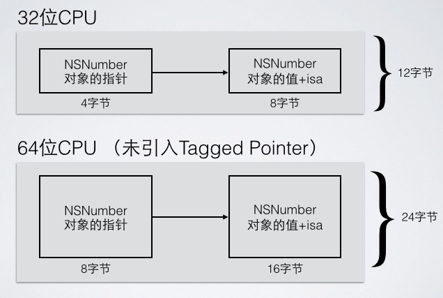

# TaggedPointer

参考: 
[http://blog.devtang.com/2014/05/30/understand-tagged-pointer/](http://blog.devtang.com/2014/05/30/understand-tagged-pointer/)
[https://www.mikeash.com/pyblog/friday-qa-2012-07-27-lets-build-tagged-pointers.html](https://www.mikeash.com/pyblog/friday-qa-2012-07-27-lets-build-tagged-pointers.html)
[https://www.jianshu.com/p/6389ee83a188](https://www.jianshu.com/p/6389ee83a188)
[https://www.jianshu.com/p/c9089494fb6c](https://www.jianshu.com/p/c9089494fb6c)

### WHY?

什么是 TaggedPointer? 为什么要引入 TaggedPointer呢?  
为了节省内存和提高执行效率，苹果提出了Tagged Pointer的概念。对于 64 位程序，引入 Tagged Pointer 后，相关逻辑能减少一半的内存占用, 提高访问和销毁速度. 开始时间应是2013 年 9 月，苹果推出了 iPhone5s，与此同时，iPhone5s 配备了首个采用 64 位架构的 A7 双核处理器，为了节省内存和提高执行效率，提出了Tagged Pointer的概念。  

我们先看看原有的对象为什么会浪费内存。假设我们要存储一个 NSNumber 对象，其值是一个整数。正常情况下，如果这个整数只是一个 NSInteger 的普通变量，那么它所占用的内存是与 CPU 的位数有关，在 32 位 CPU 下占 4 个字节，在 64 位 CPU 下是占 8 个字节的。而指针类型的大小通常也是与 CPU 位数相关，一个指针所占用的内存在 32 位 CPU 下为 4 个字节，在 64 位 CPU 下也是 8 个字节。

所以一个普通的 iOS 程序，如果没有Tagged Pointer对象，从 32 位机器迁移到 64 位机器中后，虽然逻辑没有任何变化，但这种 NSNumber、NSDate 一类的对象所占用的内存会翻倍。如下图所示： 



为了存储和访问一个 NSNumber 对象，我们需要在堆上为其分配内存，另外还要维护它的引用计数，管理它的生命期。这些都给程序增加了额外的逻辑，造成运行效率上的损失

为了改进上面提到的内存占用和效率问题，苹果提出了Tagged Pointer对象。由于 NSNumber、NSDate 一类的变量本身的值需要占用的内存大小常常不需要 8 个字节，拿整数来说，4 个字节所能表示的有符号整数就可以达到 20 多亿（注：2^31=2147483648，另外 1 位作为符号位)，对于绝大多数情况都是可以处理的。

所以我们可以将一个对象的指针拆成两部分，一部分直接保存数据，另一部分作为特殊标记，表示这是一个特别的指针，不指向任何一个地址。所以，引入了Tagged Pointer对象之后，64 位 CPU 下 NSNumber 的内存图变成了以下这样：


------------------------------------------------------------------------

### 分析源代码 

首先看一个方法, 此方法判断一个对象是不是tagged pointer:  

```c
// objc-internal.h
static inline bool 
_objc_isTaggedPointer(const void * _Nullable ptr) 
{
    // 即判断该指针的值(就是一个表示地址的整型数)的首位或末位是不是1
    // iOS平台: 最高位为1就是表示tagged pointer, 0表示普通对象指针
    // MAC-64平台: 最低位为1就是表示tagged pointer, 0表示普通对象指针
    return ((uintptr_t)ptr & _OBJC_TAG_MASK) == _OBJC_TAG_MASK;
}
```

- uintptr_t: 是对unsigned long的typedef: `typedef unsigned long uintptr_t`, 代表地址值类型
- 根据源码可知, 在x86_64 Mac机上, _OBJC_TAG_MASK的值是 1UL << 63, 在其他机型上_OBJC_TAG_MASK的值是 1UL, 源码如下:

```objective-c
// objc4/runtime/objc-internal.h

#if TARGET_OS_OSX && __x86_64__
    // 64-bit Mac - tag bit is LSB
    // 64位的Mac机上, tag采用LSB(LSB和MSB见后文)
#   define OBJC_MSB_TAGGED_POINTERS 0
#else
    // Everything else - tag bit is MSB
    // 其他的机型上都是MSB
#   define OBJC_MSB_TAGGED_POINTERS 1
#endif

#if OBJC_MSB_TAGGED_POINTERS
// 如果是mac-64平台, 最低有效位是1(低位优先规则 LSB)
#   define _OBJC_TAG_MASK (1UL<<63)
#   define _OBJC_TAG_INDEX_SHIFT 60
#   define _OBJC_TAG_SLOT_SHIFT 60
#   define _OBJC_TAG_PAYLOAD_LSHIFT 4
#   define _OBJC_TAG_PAYLOAD_RSHIFT 4
#   define _OBJC_TAG_EXT_MASK (0xfUL<<60)
#   define _OBJC_TAG_EXT_INDEX_SHIFT 52
#   define _OBJC_TAG_EXT_SLOT_SHIFT 52
#   define _OBJC_TAG_EXT_PAYLOAD_LSHIFT 12
#   define _OBJC_TAG_EXT_PAYLOAD_RSHIFT 12
#else
// 如果是iOS平台, 最高有效位是1（第64bit, 使用高位优先规则 MSB)
#   define _OBJC_TAG_MASK 1UL
#   define _OBJC_TAG_INDEX_SHIFT 1
#   define _OBJC_TAG_SLOT_SHIFT 0
#   define _OBJC_TAG_PAYLOAD_LSHIFT 0
#   define _OBJC_TAG_PAYLOAD_RSHIFT 4
#   define _OBJC_TAG_EXT_MASK 0xfUL
#   define _OBJC_TAG_EXT_INDEX_SHIFT 4
#   define _OBJC_TAG_EXT_SLOT_SHIFT 4
#   define _OBJC_TAG_EXT_PAYLOAD_LSHIFT 0
#   define _OBJC_TAG_EXT_PAYLOAD_RSHIFT 12
#endif
```

为什么可以通过设定最高位或者最低位是否为 1 来标识是不是Tagged Pointer呢? [参考](https://www.jianshu.com/p/31678563d00d)  
通过最低位标识: 因为在对象指针变量分配内存的时候, 由于内存对齐的原因, `On Mac OS X, malloc always returns pointers aligned to 16-byte boundaries`, 地址值是16的倍数, 自然也是2的倍数, 这样分配出来的正常内存地址末位不可能为1, 这样通过将最低标识为 1, 就可以和其他正常指针做出区分
通过最高位标识: 因为64位操作系统, 设备一般没有2的64次方bit那么大的内存, 所以内存地址一般只有 48 个左右有效位, 也就是说高位的 16 位左右都为 0, 所以可以通过最高位标识为 1 来表示TaggedPointer  

概念: LSB和MSB  
LSB 表示使用最低位标识, Least Significant Bit, 是指一个二进制数据中的第0位(即最低位), 具有权值为2^0, 比如对于一个二进制序列 0100110100, 最右端的位0, 简言之, 最低有效位代表二进制数中的最小的单位
MSB 表示使用最高位标识, Most Significant Bit, 是指一个n位二进制数字中的n-1位，具有最高的权值2^n − 1, MSB指最左端的位
使用LSB标识就是使用最低有效位标识; 使用MSB标识就是使用最高有效位标识;

在64bit的机型上, 使用1位表示是否是TaggedPointer, 其他位用于存储数据本身和数据的类型  

看一下Apple的官方说明:

```objective-c
// objc-runtime-new.mm  

/***********************************************************************
* Tagged pointer objects.
*
* Tagged pointer objects store the class and the object value in the 
* object pointer; the "pointer" does not actually point to anything.
* 
* Tagged pointer objects currently use this representation:
* (LSB)
*  1 bit   set if tagged, clear if ordinary object pointer
*  3 bits  tag index
* 60 bits  payload
* (MSB)
* The tag index defines the object's class. 
* The payload format is defined by the object's class.
*
* If the tag index is 0b111, the tagged pointer object uses an 
* "extended" representation, allowing more classes but with smaller payloads:
* (LSB)
*  1 bit   set if tagged, clear if ordinary object pointer
*  3 bits  0b111
*  8 bits  extended tag index
* 52 bits  payload
* (MSB)
*
* Some architectures reverse the MSB and LSB in these representations.
*
* This representation is subject to change. Representation-agnostic SPI is:
* objc-internal.h for class implementers.
* objc-gdb.h for debuggers.
**********************************************************************/
```

可知, 对于iPhone来说, 64个bit的分布是: [60 bit表示payload、3 bit表示tag即对象的类型 tagged pointer class、 1 bit表示是否是tagged pointer],  不过文档给出 `This representation is subject to change.`, 即有可能发生变化  

再来看生成TaggedPointer的源码:  

```objective-c
// objc-internal.h

static inline void * _Nonnull
_objc_makeTaggedPointer(objc_tag_index_t tag, uintptr_t value)
{
    // PAYLOAD_LSHIFT and PAYLOAD_RSHIFT are the payload extraction shifts.
    // They are reversed here for payload insertion.

    // assert(_objc_taggedPointersEnabled());
    if (tag <= OBJC_TAG_Last60BitPayload) {
        // assert(((value << _OBJC_TAG_PAYLOAD_RSHIFT) >> _OBJC_TAG_PAYLOAD_LSHIFT) == value);
        return (void *)
            (_OBJC_TAG_MASK | 
             ((uintptr_t)tag << _OBJC_TAG_INDEX_SHIFT) | 
             ((value << _OBJC_TAG_PAYLOAD_RSHIFT) >> _OBJC_TAG_PAYLOAD_LSHIFT));
    } else {
        // assert(tag >= OBJC_TAG_First52BitPayload);
        // assert(tag <= OBJC_TAG_Last52BitPayload);
        // assert(((value << _OBJC_TAG_EXT_PAYLOAD_RSHIFT) >> _OBJC_TAG_EXT_PAYLOAD_LSHIFT) == value);
        return (void *)
            (_OBJC_TAG_EXT_MASK |
             ((uintptr_t)(tag - OBJC_TAG_First52BitPayload) << _OBJC_TAG_EXT_INDEX_SHIFT) |
             ((value << _OBJC_TAG_EXT_PAYLOAD_RSHIFT) >> _OBJC_TAG_EXT_PAYLOAD_LSHIFT));
    }
}
```

假设不是MAC-64平台, 把上面源代码中的pdcg定义替换翻译得到:  

```objective-c
static inline void * _Nonnull
_objc_makeTaggedPointer(uint16_t tag, uintptr_t value) {
    if (tag <= 6) { // 这里的6就是0b110, 即未超过0b111
        return (void *)
            (1 |
             tag << 1 |
             (value << 4) >> 0);
    } else {
        return (void *)
        (0b1111 |
            ((tag - 8) << 4) |
            ((value << 12) >> 0)
         );
    }
}
```

根据Apple的文档再结合上面的源码, 这就很明了的:  

1. 标签指针(Tagged pointer)对象存储了类信息和对象实际的值，此时的指针不指向任何东西；由于Tagged Pointer指针的值不再是地址, 所以实际上它不再是一个对象，它只是一个披着对象皮的普通变量而已。所以，它的内存并不存储在堆中，也不需要 malloc 和 free
2. 除MAC-64之外, 使用最低位作为标记位，如果是标签指针对象就, 标记位被置为1，如果是普通对象类型就标记为0；
3. 从右往左紧接着最后一们的后三位是标签索引位, 即tag；标签索引位定义了标签对象代表的对象的真实类型
4. 如果非MAC-64, 如果tag未超过6(即小于0b111), 则TaggedPointer格式为: [60 bit payload、3 bit tag pointer class、1 bit  tag 标识位]
5. 如果非MAC-64, 但tag值是7(即0b111), 则则TaggedPointer格式为:  [ 52 bit表示payload、8 bit表示扩展tag pointer class、 3 bit(0b111)、1 bit表示是不是TaggedPointer标志位]
6. Tagged Pointer专门用来存储小的对象，例如NSNumber和NSDate

但是实验结果并不和唐巧博客中试验结果一致, 可能Apple的实现发生了变化? 
比如我使用自己的iPhone7真机测试: 

```objective-c
- (void)testStr {
    NSString *str0 = @"a"; // __NSCFConstantString
    NSString *str1 = @"a"; //__NSCFConstantString
    NSString *str2 = [NSString stringWithFormat:@"%@", str0]; // NSTaggedPointerString
    NSString *str3 = [str0 copy]; // __NSCFConstantString
    NSString *str4 = [str0 mutableCopy]; // __NSCFString

    NSLog(@"str0(%@<%p>: %p): %@", [str0 class], &str0, str0, str0);
    NSLog(@"str1(%@<%p>: %p): %@", [str1 class], &str1, str1, str1);
    NSLog(@"str2(%@<%p>: %p): %@", [str2 class], &str2, str2, str2);
    NSLog(@"str3(%@<%p>: %p): %@", [str3 class], &str3, str3, str3);
    NSLog(@"str4(%@<%p>: %p): %@", [str4 class], &str4, str4, str4);
}
```

打印结果:  
```objective-c
str0(__NSCFConstantString<0x16b699c28>: 0x10476c088): a
str1(__NSCFConstantString<0x16b699c20>: 0x10476c088): a
str2(NSTaggedPointerString<0x16b699c18>: 0xda33a4df0082486e): a
str3(__NSCFConstantString<0x16b699c10>: 0x10476c088): a
str4(__NSCFString<0x16b699c08>: 0x281167d20): a
```

从str2的地址 `0xda33a4df0082486e`中怎么也无法得到字符a对应ASCII 97的二进制: 1100001

- 0xda33a4df0082486e:  1101101000110011101001001101111100000000100000100100100001101110
- 97: 1100001