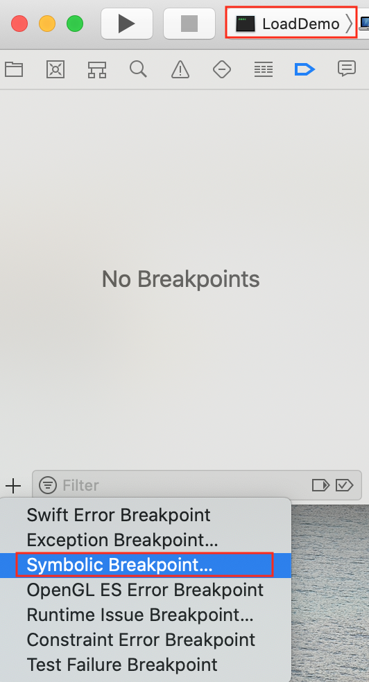
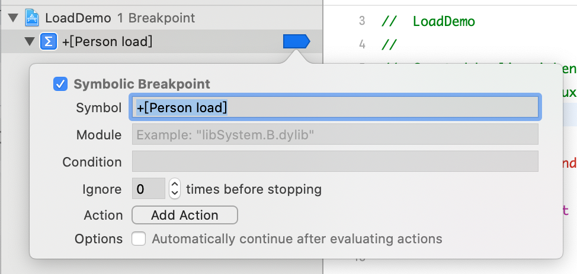
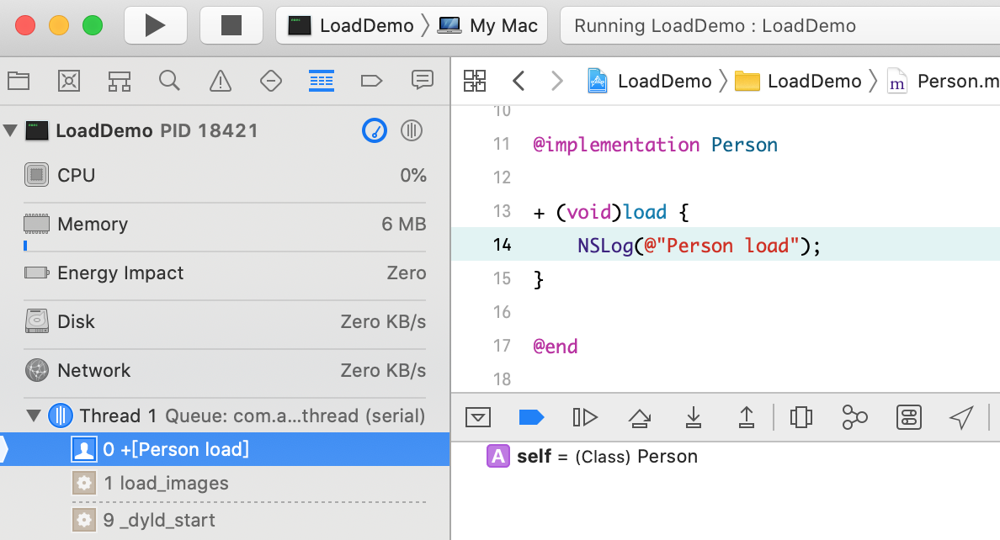

# load和initialize

参考: 

- [https://www.jianshu.com/p/3af22c8173db](https://www.jianshu.com/p/3af22c8173db)
- [https://www.jianshu.com/p/6d9a99ba3f06](https://www.jianshu.com/p/6d9a99ba3f06)
- 对比load和initialize: [https://stackoverflow.com/questions/13326435/nsobject-load-and-initialize-what-do-they-do](https://stackoverflow.com/questions/13326435/nsobject-load-and-initialize-what-do-they-do) 

load和initialize都是NSObject的类方法, NSObject.h 声明如下

```objective-c
// NSObject.h
+ (void)load;
+ (void)initialize;
```

但是实现默认是空的:  

```
// NSObject.mm
+ (void)load {}
+ (void)initialize {}
```

load方法是在添加到runtime时开始执行，先执行父类load 方法，再执行子类load方法，最后是类别中的load方法。因为是通过函数指针方式实现调用的，所以不会想objc_msgSend那样有方法查找过程 
+ load 作为 Objective-C 中的一个方法，与其它方法有很大的不同。它只是一个在整个文件被加载到运行时，在 main 函数调用之前被 ObjC 运行时调用的钩子方法

### load方法的调用栈  

新建一Mac OS Terminal程序, 新建一个Person类, 并书写load方法

```objective-c
@interface Person : NSObject

@end

@implementation Person

+ (void)load {
    NSLog(@"Person load");
}

@end

int main(int argc, const char * argv[]) {
    @autoreleasepool {
        
    }
    return 0;
}
```

运行项目可知, 虽然在main方法中没有调用任何关于Person的方法, 但是Console打印出来了 `Person load`, 也就是说, 这个load方法是runtime调用的.  

为了更清楚的了解它的调用栈, 我们可以打一下Symbolic Breakpoint:  
    

  

运行程序, 断点停在了load方法内:  

  

从下往上看, 其中dyld 是`dynamic link editor` 的缩写，它是苹果的动态链接器, 在系统内核做好程序准备工作之后，交由 dyld 负责余下的工作; 然后就是一个非常重要的方法 `load_images`, 比过`load_images`之后才会调到`[Person load]`, 来看一下位于objc-runtime-new.mm中的`load_images`源代码:  

call_load_methods
load_images

```c
// objc-runtime-new.mm

```

