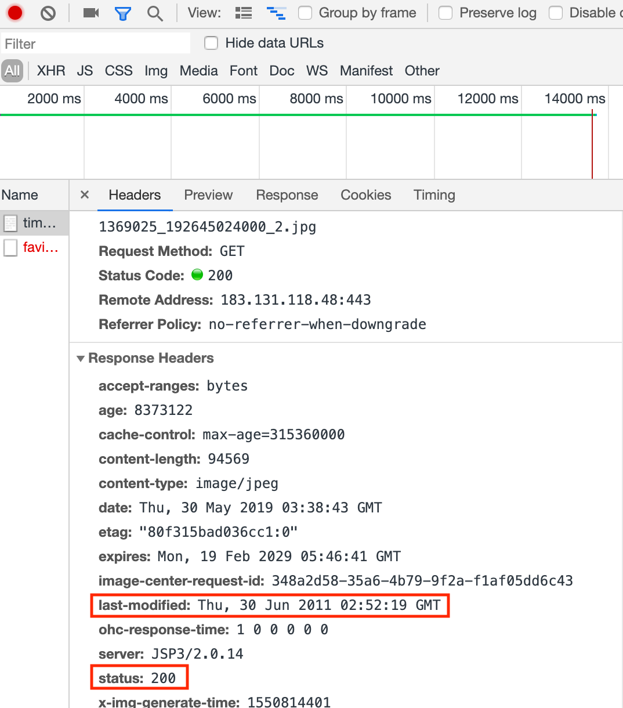
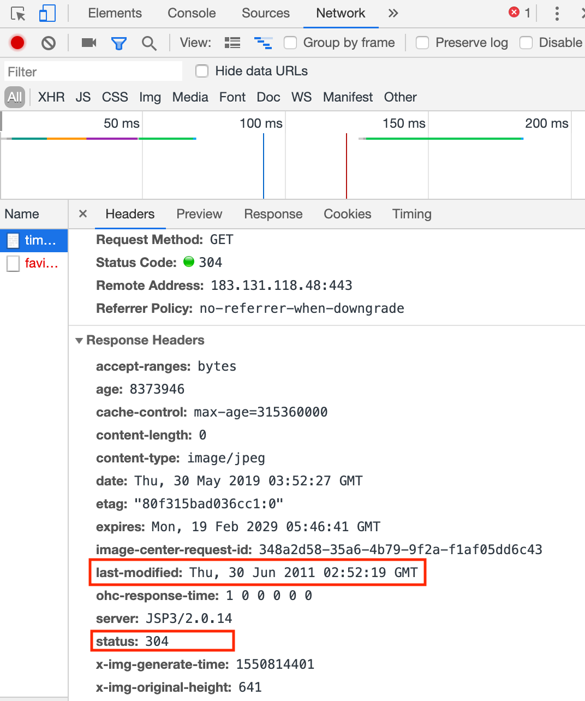

# 缓存

参考链接：
- [https://stackoverflow.com/questions/824152/what-takes-precedence-the-etag-or-last-modified-http-header/824209#824209](https://stackoverflow.com/questions/824152/what-takes-precedence-the-etag-or-last-modified-http-header/824209#824209)
- [https://www.jianshu.com/p/fb5aaeac06ef](https://www.jianshu.com/p/fb5aaeac06ef)
- [https://baike.baidu.com/item/ETag/4419019?fr=aladdin](https://baike.baidu.com/item/ETag/4419019?fr=aladdin)
- [https://developer.mozilla.org/zh-CN/docs/Web/HTTP/Headers/ETag](https://developer.mozilla.org/zh-CN/docs/Web/HTTP/Headers/ETag)


网络缓存一般指内存缓存和磁盘缓存，iOS提供了NSURLCache用于处理网络缓存。

### NSURLCache
An object that maps URL requests to cached response objects.
The NSURLCache class implements the caching of responses to URL load requests by mapping NSURLRequest objects to NSCachedURLResponse objects. It provides a composite in-memory and on-disk cache, and lets you manipulate the sizes of both the in-memory and on-disk portions. You can also control the path where cache data is stored persistently.

### 控制文件缓存的有效性
服务器的文件存贮，大多采用资源变动后就重新生成一个链接的做法。但不排除存在不同文件使用同一个链接的情况。那么如果服务端的file更改了，本地已经有了缓存。如何更新缓存？
这种情况下需要借助 ETag 或 Last-Modified 判断图片缓存是否有效。
在浏览器第一次请求某一个URL时，服务器端的返回状态会是200，内容是你请求的资源，同时有一个Last-Modified的属性标记此文件在服务期端最后被修改的时间，格式类似这样：
last-modified: Thu, 30 Jun 2011 02:52:19 GMT // Last-Modified 是资源最后修改的时间戳，往往与缓存时间进行对比来判断缓存是否过期
客户端第二次请求此URL时，根据 HTTP 协议的规定，浏览器会向服务器传送 If-Modified-Since 报头，询问该时间之后文件是否有被修改过：
If-Modified-Since: Thu, 30 Jun 2011 02:52:19 GMT
如果服务器端的资源没有变化，则自动返回 HTTP 304 （Not Changed.）状态码，内容为空，这样就节省了传输数据量。

以请求百度上面一张图片为例：
https://timgsa.baidu.com/timg?image&quality=80&size=b9999_10000&sec=1559197432643&di=d99c5caa027c418d1995d1646e6f2c2e&imgtype=0&src=http%3A%2F%2Fpic15.nipic.com%2F20110628%2F1369025_192645024000_2.jpg

当第一次请求时：


```
-- General --
Request URL: https://timgsa.baidu.com/timg?image&quality=80&size=b9999_10000&sec=1559197432643&di=d99c5caa027c418d1995d1646e6f2c2e&imgtype=0&src=http%3A%2F%2Fpic15.nipic.com%2F20110628%2F1369025_192645024000_2.jpg
Request Method: GET
Status Code: 200 
Remote Address: 183.131.118.48:443
Referrer Policy: no-referrer-when-downgrade

-- Response Headers --
accept-ranges: bytes
age: 8373122
cache-control: max-age=315360000
content-length: 94569
content-type: image/jpeg
date: Thu, 30 May 2019 03:38:43 GMT
etag: "80f315bad036cc1:0"
expires: Mon, 19 Feb 2029 05:46:41 GMT
image-center-request-id: 348a2d58-35a6-4b79-9f2a-f1af05dd6c43
last-modified: Thu, 30 Jun 2011 02:52:19 GMT
ohc-response-time: 1 0 0 0 0 0
server: JSP3/2.0.14
status: 200
x-img-generate-time: 1550814401
x-img-original-height: 641
x-img-original-size: 247176
x-img-original-width: 1024
x-img-thumnail-height: 641
x-img-thumnail-size: 94569
x-img-thumnail-width: 1024

-- Request Headers --
:authority: timgsa.baidu.com
:method: GET
:path: /timg?image&quality=80&size=b9999_10000&sec=1559197432643&di=d99c5caa027c418d1995d1646e6f2c2e&imgtype=0&src=http%3A%2F%2Fpic15.nipic.com%2F20110628%2F1369025_192645024000_2.jpg
:scheme: https
accept: text/html,application/xhtml+xml,application/xml;q=0.9,image/webp,image/apng,*/*;q=0.8,application/signed-exchange;v=b3
accept-encoding: gzip, deflate, br
accept-language: zh-CN,zh;q=0.9,en;q=0.8
cache-control: max-age=0
cookie: BIDUPSID=8E...
user-agent: Mozilla/5.0 (Linux; ...
```
再次请求时：


```
-- General --
Request URL: https://timgsa.baidu.com/timg?image&quality=80&size=b9999_10000&sec=1559197432643&di=d99c5caa027c418d1995d1646e6f2c2e&imgtype=0&src=http%3A%2F%2Fpic15.nipic.com%2F20110628%2F1369025_192645024000_2.jpg
Request Method: GET
Status Code: 304 
Remote Address: 183.131.118.48:443
Referrer Policy: no-referrer-when-downgrade

-- Response Headers --
accept-ranges: bytes
age: 8373946
cache-control: max-age=315360000
content-length: 0
content-type: image/jpeg
date: Thu, 30 May 2019 03:52:27 GMT
etag: "80f315bad036cc1:0"
expires: Mon, 19 Feb 2029 05:46:41 GMT
image-center-request-id: 348a2d58-35a6-4b79-9f2a-f1af05dd6c43
last-modified: Thu, 30 Jun 2011 02:52:19 GMT
ohc-response-time: 1 0 0 0 0 0
server: JSP3/2.0.14
status: 304
x-img-generate-time: 1550814401
x-img-original-height: 641
x-img-original-size: 247176
x-img-original-width: 1024
x-img-thumnail-height: 641
x-img-thumnail-size: 94569
x-img-thumnail-width: 1024

-- Request Headers --
:authority: timgsa.baidu.com
:method: GET
:path: /timg?image&quality=80&size=b9999_10000&sec=1559197432643&di=d99c5caa027c418d1995d1646e6f2c2e&imgtype=0&src=http%3A%2F%2Fpic15.nipic.com%2F20110628%2F1369025_192645024000_2.jpg
:scheme: https
accept: text/html,application/xhtml+xml,application/xml;q=0.9,image/webp,image/apng,*/*;q=0.8,application/signed-exchange;v=b3
accept-encoding: gzip, deflate, br
accept-language: zh-CN,zh;q=0.9,en;q=0.8
cache-control: max-age=0
cookie: BIDUPSID=8E4E4EB97A...
if-modified-since: Thu, 30 Jun 2011 02:52:19 GMT
if-none-match: "80f315bad036cc1:0"
upgrade-insecure-requests: 1
user-agent: Mozilla/5.0 (Linux; Android 6.0; Nexus 5 Build/MRA58N) AppleWebKit/537.36 (KHTML, like Gecko) Chrome/74.0.3729.169 Mobile Safari/537.36
```

伪代码示例：
```Objective-C
if ETagFromServer != ETagOnClient || LastModifiedFromServer != LastModifiedOnClient
  GetFromServer
else
  GetFromCache
```

代码示例：
```Objective-C
// Demo地址：https://github.com/ACommonChinese/MyGitbookSubDemos/tree/master/LastModified_ETag
#import "ViewController.h"

#define kLastModifiedImageURL @"https://timgsa.baidu.com/timg?image&quality=80&size=b9999_10000&sec=1559197432643&di=d99c5caa027c418d1995d1646e6f2c2e&imgtype=0&src=http%3A%2F%2Fpic15.nipic.com%2F20110628%2F1369025_192645024000_2.jpg"

typedef void (^GetDataCompletion)(NSData *data);

@interface ViewController ()

@property (weak, nonatomic) IBOutlet UIImageView *imageView;

// 响应的 LastModified
@property (nonatomic, copy) NSString *localLastModified;

@end

@implementation ViewController

- (void)viewDidLoad {
    [super viewDidLoad];
    // Do any additional setup after loading the view.
}

- (IBAction)lastModified:(id)sender {
    [self getData:^(NSData *data) {
        if (data) {
            self.imageView.image = [UIImage imageWithData:data];
        }
    }];
}

// https://github.com/ACommonChinese/MyGitbookSubDemos/tree/master/LastModified_ETag
- (void)getData:(GetDataCompletion)completion {
    NSURL *url = [NSURL URLWithString:kLastModifiedImageURL];
    NSMutableURLRequest *request = [NSMutableURLRequest requestWithURL:url cachePolicy:NSURLRequestReloadIgnoringLocalCacheData timeoutInterval:15.0];
    // NSURLRequestReloadIgnoringLocalCacheData: This policy specifies that no existing cache data should be used to satisfy a URL load request. 试验结果：运行中点击两次走缓存（再次运行，第一次不走缓存）
    // NSURLRequestReturnCacheDataElseLoad: Use existing cache data, regardless or age or expiration date, loading from originating source only if there is no cached data. 试验结果：每次都是statusCode == 200
    // NSURLRequestReturnCacheDataDontLoad: Use existing cache data, regardless or age or expiration date, and fail if no cached data is available. 试验结果：每次都是statusCode == 200
    
    // 发送 LastModified
    if (self.localLastModified.length > 0) {
        [request setValue:self.localLastModified forHTTPHeaderField:@"If-Modified-Since"];
    }
    
    NSURLSessionDataTask *task = [[NSURLSession sharedSession] dataTaskWithRequest:request completionHandler:^(NSData * _Nullable data, NSURLResponse * _Nullable response, NSError * _Nullable error) {
        NSHTTPURLResponse *httpResponse = (NSHTTPURLResponse *)response;
        NSLog(@"statusCode == %@", @(httpResponse.statusCode));
        // 判断响应的状态码是否是 304 Not Modified （更多状态码含义解释： https://github.com/ChenYilong/iOSDevelopmentTips）
        if (httpResponse.statusCode == 304) {
            NSLog(@"加载本地缓存图片");
            // 如果是，使用本地缓存
            // 根据请求获取到`被缓存的响应`！
            NSCachedURLResponse *cacheResponse = [[NSURLCache sharedURLCache] cachedResponseForRequest:request];
            // 拿到缓存的数据
            data = cacheResponse.data;
        }
        // 获取并且纪录 LastModified
        self.localLastModified = httpResponse.allHeaderFields[@"Last-Modified"];
        NSLog(@"localLastModified: %@", self.localLastModified);
        dispatch_async(dispatch_get_main_queue(), ^{
            !completion ?: completion(data);
        });
    }];
    [task resume];
}

@end
```

### ETag
[Etag百度](https://baike.baidu.com/item/ETag/4419019?fr=aladdin)

Etag是一个字符串值，用作 Request 缓存请求头，每一个资源文件都对应一个唯一的 ETag 值， 服务器单独负责生成和判断Etag是什么及其含义，并在HTTP响应头中将其传送到客户端:

```
服务器端返回的格式:
ETag: "50b1c1d4f775c61:df3"

客户端的查询更新格式:
If-None-Match: W/"50b1c1d4f775c61:df3"

// If-None-Match - 与响应头的 Etag 相对应，可以判断本地缓存数据是否发生变化, 如果ETag没改变，则返回状态304然后不返回，这也和Last-Modified一样。
```

ETag 是的功能与 Last-Modified 类似：服务端不会每次都会返回文件资源。客户端每次向服务端发送上次服务器返回的 ETag 值，服务器会根据客户端与服务端的 ETag 值是否相等，来决定是否返回 data，同时总是返回对应的 HTTP 状态码。客户端通过 HTTP 状态码来决定是否使用缓存。比如：服务端与客户端的 ETag 值相等，则 HTTP 状态码为 304，不返回 data。服务端文件一旦修改，服务端与客户端的 ETag 值不等，并且状态值会变为200，同时返回 data。

因为修改资源文件后该值会立即变更。这也决定了 ETag 在断点下载时非常有用。 比如 AFNetworking 在进行断点下载时，就是借助它来检验数据的。详见在 AFHTTPRequestOperation 类中的用法:

```Objective-C
// 下载暂停时提供断点续传功能，修改请求的HTTP头，记录当前下载的文件位置，下次可以从这个位置开始下载。
- (void)pause {
   unsigned long long offset = 0;
   if ([self.outputStream propertyForKey:NSStreamFileCurrentOffsetKey]) {
       offset = [[self.outputStream propertyForKey:NSStreamFileCurrentOffsetKey] unsignedLongLongValue];
   } else {
       offset = [[self.outputStream propertyForKey:NSStreamDataWrittenToMemoryStreamKey] length];
   }

   NSMutableURLRequest *mutableURLRequest = [self.request mutableCopy];
   if ([self.response respondsToSelector:@selector(allHeaderFields)] && [[self.response allHeaderFields] valueForKey:@"ETag"]) {
   //若请求返回的头部有ETag，则续传时要带上这个ETag，
   //ETag用于放置文件的唯一标识，比如文件MD5值
   //续传时带上ETag服务端可以校验相对上次请求，文件有没有变化，
   //若有变化则返回200，回应新文件的全数据，若无变化则返回206续传。
       [mutableURLRequest setValue:[[self.response allHeaderFields] valueForKey:@"ETag"] forHTTPHeaderField:@"If-Range"];
   }
   //给当前request加Range头部，下次请求带上头部，可以从offset位置继续下载
   [mutableURLRequest setValue:[NSString stringWithFormat:@"bytes=%llu-", offset] forHTTPHeaderField:@"Range"];
   self.request = mutableURLRequest;

   [super pause];
}
```

Etag示例代码：
```Objective-C
#import "ViewController.h"

#define kETagImageURL @"http://img.daimg.com/uploads/allimg/110727/3-110HG133235Y.jpg"

typedef void (^GetDataCompletion)(NSData *data);

@interface ViewController ()

@property (weak, nonatomic) IBOutlet UIImageView *imageView;

// 响应的 LastModified
@property (nonatomic, copy) NSString *localLastModified;
// 响应的 etag
@property (nonatomic, copy) NSString *etag;

@end

@implementation ViewController

- (void)viewDidLoad {
    [super viewDidLoad];
    // Do any additional setup after loading the view.
}

- (IBAction)lastModified:(id)sender {
    [self getData:^(NSData *data) {
        if (data) {
            self.imageView.image = [UIImage imageWithData:data];
        }
    }];
}

- (IBAction)etag:(id)sender {
    [self EtagGetData:^(NSData *data) {
        if (data) {
            self.imageView.image = [UIImage imageWithData:data];
        }
    }];
}

/*!
 @brief 如果本地缓存资源为最新，则使用使用本地缓存。如果服务器已经更新或本地无缓存则从服务器请求资源。
 步骤：
 1. 请求是可变的，缓存策略要每次都从服务器加载
 2. 每次得到响应后，需要记录住 etag
 3. 下次发送请求的同时，将etag一起发送给服务器（由服务器比较内容是否发生变化）
 */
- (void)EtagGetData:(GetDataCompletion)completion {
    NSURL *url = [NSURL URLWithString:kETagImageURL];
    NSMutableURLRequest *request = [NSMutableURLRequest requestWithURL:url cachePolicy:NSURLRequestReloadIgnoringCacheData timeoutInterval:15.0];
    
    // 发送 etag
    if (self.etag.length > 0) {
        [request setValue:self.etag forHTTPHeaderField:@"If-None-Match"];
    }
    
    NSURLSessionDataTask *task = [[NSURLSession sharedSession] dataTaskWithRequest:request completionHandler:^(NSData * _Nullable data, NSURLResponse * _Nullable response, NSError * _Nullable error) {
        NSHTTPURLResponse *httpResponse = (NSHTTPURLResponse *)response;
        NSLog(@"statusCode == %@", @(httpResponse.statusCode));
        // 判断响应的状态码是否是 304 Not Modified （更多状态码含义解释： https://github.com/ChenYilong/iOSDevelopmentTips）
        if (httpResponse.statusCode == 304) {
            NSLog(@"加载本地缓存图片");
            // 如果是，使用本地缓存
            // 根据请求获取到`被缓存的响应`！
            NSCachedURLResponse *cacheResponse =  [[NSURLCache sharedURLCache] cachedResponseForRequest:request];
            // 拿到缓存的数据
            data = cacheResponse.data;
        }
        // 获取并且纪录 etag，区分大小写
        self.etag = httpResponse.allHeaderFields[@"Etag"];
        NSLog(@"%@", self.etag);
        dispatch_async(dispatch_get_main_queue(), ^{
            !completion ?: completion(data);
        });
    }];
    [task resume];
}

@end
```
注：由于加载非https图片，需在Info.plist中添加App Transport Security Settings及其下的Allow Arbitrary Loads: YES.
另外，如果借助了 Last-Modified 和 ETag，那么缓存策略则必须使用 NSURLRequestReloadIgnoringCacheData 策略，忽略缓存，每次都要向服务端进行校验。

系统的NSURLCache可以满足大部分情况，如果使用 GET 请求，iOS已经帮你做好了缓存。你需要的仅仅是设置下内存缓存大小、磁盘缓存大小、以及缓存路径。甚至这两行代码不设置也是可以的，会有一个默认值。代码如下：
```Objective-C
NSURLCache *urlCache = [[NSURLCache alloc] initWithMemoryCapacity:4 * 1024 * 1024 diskCapacity:20 * 1024 * 1024 diskPath:nil];
[NSURLCache setSharedURLCache:urlCache];
```
只此两句代码即可，但是不够灵活，不能自定义。只能指定一个缓存的总文件夹，不能分别指定每一个文件缓存的位置，更不能为每个文件创建一个文件夹，也不能指定文件夹的名称。缓存的对象也是固定的：只能是 GET请求的返回值。

