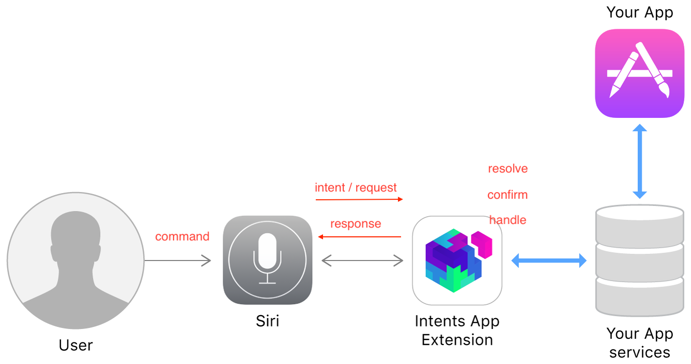

# SiriKit工作流程

[Apple](https://developer.apple.com/documentation/sirikit)

用户对Siri讲话，即发送指令command, 比如：打开某某App发送消息给张三，这是一条command, Siri接到这个command之后自动分析指令并把用户讲的指令转变为actionable data并且把它们放入封装对象好的对象intent object中，然后把这个intent作为request传给Intents app extension, 然后Siri和extension之间会有交互。我们要做的就是在intent app extension中撸码，解决交互中的三个阶段：resolve confirm和handle。

