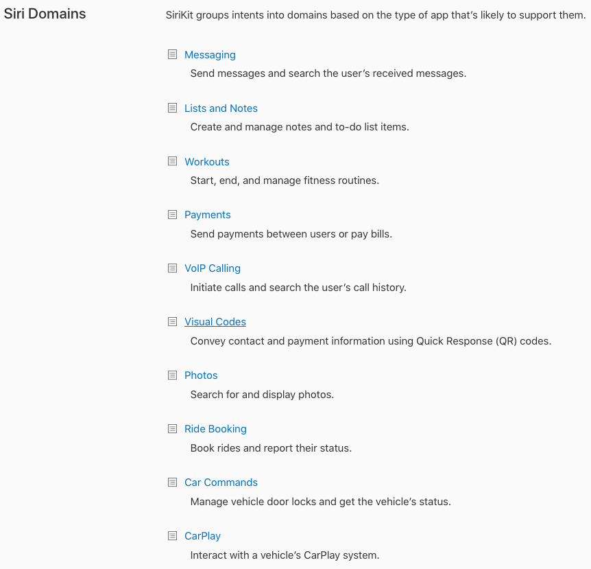

# 概念介绍

**domain & intent & (resolve, confirm, handle)三部曲**

在[这里](https://developer.apple.com/documentation/sirikit)有所有domain的列表服务的种类，即是domain, 比如：健康、信息、支付、预定车辆、媒体等等。[这里: Apple: Domains and Intents](https://developer.apple.com/design/human-interface-guidelines/sirikit/overview/domains-and-intents/)是详细介绍，SiriKit把不同的业务种类分成不同的domain，用户对Siri讲话时，Siri分析出domain并做一些具体的事情，这些事情即是`intent`, 即domain是intent的集合，比如用户说："发送消息给张三"，这属于消息类的domain, 经过Siri处理，用户的命令这个事情用成了用户的意图`intent`传给`extension`, extension处理intent. 在处理消息的过程中由于语义不清楚，可能需要`resolve`，然后确定以后，假如有多种选择，会要求`confirm`确认，`confirm`之后，extension就可以`handle`这个消息。

由于各种domain的不同，导致一个问题，比如对于消息类的domain, 有不同的class和方法，不同的处理，对于预定车辆(ride book)又是另外的各种class和方法，虽然其用法大同小异，但依然还是有所差别。这就需要根据不同的业务domain做不同的学习。

[Siri Domains](https://developer.apple.com/documentation/sirikit#//apple_ref/doc/uid/TP40016875-CH9-SW2)

... ...

下面是一个和`Intent`相关的常用的类：
[Apple](https://developer.apple.com/documentation/sirikit/extension-related_classes)

- INExtension（类）: Intent extension的入口点
- INIntentHandlerProviding (协议)，分发和处理这些intent的接口
- INIntent: 使用Intent extension填充的请求
- INIntentResponse: intent对象的响应
- INIntentResolutionResult: 对intent object的resolve的结果 
- INPreferences: 偏好设置
- INParameter: 交互对象的参数
- INIntentError: SiriKit返回的错误
- INIntentError.Code: 错误码
- INIntentErrorDomain: Intent的错误domain

