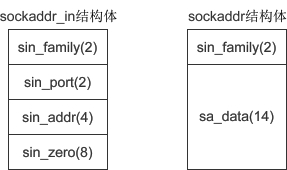

# Linux_Socket常用函数解析

接口查询参考[http://man.he.net/](http://man.he.net/)

**htons**
htonl, htons, ntohl, ntohs -- convert values between host and network
     byte order
即：htonl, htons, ntohl, ntohs这4个函数转换主机节序和网络的字节序。网络中使用大端big endian, 大字节在前, 常见的网络字节转换函数有：
htons()：host to network short，将 short 类型数据从主机字节序转换为网络字节序。
ntohs()：network to host short，将 short 类型数据从网络字节序转换为主机字节序。
htonl()：host to network long，将 long 类型数据从主机字节序转换为网络字节序。
ntohl()：network to host long，将 long 类型数据从网络字节序转换为主机字节序。
htons() 用来将当前主机字节序转换为网络字节序，其中h代表主机（host）字节序，n代表网络（network）字节序，s代表short，htons 是 h、to、n、s 的组合，可以理解为”将 short 型数据从当前主机字节序转换为网络字节序“。

**int socket(int af, int type, int protocol)**
- `#include <sys/socket.h>`
- 创建一个socket, 示例：`int serv_sock = socket(AF_INET, SOCK_STREAM, IPPROTO_TCP);`
- 参数af：地址族（Address Family），也就是 IP 地址类型，常用的有 AF_INET 和 AF_INET6。AF 是“Address Family”的简写，INET是“Inetnet”的简写。AF_INET 表示 IPv4 地址，例如 127.0.0.1；AF_INET6 表示 IPv6 地址，例如 1030::C9B4:FF12:48AA:1A2B
注：127.0.0.1，它是一个特殊IP地址，表示本机地址。
也可以使用 PF 前缀，PF 是“Protocol Family”的简写，它和 AF 是一样的。例如，PF_INET 等价于 AF_INET，PF_INET6 等价于 AF_INET6
- 参数type: 数据传输方式/套接字类型，常用的有 SOCK_STREAM（流格式套接字/面向连接的套接字） 和 SOCK_DGRAM（数据报套接字/无连接的套接字）
- 能数protocol:  protocol 表示传输协议，常用的有 IPPROTO_TCP 和 IPPTOTO_UDP，分别表示 TCP 传输协议和 UDP 传输协议. 注：一般情况下有了 af 和 type 两个参数就可以创建套接字了，操作系统会自动推演出协议类型，除非遇到这样的情况：有两种不同的协议支持同一种地址类型和数据传输类型。如果我们不指明使用哪种协议，操作系统是没办法自动推演的。参数指定IPPROTO_TCP即是TCP套接字。
- 如果使用 SOCK_DGRAM 传输方式，那么满足这两个条件的协议只有 UDP，因此可以这样来调用 socket() 函数：`int udp_socket = socket(AF_INET, SOCK_DGRAM, IPPROTO_UDP);  //IPPROTO_UDP表示UDP协议`, 这种套接字称为 UDP 套接字。
- 上面两种情况都只有一种协议满足条件，可以将 protocol 的值设为 0，系统会自动推演出应该使用什么协议，如下所示：
```
int tcp_socket = socket(AF_INET, SOCK_STREAM, 0);  //创建TCP套接字
int udp_socket = socket(AF_INET, SOCK_DGRAM, 0);  //创建UDP套接字
```
**int bind(int sockfd, const struct sockaddr *addr, socklen_t addrlen)**
- 将套接字和IP、端口绑定
- sock 为 socket 文件描述符，addr 为 sockaddr 结构体变量的指针，addrlen 为 addr 变量的大小，可由 sizeof() 计算得出。
- 下面的代码，将创建的套接字与IP地址 127.0.0.1、端口 1234 绑定：
```C
#include <sys/types.h>
#include <sys/socket.h>
//创建套接字
int serv_sock = socket(AF_INET, SOCK_STREAM, IPPROTO_TCP);
//创建sockaddr_in结构体变量
struct sockaddr_in serv_addr;
memset(&serv_addr, 0, sizeof(serv_addr));  //每个字节都用0填充
serv_addr.sin_family = AF_INET;  //使用IPv4地址
serv_addr.sin_addr.s_addr = inet_addr("127.0.0.1");  //具体的IP地址
serv_addr.sin_port = htons(1234);  //端口
//将套接字和IP、端口绑定
bind(serv_sock, (struct sockaddr*)&serv_addr, sizeof(serv_addr)); // 这里我们使用 sockaddr_in 结构体，然后再强制转换为 sockaddr 类型，后边会讲解为什么这样做
```

**sockaddr_in**
- 结构体(一般用作套接字地址)
- 成员变量：
```C
struct sockaddr_in{
    sa_family_t     sin_family;   //地址族（Address Family），也就是地址类型
    uint16_t        sin_port;     //16位的端口号
    struct in_addr  sin_addr;     //32位IP地址
    char            sin_zero[8];  //不使用，一般用0填充
};
```
- 示例：
```C
struct sockaddr_in serv_addr; // 套接字地址
memset(&serv_addr, 0, sizeof(serv_addr)); // 每个字节都用0填充
serv_addr.sin_family = AF_INET; // 使用IPv4地址
serv_addr.sin_addr.s_addr = inet_addr("30.16.104.56"); // IP地址
serv_addr.sin_port = htons(1234); // 端口号
```
- 参数sin_family 和 socket() 的第一个参数的含义相同，取值也要保持一致
- 参数sin_port为端口号。uint16_t 的长度为两个字节，理论上端口号的取值范围为 0~65536，但 0~1023 的端口一般由系统分配给特定的服务程序，例如 Web 服务的端口号为 80，FTP 服务的端口号为 21，所以我们的程序要尽量在 1024~65536 之间分配端口号。端口号需要用 htons() 函数转换。
- 参数sin_addr是struct in_addr 结构体类型的变量，该结构体只包含一个成员：
```C
struct in_addr{
    in_addr_t  s_addr;  //32位的IP地址
};
```
in_addr_t 在头文件 <netinet/in.h> 中定义，等价于 unsigned long，长度为4个字节。也就是说，s_addr 是一个整数，而IP地址是一个字符串，所以需要 inet_addr() 函数进行转换，例如：
```C
unsigned long ip = inet_addr("127.0.0.1");
printf("%ld\n", ip); // 16777343
```
- 参数sin_zero[8] 是多余的8个字节，没有用，一般使用 memset() 函数填充为 0。上面的代码中，先用 memset() 将结构体的全部字节填充为 0，再给前3个成员赋值，剩下的 sin_zero 自然就是 0 了

注：bind() 第二个参数的类型为 sockaddr，而代码中却使用 sockaddr_in，然后再强制转换为 sockaddr，这是为什么呢？
sockaddr 结构体的定义如下：
```C
struct sockaddr{
    sa_family_t  sin_family;   //地址族（Address Family），也就是地址类型
    char         sa_data[14];  //IP地址和端口号
};
```
下图是 sockaddr 与 sockaddr_in 的对比（括号中的数字表示所占用的字节数）：

sockaddr 和 sockaddr_in 的长度相同，都是16字节，只是将IP地址和端口号合并到一起，用一个成员 sa_data 表示。要想给 sa_data 赋值，必须同时指明IP地址和端口号，例如”127.0.0.1:80“，遗憾的是，没有相关函数将这个字符串转换成需要的形式，也就很难给 sockaddr 类型的变量赋值，所以使用 sockaddr_in 来代替。这两个结构体的长度相同，强制转换类型时不会丢失字节，也没有多余的字节。

可以认为，sockaddr 是一种通用的结构体，可以用来保存多种类型的IP地址和端口号，而 sockaddr_in 是专门用来保存 IPv4 地址的结构体。另外还有 sockaddr_in6，用来保存 IPv6 地址，它的定义如下：

```C
struct sockaddr_in6 { 
    sa_family_t sin6_family;  //(2)地址类型，取值为AF_INET6
    in_port_t sin6_port;  //(2)16位端口号
    uint32_t sin6_flowinfo;  //(4)IPv6流信息
    struct in6_addr sin6_addr;  //(4)具体的IPv6地址
    uint32_t sin6_scope_id;  //(4)接口范围ID
};
```
正是由于通用结构体 sockaddr 使用不便，才针对不同的地址类型定义了不同的结构体。

**int connect(int sock, struct sockaddr *serv_addr, socklen_t addrlen)**
- 用来建立连接, 参数同bind()

**int listen(int sock, int backlog)**
- 参数sock为需要进入监听状态的套接字，backlog 为请求队列的最大长度
- 所谓被动监听，是指当没有客户端请求时，套接字处于“睡眠”状态，只有当接收到客户端请求时，套接字才会被“唤醒”来响应请求
- 请求队列: 当套接字正在处理客户端请求时，如果有新的请求进来，套接字是没法处理的，只能把它放进缓冲区，待当前请求处理完毕后，再从缓冲区中读取出来处理。如果不断有新的请求进来，它们就按照先后顺序在缓冲区中排队，直到缓冲区满。这个缓冲区，就称为请求队列（Request Queue）
缓冲区的长度（能存放多少个客户端请求）可以通过 listen() 函数的 backlog 参数指定，但究竟为多少并没有什么标准，可以根据你的需求来定，并发量小的话可以是10或者20。
如果将 backlog 的值设置为 SOMAXCONN，就由系统来决定请求队列长度，这个值一般比较大，可能是几百，或者更多。
当请求队列满时，就不再接收新的请求，对于 Linux，客户端会收到 ECONNREFUSED 错误，对于 Windows，客户端会收到 WSAECONNREFUSED 错误。

注意：listen() 只是让套接字处于监听状态，并没有接收请求。接收请求需要使用 accept() 函数

**int accept(int sock, struct sockaddr *addr, socklen_t *addrlen)**
- 参数与 listen() 和 connect() 是相同的：sock 为服务器端套接字，addr 为 sockaddr_in 结构体变量，addrlen 为参数 addr 的长度，可由 sizeof() 求得
- accept() 返回一个新的套接字来和客户端通信，addr 保存了客户端的IP地址和端口号，而 sock 是服务器端的套接字，后面和客户端通信时，要使用这个新生成的套接字，而不是原来服务器端的套接字
- listen() 只是让套接字进入监听状态，并没有真正接收客户端请求，listen() 后面的代码会继续执行，直到遇到 accept()。accept() 会阻塞程序执行（后面代码不能被执行），直到有新的请求到来。

**send()/recv()和write()/read()：发送数据和接收数据**
在服务器端用 write() 向套接字写入数据，客户端就能收到，然后再使用 read() 从套接字中读取出来，就完成了一次通信。
- `ssize_t write(int fd, const void *buf, size_t nbytes)`
  - fd 为要写入的文件的描述符，buf 为要写入的数据的缓冲区地址，nbytes 为要写入的数据的字节数
write() 函数会将缓冲区 buf 中的 nbytes 个字节写入文件 fd，成功则返回写入的字节数，失败则返回 -1
- ssize_t read(int fd, void *buf, size_t nbytes)
  - fd 为要读取的文件的描述符，buf 为要接收数据的缓冲区地址，nbytes 为要读取的数据的字节数
  - read() 函数会从 fd 文件中读取 nbytes 个字节并保存到缓冲区 buf，成功则返回读取到的字节数（但遇到文件结尾则返回0），失败则返回 -1

**recv**
```C
#include <sys/socket.h>
ssize_t recv(int socket, void *buffer, size_t length, int flags);

ssize_t recvfrom(int socket, void *restrict buffer, size_t length, int flags, struct sockaddr *restrict address, socklen_t *restrict address_len);
ssize_t recvmsg(int socket, struct msghdr *message, int flags);
```
receive a message from a socket


