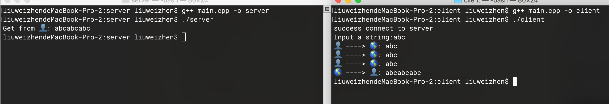

# TCP粘包问题

###缓冲区
每个 socket 被创建后，都会分配两个缓冲区，输入缓冲区和输出缓冲区:


这些I/O缓冲区特性可整理如下：
- I/O缓冲区在每个TCP套接字中单独存在；
- I/O缓冲区在创建套接字时自动生成；
- 即使关闭套接字也会继续传送输出缓冲区中遗留的数据;
- 关闭套接字将丢失输入缓冲区中的数据;

输入输出缓冲区的默认大小可以通过 getsockopt() 函数获取：

```C
int sock = socket(AF_INET, SOCK_STREAM, IPPROTO_TCP);
unsigned optVal;
socklen_t optLen = sizeof(int);
getsockopt(sock, SOL_SOCKET, SO_SNDBUF, (void*)&optVal, &optLen);
printf("缓冲区大小: %d字节\n", optVal); // 缓冲区大小: 131072字节
```

###阻塞模式
TCP套接字默认情况下是阻塞模式，也是最常用的，在这种模式下：
当使用 write()/send() 发送数据时：
1. 首先会检查缓冲区，如果缓冲区的可用空间长度小于要发送的数据，那么 write()/send() 会被阻塞（暂停执行），直到缓冲区中的数据被发送到目标机器，腾出足够的空间，才唤醒 write()/send() 函数继续写入数据。
2. 如果TCP协议正在向网络发送数据，那么输出缓冲区会被锁定，不允许写入，write()/send() 也会被阻塞，直到数据发送完毕缓冲区解锁，write()/send() 才会被唤醒。
3. 如果要写入的数据大于缓冲区的最大长度，那么将分批写入。
4. 直到所有数据被写入缓冲区 write()/send() 才能返回。

当使用 read()/recv() 读取数据时：
1. 首先会检查缓冲区，如果缓冲区中有数据，那么就读取，否则函数会被阻塞，直到网络上有数据到来。
2. 如果要读取的数据长度小于缓冲区中的数据长度，那么就不能一次性将缓冲区中的所有数据读出，剩余数据将不断积压，直到有 read()/recv() 函数再次读取。
3. 直到读取到数据后 read()/recv() 函数才会返回，否则就一直被阻塞。

这就是TCP套接字的阻塞模式。所谓阻塞，就是上一步动作没有完成，下一步动作将暂停，直到上一步动作完成后才能继续，以保持同步性。

###粘包问题
由于缓冲区的存在和阻塞模式，数据的接收和发送不一定是同步的，即read()/recv() 和 write()/send() 的执行次数可能不同。
例如，write()/send() 重复执行三次，每次都发送字符串"abc"，那么目标机器上的 read()/recv() 可能分三次接收，每次都接收"abc"；也可能分两次接收，第一次接收"abcab"，第二次接收"cabc"；也可能一次就接收到字符串"abcabcabc"。

假设我们希望客户端每次发送一位学生的学号，让服务器端返回该学生的姓名、住址、成绩等信息，这时候可能就会出现问题，服务器端不能区分学生的学号。例如第一次发送 1，第二次发送 3，服务器可能当成 13 来处理，返回的信息显然是错误的。

这就是数据的“粘包”问题，客户端发送的多个数据包被当做一个数据包接收。也称数据的无边界性，read()/recv() 函数不知道数据包的开始或结束标志（实际上也没有任何开始或结束标志），只把它们当做连续的数据流来处理。

下面的代码演示了粘包问题，客户端连续三次向服务器端发送数据，服务器端却一次性接收到所有数据：
[http://c.biancheng.net/view/2350.html](http://c.biancheng.net/view/2350.html)演示了在Windows环境下的代码，下面我们先一个在Linux下的演示代码：

**server**
```C
#include <iostream>
#include <stdlib.h>
#include <sys/socket.h>
#include <netinet/in.h>
#include <arpa/inet.h>
#include <unistd.h>

#define BUF_SIZE 100

int main(int argc, const char * argv[]) {
    struct sockaddr_in serv_addr;
    memset(&serv_addr, 0, sizeof(serv_addr));
    serv_addr.sin_family = AF_INET;
    serv_addr.sin_addr.s_addr = inet_addr("30.16.104.105");
    serv_addr.sin_port = htons(1234);
    
    int serv_sock = socket(AF_INET, SOCK_STREAM, IPPROTO_TCP);
    bind(serv_sock, (const struct sockaddr *)&serv_addr, sizeof(serv_addr));
    
    listen(serv_sock, 20);
    
    struct sockaddr_in clnt_addr;
    socklen_t clnt_addr_size = sizeof(clnt_addr);
    int clnt_sock = accept(serv_sock, (struct sockaddr *)&clnt_addr, &clnt_addr_size);
    
    sleep(10); // 暂停10秒

    // 接收客户端发来的数据，并原样返回
    char buffer[BUF_SIZE] = {0};
    ssize_t recv_len = recv(clnt_sock, buffer, BUF_SIZE, 0);
    printf("Get from 👤: %s\n", buffer);
    send(clnt_sock, buffer, recv_len, 0);
    
    close(clnt_sock);
    close(serv_sock);
    
    return 0;
}
```

**client**
```C
#include <iostream>
#include <stdlib.h>
#include <unistd.h>
#include <arpa/inet.h>
#include <sys/socket.h>

#define BUF_SIZE 100

int main(int argc, const char * argv[]) {
    struct sockaddr_in serv_addr;
    memset(&serv_addr, 0, sizeof(serv_addr));
    serv_addr.sin_family = AF_INET;
    serv_addr.sin_addr.s_addr = inet_addr("30.16.104.105");
    serv_addr.sin_port = htons(1234);
    
    int sock = socket(AF_INET, SOCK_STREAM, IPPROTO_TCP);
    int flag = connect(sock, (struct sockaddr*)&serv_addr, sizeof(serv_addr));
    if (flag == 0) {
        printf("success connect to server\n");
    }
    else {
        printf("fail connect to server\n");
        return 0;
    }
    
    char bufSend[BUF_SIZE] = {0};
    printf("Input a string:");
    // gets(bufSend);
    scanf("%s", bufSend);
    for (int i = 0; i < 3; i++) {
        printf("👤 ----> 🌎: %s\n", bufSend);
        send(sock, bufSend, strlen(bufSend), 0);
    }

    char bufRecv[BUF_SIZE] = {0};
    recv(sock, bufRecv, BUF_SIZE, 0);
    printf("🌎 ----> 👤: %s\n", bufRecv);
    
    close(sock);
    
    return 0;
}
```



[Demo](https://github.com/ACommonChinese/MyGitbookSubDemos/tree/master/socket%E7%B2%98%E5%8C%85%E9%97%AE%E9%A2%98)

###什么是保护消息边界
保护消息边界是指传输协议把数据当做一条独立的消息在网上传输，接收端只能接收独立的消息。也就是说存在保护消息边界，接收端一次只能接收发送端发出的一个数据包。UDP具有保护消息边界。但是TCP没有。

###UDP为什么不会出现粘包
TCP是面向流的传输，UDP是面向消息的传输，具有保护消息边界。

TCP为了保证可靠传输，尽量减少额外开销（每次发包都要验证），因此采用了流式传输，面向流的传输，采用优化方法（Nagle算法），无保护消息边界，将多次间隔较小、数据量小的数据，合并成一个大的数据块，然后进行封包。这相对于面向消息的传输，可以减少发送包的数量，从而减少了额外开销。但是，对于数据传输频繁的程序来讲，使用TCP可能会容易粘包。当然，对接收端的程序来讲，如果机器负荷很重，也会在接收缓冲里粘包。

UDP采用了链式结构来记录每一个到达的UDP包，在每个UDP包中就有了消息头（消息来源地址，端口等信息），这样，对于接收端来说，就容易进行区分处理了。所以UDP不会出现粘包问题。UDP协议的保护消息边界使得每一个消息都是独立的。而流传输却把数据当作一串数据流，不认为数据是一个一个的消息。

举个例子来说，连续发送三个数据包，大小分别是1k，2k，4k，这三个数据包都已经到达了接收端的缓冲区中，如果使用UDP协议，不管我们使用多大的接收缓冲区去接收数据，则必须有三次接收动作，才能把所有数据包接受完。而使用TCP协议，只要把接收数据的缓冲区大小设置在7kb以上，就能够一次把所有的数据包接收下来，即只需要有一次接收动作。这样问题就来了，由于TCP协议是流传输的，它把数据当作一串数据流，所以他不知道消息的边界，即独立的消息之间是如何被分隔开的。这便会造成消息的混淆，也就是说不能够保证一个send方法发出的数据被一个recv方法读取.

###什么时候有可能出现粘包
1. 如果利用tcp每次发送数据，就与对方建立连接，然后双方发送完一段数据后，都关闭连接（双方都发送close），这样就不会出现粘包问题（因为只有一种包结构,类似于http协议）。
如：A需要发送一段字符串给B，那么A与B建立连接，然后发送双方都默认好的协议字符如"hello give me sth abour yourself"，然后B收到报文后，就将缓冲区数据接收，然后关闭连接，这样粘包问题不用考虑到，因为大家都知道是发送一段字符
2. 如果发送数据无结构，如文件传输，这样发送方只管发送，接收方只管接收存储就ok，也不用考虑粘包
3. 如果双方建立连接，需要在连接后一段时间内发送不同结构数据，如：
  - "hellogive me sth abour yourself"
  - "Don'tgive me sth abour yourself"
这样的话，如果发送方连续发送这个两个包出去，接收方一次接收可能会是"hellogive me sth abour yourselfDon't give me sth abour yourself"这样粘包出现，接收方就傻了。

###发送方和接收方都有可能出现粘包
1. 发送方引起的粘包是由TCP协议本身造成的，TCP为提高传输效率，发送方往往要收集到足够多的数据后才发送一包数据。若连续几次发送的数据都很少，通常TCP会根据优化算法把这些数据合成一包后一次发送出去，这样接收方就收到了粘包数据。
2. 接收方引起的粘包是由于接收方用户进程不及时接收数据，从而导致粘包现象。这是因为接收方先把收到的数据放在系统接收缓冲区，用户进程从该缓冲区取数据，若下一包数据到达时前一包数据尚未被用户进程取走，则下一包数据放到系统接收缓冲区时就接到前一包数据之后，而用户进程根据预先设定的缓冲区大小从系统接收缓冲区取数据，这样就一次取到了多包数据。

### 如何解决粘包现象
参见[这里](https://www.cnblogs.com/smark/p/3284756.html)
处理粘包的唯一方法就是制定应用层的数据通讯协议，通过协议来规范现有接收的数据是否满足消息数据的需要。在应用中处理粘包的基础方法主要有两种分别是以4节字描述消息大小或以结束符，实际上也有两者相结合的如HTTP,redis的通讯协议等。


