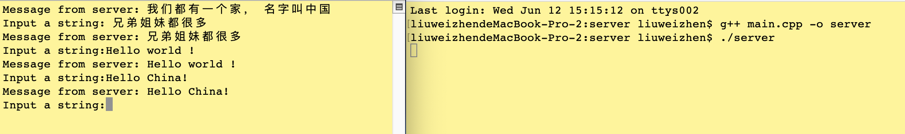

# server持续监听client

[这里](http://c.biancheng.net/view/2348.html)展示了Windows环境下让服务器端持续监听客户端的请求的代码示例，我在下面写一个Mac环境下(Linux通用)代码

**Server端**
```C++
#include <iostream>
#include <stdlib.h>
#include <sys/socket.h>
#include <netinet/in.h>
#include <arpa/inet.h>
#include <unistd.h>

#define BUF_SIZE 100

int main(int argc, const char * argv[]) {
    // 创建套接字
    int serv_sock = socket(AF_INET, SOCK_STREAM, IPPROTO_TCP);
    
    // 绑定IP, 端口
    struct sockaddr_in serv_addr;
    memset(&serv_addr, 0, sizeof(serv_addr));
    serv_addr.sin_family = AF_INET;
    serv_addr.sin_addr.s_addr = inet_addr("30.16.104.105");
    serv_addr.sin_port = htons(1234);
    bind(serv_sock, (const struct sockaddr *)&serv_addr, sizeof(serv_addr));
    
    // 进入监听状态
    listen(serv_sock, 20);
    
    // 接收客户端请求
    struct sockaddr_in clnt_addr;
    socklen_t clnt_addr_size = sizeof(clnt_addr);
    char buffer[BUF_SIZE] = {0}; // 缓冲区
    while (1) {
        int clnt_sock = accept(serv_sock, (struct sockaddr *)&clnt_addr, &clnt_addr_size);
        size_t length = BUF_SIZE;
        ssize_t strLen = recv(clnt_sock, buffer, length, 0);  //接收客户端发来的数据
        send(clnt_sock, buffer, strLen, 0); // 将数据原样返回
        close(clnt_sock);
        memset(buffer, 0, BUF_SIZE);
    }
    close(serv_sock); // Code will never be executed
    
    return 0;
}
```

**Client端**
```C++
#include <iostream>
#include <stdlib.h>
#include <unistd.h>
#include <arpa/inet.h>
#include <sys/socket.h>

#define BUF_SIZE 100

int main(int argc, const char * argv[]) {
    // 向服务器发起请求
    struct sockaddr_in serv_addr;
    memset(&serv_addr, 0, sizeof(serv_addr));
    serv_addr.sin_family = AF_INET;
    serv_addr.sin_addr.s_addr = inet_addr("30.16.104.105");
    serv_addr.sin_port = htons(1234);
    
    char bufSend[BUF_SIZE] = {0};
    char bufRecv[BUF_SIZE] = {0};
    
    while (1) {
        int sock = socket(AF_INET, SOCK_STREAM, IPPROTO_TCP);
        int flag = connect(sock, (struct sockaddr*)&serv_addr, sizeof(serv_addr));
        if (flag == 0) {
            // printf("success connect to server\n");
        }
        else {
            printf("fail connect to server\n");
        }
        printf("Input a string:");
        // scanf("%s", bufSend);
        gets(bufSend); // 支持空格输入
        send(sock, bufSend, strlen(bufSend), 0);
        recv(sock, bufRecv, BUF_SIZE, 0); // 接收服务器传回的数据
        printf("Message from server: %s\n", bufRecv);
        memset(bufSend, 0, BUF_SIZE);  //重置缓冲区
        memset(bufRecv, 0, BUF_SIZE);  //重置缓冲区
        close(sock);
    }
    
    return 0;
}
```



[Demo](https://github.com/ACommonChinese/MyGitbookSubDemos/tree/master/server%E6%8C%81%E7%BB%AD%E7%9B%91%E5%90%ACclient)

