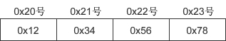
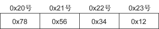

# 字节序

字节序问题，即大小端问题。这是由不同的CPU架构导致。

假设在 0x20 号开始的地址中保存 4 字节 int 型数据 0x12345678，对于大端序，最高位字节 0x12 存放到低位地址，最低位字节 0x78 存放到高位地址, 如图所示：


小端序的保存方式如下图所示：


不同 CPU 保存和解析数据的方式不同（主流的 Intel 系列 CPU 为小端序），小端序系统和大端序系统通信时会发生数据解析错误。因此在发送数据前，要将数据转换为统一的格式——网络字节序（Network Byte Order）。网络字节序统一为大端序。

主机 A 先把数据转换成大端序再进行网络传输，主机 B 收到数据后先转换为自己的格式再解析。

htons() 用来将当前主机字节序转换为网络字节序，其中h代表主机（host）字节序，n代表网络（network）字节序，s代表short，htons 是 h、to、n、s 的组合，可以理解为”将 short 型数据从当前主机字节序转换为网络字节序“。

常见的网络字节转换函数有：
htons()：host to network short，将 short 类型数据从主机字节序转换为网络字节序。
ntohs()：network to host short，将 short 类型数据从网络字节序转换为主机字节序。
htonl()：host to network long，将 long 类型数据从主机字节序转换为网络字节序。
ntohl()：network to host long，将 long 类型数据从网络字节序转换为主机字节序。

通常，以s为后缀的函数中，s代表 2 个字节 short，因此用于端口号转换；以l为后缀的函数中，l代表 4 个字节的 long，因此用于 IP 地址转换。

示例：

```C
#include <stdio.h>

int main(int argc, const char * argv[]) {
    unsigned short host_port = 0x1234, net_port;
    unsigned long host_addr = 0x12345678, net_addr;
    net_port = htons(host_port); // 主机端口号转换为网络字节序
    net_addr = htonl(host_addr); // IP地址转换为网络字节序
    printf("👤 port: %#x\n", host_port);
    printf("🌎 port: %#x\n", net_port);
    printf("👤 address: %#lx\n", host_addr);
    printf("🌎 address: %#lx\n", net_addr);
    return 0;
}
```
👤 port: 0x1234
🌎 port: 0x3412
👤 address: 0x12345678
🌎 address: 0x78563412


再来看一个函数：`inet_addr`
serv_addr.sin_addr.s_addr = inet_addr("127.0.0.1");  //具体的IP地址
inet_addr() 除了将字符串转换为 32 位整数，同时还进行网络字节序转换，示例：

```C

#include <iostream>
#include <sys/socket.h>
#include <arpa/inet.h>

#pragma comment(lib, "ws2_32.lib")
int main(){
    char *addr1 = "1.2.3.4";
    char *addr2 = "1.2.3.256";
    unsigned long conv_addr = inet_addr(addr1);
    if(conv_addr == INADDR_NONE){
        puts("Error occured!");
    }else{
        printf("Network ordered integer addr: %#lx\n", conv_addr);
    }
    conv_addr = inet_addr(addr2);
    if(conv_addr == INADDR_NONE){
        puts("Error occured!");
    }else{
        printf("Network ordered integer addr: %#lx\n", conv_addr);
    }
    system("pause");
    return 0;
}
```
Network ordered integer addr: 0x4030201
Error occured!

从运行结果可以看出，inet_addr() 不仅可以把 IP 地址转换为 32 位整数，还可以检测无效 IP 地址。

注意：为 sockaddr_in 成员赋值时需要显式地将主机字节序转换为网络字节序，而通过 write()/send() 发送数据时 TCP 协议会自动转换为网络字节序，不需要再调用相应的函数。
