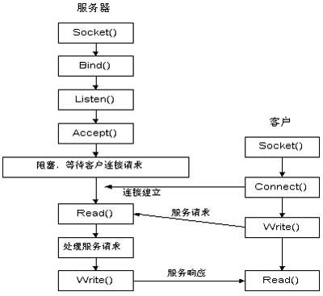

# 认识Socket

推荐链接：  
[http://c.biancheng.net/view/2123.html](#)

#### 什么是Socket?

Socket的英文原义是“孔”或“插座”, 在计算机里，网络上的两个程序通过一个双向的通信连接实现数据的交换，这个连接的一端称为一个socket。  
在Internet上的主机一般运行了多个服务软件，同时提供几种服务。每种服务都打开一个Socket，并绑定到一个端口上，不同的端口对应于不同的服务。  
Socket实质上提供了进程通信的端点。进程通信之前，双方首先必须各自创建一个端点，否则是没有办法建立联系并相互通信的。正如打电话之前，双方必须各自拥有一台电话机一样

Socket套接字有多种形式，但一般是指Internet套接字，根据数据的传输方式，一般可以将 Internet 套接字分成两种类型。通过 socket\(\) 函数创建连接时，必须告诉它使用哪种数据传输方式：

[http://c.biancheng.net/view/2124.html](http://c.biancheng.net/view/2124.html)

**流格式套接字（SOCK\_STREAM）**  
流格式套接字（Stream Sockets）也叫“面向连接的套接字”, 使用TCP 协议，在代码中使用 SOCK\_STREAM 表示，SOCK\_STREAM 是一种可靠的、双向的通信数据流，数据可以准确无误地到达另一台计算机，如果损坏或丢失，可以重新发送。 什么是面向连接和面向非连接？[参见这里](http://c.biancheng.net/view/2125.html)
SOCK\_STREAM 有以下几个特征：

* 数据在传输过程中不会消失；
* 数据是按照顺序传输的；
* 数据的发送和接收不是同步的（有的教程也称“不存在数据边界”）

`SOCK_STREAM`是基于流的传输，可以想像成传送带，因此数据是按顺序传输的。
怎么理解“数据的发送和接收是不同步的”？流格式套接字的内部有一个缓冲区（也就是字符数组），通过 socket 传输的数据将保存到这个缓冲区。接收端在收到数据后并不一定立即读取，只要数据不超过缓冲区的容量，接收端有可能在缓冲区被填满以后一次性地读取，也可能分成好几次读取。
也就是说，不管数据分几次传送过来，接收端只需要根据自己的要求读取，不用非得在数据到达时立即读取。传送端有自己的节奏，接收端也有自己的节奏，它们是不一致的。

浏览器所使用的 http 协议就基于面向连接的套接字，即流套接字，因为必须要确保数据准确无误，否则加载的 HTML 将无法解析。

**数据报格式套接字（SOCK\_DGRAM）**  
数据报格式套接字（Datagram Sockets）也叫“无连接的套接字”，使用UDP协议，在代码中使用 SOCK\_DGRAM 表示。  
计算机只管传输数据，不作数据校验，如果数据在传输中损坏，或者没有到达另一台计算机，是没有办法补救的。也就是说，数据错了就错了，无法重传。  
因为数据报套接字所做的校验工作少，所以在传输效率方面比流格式套接字要高。  
可以将 SOCK\_DGRAM 比喻成高速移动的摩托车快递，它有以下特征：

* 强调快速传输而非传输顺序；
* 传输的数据可能丢失也可能损毁；
* 限制每次传输的数据大小；
* 数据的发送和接收是同步的（有的教程也称“存在数据边界”）。

除了源端口和目的端口，面向连接的套接字还包括序号、确认信号、数据偏移、控制标志（通常说的 URG、ACK、PSH、RST、SYN、FIN）、窗口、校验和、紧急指针、选项等信息；而无连接的套接字则只包含长度和校验和信息。数据报套接字也使用 IP 协议作路由，但是它不使用 TCP 协议，而是使用 UDP 协议（User Datagram Protocol，用户数据报协议）。

怎么理解“数据的发送和接收是同步的”？打个比方，用两辆摩托车分别发送两件包裹，那么接收者也需要分两次接收，所以“数据的发送和接收是同步的”；换句话说，接收次数应该和发送次数相同。


关于Socket的一些原始API的用法，可以参见Linux的[man-pages](https://www.kernel.org/doc/man-pages/), 可以下载下来：[https://www.kernel.org/doc/man-pages/download.html](https://www.kernel.org/doc/man-pages/download.html), 也可以在线搜索：[http://man.he.net/](http://man.he.net/)



接下来仿照[http://c.biancheng.net/view/2128.html](http://c.biancheng.net/view/2128.html)的代码写一个示例，这个示例包含server端和client, server端监听并等待client的连接，当client发起连接后，server向client询问：  
你想要哪一种水果?  
1. 苹果  
2. 桔子  
3. 香蕉

接下来client端输入一个序号，然后server就把相关的水果发送给client.

server源码示例

```C
//
//  main.cpp
//  server_cpp
//
//  Created by liuweizhen on 2019/6/6.
//  Copyright © 2019 DaLiu. All rights reserved.
//  http://c.biancheng.net/view/2128.html

#include <iostream>
#include <string.h>
#include <stdlib.h>
#include <sys/socket.h>
#include <netinet/in.h>
#include <arpa/inet.h>
#include <unistd.h>

int main(int argc, const char * argv[]) {
    /**
     创建套接字
     名字: socket -- create an endpoint for communication
     概要，大纲（synopsis[sɪ'nɑpsɪs]）：
        #include <sys/socket.h>
        int socket(int domain, int type, int protocol)
     描述（description）:
        参数domain: AF_INET: internetwork: UDP, TCP, etc.  AF_INET6: IPV6
        参数type: SOCK_STREAM SOCK_DGRAM SOCK_RAW
        参数protocol: 协议

     tcp_socket = socket(AF_INET, SOCK_STREAM, 0);
     udp_socket = socket(AF_INET, SOCK_DGRAM, 0);
     raw_socket = socket(AF_INET, SOCK_RAW, protocol);
     */
    int serv_sock = socket(AF_INET, SOCK_STREAM, IPPROTO_TCP);

    /**
     struct sockaddr_in {
        sa_family_t sin_family;   // address family: AF_INET 采用的地址，IPv4或IPv6
        in_port_t sin_port;       // port in network byte order 端口
        struct in_addr sin_addr;  // internet address IP地址
     }

     // Internet address
     struct in_addr {
        uint32_t s_addr; // address in network byte order
     };
     */
    struct sockaddr_in serv_addr; // 套接字地址
    memset(&serv_addr, 0, sizeof(serv_addr)); // 每个字节都用0填充
    serv_addr.sin_family = AF_INET; // 使用IPv4地址
    serv_addr.sin_addr.s_addr = inet_addr("30.16.104.56"); // IP地址
    serv_addr.sin_port = htons(1234); // 端口号
    /***
     htonl, htons, ntohl, ntohs -- convert values between host and network
     byte order
     即：htonl, htons, ntohl, ntohs这4个函数转换主机节序和网络的字节序。网络中使用大端big endian, 大字节在前
     htonl: Host TO Network Long  ==> uint32_t htonl(uint32_t hostlong);
     htons: Host To Network Short ==> uint16_t htons(uint16_t hostshort);
     ntohl: Network To Host Long  ==> uint32_t ntohl(uint32_t netlong);
     ntohs: Network To Host Short ==> uint16_t ntohs(uint16_t netshort);
     */

    // 将套接字和IP、端口绑定
    bind(serv_sock, (const struct sockaddr *)&serv_addr, sizeof(serv_addr));

    /**
     listen for connections on a socket   #include <sys/socket.h>
     函数原形：int listen(int sockt, int backlog)
     描述：
     Creation of socket-based connections requires several operations.
     1>. a socket is created with socket.
     2>. a willingness to accept incoming connections and a queue limit for incoming connections are specified
        with listen().
     3>. the connections are accepted with accept.
     The listen() call applies only to sockets of type SOCK_STREAM.
     */
    listen(serv_sock, 20); // 进入监听状态，等待客户端发起请求

    // 接收客户端请求
    struct sockaddr_in clnt_addr;
    socklen_t clnt_addr_size = sizeof(clnt_addr);
    // accept会阻塞当前线程，accept for connection of client
    int clnt_sock = accept(serv_sock, (struct sockaddr *)&clnt_addr, &clnt_addr_size);
    // The call returns -1 on error and the global variable errno is set to
    // indicate the error.  If it succeeds, it returns a non-negative integer
    // that is a descriptor for the accepted socket.

    switch (clnt_sock) { // On success,  these system calls return a nonnegative integer that is a descriptor for the accepted socket. 即，如果accept成功，此值应为正数
        case -1: {
            printf("The call returns -1 on error and the global variable errno is set to indicate the error. \n");
            printf("【%d】", errno); // errno: http://man.he.net/?topic=errno&section=all
            break;
        }
        case EBADF:
            printf("EBADF: socket is not a valid file descriptor.\n");
            break;
        case ECONNABORTED:
            printf("ECONNABORTED: The connection to socket has been aborted.\n");
            break;
        case EFAULT:
            printf("EFAULT: The address parameter is not in a writable part of the user address space.\n");
            break;
        case EINTR:
            printf("EINTR: The accept() system call was terminated by a signal.\n");
            break;
        case EINVAL:
            printf("EINVAL: socket is unwilling to accept connections.\n");
            break;
        case EMFILE:
            printf("EMFILE:  The per-process descriptor table is full.\n");
            break;
        case ENFILE:
            printf("ENFILE: The system file table is full.\n");
            break;
        case ENOMEM:
            printf("ENOMEM: Insufficient memory was available to complete the operation.\n");
            break;
        case ENOTSOCK:
            printf("ENOTSOCK:  socket references a file type other than a socket.\n");
            break;
        case EOPNOTSUPP:
            printf("EOPNOTSUPP: socket is not of type SOCK_STREAM and thus does not accept connections.\n");
            break;
        case EWOULDBLOCK:
            printf("EWOULDBLOCK: socket is marked as non-blocking and no connections are present to be accepted.\n");
            break;
        default:
            break;
    }

    char str[] = "你想要哪一种水果?\n1. 苹果 \n2. 桔子\n3. 香蕉\n";
    write(clnt_sock, str, sizeof(str)); // 发送给客户端

    int buffer;
    read(clnt_sock, (void *)&buffer, sizeof(buffer));

    switch (buffer) {
            case 1: {
                char fruits[100] = "苹果...";
                write(clnt_sock, (const void *)fruits, sizeof(fruits));
                break;
            }
            case 2: {
                char fruits[100] = "桔子...";
                write(clnt_sock, (const void *)fruits, sizeof(fruits));
                break;
            }
            case 3: {
                char fruits[100] = "香蕉...";
                write(clnt_sock, (const void *)fruits, sizeof(fruits));
                break;
            }
        default:
            break;
    }

    /** 另一次连结
    int clnt_sock2 = accept(serv_sock, (struct sockaddr *)&clnt_addr, &clnt_addr_size);
    if (clnt_sock2 == -1) {
        std::cout << "failure for accept" << std::endl;
    }
     */

    // 关闭套接字
    close(clnt_sock);
    close(serv_sock);

    return 0;
}
```

client源码示例

```C
#include <stdio.h>
#include <string.h>
#include <stdlib.h>
#include <unistd.h>
#include <arpa/inet.h>
#include <sys/socket.h>

int main(int argc, const char * argv[]) {
    // 创建套接字
    int sock = socket(AF_INET, SOCK_STREAM, 0);

    // 向服务器（特定的IP和端口）发起请求
    struct sockaddr_in serv_addr;
    memset(&serv_addr, 0, sizeof(serv_addr));  // 每个字节都用0填充
    serv_addr.sin_family = AF_INET;  // 使用IPv4地址
    serv_addr.sin_addr.s_addr = inet_addr("30.16.104.56");  // 具体的IP地址
    serv_addr.sin_port = htons(1234);  // 端口
    int flag = connect(sock, (struct sockaddr*)&serv_addr, sizeof(serv_addr));
    if (0 == flag) {
        printf("连接Server成功");
    }
    else {
        printf("连接Server失败");
        return 0;
    }
    // 读取服务器传回的数据
    char buffer[180];
    read(sock, buffer, 300); // read 方法：http://www.man7.org/linux/man-pages/man2/read.2.html

    printf("%s\n", buffer);

    int input_num;
    printf("please input number:");
    scanf("%d", &input_num);
    // printf("get input number: %d - %lu", input_num, sizeof(input_num));
    write(sock, (const void *)&input_num, sizeof(input_num)); // write to server
    char buffer2[200];
    read(sock, buffer2, sizeof(buffer2));
    printf("\nserver响应: %s\n", buffer2);

    // 关闭套接字
    close(sock);

    return 0;
}
```

```
先运行server：
g++ main.cpp -o server
./server

再运行client：
g++ main.cpp -o client
./client
```


此Demo源码在[这里](https://github.com/ACommonChinese/MyGitbookSubDemos/tree/master/CFSocket)

相关链接：

* [https://baike.baidu.com/item/socket/281150?fr=aladdin](https://baike.baidu.com/item/socket/281150?fr=aladdin)
* [https://www.jianshu.com/p/da02ffd2f718](https://www.jianshu.com/p/da02ffd2f718)
* [Apple CFSocket源码](https://opensource.apple.com/source/CF/CF-635/CFSocket.c.auto.html)
* [第三方CocoaAsyncSocket](https://github.com/robbiehanson/CocoaAsyncSocket)
* [http://c.biancheng.net/socket/](http://c.biancheng.net/socket/)
* [https://www.kernel.org/doc/man-pages/](https://www.kernel.org/doc/man-pages/)


