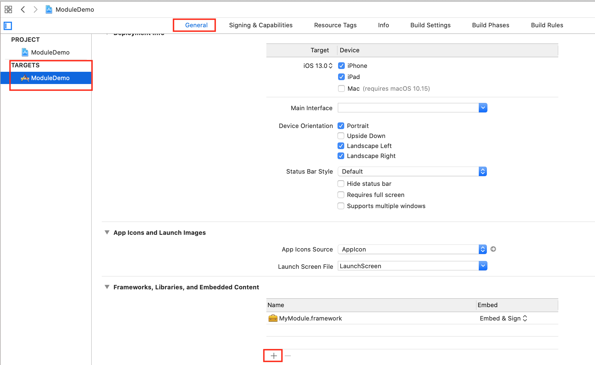

# Framework

假设新建一主项目ModuleDemo, 为它添加一个framework:

File > New > Project > Framework > 假设命名为`MyModule`，往这个MyModule中添加代码 `Person.swift`

```swift
// -- Person.swift --
import Foundation

public class Person: NSObject {
    public func sayHello() -> String {
        return "Module::Person::sayHello()"
    }
}
```

生成Swift的framework和生成OC的framework时，XCode会新建Xxx.h(比如MyModule.h)文件用于导入需要暴露出去的头文件，但Swift由于有权限修饰符，所以不需要再在这个头文件中显示暴露，上面的Person类前加了public修饰，代表外部是可以访问的。

然后通过+ > Add files 把MyModule中的MyModule.xcodeproj添加进去，添加进去之后再通过这个加号把MyModule.framework也添加进去：




Swift的命名空间基于不同的Module，上面在MyModule中有一个Person类，可以在主工程中也新建一个Person类，这是不冲突的：

```swift
// 主工程中Person.swift
public class Person {
    public func sayHello() -> String {
        return "Project::Person::sayHello()"
    }
}
```

使用这两个Person:

```swift
import SwiftUI
import MyModule

struct ContentView: View {
    var body: some View {
        VStack {
            Text(Person().sayHello())
            Text(MyModule.Person().sayHello())
        }
    }
}
```