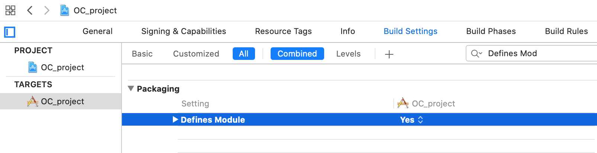
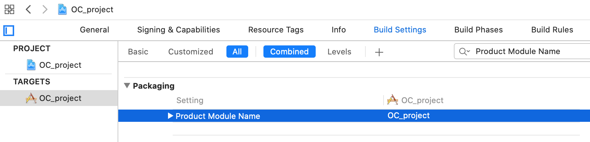
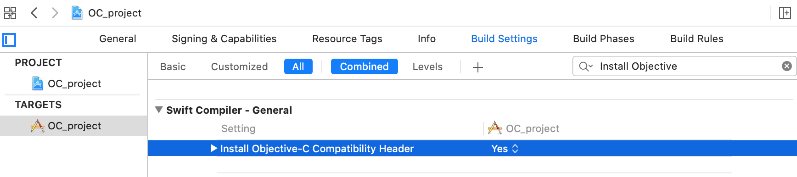
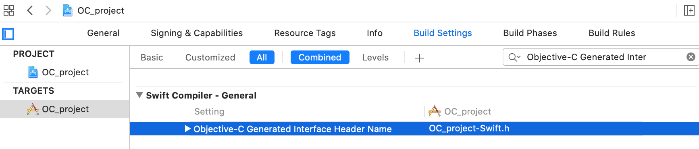
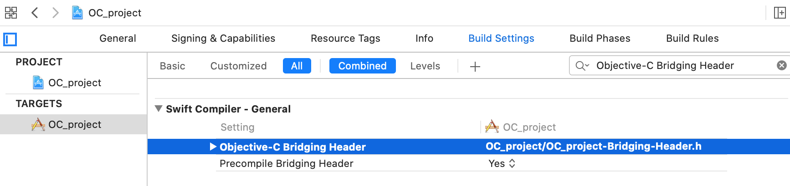

# 和OC混编


[我的简书](https://www.jianshu.com/p/3b025b906e9c)

OC和Swift的混编，分为两种情况：  

1. OC项目中嵌入Swift文件
2. Swift项目中嵌入OC文件

### 先来看OC项目中嵌入Swift文件的情况 

新建一基于OC的项目，比如：OC_project, 接下来我们创建一个Swift类: Person    
在新建这个Swift类时，Xcode会提示生成桥接文件： 

    

添加这个文件会创建一个OC和swift的混合target, 这样可以让OC和Swift两个语言都可以访问class, 这个文件的主要目的是暴露一些OC的header, 让Swift可以调用OC:

OC_project-Bridging-Header.h(让Swift可以调OC):

`Use this file to import your target's public headers that you would like to expose to Swift.`

```swift
// Person.swift
import Foundation

// 和java不同，这里public的类名Person和文件名可以不一样，但作为习惯，一般和文件名写成一样
// public可以省略，外面同样可以调得到
// 如果要OC调用到这个Swift类，@objc不可省略，而且这个类要直接或间接继承于NSObject
@objc public class Person : NSObject {
    // 为了让OC调用，方法同样需要@objc标示
    @objc
    func think() -> Void {
        print("person can think, it's important.")
    }
    
    @objc
    func eat() -> Void {
        print("person can eat, it's important.")
    }
    
    @objc
    func drink(_ water: String) -> Void {
        print("person can drink \(water), it's important")
    }
}
```

然后我们在OC的类里面调用这个Swift类：

```objective-c
#import "ViewController.h"
#import "OC_project-Swift.h" // 让OC可以调Swift, 格式：工程名-Swift.h

@interface ViewController ()

@end

@implementation ViewController

- (void)viewDidLoad {
    [super viewDidLoad];
    
    // 依赖于Apple自动生成的"工程名-Swift.h"文件，本示例中是：OC_project-Swift.h
    // 其实在这个文件中声明了一些Swift到OC的转换后方法，因此我们可以以OC的调用方式调用Swift方法
    Person *p = [[Person alloc] init];
    NSLog(@"%@", p);
    [p think];
    [p eat];
    [p drink:@"咖啡"];
}

@end
```

注意，一般这样做就可以了，但Xcode有时候会抽疯的，因此如果有问题我们需要检查Xcode的设置：   
**1. Defines Module: `YES`** 

  

**2. Product Module Name : `Your Project Name`**   

  

Make sure that your Product Module Name doesn't contain any special characters.  

**3. Install Objective-C Compatibility Header : `YES`**  

   

Once you've added *.swift file to the project this property will appear in Build Settings

**4. Objective-C Generated Interface Header : `YourProjectName-Swift.h`**  

  

This header is auto generated by Xcode  

**5. Objective-C Bridging Header : `$(SRCROOT)/yourProject-Bridging-Header.h`**  

  

上面已经可以让OC调用Swift正常运作，下面我们依然基于这个OC项目，让Swift调用OC，在做这个之前我们需要知道一个概念：  

- Objective-C调用Swift: 需要引入系统生成的文件 `#import "OC_project-Swift.h" `在暴露出来的Swift方法和属性上加@objc标识，否则不可用；且Swift class需要继承自NSObject或NSObject的子类。另外如果仍有问题，需要在工程配置里面做一些小改动。
- Swift调用Objective-C: 需要在统一的bridge头文件（YourProjectName-Bridging-Header.h）里面import，然后即可使用。  

在上面的示例中， 使用OC调Swift并不需要使用桥接文件, 但如果要让Swift调OC，则需要在这个文件中import要在Swift中使用的OC类的头文件。
接下来我们新建一个OC的Dog类，让Swift方法调用这个Dog类的方法。  

在上面的示例中， 使用OC调Swift需要引入系统文件“工程名-Swift.h”，但如果要让Swift调OC，则需要在桥接文件`OC_project-Bridging-Header.h`中引入要在Swift中使用的OC类的头文件： 

```objective-c
// -- OC_project-Bridging-Header.h --
#import "Dog.h"
```

```objective-c
-- Dog.h --
@interface Dog : NSObject

- (void)think;
- (void)eat:(NSString *)food;
@end

-- Dog.m --
@implementation Dog

- (void)think {
    NSLog(@"Dog can think, but it's different with person's think");
}

- (void)eat:(NSString *)food {
    NSLog(@"%@", [NSString stringWithFormat:@"dog can eat: %@, it's important", food]);
}

@end
```

```swift
// -- Person.swift --
import Foundation

@objc public class Person : NSObject {
    ...
   
    @objc
    func dogThink() -> Void {
        let dog: Dog = Dog()
        dog.think()
    }

    @objc
    func dogEat(_ food: String) -> Void {
        let dog: Dog = Dog()
        dog.eat(food)
    }
}
```

```objective-c
-- ViewController.m --
@implementation ViewController

- (void)viewDidLoad {
    [super viewDidLoad];
    
    // 依赖于Apple自动生成的‘工程名-Swift.h’文件
    Person *p = [[Person alloc] init];
    NSLog(@"%@", p);
    [p think];
    [p eat];
    [p drink:@"咖啡"];
    [p dogThink]; // 添加
    [p dogEat:@"狗粮"]; // 添加
}

@end
```

------

### 以上是基于OC项目嵌入Swift文件，接下来我们在Swift项目中嵌入OC文件

Swift项目中嵌入OC文件相对比较简单，新建一基于Swfift的项目，比如：Swift_project, 然后新建OC类，在新建的时候同样按照系统提示生成bridge文件。

如果Swift类要调用OC，只须在`Swift_project-Bridging-Header.h`中`#import`相对应的OC类即可。如果OC类要调用Swift, 只需`#import "Swift_project-Swift.h"`即可。  

示例：  

```objective-c
-- Person.h --
@interface Person : NSObject

- (void)think;
- (void)dogThink;

@end

-- Person.m --
#import "Person.h"
#import "Swift_project-Swift.h"

@implementation Person

- (void)think {
    NSLog(@"think");
}

- (void)dogThink {
    Dog *d = [[Dog alloc] init];
    [d think];
}

@end
```

```swift
-- Dog.swift --
import UIKit

@objc
class Dog: NSObject {
    @objc
    public func think() -> Void {
        print("dong think, but different with person")
    }
}

-- Swift_project-Bridging-Header.h --
#import "Person.h"
```

```swift
-- ViewController.swift --
class ViewController: UIViewController {
    override func viewDidLoad() {
        super.viewDidLoad()
     
        let p: Person = Person()
        p.think()
        p.dogThink()
    }
}
```