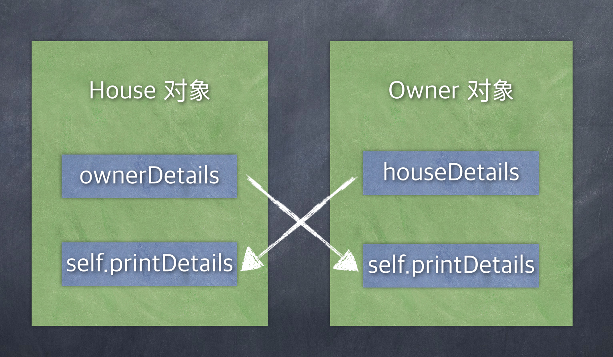

# CaptureList

**参考** 

[HACKING WITH SWIFT](https://www.hackingwithswift.com/articles/179/capture-lists-in-swift-whats-the-difference-between-weak-strong-and-unowned-references)  
[简书译文](https://www.jianshu.com/p/37a62bada107)   

CaptureList即捕获列表，位于代码中的闭包参数列表之前，并将环境中的值捕获为强引用，弱引用或无主引用。在闭包内捕获的对象默认是强引用，swift允许指定CaptureList让我们自己决定如何捕获闭包内使用的值    

```swift
var a = 0
var b = 0
let closure : () -> () = { print(a, b) }
closure()   // 0 0
a = 3
b = 7
closure()  // 3 7
// 我们可以很直观的看到现在的a,b值都改变了。swift的闭包中捕获到的值是捕获的引用。所以一旦你改变了这些捕获变量的值，在闭包中就会反应出来

// -------------------------------------

// 捕获列表
var c = 0
var d = 0
let anotherClosure : () -> () = {  [c, d]  in
    print(c, d)
}
anotherClosure() // 0 0
c = 3
d = 7
anotherClosure() // 0 0
// 显而易见，当你使用了捕获列表之后，你无论怎么在闭包外面操作改变原始的值。闭包并不关心。因为这个时候它已经不是捕获的引用了，而是最初原始值的copy副本
```

### 强引用  

> 除非你要求特别的东西，否则Swift会使用强大的捕获功能。这意味着闭包将捕获闭包内使用的任何外部值，并确保它们永远不会被破坏

```swift
class Singer {
    func playSong() {
        print("我和我的祖国，一切都不能分割~")
    }
}

/// 调这个方法返回一个闭包
/// 该闭包内做了一件事情：生成Singer对象，并调用该对象的playSong()方法
func sing() -> () -> Void {
    let singer = Singer();
    let singing = {
        singer.playSong()
        // return 此return可省略
    }
    return singing
}

let singFunction = sing()
singFunction()      // 打印出: 我和我的祖国，一切都不能分割~
```

那个`taylor`常量是在`sing()`函数内部进行的，所以通常它会在函数结束时被销毁。但是，它会在闭包内部使用，这意味着只要闭包存在某个地方，即使函数返回后，Swift也会自动确保它保持活动状态。

这是一个强大的捕获行动。如果Swift允许`taylor`被摧毁，那么关闭将不再是安全的 - 它的`taylor.playSong()`方法将不再有效. 我们来测试一下：  

```swift
class Singer {
    var name: String = ""

    init(_ name: String) {
        self.name = name
    }

    func playSong() {
        print("我和我的祖国，一切都不能分割~")
    }

    deinit {
        print("\(name) deinit")
    }
}

/// 调这个方法返回一个闭包
/// 该闭包内做了一件事情：生成Singer对象，并调用该对象的playSong()方法
func sing() -> () -> Void {
    let singer = Singer("大刘");
    let singing = {
        singer.playSong()
        // return 此return可省略
    }
    return singing
}

class Test {
    public func test() -> () -> Void {
        let _ = Singer("李四")

        let singFunction = sing()
        // singFunction() // 调用这个闭包
        return singFunction
    }

    public func sayEnd(_ closure: () -> ()) {
        print("end of program")
    }
}

let t: Test = Test()
let closure = t.test()
t.sayEnd(closure)
print("hello world! hello china!")
```

运行结果：

```
李四 deinit
end of program
hello world! hello china!
```

可以看到当Singer("李四")对象出了方法test()的作用域后，被释放了，而sing()产生的闭包内部生成了一个Singer("大刘")对象，由于闭包在外面被引用，所以Singer("大刘")并没有释放。即：闭包属于引用类型，闭包默认会强引用其内部维护的对象。  

### 弱引用[weak]

> Swift让我们指定一个捕获列表来确定如何捕获闭包内使用的值。与强引用常见使用的是弱引用，它改变了两件事：  
> 

1. Weakly captured values aren’t kept alive by the closure, so they might be destroyed and be set to nil.
2. As a result of 1, weakly captured values are always optional in Swift. This stops you assuming they are present when in fact they might not be.

示例：  

```swift
class Singer {
    func playSong() {
        print("我和我的祖国，一切都不能分割~")
    }
}

/// 调这个方法返回一个闭包
/// 该闭包内做了一件事情：生成Singer对象，并调用该对象的playSong()方法
func sing() -> () -> Void {
    let taylor = Singer();
    let singing = { [weak taylor] in
        // taylor.playSong() // taylor后面没有？，报错：Value of optional type 'Singer?' must be unwrapped to refer to member 'playSong' of wrapped base type 'Singer'
        if let _ = taylor {
            print("exist")
        }
        else {
            print("not exist")
        }
        taylor?.playSong()
        return // 此return不可省略, 因为这个闭包只有这一句代码，而taylor可能不存在，疑是编译器限制
    }
    return singing
}

let singFunction = sing()
singFunction()      // 打印：not exist
```

`[weak taylor]`是我们的捕获列表.它是闭包的一个特定部分，我们就如何捕获值给出具体指示,在这里我们说`taylor`应该被弱引用，这就是为什么我们需要使用`taylor？.playSong()` - 它现在是可选的，因为它可以在任何时候设置为`nil`

方法修改以后,调用`singFunction()`会发现不会打印"我和我的祖国...", 原因是`taylor`只存在于`sing()`中，因为它返回的闭包并没有强持有它。     

如果上面代码修改成:

```swift
func sing() -> () -> Void {
    let taylor = Singer()

    let singing = { [weak taylor] in
        taylor!.playSong()
        return
    }

    return singing
}
```

会引发崩溃,因为`taylor`是`nil`

### 无主引用[unowned]  

> An alternative to **weak** is **unowned**, which behaves more like implicitly unwrapped optionals. Like weak capturing, unowned capturing allows values to become nil at any point in the future. However, you can work with them as if they are always going to be there – you don’t need to unwrap optionals.

示例：  

```swift
class Singer {
    func playSong() {
        print("我和我的祖国，一切都不能分割~")
    }
}

func sing() -> () -> Void {
    let taylor = Singer()

    let singing = { [unowned taylor] in
        taylor.playSong() // Crash here
        return
    }

    return singing
}

let singFunction = sing()
singFunction()
```

`taylor.playSong()`会发生崩溃, 与我们之前强制解包类似 :unowned taylor 告诉我们taylor会一直存在闭包的生命周期内,但实际上,taylor几乎立即被销毁,所以会崩溃.  
总结：使用unowned和使用weak的含义相同，只是使用unowned代表闭包内**不拥有**，捕获的对象是外部强拥有的，因此使用unowned是假定认为非空，可以不使用?来调用，但这里有一个潜在的危险就是如果在外部被置为nil, 则会如上代码所示crash   

### 捕获列表与参数在一起  

当一起使用捕获列表和闭包参数时，捕获列表必须始终首先出现，然后单词in来标记闭包体的开始  

```swift
writeToLog { [weak self] user, message in 
    self?.addToLog("\(user) triggered event: \(message)")
}
```

### 循环引用 Strong reference cycles

> When thing A owns thing B, and thing B owns thing A, you have what’s called a strong reference cycle, or often just a retain cycle.
> 

示例：  

```swift
class House {
    /// 注意这里不可以写为 () -> Void？
    /// 因为这代表返回值可空
    /// 而(() -> Void)? 代表闭包可空
    var ownerDetails: (() -> Void)?
    
    func printDetails() {
        print("House :: printDetails")
    }
    deinit {
        print("House :: deinit")
    }
}

class Owner {
    var houseDetails: (() -> Void)?

    func printDetails() -> Void {
        print("Owner :: printDetails")
    }

    deinit {
        print("Owner :: deinit")
    }
}

print("Creating a house and an owner")

// We can try creating two instances of those classes inside a do block. We don’t need a catch block here, but using do ensures they will be destroyed as soon as the } is reached:
do {
    let house = House()
    let owner = Owner()
    house.ownerDetails = owner.printDetails
    owner.houseDetails = house.printDetails
}

print("Done")
```

销毁器中的信息不会被打印,这是因为 house有一个属性指向owner,同时owner有一个属性指向house,所以他们不能被安全销毁,会导致内存不能释放   



为解决这个问题,我们需要创建一个新的闭包,使用弱引用:  

```swift
do {
    let house = House()
    let owner = Owner()
    house.ownerDetails = { [weak owner] in
        owner?.printDetails()
    }
    owner.houseDetails = { [weak house] in
        house?.printDetails()
    }
}

print("Done")
```

程序打印：

Owner :: deinit  
House :: deinit  
Done    

没有必要将这两个值都使用弱引用 - 重要的是至少有一个值，因为它允许Swift在必要时销毁它们。下面这种也是可以工作的：   

```swift
house.ownerDetails = { [weak owner] in
    owner?.printDetails()
}
owner.houseDetails = house.printDetails
```

### 闭包复制

闭包会和它的复制闭包共享捕获数据  

```swift
var numberOfLinesLogged = 0

let logger1 = {
    numberOfLinesLogged += 1
    print("Lines logged: \(numberOfLinesLogged)")
}

logger1()

let logger2 = logger1
logger2()
logger1()
logger2()
```
