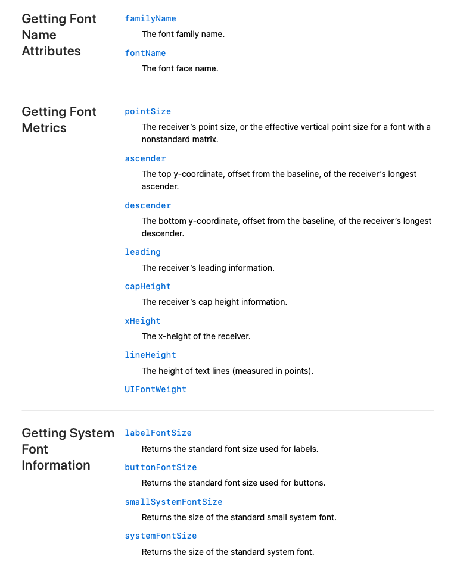

# UIFont

关于字体的设计，可参见： [Apple](https://developer.apple.com/library/archive/documentation/StringsTextFonts/Conceptual/TextAndWebiPhoneOS/Introduction/Introduction.html#//apple_ref/doc/uid/TP40009542)


### 字体家族

我们可以使用`[UIFont systemFontOfSize:20]`来获取系统字体, 也可以使用`[UIFont boldSystemFontOfSize:20]`获取系统粗字体，要使用其他字体，可以使用：

```Objective-C
UIFont *font = [UIFont fontWithName:@"Courier-Bold" size:18];
```

这里的"Courier-Bold"就是字体名字，一个字体的称呼可由字体名字和其所属的字体家族组成，获取字体家族和字体名字：

```Objective-C
NSArray *familys = [UIFont familyNames];
NSMutableString *fontFamilyNames = [NSMutableString string];
for (int i = 0; i < familys.count; i++) {
    NSString *familyName = [familys objectAtIndex:i];
    NSArray *fontNames = [UIFont fontNamesForFamilyName:familyName];
    [fontFamilyNames appendFormat:@"\n\n==== %d %@ ====\n", i, familyName];
    for (int i = 0; i < fontNames.count; i++) {
        [fontFamilyNames appendFormat:@"    %@\n", fontNames[i]];
    }
}
NSLog(@"%@", fontFamilyNames);
```

程序打印结果如下：

```
==== 0 Copperplate ====
     Copperplate-Light
     Copperplate
     Copperplate-Bold


==== 1 Apple SD Gothic Neo ====
     AppleSDGothicNeo-Thin
     AppleSDGothicNeo-Light
     AppleSDGothicNeo-Regular
     AppleSDGothicNeo-Bold
     AppleSDGothicNeo-SemiBold
     AppleSDGothicNeo-UltraLight
     AppleSDGothicNeo-Medium


 ==== 2 Thonburi ====
     Thonburi
     Thonburi-Light
     Thonburi-Bold


 ==== 3 Gill Sans ====
     GillSans-Italic
     GillSans-SemiBold
     GillSans-UltraBold
     GillSans-Light
     GillSans-Bold
     GillSans
     GillSans-SemiBoldItalic
     GillSans-BoldItalic
     GillSans-LightItalic


==== 4 Marker Felt ====
     MarkerFelt-Thin
     MarkerFelt-Wide


==== 5 Hiragino Maru Gothic ProN ====
     HiraMaruProN-W4


==== 6 Courier New ====
     CourierNewPS-ItalicMT
     CourierNewPSMT
     CourierNewPS-BoldItalicMT
     CourierNewPS-BoldMT

     ...
```

这里面就列出了设备本身自带的支持的所有字体。

### 字体属性

字体有很多属性，列表如下：



font.familyName和font.fontName是字体家族和字体名字

```Objective-C
UIFont *font = [UIFont fontWithName:@"Courier-Bold" size:18];
NSLog(@"%@", font.familyName); // 字体家族：Courier
NSLog(@"%@", font.fontName);   // 字体名字：Courier-Bold
```

**systemFontSize**

```Objective-C
NSLog(@"system fontSize: %f", UIFont.systemFontSize); // 14, 系统字体默认大小
```

**pointSize**

pointSize: The receiver’s point size, or the effective vertical point size for a font with a nonstandard matrix.    
字体的pointSize可以理解成在竖直方向字体所占的点个距离，比如字体大小是80，则Label的高度为80在竖直方向上是可以容纳下这个字体的。  
这个pointSize其实也就是在创建字体时指定的fontSize, 比如：    
```Objective-C
UIFont *font = [UIFont systemFontOfSize:30];
NSLog(@"pointSize: %f", font.pointSize); // 30
```

**其他**

结合上面图示了解其他常见属性意义

```Objective-C
// ==== pointSize ====
// The receiver’s point size, or the effective vertical point size for a font with a nonstandard matrix.
UIFont *font = [UIFont systemFontOfSize:30];
// 释义：The receiver’s point size, or the effective vertical point size for a font with a nonstandard matrix.
NSLog(@"pointSize: %lf", font.pointSize); // 30
// 释义：The top y-coordinate, offset from the baseline, of the receiver’s longest ascender.
NSLog(@"ascent: %lf", font.ascender); // 28.564453
// 释义：The bottom y-coordinate, offset from the baseline, of the receiver’s longest descender.
NSLog(@"descent: %lf", font.descender); // -7.236328
// 释义：The receiver’s leading information.
NSLog(@"leading: %lf", font.leading); // 0
// 释义：The receiver’s cap height information.
NSLog(@"capHeight: %lf", font.capHeight); // capHeight: 21.137695
// 释义：The x-height of the receiver.
NSLog(@"xHeight: %lf", font.xHeight); // xHeight: 15.234375
// 释义：The height of text lines (measured in points).
NSLog(@"lineHeight: %lf", font.lineHeight); // 35.800781
```

Demo对应：根目录下的 `demos/UIFont`
