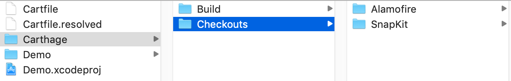
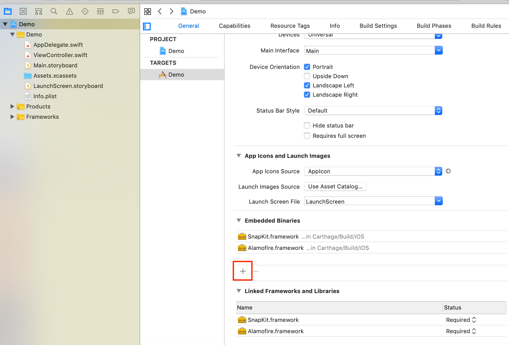

# carthage

参考链接 [https://www.cnblogs.com/edensyd/p/9525366.html](https://www.cnblogs.com/edensyd/p/9525366.html)

Carthage类似于Cocoapods, 包管理器Package manager

**安装Carthage**
`brew install Carthage`
/usr/local/Cellar/carthage/0.33.0: 8 files, 21.3MB

```
carthage version #查看版本号
0.33.0
```

**使用carthage安装第三方包**
比如新建一Xcode工程， Demo
```shell
cd Demo

ls
Demo
Demo.xcodeproj

touch Cartfile
vim Cartfile

github "SnapKit/SnapKit"
github "Alamofire/Alamofire"
```

使用carthage安装框架：
```shell
Carthage update --platform iOS

open Carthage #查看Carthage生成的目录
```


其中：
- Carthage/Checkouts目录：从github获取的源代码
- Carthage/Build：通过xcodebuild编译生成的Framework二进制代码库

由于Carthage编译成成的是动态库framework, 因此需要手动把Carthage/Build中的framework Embed进去：
 

**安装其他库**
修改Cartfile文件，并重新执行Carthage update

**卸载Carthage**
`brew uninstall Carthage`


