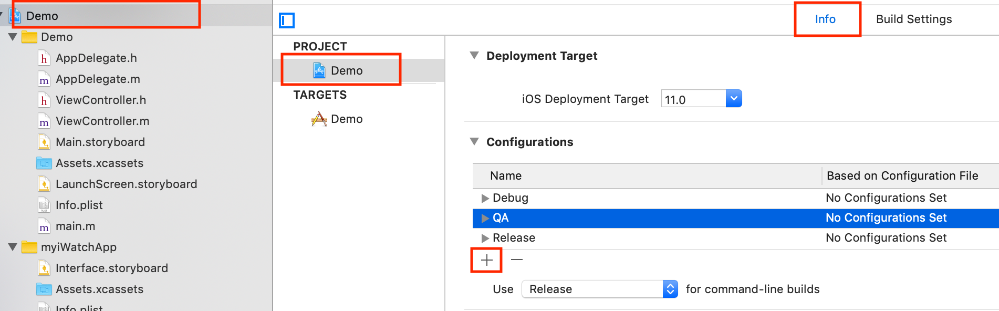
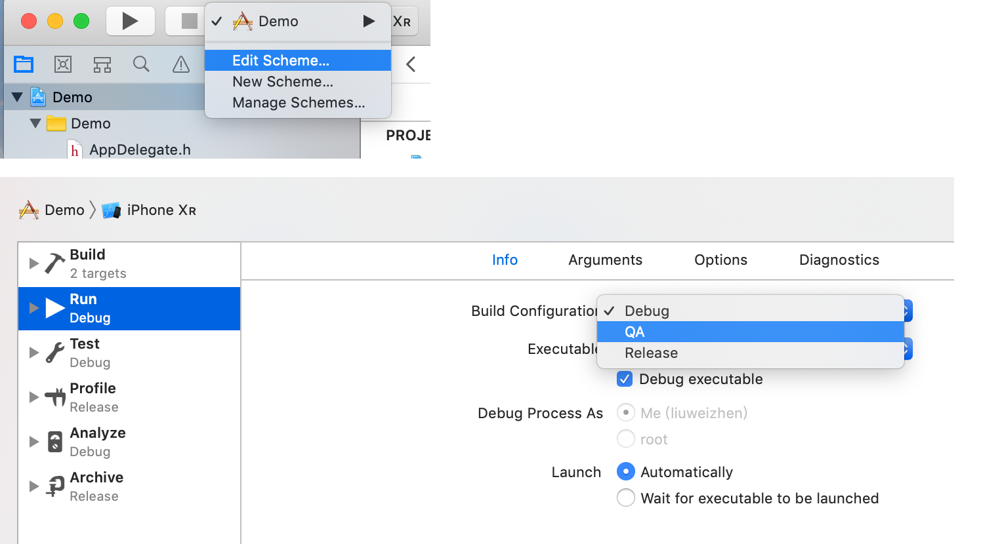
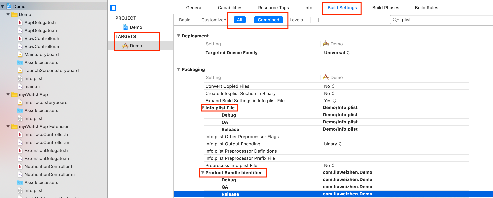
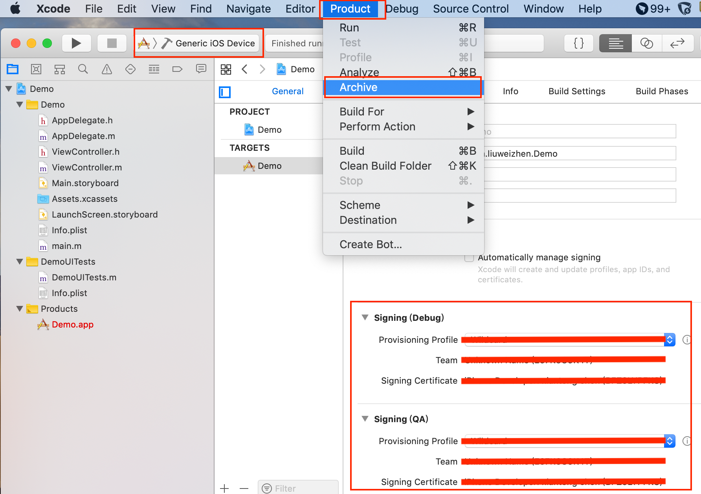
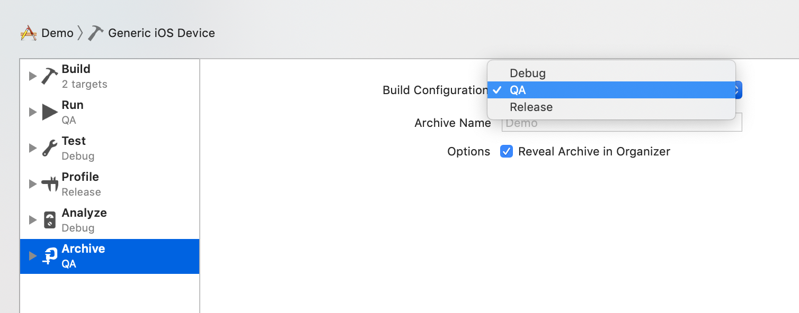
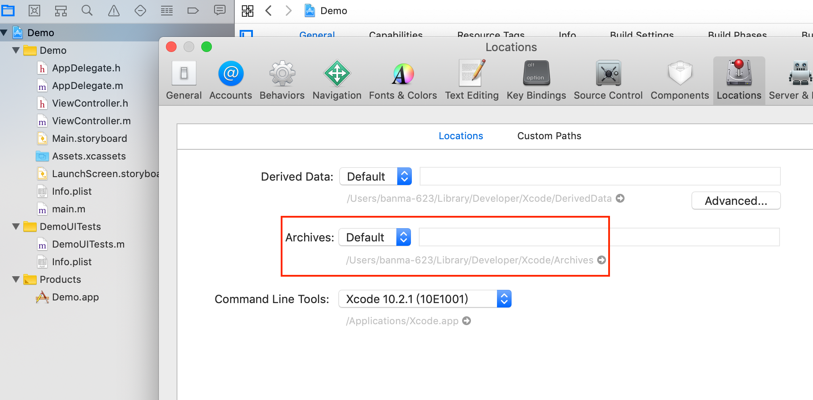
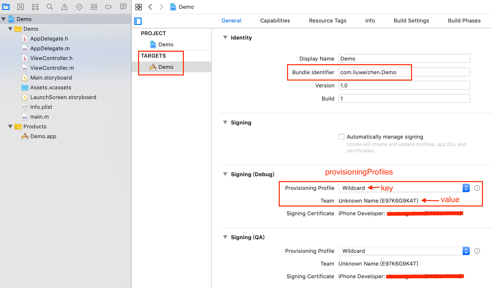
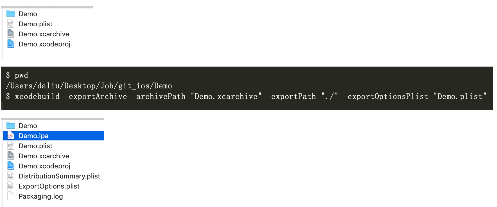
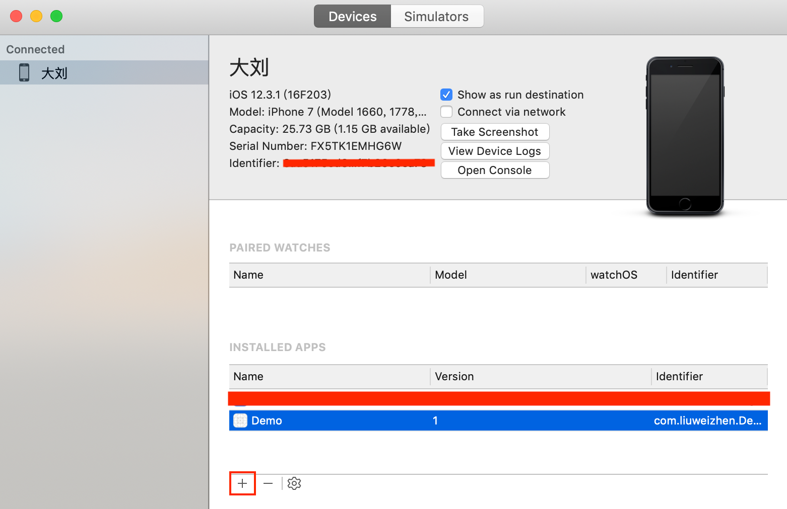

# xcodebuild

参考：
- [https://developer.apple.com/library/archive/technotes/tn2339/_index.html](https://developer.apple.com/library/archive/technotes/tn2339/_index.html)
- [https://www.jianshu.com/p/a65d8d1b090b](https://www.jianshu.com/p/a65d8d1b090b)
- [https://testerhome.com/topics/10375](https://testerhome.com/topics/10375)

在此之前，需先说明Xcode Target、Project、Build Settings 、Workspace、Scheme这些概念：
[这里](https://developer.apple.com/library/archive/featuredarticles/XcodeConcepts/Concept-Projects.html#//apple_ref/doc/uid/TP40009328-CH5-SW1)是Apple官网说明

**Target**

Target主要用来告诉工程如何编译生成产品，比如同一个工程Project可以生成多个Target: iOS/Watch/等等，一个Target定义一个Product, 一个Project可以有多个Target。而且Target是继承自Project的，也就是说如果你在Project中配置了某个东西，那么所有的Target都会生效；但是反之则不会生效。一个target 可以依赖其他target,  比如iOS的应用是一个Target，这个Target可以依赖(dependencies)其他framework, TARGETS > Build Phases > Target Dependencies
A target specifies a product to build and contains the instructions for building the product from a set of files in a project or workspace. A target defines a single product; it organizes the inputs into the build system—the source files and instructions for processing those source files—required to build that product. Projects can contain one or more targets, each of which produces one product.

**Project**

Project即工程本身，它其实是一个包含了所有文件、资源和构建信息的一个存储库， 一个Project包含了所有用于编译项目(product)的元素及元素之间的关系。它可以包含多个Target(所谓Target， 实质上是用于指定如何编译产品),  默认情况下,一个Project定义的build settings对于所有的Target都是一样的.

**Scheme**

An Xcode scheme defines a collection of targets to build, a configuration to use when building, and a collection of tests to execute.
You use Xcode schemes to specify which target, build configuration, and executable configuration is active at a given time.

**Build Settings**

A build setting is a variable that contains information about how a particular aspect of a product’s build process should be performed. For example, the information in a build setting can specify which options Xcode passes to the compiler.

You can specify build settings at the project or target level. Each project-level build setting applies to all targets in the project unless explicitly overridden by the build settings for a specific target.

Each target organizes the source files needed to build one product. A build configuration specifies a set of build settings used to build a target's product in a particular way.
每一个Target都会编译成一个产品Product,  编译选项Build Configuration通过指定一组build settings告诉Target如何编译生成产品Product

**实战**

需求：服务器环境分为开发环境(Debug)、QA环境、线上环境(Release)，为了方便环境测试，可以通过Configuration配置不同的选项，从而不用每次切换环境手动修改代码。

做法：

**1. 复制Configuration**

如下图点击"+"复制一个Configuration，并命名为QA

这样之后，我们就可以看到schema里多一个QA选项(默认有Debug和Release)


**2. 添加预定义宏**

比如我们在Debug下添加`__DEBUG__`
在QA下添加`__QA__`
在Release下添加`__RELEASE`

**3. 在代码中判断处理**

```Objective-C
- (NSString *)getHost {
#ifdef __DEBUG__
    return @"debug host";
#elif __QA__
    return @"qa host";
#elif __RELEASE__
    return @"release host";
#endif
    return nil;
}
```

我们甚至可以针对不同的环境设置不同的Info.plist, 针对不同的环境设置不同的打包证书


### xcode build

xcodebuild是一个命令行工具:
xcodebuild is a command-line tool that allows you to perform build, query, analyze, test, and archive operations on your Xcode projects and workspaces from the command line.

```shell
which a xcodebuild # /usr/bin/xcodebuild
```

我们可以通过在浏览器键入：`x-man-page://xcodebuild`来查看xcodebuild的man page说明。

默认情况下，xcodebuild会把编译的输出放入`Location Preferences`，即Xcode > Preferences > Locations所指定的目录下。

一些xcodebuild的基本命令：
- 查看xcodebuild简洁用法 `xcodebuild -usage`
- 查看已安装的SDK `xcodebuild -showsdks`
```shell
$ xcodebuild -showsdks

iOS SDKs:
        iOS 12.2                        -sdk iphoneos12.2

iOS Simulator SDKs:
        Simulator - iOS 12.2            -sdk iphonesimulator12.2

macOS SDKs:
        macOS 10.14                     -sdk macosx10.14

tvOS SDKs:
        tvOS 12.2                       -sdk appletvos12.2

tvOS Simulator SDKs:
        Simulator - tvOS 12.2           -sdk appletvsimulator12.2

watchOS SDKs:
        watchOS 5.2                     -sdk watchos5.2

watchOS Simulator SDKs:
        Simulator - watchOS 5.2         -sdk watchsimulator5.2
```
- 查看安装的版本号 `xcodebuild -version`
- 查看项目中的Targets、Congigurations和Schemes，以上面Demo为例：
```shell
xcodebuild
-list
[[-project <projectname>]|[-workspace <workspacename>]] 

$ xcodebuild -list
Information about project "Demo":
    Targets:
        Demo

    Build Configurations:
        Debug
        QA
        Release

    If no build configuration is specified and -scheme is not passed then "Release" is used.

    Schemes:
        Demo
```

- Archive打包
```shell
xcodebuild
archive -archivePath <archivePath>
-project <projectName>
-scheme <schemeName> #从-list命令中获取
-configuration < Debug|Release...>
-sdk <sdkName> #sdkName可从showsdks命令中获取

以上面Demo示例，配置好TARGETS > General > Singing(QA)下面的Provisioning Profile后就可以打包了：
xcodebuild archive -archivePath ./ -project Demo.xcodeproj -scheme Demo -configuration QA
这样就在当前目录下生成了Demo.xcarchive文件包
```

也可以用Xcode手动操作：

打包完成后，通过Window > Organizer找到打好的包，并Show in Finder, 可以看到，Xcode会生一个名字形如`Demo 2019-7-15, 4.33 PM.xcarchive`的包，即Demo [时间戮].xcarchive, 那我们这样打的包是哪个环境的呢？这个可以通过Edit Scheme…中查看：

默认是Release,  注：如果要打哪个环境下面的包，就要配置好哪个环境下面的证书及配置文件Provisioning Profile

可以看到通过手动Xcode打的包(Archive)的文件目录形如：`/Users/daliu/Library/Developer/Xcode/Archives/`, 这个路径正是Xcode > Preferences > Locations > Archives 指定的路径


通过命令或Xcode手动打包后生成的.xcarchive文件，可以转为.ipa包，以上面Demo为例：
把.xcarchive转.ipa包的核心叫`exportOptionsPlist`选项，这是一个plist格式的文件，需要在这个plist文件中告诉打包脚本`provisioningProfiles`等信息。如下新建一个名叫Demo.plist的文件(名字随意)

我这里以provisioning profile为Wildcard示例：



```
<?xml version="1.0" encoding="UTF-8"?>
<!DOCTYPE plist PUBLIC "-//Apple//DTD PLIST 1.0//EN" "http://www.apple.com/DTDs/PropertyList-1.0.dtd">
<plist version="1.0">
<dict>
	<key>method</key>
	<string>development</string>
	<key>provisioningProfiles</key>
	<dict>
		<key>com.liuweizhen.Demo</key>
		<string>Wildcard</string>
	</dict>
	<key>signingStyle</key>
	<string>manual</string>
	<key>compileBitcode</key>
	<string>false</string>
	<key>teamID</key>
	<string>E97K6G9K4T</string>
</dict>
</plist>
```

有了这个plist文件，就可以调用命令生成.ipa了：

```Shell
xcodebuild -exportArchive -archivePath "Demo.xcarchive" -exportPath "./" -exportOptionsPlist "Demo.plist"
```



这样就可以把ipa包通过Xcode > window > Devices and Simulators > click "+" 安装在手机上跑起来


###打包framework

假设我们写了一个叫`BMAutolayout`的framework，使用脚本打包，由于framework分CPU架构，模拟器和真机不一样，需要合包，可以使用脚本完成，打包framework不需要证书，pofile配置文件，下面我们打Release包，示例：

universal-framework.sh

```Shell
#!/bin/sh

PROJECT_NAME=BMAutoLayout
TARGET=BMAutoLayout
CONFIGURATION=Release
BUILD_DIR=build

UNIVERSAL_OUTPUTFOLDER=${BUILD_DIR}/${CONFIGURATION}-universal

echo ${UNIVERSAL_OUTPUTFOLDER} # build/Release-universal

make sure the output directory exists
mkdir -p "${UNIVERSAL_OUTPUTFOLDER}"

# Step 1. Build Device and Simulator versions
xcodebuild -target "${TARGET}" ONLY_ACTIVE_ARCH=NO -configuration ${CONFIGURATION} -sdk iphoneos BUILD_DIR="${BUILD_DIR}" BUILD_ROOT="${BUILD_ROOT}" clean build BITCODE_GENERATION_MODE=bitcode
xcodebuild -target "${TARGET}" ONLY_ACTIVE_ARCH=NO -configuration ${CONFIGURATION} -sdk iphonesimulator BUILD_DIR="${BUILD_DIR}" BUILD_ROOT="${BUILD_ROOT}" clean build

# Step 2. Copy the framework structure (from iphoneos build) to the universal folder
cp -R "${BUILD_DIR}/${CONFIGURATION}-iphoneos/${PROJECT_NAME}.framework"* "${UNIVERSAL_OUTPUTFOLDER}/"

# Step 3. Create universal binary file using lipo and place the combined executable in the copied framework directory
lipo -create -output "${UNIVERSAL_OUTPUTFOLDER}/${PROJECT_NAME}.framework/${PROJECT_NAME}" "${BUILD_DIR}/${CONFIGURATION}-iphonesimulator/${PROJECT_NAME}.framework/${PROJECT_NAME}" "${BUILD_DIR}/${CONFIGURATION}-iphoneos/${PROJECT_NAME}.framework/${PROJECT_NAME}"
```


### 打包项目并上传

推荐使用[fastlane](https://docs.fastlane.tools/getting-started/ios/setup/)

