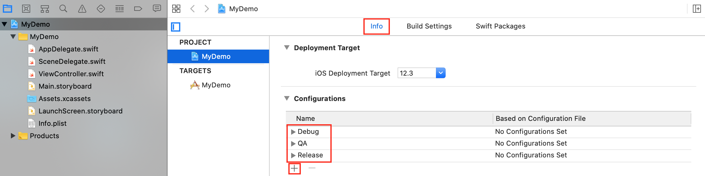
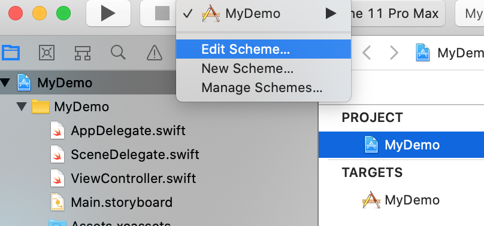
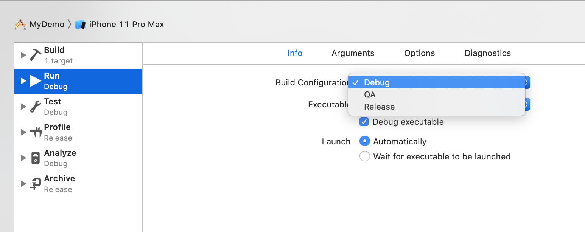
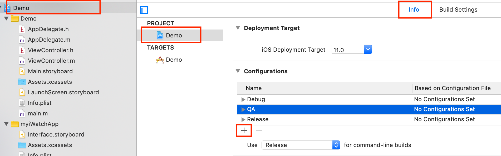
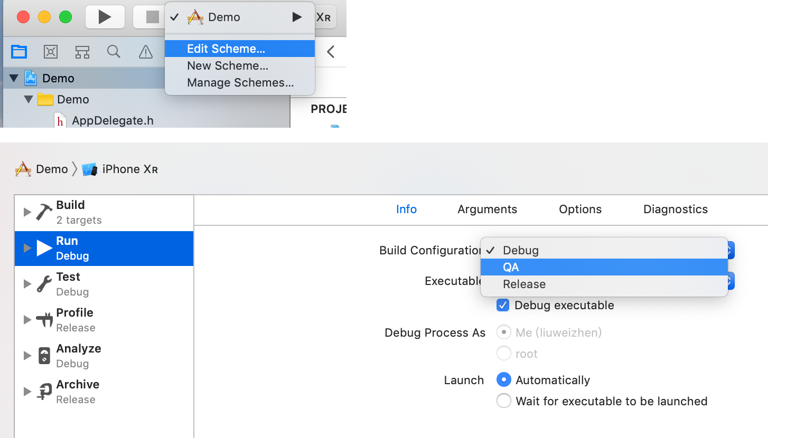
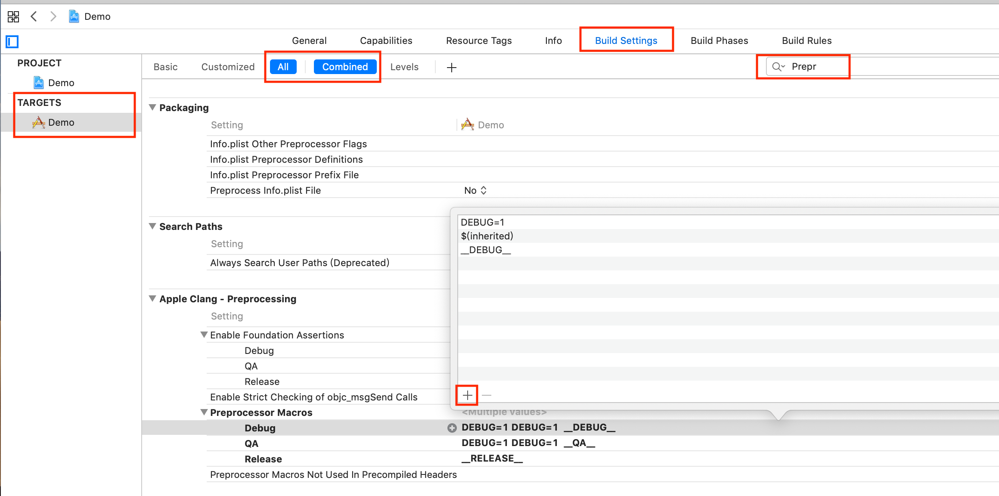
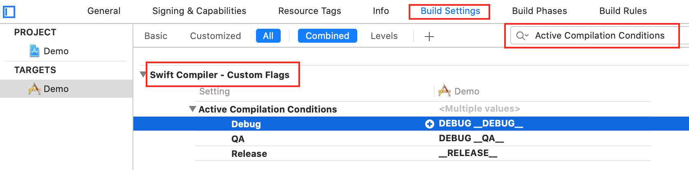
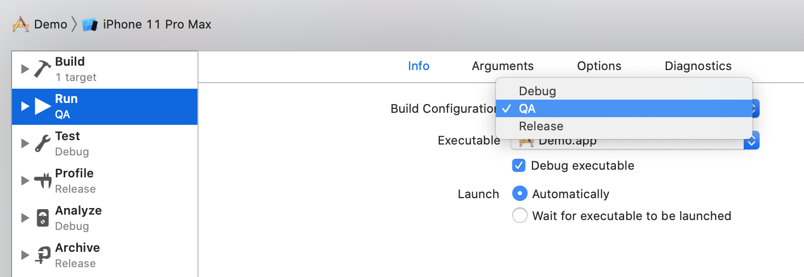
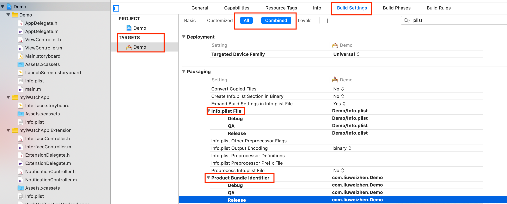

# 基本概念

参考：
- [官网](https://developer.apple.com/library/archive/featuredarticles/XcodeConcepts/Concept-Targets.html#//apple_ref/doc/uid/TP40009328-CH4-SW1)
- [https://developer.apple.com/library/archive/technotes/tn2339/_index.html](https://developer.apple.com/library/archive/technotes/tn2339/_index.html)
- [https://www.jianshu.com/p/a65d8d1b090b](https://www.jianshu.com/p/a65d8d1b090b)
- [https://testerhome.com/topics/10375](https://testerhome.com/topics/10375)

在此之前，需先说明Xcode Target、Project、Build Settings 、Workspace、Scheme这些概念：
[这里](https://developer.apple.com/library/archive/featuredarticles/XcodeConcepts/Concept-Projects.html#//apple_ref/doc/uid/TP40009328-CH5-SW1)是Apple官网说明

**Project**

Project即工程本身，它其实是一个包含了所有文件、资源和构建信息的一个存储库， 一个Project包含了所有用于编译项目(product)的元素及元素之间的关系。它可以包含多个Target(所谓Target， 实质上是用于指定如何编译产品),  默认情况下,一个Project定义的build settings对于所有的Target都是一样的.  
project可以单独存在，或者存在于一个workspace中。  

[Apple](https://developer.apple.com/library/archive/featuredarticles/XcodeConcepts/Concept-Projects.html#//apple_ref/doc/uid/TP40009328-CH5-SW1)  

> An Xcode project is a repository for all the files, resources, and information required to build one or more software products. A project contains all the elements used to build your products and maintains the relationships between those elements. It contains one or more targets, which specify how to build products. A project defines default build settings for all the targets in the project (each target can also specify its own build settings, which override the project build settings).

> An Xcode project file contains the following information:
> - References to source files:
>     - Source code, including header files and implementation files
>     - Libraries and frameworks, internal and external
>     - Resource files
>     - Image files
>     - Interface Builder (nib) files
> - Groups used to organize the source files in the structure navigator
> - Project-level build configurations. You can specify more than one build configuration for a project; for example, you might have debug and release build settings for a project.
> - Targets, where each target specifies:
>     - A reference to one product built by the project
>     - References to the source files needed to build that product
>     - The build configurations that can be used to build that product, including dependencies on other targets and other settings; the project-level build settings are used when the targets’ build configurations do not override them
>    
> - The executable environments that can be used to debug or test the program, where each executable environment specifies:   
>     - What executable to launch when you run or debug from Xcode
>     - Command-line arguments to be passed to the executable, if any
>     - Environmental variables to be set when the program runs, if any

A project can stand alone or can be included in a workspace.  
You use Xcode schemes to specify which target, build configuration, and executable configuration is active at a given time.

**wordspace**  
workspace是Xcode的一种文件，用来管理工程和里面的文件，一个workspace可以包含若干个工程，甚至可以添加任何你想添加的文件。workspace提供了工程和工程里面的target之间隐式和显式依赖关系，用来管理和组织工程里面的所有文件

**Target**

Target主要用来告诉工程如何编译生成产品，同一个工程Project可以生成多个Target: iOS/Watch/等等，一个Target定义一个Product, 一个Project可以有多个Target。而且Target是继承自Project的，也就是说如果你在Project中配置了某个东西，那么所有的Target都会生效；但是反之则不会生效。一个target 可以依赖其他target,  比如iOS的应用是一个Target，这个Target可以依赖(dependencies)其他framework, TARGETS > Build Phases > Target Dependencies  
project定义了一些基本的编译设置，每个target都继承了project的默认设置，每个target可以通过重新设置target的编译选项来定义自己的特殊编译选项  

target定义了构造一个product所需的文件和编译指令。一个target对应于一个product。target说白了就是
告诉编译系统要编译的文件和编译设置。编译指令就是根据build settings and build phases来确定的      

> A target specifies a product to build and contains the instructions for building the product from a set of files in a project or workspace. A target defines a single product; it organizes the inputs into the build system—the source files and instructions for processing those source files—required to build that product. Projects can contain one or more targets, each of which produces one product.

> The instructions for building a product take the form of build settings and build phases, which you can examine and edit in the Xcode project editor. A target inherits the project build settings, but you can override any of the project settings by specifying different settings at the target level. There can be only one active target at a time; the Xcode scheme specifies the active target.

> A target and the product it creates can be related to another target. If a target requires the output of another target in order to build, the first target is said to depend upon the second. If both targets are in the same workspace, Xcode can discover the dependency, in which case it builds the products in the required order. Such a relationship is referred to as an implicit dependency. You can also specify explicit target dependencies in your build settings, and you can specify that two targets that Xcode might expect to have an implicit dependency are actually not dependent. For example, you might build both a library and an application that links against that library in the same workspace. Xcode can discover this relationship and automatically build the library first. However, if you actually want to link against a version of the library other than the one built in the workspace, you can create an explicit dependency in your build settings, which overrides this implicit dependency.

**Build Settings**

Build Settings即编译设置，告诉XCode如何编译  

A build setting is a variable that contains information about how a particular aspect of a product’s build process should be performed. For example, the information in a build setting can specify which options Xcode passes to the compiler. 
在编译设置里可以通过配置XCode选项传给编译器

You can specify build settings at the project or target level. （可以指定工程级或target级的编译设置）
Each project-level build setting applies to all targets in the project unless explicitly overridden by the build settings for a specific target.（每一个工程级的编译设置适用于所有工程下面的的target，除非在具体的target下指定了自己特有的build setting）

Each target organizes the source files needed to build one product. A build configuration specifies a set of build settings used to build a target's product in a particular way.
每一个Target都会编译成一个产品Product,  编译选项 Build Configuration 通过指定一组build settings告诉Target如何编译生成Product 


> A build setting is a variable that contains information about how a particular aspect of a product’s build process should be performed. For example, the information in a build setting can specify which options Xcode passes to the compiler.
>
> You can specify build settings at the project or target level. Each project-level build setting applies to all targets in the project unless explicitly overridden by the build settings for a specific target.
>
> Each target organizes the source files needed to build one product. A build configuration specifies a set of build settings used to build a target's product in a particular way. For example, it is common to have separate build configurations for debug and release builds of a product.
>
> A build setting in Xcode has two parts: the setting title and the definition. The build setting title identifies the build setting and can be used within other settings. The build setting definition is a constant or a formula Xcode uses to determine the value of the build setting at build time. A build setting may also have a display name, which is used to display the build setting in the Xcode user interface.
>
> In addition to the default build settings provided by Xcode when you create a new project from a project template, you can create user-defined build settings for your project or for a particular target. You can also specify conditional build settings. The value of a conditional build setting depends on whether one or more prerequisites are met. This mechanism allows you to, for example, specify the SDK to use to build a product based on the targeted architecture.


**Build Configuration**  
XCode在编译项目时是通过 Build Configuration进行编译的，每个Build Configuration都包含了一组build settings, 一般系统默认有Debug和Release这两个Build Configuration, 我们可以通过复制Debug或Release新建自己的Build Configuration   



也可以在Scheme中选择使用哪一个Build Configuration   



**Scheme**

Scheme的英文原意是“计划、体系、方案”，An Xcode scheme defines a collection of targets to build, a configuration to use when building, and a collection of tests to execute.
You use Xcode schemes to specify which target, build configuration, and executable configuration is active at a given time.  
Xcode的scheme定义了要编译的一组target, 当编译时使用的配置configuration, 还有要执行的测试，即使用XCode scheme可以指定：

- 指定active target  
- build configuration  
- executable configuration     

一般一个Scheme对应一个工程Project或一个动态库framework, 因为可以一个framework也是一个单独的project   
我们可以定义多个scheme，但是每次只能使用其中一个。我们可以设置scheme保存在project中还是workspace中。如果保存在project中，那么任意包含了这个工程的workspace都可以使用。如果保存在workspace中，那么只有这个workspace可以使用

> An Xcode scheme defines a collection of targets to build, a configuration to use when building, and a collection of tests to execute.
>
> You can have as many schemes as you want, but only one can be active at a time. You can specify whether a scheme should be stored in a project—in which case it’s available in every workspace that includes that project, or in the workspace—in which case it’s available only in that workspace. When you select an active scheme, you also select a run destination (that is, the architecture of the hardware for which the products are built).

### 使用

基于上面的概念的理解，可以做一些事情，比如这样一个需求：服务器环境分为开发环境(Debug)、QA环境、线上环境(Release)，为了方便环境测试，可以通过Configuration配置不同的选项，从而不用每次切换环境手动修改代码  

做法：

**1. 复制Configuration**

如下图点击"+"复制一个Configuration，并命名为QA

这样之后，我们就可以看到schema里多一个QA选项(默认有Debug和Release)
  

**2. 添加预定义宏**  


**3. 在代码中判断处理**  

```Objective-C
- (NSString *)getEnviroment {
#ifdef __DEBUG__
    return @"debug host";
#elif __QA__
    return @"qa host";
#elif __RELEASE__
    return @"release host";
#endif
    return nil;
}
```

**3. Swift项目有所不同** 
[stackoverflow](https://stackoverflow.com/questions/53646397/how-do-i-access-a-preprocessor-macro-from-code-in-xcode-using-swift)  

如果是Swift项目，或通过Swift代码获取，需要配置Swift编译器的`Active Compilation Conditions



对应的Swift的代码是：  

```swift
override func viewDidLoad() {
    super.viewDidLoad()
    
    if let enviroment: String = self.getEnviroment() {
        print(enviroment)
    }
}

func getEnviroment() -> String? {
    #if __DEBUG__
        return "debug host"
    #elseif __QA__
        return "qa host"
    #elseif __RELEASE__
        return "release host"
    #else
        return nil
    #endif
}
```

程序默认打印 "debug host"， 如果通过Edit Scheme切换Build Configuration为QA，则程序打印“qa host”   


我们甚至可以针对不同的环境设置不同的Info.plist, 针对不同的环境设置不同的打包证书  
  