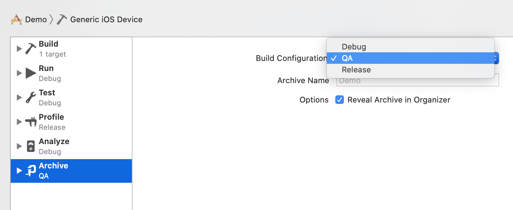
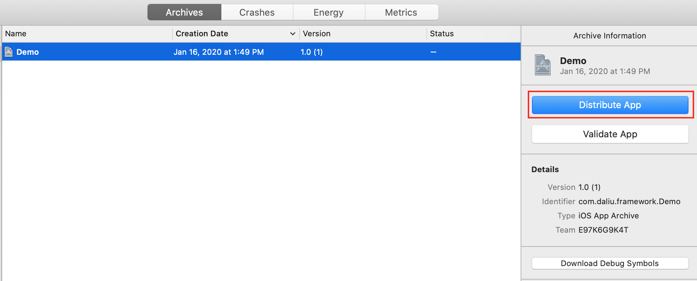
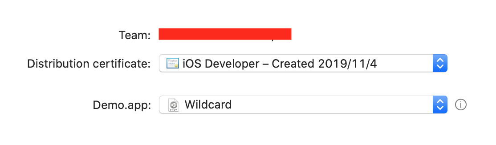
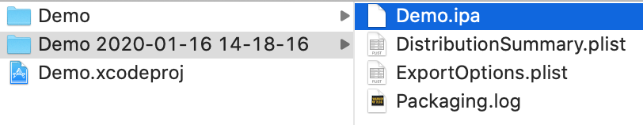
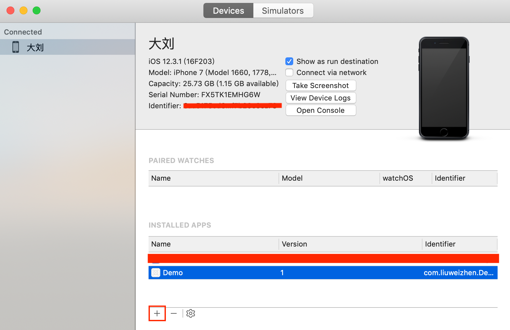
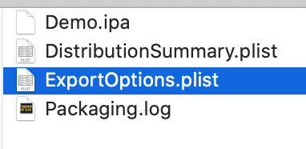
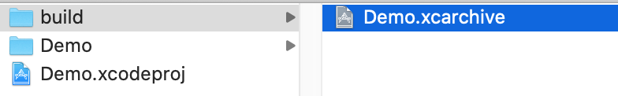

# 常用命令

默认情况下，xcodebuild会把编译的输出放入`Location Preferences`，即Xcode > Preferences > Locations所指定的目录下。  

一些xcodebuild的基本命令 

- 查看xcodebuild简洁用法 `xcodebuild -usage`
- 查看已安装的SDK `xcodebuild -showsdks`
```
iOS SDKs:
	iOS 13.2                      	-sdk iphoneos13.2

iOS Simulator SDKs:
	Simulator - iOS 13.2          	-sdk iphonesimulator13.2

macOS SDKs:
	DriverKit 19.0                	-sdk driverkit.macosx19.0
	macOS 10.15                   	-sdk macosx10.15

tvOS SDKs:
	tvOS 13.2                     	-sdk appletvos13.2

tvOS Simulator SDKs:
	Simulator - tvOS 13.2         	-sdk appletvsimulator13.2

watchOS SDKs:
	watchOS 6.1                   	-sdk watchos6.1

watchOS Simulator SDKs:
	Simulator - watchOS 6.1       	-sdk watchsimulator6.1
```
- 查看安装的版本号 `xcodebuild -version` 
```
% xcodebuild -version
Xcode 11.3
Build version 11C29
```

- 查看项目中的Targets、Congigurations和Schemes，以Demo为例：
```
% xcodebuild -list
Information about project "Demo":
    Targets:
        Demo

    Build Configurations:
        Debug
        QA
        Release

    If no build configuration is specified and -scheme is not passed then "Release" is used.

    Schemes:
        Demo
```

- Archive打包

可以通过XCode打包和脚本打包，先来看使用Xcode打包：

`Product > Archive`

**注：**Archive可以打Congiguration配置下的各种类型的包，本例QA，`Debug、QA、Release`, 这可以通过Scheme来选择：  



通过XCode打包生成的包名字形如：`Demo 2020-1-16, 1.49 PM.xcarchive`

这个步骤不需要证书，profile文件等说明，因为这一步打包只是证明程序跑的通。然后为了可以在真机上运行，就需要提供证书，profile文件等说明，并转换成ipa包安装到手机上。通过XCode的export导出ipa包：



选择 Development(这一个选项对应开发证书，如果选择App Store Connect就是对应发布证书) > 选择证书和profile文件 > Export



Export之后就可以看到.ipa文件    


接下下就可以把这个ipa文件安装在手机上, 可以使用Apple的Apple Configurator 2，手机和电脑使用充电线连接，然后直接把.ipa文件拖入Apple Configurator 2即可完成安装。   
通过Xcode > window > Devices and Simulators > click "+" 安装在手机上跑起来：


接下来我们使用脚本打包ipa，在此之前我们先把上面使用XCode包export的文件`ExportOptions.plist`记录下来：



等一下要使用。

先看一下打包成.xcarchive的命令，命令格式如下：  

```shell
xcodebuild
archive -archivePath <archivePath>
-project <projectName>
-scheme <schemeName> #从-list命令中获取
-configuration < Debug|Release...>
-sdk <sdkName> #sdkName可从showsdks命令中获取
```

示例：  

以上面Demo示例，配置好`TARGETS > General > Singing(QA)`下面的`Provisioning Profile`后就可以打包了：

```shell
% cd xxx/xxx/Demo
% ls
Demo		Demo.xcodeproj
% mkdir build

xcodebuild archive -archivePath build/Demo -project Demo.xcodeproj -scheme Demo -configuration QA
```

脚本会自动读取项目的一些配置信息，比如： 

```
Entitlements:

{
    "application-identifier" = "E97K6G9K4T.com.daliu.framework.Demo";
    "com.apple.developer.team-identifier" = E97K6G9K4T;
    "get-task-allow" = 1;
    "keychain-access-groups" =     (
        "E97K6G9K4T.com.daliu.framework.Demo"
    );
}

Signing Identity:     "iPhone Developer: 大刘 证书 (M8JC6WJ6Z8)"
Provisioning Profile: "Wildcard"
                      (d7430d17-8e8f-4db7-840a-1ba5575153d4)
```



这样就在当前目录下生成了Demo.xcarchive文件包。当XCode选择模拟器时，打的就是模拟器的包，选择`Generic iOS Device`时，打的就是真机包. 这里生成的.xcarchive包还不可以直接在直机上运行，接下来我们把它转换为.ipa格式的包，这需要一个plist文件指定profile，teamId等信息，可以参照上面我们保存的`ExportOptions.plist`文件，

```xml
<?xml version="1.0" encoding="UTF-8"?>
<!DOCTYPE plist PUBLIC "-//Apple//DTD PLIST 1.0//EN" "http://www.apple.com/DTDs/PropertyList-1.0.dtd">
<plist version="1.0">
<dict>
	<key>compileBitcode</key>
	<true/>
	<key>destination</key>
	<string>export</string>
	<key>method</key>
	<string>development</string>
	<key>provisioningProfiles</key>
	<dict>
		<key>com.daliu.framework.Demo</key>
		<string>Wildcard</string>
	</dict>
	<key>signingCertificate</key>
	<string>E2EA7A8E4588D663532991213AF57A76E21CA26E</string>
	<key>signingStyle</key>
	<string>manual</string>
	<key>stripSwiftSymbols</key>
	<true/>
	<key>teamID</key>
	<string>E97K6G9K4T</string>
	<key>thinning</key>
	<string>&lt;none&gt;</string>
</dict>
</plist>
```

有了这个Plist文件和.arvhice文件，就可以生成.ipa文件的，形如：

```Shell
xcodebuild -exportArchive -archivePath "Demo.xcarchive" -exportPath "./" -exportOptionsPlist "Demo.plist"
```

下面参照Plist文件和见[这里](https://stackoverflow.com/questions/14934808/how-to-convert-xcarchive-to-ipa-for-client-to-submit-app-to-app-store-using-ap)写一个编译并打包成ipa包的shell脚本：  

```sh
PROJECT=Demo #工程名
ARCHIVE_PATH=tmp/${PROJECT}.xcarchive # Archive后的.xcarchive目录
EXPORT_PATH=tmp/ # 导出ipa的目录
SCHEME=${PROJECT}
EXPORT_OPTIONS=ExportOptions.plist

mkdir -p $ARCHIVE_PATH # 按目录层级自动创建目录

echo "============ var name ================="
echo "PROJECT: "${PROJECT}
echo "ARCHIVE_PATH: "${ARCHIVE_PATH}
echo "EXPORT_PATH: "${EXPORT_PATH}
echo "SCHEME: "${SCHEME}
echo "EXPORT_OPTIONS: "${EXPORT_OPTIONS}
echo "======================================="

xcodebuild -project ./${PROJECT}.xcodeproj -scheme ${SCHEME} archive -archivePath $ARCHIVE_PATH -verbose # 打包成.xcarchive文件

echo "打包完成"

xcodebuild -exportArchive -archivePath $ARCHIVE_PATH -exportPath $EXPORT_PATH -exportOptionsPlist $EXPORT_OPTIONS

echo "转成ipa完成"

open $EXPORT_PATH # 打开ipa文件所在目录
```

其中`ExportOptions.plist`内容如下：

```xml
<?xml version="1.0" encoding="UTF-8"?>
<!DOCTYPE plist PUBLIC "-//Apple//DTD PLIST 1.0//EN" "http://www.apple.com/DTDs/PropertyList-1.0.dtd">
<plist version="1.0">
<dict>
	<key>compileBitcode</key>
	<true/>
	<key>destination</key>
	<string>export</string>
	<key>method</key>
	<string>development</string>
	<key>provisioningProfiles</key>
	<dict>
		<key>com.daliu.framework.Demo</key>
		<string>Wildcard</string>
	</dict>
	<key>signingCertificate</key>
	<string>A2EA7A8E4588366353299C213AF57A75E21CA26E</string>
	<key>signingStyle</key>
	<string>manual</string>
	<key>stripSwiftSymbols</key>
	<true/>
	<key>teamID</key>
	<string>E97K6G9K4T</string>
	<key>thinning</key>
	<string>&lt;none&gt;</string>
</dict>
</plist>
```


