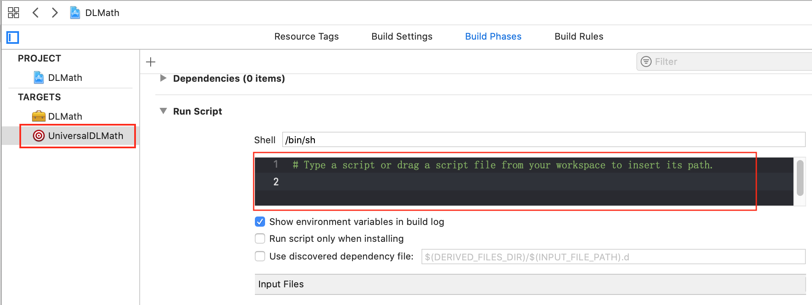

# 打包framework

下面以一个完整的示例打包Swift framework，Framework分动态静态之分，此处以动态framework为例  

### 编写framework

 File > New > Project > iOS > Framework > Product Name比如输入"DLMath"  

 这会生成一个DLMath.h的头文件，该头文件的作用是整个包对外提供的入口头文件，除了正常定义参数属性之外，还有：
 1. 提供 Swift项目内引用的OC文件的import引用，注意，这里引用之前必须在Build Phrases的Headers内暴露到 Public
 2. 提供第三方文件的import引用  

这里我们暂且不用理会，因为对于Swift而言，是否暴露给外面用是通过访问控制符来控制的：  

- open:  在所有模块都可以访问, 重写和继承.
- public: 在模块里面是可以继承或者重写, 在模块外可以访问,但不可以重写和继承
- internal: 默认访问域，module访问域，或者说target作用域，在同一module内可被访问
- fileprivate: 如名字一样, 只有这个文件才能访问.
- private：只能在作用域访问

```swift
public class DLMath {
    // 如果不继承于NSObject, Swift动态库里的类需要提供构造方法，否则:
    // 'DLMath' initializer is inaccessible due to 'internal' protection level
    public init() {
    }
    
    public func sum(_ a: Int, _ b: Int) -> Int {
        return a + b
    }
    public func minus(_ a: Int, _ b: Int) -> Int {
        return a - b
    }
}
```

Framework编写完成之后，接下来进行打包，打包可以使用Xcode进行打包，也可以使用脚本，先来看使用XCode打包：  

### 使用XCode打包

1. XCode选择模拟器，command + B 编译模拟器下的包，生成的包: Products/DLMain.framework, show In Finder并保存
2. XCode选择真机，command + B 编译真机下的包，生成的包： Products/DLMain.framework，show in Finder并保存  


其中Debug-iphoneos下面DLMath.framework是真机下的包，而Debug-iphonesimulator下面的DLMath.framework是模拟器下的包，我们可以通过`lipo -info`查看framework支持的CPU架构：  

```
% lipo -info /Users/.../Debug-iphonesimulator/DLMath.framework/DLMath
Non-fat file: /Users/.../Debug-iphonesimulator/DLMath.framework/DLMath is architecture: x86_64 

% lipo -info /Users/.../Debug-iphoneos/DLMath.framework/DLMath
Non-fat file: /Users/.../Debug-iphoneos/DLMath.framework/DLMath is architecture: arm64
```

每个架构支持的机型不一致：

Description of Architecture:  
- armv64: iPhoneX, iPhone 5s-8, iPad Air — iPad Pro
- armv7 : iPhone3Gs-5c, iPad WIFI(4th gen)
- armv6 : iPhone — iPhone3G
- -the above if for real devices
- i386 : 32-bit simulator
- x86_64 : 64-bit simulator

我们把上面XCode生成的模拟器包和真机包合起来成一个通用包：  

1. 先把 Debug-iphoneos 拷贝一份，比如起名为Debug-universal  
2. 架构合并，使用命令把模拟器包和真机包合成一个 `lipo -create /Users/.../Debug-iphoneos/DLMath.framework/DLMath /Users/.../Debug-iphoneos/DLMath.framework/DLMath -output /Users/.../Debug-universal/DLMath.framework/DLMath `  
3. 因为是纯Swift的framework, 因此需要把把模拟器下面的modules拷贝到universal中: `cp /Users/.../Debug-iphonesimulator/DLMath.framework/Modules /Users/.../Debug-universal/DLMath.framework/Modules`否则会：[报错](https://stackoverflow.com/questions/56957632/could-not-find-module-for-target-x86-64-apple-ios-simulator)
Could not find module 'DLMath' for target 'x86_64-apple-ios-simulator'; found: arm64, arm64-apple-ios 

### 使用XCode的Aggregate和Run Script打包  
XCode提供了Aggregate的target和`Run Script`功能方便我们打跨平台的包， 在DLMath工程上选择File > New > Target > Cross-platform > Aggregate, 比如起名为UniversalDLMath  


然后在Build Phases中New Run Script Phase

  



XCode允许我们在这里写xcodebuild的shel打包l脚本，XCode在编译UniversalDLMath这个Target时就会执行此处的shell脚本， 在这里写脚本的一个优势是可以使用XCode内置的一些变量，这些变量会根据我们对当前工程的配置赋值，执行脚本时XCode内部会引入这些变量, 我们可以在Run Script中键入env查看这个环境变量：  

```
echo "==== Begin check env ===="
env
echo "==== End check env ===="
```


Command+B, 然后 View > Navigators > Show Report Navigator (快捷键Command + 9)  


在XCode编译时会cd到目录下并export引入一些环境变量  

```shell
cd /Users/daliu/Desktop/ForDelete/DLMath
export ACTION=build
export AVAILABLE_PLATFORMS="appletvos appletvsimulator iphoneos iphonesimulator macosx watchos watchsimulator"
export PROJECT_NAME=DLMath
export BUILD_ACTIVE_RESOURCES_ONLY=YES
export BUILD_COMPONENTS="headers build"
export BUILD_DIR=/Users/daliu/Library/Developer/Xcode/DerivedData/DLMath-dpcswzmksibxhddidjyfqpcnwkke/Build/Products
export BUILD_LIBRARY_FOR_DISTRIBUTION=NO
export BUILD_ROOT=/Users/daliu/Library/Developer/Xcode/DerivedData/DLMath-dpcswzmksibxhddidjyfqpcnwkke/Build/Products
export BUILD_STYLE=
export BUILD_VARIANTS=normal
export BUILT_PRODUCTS_DIR=/Users/daliu/Library/Developer/Xcode/DerivedData/DLMath-dpcswzmksibxhddidjyfqpcnwkke/Build/Products/Debug-iphonesimulator
export CONFIGURATION=Debug
export CONFIGURATION_BUILD_DIR=/Users/daliu/Library/Developer/Xcode/DerivedData/DLMath-dpcswzmksibxhddidjyfqpcnwkke/Build/Products/Debug-iphonesimulator
... 
```

以变量BUILD_DIR指定的路径为例：`/Users/daliu/Library/Developer/Xcode/DerivedData/DLMath-dpcswzmksibxhddidjyfqpcnwkke/Build/Products`，这实际上对应的配置是：  


可以测试： 


[这里](https://gist.github.com/cromandini/1a9c4aeab27ca84f5d79)是一份打包脚本的写法，我们抄录它放在XCode的Run Script中： 

```shell
#!/bin/sh

echo "==================== 开始打包 ===================="

# 这里的环境变量CONFIGURATION对应的是Debug、Release ...
UNIVERSAL_OUTPUTFOLDER=${BUILD_DIR}/${CONFIGURATION}-universal
# make sure the output directory exists 
# 确保xxx-universal目录存在，这里 ${XXX} 同 "${XXX}"
mkdir -p ${UNIVERSAL_OUTPUTFOLDER}

# Step 1. Build Device and Simulator versions
echo ${CONFIGURATION}
xcodebuild -target ${PROJECT_NAME} ONLY_ACTIVE_ARCH=NO -configuration ${CONFIGURATION} -sdk iphoneos BUILD_DIR="${BUILD_DIR}" BUILD_ROOT="${BUILD_ROOT}" clean build
xcodebuild -target "${PROJECT_NAME}" -configuration ${CONFIGURATION} -sdk iphonesimulator ONLY_ACTIVE_ARCH=NO BUILD_DIR="${BUILD_DIR}" BUILD_ROOT="${BUILD_ROOT}" clean build

# Step 2. Copy the framework structure (from iphoneos build) to the universal folder
cp -R ${BUILD_DIR}/${CONFIGURATION}-iphoneos/${PROJECT_NAME}.framework ${UNIVERSAL_OUTPUTFOLDER}/

# Step 3. Copy Swift modules from iphonesimulator build (if it exists) to the copied framework directory
SIMULATOR_SWIFT_MODULES_DIR="${BUILD_DIR}/${CONFIGURATION}-iphonesimulator/${PROJECT_NAME}.framework/Modules/${PROJECT_NAME}.swiftmodule/."
# 如果存在，则拷贝到universal中
if [ -d "${SIMULATOR_SWIFT_MODULES_DIR}" ]; then
cp -R ${SIMULATOR_SWIFT_MODULES_DIR} "${UNIVERSAL_OUTPUTFOLDER}/${PROJECT_NAME}.framework/Modules/${PROJECT_NAME}.swiftmodule"
fi

# Step 4. Create universal binary file using lipo and place the combined executable in the copied framework directory
lipo -create -output "${UNIVERSAL_OUTPUTFOLDER}/${PROJECT_NAME}.framework/${PROJECT_NAME}" "${BUILD_DIR}/${CONFIGURATION}-iphonesimulator/${PROJECT_NAME}.framework/${PROJECT_NAME}" "${BUILD_DIR}/${CONFIGURATION}-iphoneos/${PROJECT_NAME}.framework/${PROJECT_NAME}"

# 经过上面4步之后，在BUILD_DIR目录下就生成了完整的Debug-universal/DLMath.framework
# Step 5. Convenience step to copy the framework to the project's directory
# 把Debug-universal下面的DLMath.framework拷贝到工程所在目录下
cp -R "${UNIVERSAL_OUTPUTFOLDER}/${PROJECT_NAME}.framework" "${PROJECT_DIR}"

# Step 6. Convenience step to open the project's directory in Finder
# 打开目录${PROJECT_DIR}
open "${PROJECT_DIR}"

echo "==================== 变量列表 ===================="
echo "UNIVERSAL_OUTPUTFOLDER: ${UNIVERSAL_OUTPUTFOLDER}"
echo "PROJECT_NAME: ${PROJECT_NAME}"
echo "BUILD_DIR: ${BUILD_DIR}"
echo "CONFIGURATION: ${CONFIGURATION}"
echo "PROJECT_DIR: ${PROJECT_DIR}"

echo "==================== 打包结束 ===================="
```

### 不借助XCode使用纯脚本打包  

也可以仿照上面的脚本代码在Framework目录下建一个shell脚本文件，全部使用此脚本打包：

```
#!/bin/sh

PROJECT_NAME=DLMath
TARGET=DLMath
CONFIGURATION=Release
UNIVERSAL_OUTPUT=universal
BUILD_DIR=build

# Step 1. 编译真机包和真机包
# xcodebuild命令默认会在当前目录下生成build目录，当-sdk iphoneos时，会生成Release-iphoneos目录，当-sdk iphonesimulator时生成Release-iphonesimulator目录(Debug和Release由-configuration决定)
xcodebuild BITCODE_GENERATION_MODE=bitcode OTHER_CFLAGS="-fembed-bitcode" -target ${TARGET} ONLY_ACTIVE_ARCH=NO -configuration ${CONFIGURATION} -sdk iphoneos BUILD_DIR="${BUILD_DIR}"
xcodebuild BITCODE_GENERATION_MODE=bitcode OTHER_CFLAGS="-fembed-bitcode" -target ${TARGET} ONLY_ACTIVE_ARCH=NO -configuration ${CONFIGURATION} -sdk iphonesimulator BUILD_DIR="${BUILD_DIR}" 

# 确保universal目录存在
mkdir -p ${BUILD_DIR}/${UNIVERSAL_OUTPUT}/${PROJECT_NAME}.framework

# Step 2. 把build/iphoneos下面的XXX.framework拷贝到universal目录中，因为即将生成的universal包要用相同的Headers|Info.plist|Modules
cp -R "${BUILD_DIR}/${CONFIGURATION}-iphoneos/${PROJECT_NAME}.framework/"* ${BUILD_DIR}/${UNIVERSAL_OUTPUT}/${PROJECT_NAME}.framework

# Step 3. 合并真机包和模拟器包
lipo -create ${BUILD_DIR}/${CONFIGURATION}-iphonesimulator/${PROJECT_NAME}.framework/${PROJECT_NAME} ${BUILD_DIR}/${CONFIGURATION}-iphoneos/${PROJECT_NAME}.framework/${PROJECT_NAME} -output ${BUILD_DIR}/${UNIVERSAL_OUTPUT}/${PROJECT_NAME}.framework/${PROJECT_NAME}

# Step 4. 把模拟器下的swiftmodule以真机下面的swiftmodule合在一起
SIMULATOR_SWIFT_MODULES_DIR="${BUILD_DIR}/${CONFIGURATION}-iphonesimulator/${PROJECT_NAME}.framework/Modules/${PROJECT_NAME}.swiftmodule/."
if [ -d "${SIMULATOR_SWIFT_MODULES_DIR}" ]; then
cp -R ${SIMULATOR_SWIFT_MODULES_DIR} "${BUILD_DIR}/${UNIVERSAL_OUTPUT}/${PROJECT_NAME}.framework/Modules/${PROJECT_NAME}.swiftmodule"
fi
```

```shell
chmod +x math.sh
./math.sh
```


### 使用Framework

由于是动态库，使用时需要托入工程中并 TARGET > General中存在并Embed进工程:   


