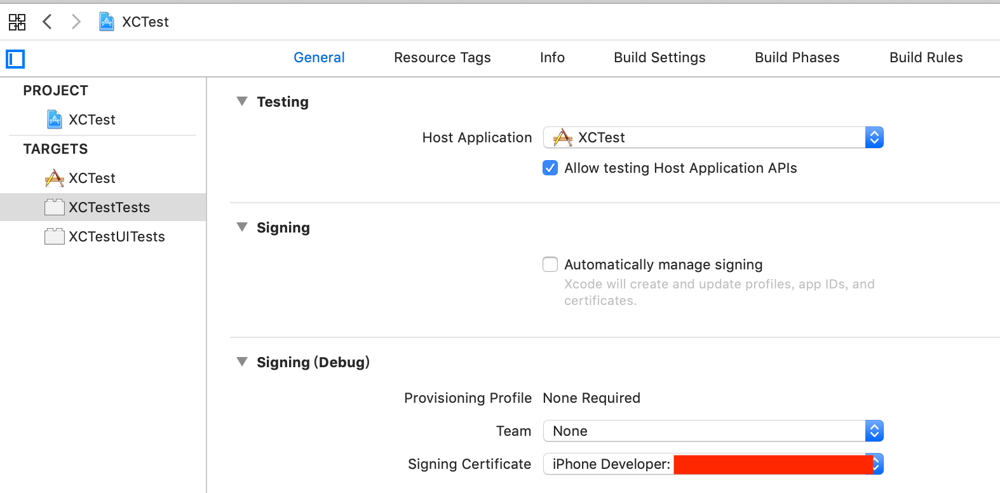

# 单元测试

### 新建项目示例

如上图所示，新建项目时可勾选上`Include Unit Tests`和`Include UI Tests`，这样做了之后，项目中会多出来

Unit Test代码示例：

```Objective-C
#import <XCTest/XCTest.h>
#import "Person.h"
#import "Model.h"

@interface AnimalTest : XCTestCase

@end

@implementation AnimalTest

- (void)setUp {
    // 每个test方法执行之前调用，在此方法中可以定义一些全局属性
    // Put setup code here. This method is called before the invocation of each test method in the class.
}

- (void)tearDown {
	  // 每个test方法执行之后调用，释放测试用例的资源代码，这个方法会每个测试用例执行后调用
    // Put teardown code here. This method is called after the invocation of each test method in the class.
}

- (void)testPerson {
    Person *p = [[Person alloc] init];
    p.name = @"fff";
    XCTAssertTrue(p.name.length > 0, @"person name empty");
}

- (void)testExample {
    // This is an example of a functional test case.
    // Use XCTAssert and related functions to verify your tests produce the correct results.
}

// 普通测试
- (void)testModel {
    Model *model = [[Model alloc] init];
    NSInteger num = [model randomLessThanTen];
    XCTAssert(num < 10, @"num should less than 10");
}

// 性能测试
- (void)testPerformanceExample {
    // This is an example of a performance test case.
    [self measureBlock:^{
        // Put the code you want to measure the time of here.
        for (NSInteger index = 0; index < 1000; index ++) {
            // No baseline average for Time.
            // Time: 0.348 sec
            // Time: 0.297 sec (10% better)
            NSLog(@"%ld",index);
        }
    }];
}

// 异步测试
- (void)testAsynExample {
    XCTestExpectation *exp = [self expectationWithDescription:@"Something error"];
    /**
    [self expectationForPredicate:(nonnull NSPredicate *) evaluatedWithObject:(nullable id) handler:^BOOL{}];
    [self expectationForNotification:(nonnull NSNotificationName) object:(nullable id) handler:^BOOL(NSNotification * _Nonnull notification) {}]
     */
    
    NSOperationQueue *queue = [[NSOperationQueue alloc] init];
    [queue addOperationWithBlock:^{
        // 模拟这个异步操作需要2秒后才能获取结果，比如一个异步网络请求
        sleep(2);
        // 模拟获取的异步操作后，获取结果，判断异步方法的结果是否正确
        NSString *result = @"This is result";
        XCTAssert(result.length > 0, @"result is empty!");
        // 如果断言没问题，就调用fulfill宣布测试满足
        [exp fulfill];
    }];
    
    // 设置延迟多少秒后，如果没有满足测试条件就报错
    [self waitForExpectationsWithTimeout:3 handler:^(NSError * _Nullable error) {
        if (error) {
            NSLog(@"Time out error: %@", error);
        }
    }];
}

// 异步测试From AFNetworking
- (void)testThatBackgroundImageChanges {
    XCTAssertNil([self.button backgroundImageForState:UIControlStateNormal]); // 首先确保当前button的backgroundImage为空
    [self.button setBackgroundImageForState:UIControlStateNormal withURL:self.jpegURL]; // 发送了一个请求，获取图片
    NSPredicate *predicate = [NSPredicate predicateWithBlock:^BOOL(UIButton  * _Nonnull button, NSDictionary<NSString *,id> * _Nullable bindings) {
        return [button backgroundImageForState:UIControlStateNormal] != nil;
    }];
    
    [self expectationForPredicate:predicate
              evaluatedWithObject:self.button
                          handler:nil];
    
    // 20秒内正确获得则通过测试，否则失败
    // [self waitForExpectationsWithTimeout:20 handler:nil];
    [self waitForExpectationsWithCommonTimeout];
}

// 异步测试，expectationForNotification，监听通知, 如果在规定时间内正确收到通知则测试通过
- (void)testNotification {
    [self expectationForNotification:@"notification name" object:nil handler:^BOOL(NSNotification * _Nonnull notification) {
        NSLog(@"get notification: %@", notification.name);
        return YES;
    }];
    
    [[NSNotificationCenter defaultCenter] postNotificationName:@"notification name" object:nil];
    // 设置延迟多少秒后，如果没有满足测试条件就报错
    [self waitForExpectationsWithTimeout:3 handler:^(NSError * _Nullable error) {
        NSLog(@"Time out: %@", error);
    }];
}

// Swift版
/**
func testNotification() {
    let expectation: XCTestExpectation = self.expectation(description: "expectation for notification xxx")
    
    let observer = NotificationCenter.default.addObserver(forName: NSNotification.Name(rawValue: "notification name"), object: nil, queue: nil) { (notification) in
        print("get notification: \(notification)")
        expectation.fulfill()
    }
    NotificationCenter.default.post(name: NSNotification.Name(rawValue: "notification name"), object: nil, userInfo: nil)
    self.waitForExpectations(timeout: 3) { (error) in
        print("Time out")
    }
    NotificationCenter.default.removeObserver(observer)
}
*/
```

- 测试方法需以`test`开头，点击方法左边的菱形运行测试单元。绿色表示测试通过。
- 测试常用方法：

```Objective-C
XCTAssert(expression, format...)
XCTAssertTrue(expression, format...)
XCTAssertFalse(expression, format...)
XCTAssertEqual(expression1, expression2, format...)
XCTAssertNotEqual(expression1, expression2, format...)
XCTAssertEqualWithAccuracy(expression1, expression2, accuracy, format...)
XCTAssertNotEqualWithAccuracy(expression1, expression2, accuracy, format...)
XCTAssertNil(expression, format...)
XCTAssertNotNil(expression, format...)
XCTFail(format...)
```
- 可以手动创建Test Target

或者：
Test Target: File -> New -> File, 找到`UI Test Case Class`和`Unit Test Case Class`

### UITest
UI Tests和Unit Test不同，UI Test牵涉到UI的东西，系统提供了一大批获取操作控件的方法，通过这个API来操作并测试UI。
假设代码：

```Objective-C
- (BOOL)application:(UIApplication *)application didFinishLaunchingWithOptions:(NSDictionary *)launchOptions {
    self.window = [[UIWindow alloc] initWithFrame:UIScreen.mainScreen.bounds];
    self.window.backgroundColor = UIColor.whiteColor;
    RootViewController *controller = [[RootViewController alloc] init];
    UINavigationController *nivController = [[UINavigationController alloc] initWithRootViewController:controller];
    self.window.rootViewController = nivController;
    [self.window makeKeyAndVisible];
    return YES;
}
```
其中RootViewController有一个显示为"Login"的按钮，点击这个按钮进入到登录控制器：


我们在UITest中模拟一下操作：

```Objective-C
// XCTestUITests.m

- (void)setUp {
    self.continueAfterFailure = NO;

    XCUIApplication *app = [[XCUIApplication alloc] init];
    self.app = app;
    [app launch];
}

- (void)testLogin {
    XCUIApplication *app = self.app;
    if (app.navigationBars.count) {
        XCUIElement *navigationBar = [app.navigationBars elementBoundByIndex:0];
        XCUIElement *loginButton = navigationBar.buttons[@"ToLogin"];
        [loginButton tap]; // 进入到登录控制器
        
        // 用户名
        XCUIElement *usernameField = app.textFields[@"username"];
        if (usernameField.value) {
            NSLog(@"清空初始用户名:%@", usernameField.value);
        }
        [usernameField tap]; // 让usernameField成为第一响应者
        [usernameField typeText:@"daliu"]; // 输入'daliu'
        
        // 密码
        XCUIElement *passwordField = app.secureTextFields[@"password"];
        [passwordField tap];
        [passwordField typeText:@"a111111"];
        XCUIElement *nextButton = app.buttons[@"Login"];
        [nextButton tap]; // 点击Login按钮
    }
}
```

系统提供了很多API用于在XCUI Test：

```Objective-C
// 获取 UITabBarController 的 Item
- (void)testUITabBarController_item {
    NSArray<XCUIElement *> *tabBars = self.app.tabs.allElementsBoundByIndex;
    XCUIElement *tabBar = tabBars[0];
    XCUIElementQuery *tabBarItems = [tabBar childrenMatchingType:XCUIElementTypeButton];
    XCUIElement *tabBarItem1 = [tabBarItems elementBoundByIndex:0];
    XCUIElement *tabBarItem2 = [tabBarItems elementBoundByIndex:1];
    XCUIElement *tabBarItem3 = [tabBarItems elementBoundByIndex:2];
    XCUIElement *tabBarItem4 = [tabBarItems elementBoundByIndex:3];
    [tabBarItem1 tap];
    [tabBarItem2 tap];
    [tabBarItem3 tap];
    [tabBarItem4 tap];
}

// 获取UISegmentControl的label
- (void)testUISegmentControl_label {
    XCUIElement *segmentScrollView = nil;
    for (NSInteger i = 0; i < app.scrollViews.count; i++) {
        XCUIElement *scrollView = [app.scrollViews elementBoundByIndex:i];
        if (scrollView.staticTexts.count == 3) {
            segmentScrollView = scrollView;
            break;
        }
    }
    XCTAssertNotNil(segmentScrollView);

    XCUIElement *todoStaticText = [segmentScrollView.staticTexts elementBoundByIndex:0];
    XCUIElement *doingStaticText = [segmentScrollView.staticTexts elementBoundByIndex:1];
    XCUIElement *doneStaticText = [segmentScrollView.staticTexts elementBoundByIndex:2];
    self.todoStaticText = todoStaticText;
    self.doingStaticText = doingStaticText;
    self.doneStaticText = doneStaticText;

    [self.todoStaticText tap];
    [self.doingStaticText tap];
    [self.doneStaticText tap];
}

// 获取 textField 的 删除键
XCUIElement *userNameTextField = self.app.textFields[@"用户名"];
[userNameTextField tap];
if (userNameTextField.value) {
    NSLog(@"清空初始用户名:%@", userNameTextField.value);
    XCUIElement *userNameClearTextButton = userNameTextField.buttons[@"Clear text"];
    [userNameClearTextButton tap];
}
[userNameTextField typeText:userName];

// 获取 keyboard 的 return 键
XCUIElement *keyboard = [self.app.keyboards elementBoundByIndex:0];
// 键盘 search 键
XCUIElement *keyboardSerch = keyboard.buttons[@"Search"];
```

由此可见，这些API太过繁锁，不实用。可以尝试用一下

### 真机调试

对于XCTest，需要配置2步：
1. 把BuildSetting里的Code Signing Identify配置成和原工程的Team相同
**原工程:**


**build setting:**


2. 正确设置General的Singing Certificate


对于XCUITest，需要配置General的`Provisioning Profile`


参考：

- [https://www.jianshu.com/p/10795157fdc0](https://www.jianshu.com/p/10795157fdc0)
- [ https://www.jianshu.com/p/81b10745044b]( https://www.jianshu.com/p/81b10745044b)
- [https://blog.csdn.net/ZY_FlyWay/article/details/80943687](https://blog.csdn.net/ZY_FlyWay/article/details/80943687)
- [Apple](https://developer.apple.com/library/archive/documentation/DeveloperTools/Conceptual/testing_with_xcode/chapters/05-running_tests.html)
- [RunningOnDevice](https://www.twilio.com/blog/2018/07/how-to-test-your-ios-application-on-a-real-device.html)

