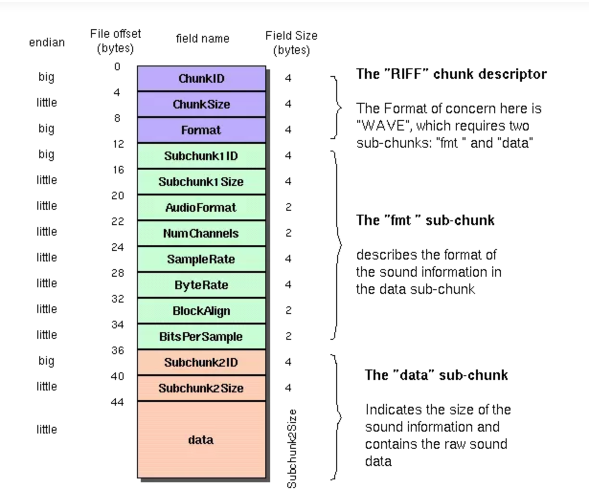
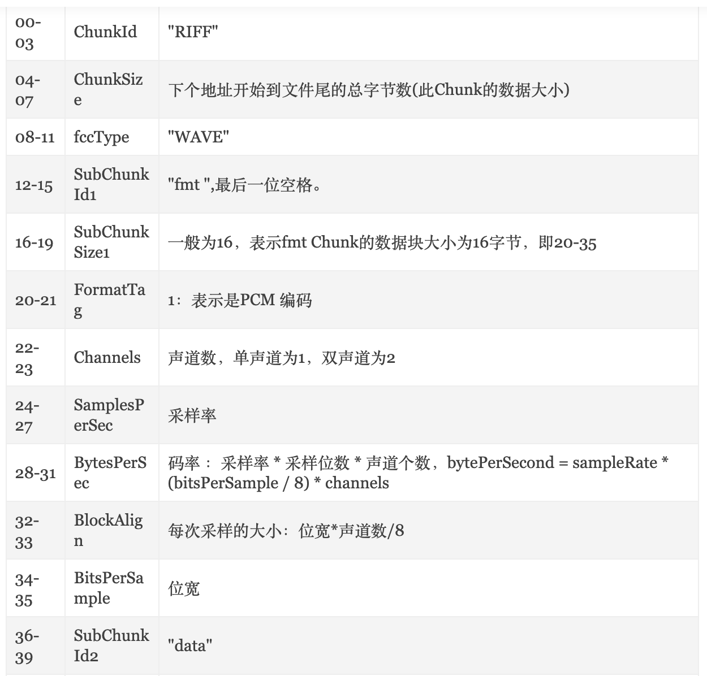

# pcm转wav

### 什么是WAV和PCM？  

WAV：wav是一种无损的音频文件格式，WAV符合 PIFF(Resource Interchange File Format)规范。所有的WAV都有一个文件头，这个文件头音频流的编码参数。WAV对音频流的编码没有硬性规定，除了PCM之外，还有几乎所有支持ACM规范的编码都可以为WAV的音频流进行编码。

PCM:PCM（Pulse Code Modulation----脉码调制录音)。所谓PCM录音就是将声音等模拟信号变成符号化的脉冲列，再予以记录。PCM信号是由[1]、[0]等符号构成的数字信号，而未经过任何编码和压缩处理。  

简单来说：wav是一种无损的音频文件格式，pcm是没有压缩的编码方式。  

有时候需要将录音文件保存为wav格式，这需要手动填充wav的文件头信息  

   

  

