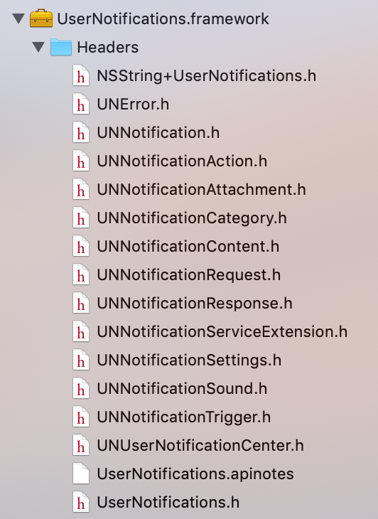
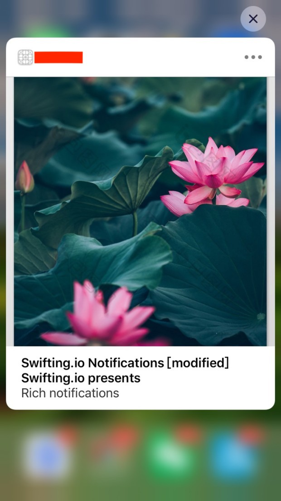
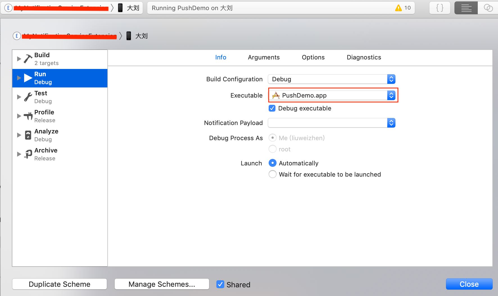

# 推送通知


本文只讨论代码，原理性内容请参考下面的链接文章。

iOS 10之后使用UserNotificationKit新框架， 使用时`#import <UserNotifications/UserNotifications.h>`



iOS设备要使用推送功能，至少需要三样东西：

- 推送证书：Server向APNs发推送消息时，APNs需要Server提供这个推送证书
- 用户的许可
- deviceToken: APNs要向特定的设备发消息，必须要这个设备的标识，才能推得过去，这个标识就是deviceToken

**第一步：推送证书**

Wildcard不可以作为推送证书，Debug和Product的证书不一样，区分配置。推送原理和证书配置可参见[这里](https://www.jianshu.com/p/2c8cf1ccf625)，作者写的很详细，此处省略。

**第二步：请求用户许可**

本地和远程的通知都需要请求用户授权，首先第一步，在TARGETS > Capabilities > Background Modes > Remote notifications 勾选，这只是告诉系统，此App有推送功能。其次，才是真正的通过代码请求用户许可使用推送功能：

```
UNUserNotificationCenter *center = [UNUserNotificationCenter currentNotificationCenter];
center.delegate = self;
/**
 UNAuthorizationOptionBadge   = (1 << 0),红色圆圈
 UNAuthorizationOptionSound   = (1 << 1),声音
 UNAuthorizationOptionAlert   = (1 << 2),内容
 UNAuthorizationOptionCarPlay = (1 << 3),车载通知
 */
UNAuthorizationOptions options = UNAuthorizationOptionBadge | UNAuthorizationOptionSound | UNAuthorizationOptionAlert;
[center requestAuthorizationWithOptions:options completionHandler:^(BOOL granted, NSError * _Nullable error) {
    if (granted && !error) {
        NSLog(@"用户授权成功");
    }
    else {
        NSLog(@"用户授权失败，error: %@", error.localizedDescription);
    }
}];
```

注：在上面的代码中有一句`center.delgate = self`， Apple官网提示：
delegate must be setted before "application:didFinishLaunchingWithOptions:" return，也就是说，UNUserNotificationCenter对象的delegate的设置必须要在函数application:didFinishLaunchingWithOptions:返回之前设置。

当App第一次运行(或卸载重装第一次运行)时，系统会弹出Dialog提示用户是否允许推送。Apple提示：Always call this method before scheduling any local notifications and before registering with the Apple Push Notification service. 即，在注册通知和分发本地通知之前，可以调用此方法，如果用户原来已同意，则此方法不会再弹框提示用户，而是直接返回granted为YES。

另外，在实际项目中，一般也可以先获取用户是否已允许了推送，如果用户还未选择，则请求授权，如果拒绝了，可以显示产品要求的界面，提示用户开启授权。

```Objective-C
[center getNotificationSettingsWithCompletionHandler:^(UNNotificationSettings * _Nonnull settings) {
    switch (settings.authorizationStatus) {
        // 用户尚未选定(比如第一次启动)
        case UNAuthorizationStatusNotDetermined: {
            /**
             UNAuthorizationOptionBadge   = (1 << 0),红色圆圈
             UNAuthorizationOptionSound   = (1 << 1),声音
             UNAuthorizationOptionAlert   = (1 << 2),内容
             UNAuthorizationOptionCarPlay = (1 << 3),车载通知
             */
            UNAuthorizationOptions options = UNAuthorizationOptionBadge | UNAuthorizationOptionSound | UNAuthorizationOptionAlert;
            [center requestAuthorizationWithOptions:options completionHandler:^(BOOL granted, NSError * _Nullable error) {
                if (granted && !error) {
                    NSLog(@"用户授权成功");
                }
                else {
                    NSLog(@"用户授权失败，error: %@", error.localizedDescription);
                }
            }];
            break;
        }
        // 已授权
        case UNAuthorizationStatusAuthorized: {
            break;
        }
        case UNAuthorizationStatusDenied: {
            // 显示未授权界面，引导用户打开设置，允许授权
            return;
        }
        default:
            break;
    }
}]
```

**第三步：获取deviceToken**

这个deviceToken是需要App向APNs发起regist, APNs才会传过来给App的。APNs必须知道和设备惟一性关联的deviceToken才知道向具体哪台设备发送推送消息。

```Objective-C
- (BOOL)application:(UIApplication *)application didFinishLaunchingWithOptions:(NSDictionary *)launchOptions {
	  // Register to receive remote notifications via Apple Push 	Notification service.
    [application registerForRemoteNotifications];
}
```

**第四步：告诉Server deviceToken**

如果向APNs注册deviceToken成功，由于上面在AppDelegate中设置了`center.delegate = self`APNs会把deviceToken通过代理方法传过来：

```Objective-C
- (void)application:(UIApplication *)application didRegisterForRemoteNotificationsWithDeviceToken:(NSData *)deviceToken {
    NSLog(@"注册远程推送成功: ");
#ifdef DEBUG
    NSString *deviceTokenStr = [[[[deviceToken description]
                                  stringByReplacingOccurrencesOfString:@"<" withString:@""]
                                 stringByReplacingOccurrencesOfString:@">" withString:@""]
                                stringByReplacingOccurrencesOfString: @" " withString: @""];
    // 将device token转换为字符串，粘贴到smartPush中
    NSLog(@"deviceTokenStr = %@", deviceTokenStr);
#endif
    // Send deviceToken to server
}

- (void)application:(UIApplication *)application didFailToRegisterForRemoteNotificationsWithError:(NSError *)error {
    NSLog(@"注册远程推送失败，error: %@", error.localizedDescription);
}
```

注：From Apple: Device tokens can change periodically, so caching the value risks sending an invalid token to your server. If the device token hasn't changed, registering with APNs and returning the token happens quickly.

也就是说Device token有可能发生周期性的变化, 所以不建议缓存device token。

**第五步：Server 向APNs发消息**

可以通过[smartpush](https://github.com/shaojiankui/SmartPush)，指定证书，并把上面注册获取的deviceToken贴上去模拟推送消息。
推送消息的格式可以参考[这里](https://developer.apple.com/library/archive/documentation/NetworkingInternet/Conceptual/RemoteNotificationsPG/CreatingtheNotificationPayload.html#//apple_ref/doc/uid/TP40008194-CH10-SW1) 

**第六步：接收APNs发送过来的消息**

```Objective-C
// 只有当App在前台(foreground)时，推送过来，此方法才执行
- (void)userNotificationCenter:(UNUserNotificationCenter *)center willPresentNotification:(UNNotification *)notification withCompletionHandler:(void (^)(UNNotificationPresentationOptions options))completionHandler {
    // {"aps":{"alert":"This is some fancy message.","badge":6,"sound": "default"}}
    NSLog(@"App在前台, 正在运行中，推送消息过来");
    UNNotificationRequest *request = notification.request;
    NSLog(@"===> identifier: %@", request.identifier);
    UNNotificationContent *content = request.content;
    NSLog(@"===> badge: %@", content.badge); // 6
    NSLog(@"===> body: %@", content.body); // This is some fancy message.
    NSLog(@"===> categoryIdentifier: %@", content.categoryIdentifier);
    NSLog(@"===> userInfo: %@", content.userInfo); // 即整个aps字典
    NSLog(@"===> userInfo[@\"sound\"]: %@", content.userInfo[@"aps"][@"sound"]); // default
}

// 推送过来，用户点击了消息
- (void)userNotificationCenter:(UNUserNotificationCenter *)center didReceiveNotificationResponse:(UNNotificationResponse *)response withCompletionHandler:(void(^)(void))completionHandler {
    
    [self printNotificationResponse:response];
		... ...
    }
    completionHandler();
}

- (void)printNotificationResponse:(UNNotificationResponse *)response {
    NSLog(@"打印通知过来的信息:");
    UNNotificationRequest *request = response.notification.request;
    NSDictionary *userInfo = request.content.userInfo;
    NSString *title = request.content.title;
    NSString *subTitle = request.content.subtitle;
    NSString *categoryIdentifier = request.content.categoryIdentifier;
    NSString *body = request.content.body;
    NSString *identifier = request.identifier;
    NSLog(@"\n \
          response.actionIdentifier: %@\n \
          userInfo: %@\n \
          title: %@\n \
          subTitle: %@\n \
          categoryIdentifier: %@\n \
          body: %@\n \
          request identifier: %@\n",
          response.actionIdentifier,
          userInfo,
          title,
          subTitle,
          categoryIdentifier,
          body,
          identifier);
}

```

以上就是推送通知的大致流程，下面讨论一些细节性问题：

**UNNotificationCategory**

UNNotificationCategory是推送策略，每一种策略代表了一个notification的type，每种策略都有一个标识identifier，其目的是：Registers your app’s notification types and the custom actions that they support.
比如，推送过来后，可以通过用力按推送消息(重力感应)，弹出一些界面，比如出现一个文本输入框，出现几个按钮，针对性的做操作。[这里](https://developer.apple.com/documentation/usernotifications/declaring_your_actionable_notification_types?language=objc)有Apple官网的说明，UNUserNotificationCenter可以设置多个category, 一个category可以对应多个action, 这里的action可以理解成"操作行为"，比如按钮，文本输入等等。

示例：

```Objective-C
[center setNotificationCategories:[NSSet setWithObjects:[self getNotificationCategory], nil]];

...

- (UNNotificationCategory *)getNotificationCategory {
    // 文本交互(iOS10之后支持对通知的文本交互)
    /** Action的option:
     UNNotificationActionOptionAuthenticationRequired 用于文本
     UNNotificationActionOptionForeground 前台模式，进入APP
     UNNotificationActionOptionDestructive 销毁模式，不进入APP
     */
    UNTextInputNotificationAction *textInputAction = [UNTextInputNotificationAction actionWithIdentifier:@"textInput_identifer" title:@"textInput title" options:UNNotificationActionOptionAuthenticationRequired textInputButtonTitle:@"输入" textInputPlaceholder:@"text input placeholder"];
    
    // 打开应用按钮
    UNNotificationAction *action1 = [UNNotificationAction actionWithIdentifier:@"actionIdentifier_foreGround_open" title:@"打开" options:UNNotificationActionOptionForeground];
    
    // 不打开应用按钮
    UNNotificationAction *action2 = [UNNotificationAction actionWithIdentifier:@"actionIdentifier_foreGround_close" title:@"关闭" options:UNNotificationActionOptionDestructive];
    
    /// 参数：
    ///   identifier: 分类的标识，通知可以添加不同类型的分类交互按钮
    ///   actions: 交互按钮列表
    ///   intentIdentifiers: 分类内部标识符，目前无用，一般为空即可
    ///   options: Category的选项：
    /**
    typedef NS_OPTIONS(NSUInteger, UNNotificationCategoryOptions) {
        
        // Whether dismiss action should be sent to the UNUserNotificationCenter delegate
        UNNotificationCategoryOptionCustomDismissAction = (1 << 0),
        
        // Whether notifications of this category should be allowed in CarPlay
        UNNotificationCategoryOptionAllowInCarPlay __API_UNAVAILABLE(macos) = (1 << 1),
        
        // Whether the title should be shown if the user has previews off
        UNNotificationCategoryOptionHiddenPreviewsShowTitle = (1 << 2),
        // Whether the subtitle should be shown if the user has previews off
        UNNotificationCategoryOptionHiddenPreviewsShowSubtitle  = (1 << 3),
    }*/
    UNNotificationCategory *category =
        [UNNotificationCategory categoryWithIdentifier:@"com.apple.usernotifications.service"
                                               actions:@[textInputAction,action1,action2] intentIdentifiers:@[]
                                               options:UNNotificationCategoryOptionCustomDismissAction];
    
    return category;
}
```

一旦配置了Category，就可以在接收到消息后获取对应的信息：

```Objective-C
// 根据identifer判断按钮类型
if ([response.actionIdentifier isEqualToString:@"textInput_identifer"]) {
    UNTextInputNotificationResponse *textResponse = (UNTextInputNotificationResponse *)response;
    NSLog(@"输入的内容为：%@", textResponse.userText);
}
else {
    // 处理其他事件
    NSLog(@"actionIdentifier: %@",response.actionIdentifier); // com.apple.UNNotificationDefaultActionIdentifier
    NSLog(@"UNNotificationDefaultActionIdentifier: %@", UNNotificationDefaultActionIdentifier);
}
```

**通知的移除**

```Objective-C
- (void)removeAllNotification {
    UNUserNotificationCenter *center = [UNUserNotificationCenter currentNotificationCenter];
    [center removeAllDeliveredNotifications]; // 删除已经推送过的通知
    [center removeAllPendingNotificationRequests]; // 删除未推送的通知请求
}
```

**设置推送声音、图片、视频**

可以配置推送消息到来时的声音、图片和视频，注意，推送消息过来时会自动播放指定的声音，但是图片和视频需要重力感应，即重按消息，消息下拉出现图片和视频。先来看一下本地通知的配置：

```Objective-C
// Registration is needed for local and remote notifications.
- (IBAction)localPushNotification:(id)sender {
    UNMutableNotificationContent *content = [[UNMutableNotificationContent alloc] init];
    content.title = @"Local notification title";
    content.subtitle = @"subtitle";
    content.body = @"Rich notifications";
    content.userInfo = @{@"name":@"liuweizhen"};
    [self setAttachment:content];
    
    UNNotificationTrigger *trigger = [UNTimeIntervalNotificationTrigger triggerWithTimeInterval:5 repeats:NO];
    UNNotificationRequest *request = [UNNotificationRequest requestWithIdentifier:@"request_identifier" content:content trigger:trigger];
    UNUserNotificationCenter *center = [UNUserNotificationCenter currentNotificationCenter];
    [center addNotificationRequest:request withCompletionHandler:^(NSError * _Nullable error) {
        if (!error) {
            NSLog(@"did add notification request");
        }
    }];
}

- (void)setAttachment:(UNMutableNotificationContent *)content {
    // media attachment support: image, audio, video
    // 对于attachment有一些限制：https://developer.apple.com/documentation/usernotifications/unnotificationattachment
    // 对于本地通知消息，imageURL is a url to image saved in local space on device.
    // 对于远程推送通知消息，可以通过'service Extension'提供下载支持
    // ==== 图片 ====
    NSError *error = nil;
    UNNotificationAttachment *imageAttach = [UNNotificationAttachment attachmentWithIdentifier:@"imageIdentifier" URL:[NSURL fileURLWithPath:[[NSBundle mainBundle] pathForResource:@"sand" ofType:@"png"]] options:@{} error:&error];
    if (error) {
        NSLog(@"image attachment error: %@", error.localizedDescription);
    }
    
    // ==== 音乐 ====
    NSError *musicError = nil;
    UNNotificationAttachment *musicAttach = [UNNotificationAttachment attachmentWithIdentifier:@"musicIdentifier" URL:[NSURL fileURLWithPath:[NSBundle.mainBundle pathForResource:@"keys" ofType:@"mp3"]] options:@{} error:&musicError];
    if (musicError) {
        NSLog(@"music attachment error: %@", musicError.localizedDescription);
    }
    
    // ==== 视频 ====
    NSError *videoError = nil;
    UNNotificationAttachment *videoAttach = [UNNotificationAttachment attachmentWithIdentifier:@"videoIdentifier" URL:[NSURL fileURLWithPath:[[NSBundle mainBundle] pathForResource:@"hubblecast" ofType:@"m4v"]] options:@{} error:&videoError];
    if (videoError) {
        NSLog(@"video attachment error: %@", videoError.localizedDescription);
    }
    
    content.attachments = @[videoAttach, musicAttach, imageAttach];
    // 经测试，最前面的会显示，后面的attachment不显示
    // From apple: All attachments must reside locally on the current device before they can be added. For local notifications, modify this property before scheduling the notification. For remote notifications, use a notification service app extension to locate and download the specified files and modify the notification content before it is delivered.
    
    // content.categoryIdentifier = @"my_categoryIdentifier";
    content.categoryIdentifier = @"mynotificationcategory";
    
    // 设置推送声音
    // https://developer.apple.com/documentation/usernotifications/unnotificationsound
    content.sound = [UNNotificationSound soundNamed:@"支付宝.m4r"]; // 自定义本地声音
}
```

那么远程的推送消息如何配置声音、图片和视频呢？
远程推送消息可以附带字段sound, 形如：

```
{
    "aps": {
        "category": "category_identifier",
        "image-url": "https://pic.ibaotu.com/01/35/38/64S888piCJfy.jpg-0.jpg!ww700",
        "mutable-content":1,
        "alert": {
        	"title" : "Swifting.io Notifications",
        	"subtitle" : "Swifting.io presents",
        	"body" : "Rich notifications" 
        },
        "badge": 10,
        "sound": "支付宝.m4r",
    }
}
```

由于上面推送消息配置了`sound`，而我本地有`支付定.m4r`文件，因此推送过来后就会播放"支付宝到帐10万元"这个本地音频。另外，上面的消息中有`"mutable-content":1,`这个是不可省略的，否则系统不会认为此消息不可变，所有的自定义都无效。

对于图片和视频，需要`Extension`支持，比如上面的推送消息中，添加了一个字段：`image-url`，我们可以在获取消息后拿到这个`image-url`然后先拦截一下去下载图片，下载后再让消息继续传递。这需要做一些工作， 首先创建Notification Service Extension：

File > New > Notification Service Extension，创建完之后，我们的目录结构中多了`NotificationService.h  NotificationService.m 和 Info.plist`这三个文件, 注意，这里的Info.plist文件中指定的Notification Service Extension的Bundle identifier格式应以原项目bundle id作前缀，比如原项目bundle id为`com.daliu.smartthink`则此处的bundle id应为`com.daliu.smartthink.xxx`

其次，修改`NotificationService.m`中的代码，比如：

```Objective-C
- (void)didReceiveNotificationRequest:(UNNotificationRequest *)request withContentHandler:(void (^)(UNNotificationContent * _Nonnull))contentHandler {
    self.contentHandler = contentHandler;
    self.replaceContent = [request.content mutableCopy];
    
    [self printContent:request.content];

    // Modify the notification content here...
    // 替换原推送消息
    self.replaceContent.title = [NSString stringWithFormat:@"%@ [modified]", self.replaceContent.title];
    self.replaceContent.sound = [UNNotificationSound soundNamed:@"支付宝.m4r"];

    
    // 加载远程图片
    NSString *urlString = self.replaceContent.userInfo[@"aps"][@"image-url"];
    __weak __typeof(self)weakSelf = self;
    [self loadAttachmentForUrlString:urlString
                   completionHandler: ^(UNNotificationAttachment *attachment) {
                       NSLog(@"will end change content!!! %@", attachment);
                       weakSelf.replaceContent.attachments = [NSArray arrayWithObjects:attachment, nil];
                      
                       [weakSelf printContent:self.replaceContent];
                      
                       weakSelf.contentHandler(self.replaceContent);
    }];
}

- (void)printContent:(UNNotificationContent *)content {
    NSLog(@"originContent: 打印通知过来的信息:");
    NSDictionary *userInfo = content.userInfo;
    NSString *title = content.title;
    NSString *subTitle = content.subtitle;
    NSString *categoryIdentifier = content.categoryIdentifier;
    NSString *body = content.body;
    
    NSLog(@"\nuserInfo: %@\n \
          title: %@\n \
          subTitle: %@\n \
          categoryIdentifier: %@\n \
          body: %@\n \
          attachment: %@\n",
          userInfo,
          title,
          subTitle,
          categoryIdentifier,
          body,
          content.attachments);
}

- (void)serviceExtensionTimeWillExpire {
    // Called just before the extension will be terminated by the system.
    // Use this as an opportunity to deliver your "best attempt" at modified content, otherwise the original push payload will be used.
    NSLog(@"%s", __func__);
    self.contentHandler(self.replaceContent);
}

- (void)loadAttachmentForUrlString:(NSString *)urlString
completionHandler:(void (^)(UNNotificationAttachment *))completionHandler {
    __block UNNotificationAttachment *attachment = nil;
    __block NSURL *attachmentURL = [NSURL URLWithString:urlString];
    
    // 下载附件
    _session = [NSURLSession sessionWithConfiguration:[NSURLSessionConfiguration defaultSessionConfiguration]];
    NSURLSessionDownloadTask *task;
    task = [_session downloadTaskWithURL:attachmentURL
                       completionHandler: ^(NSURL *temporaryFileLocation, NSURLResponse *response, NSError *error) {
                           if (error != nil) {
                               NSLog(@"下载附件失败：%@", error.localizedDescription);
                           } else {
                               NSData *data = // get image data
                               NSError *error = nil;
                               attachment = [UNNotificationAttachment attachmentWithIdentifier:@"image_identifier" URL:[NSURL fileURLWithPath:filePath] options:nil error:&error];
                               if (error) {
                                   NSLog(@"create attachment fail: %@", error.localizedDescription);
                               }
                           }
                           
                           completionHandler(attachment); // contentHandler调用结束，系统会让变化了的推送消息继续传递下去
                       }];
    [task resume];
}
```




**真机运行**

推送需要在真机上运行，因为APNs不会给模拟器deviceToken, 运行时需要设置extension的scheme, Executable设置为主项目。



参考：

- [smartpush](https://github.com/shaojiankui/SmartPush)
- [https://www.jianshu.com/p/bb89d636f989](https://www.jianshu.com/p/bb89d636f989) 
- [原理说明](https://www.jianshu.com/p/2c8cf1ccf625)
- [CNSN文章](https://blog.csdn.net/watson2017/article/details/54907289)
- [https://useyourloaf.com/blog/local-notifications-with-ios-10/](https://useyourloaf.com/blog/local-notifications-with-ios-10/)
- [ 推送声音](https://developer.apple.com/documentation/usernotifications/unnotificationsound)
- [Notification Service Extension](https://tech.hbc.com/2017-07-07-ios-notifciation-service-extension-tips.html)
- [ Notification Service Extension Apple](https://developer.apple.com/library/archive/documentation/NetworkingInternet/Conceptual/RemoteNotificationsPG/ModifyingNotifications.html#//apple_ref/doc/uid/TP40008194-CH16-SW1)
- [Creating the Remote Notification Payload ](https://developer.apple.com/library/archive/documentation/NetworkingInternet/Conceptual/RemoteNotificationsPG/CreatingtheNotificationPayload.html#//apple_ref/doc/uid/TP40008194-CH10-SW1) 
- [Creating an App Extension ](https://developer.apple.com/library/archive/documentation/General/Conceptual/ExtensibilityPG/ExtensionCreation.html)
- [https://docs.airship.com/platform/ios/getting-started/](https://docs.airship.com/platform/ios/getting-started/)

