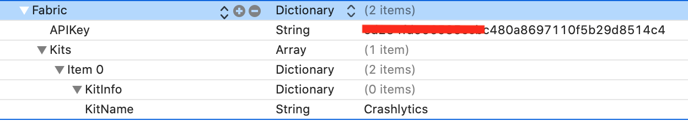

# Fabric

[参考](https://www.jianshu.com/p/e1ecd4b02e7c)
[简书](https://www.jianshu.com/p/e1ecd4b02e7c)
[博客园](https://www.cnblogs.com/wujy/p/5037084.html?utm_source=tuicool&utm_medium=referral)


[官网教程: 将Firebase添加到项目](https://firebase.google.cn/docs/ios/setup?hl=zh_cn)
[官网教程: 在 iOS 中开始使用 Firebase Crashlytics ](https://firebase.google.cn/docs/crashlytics/get-started-ios?hl=zh_cn)

### Pod下载Fabric
```
pod 'Fabric'
pod 'Crashlytics'
```

### 增加运行脚本

- cocopoads安装 `${PODS_ROOT}/Fabric/run <FABRIC_API_KEY> <BUILD_SECRET>`
- 手动安装的framework `${PROJECT_DIR}/Fabric.framework/run <FABRIC_API_KEY> <BUILD_SECRET>`

### 在Info.plist中增加api key
```
<key>Fabric</key>
<dict>
    <key>APIKey</key>
    <string>xxxxxxcbc480a8697110f5b29d8514c4</string>
    <key>Kits</key>
    <array>
        <dict>
            <key>KitInfo</key>
            <dict/>
            <key>KitName</key>
            <string>Crashlytics</string>
        </dict>
    </array>
</dict>
```


### 项目中添加Fabric代码支持

```objective-c
#import <Fabric/Fabric.h>
#import <Crashlytics/Crashlytics.h>

[Fabric with:@[[Crashlytics class]]]; 

// TODO: Move this to where you establish a user session
[self logUser];
```

```objective-c
- (void) logUser {
    // TODO: Use the current user's information
  	// You can call any combination of these three methods
	 	[CrashlyticsKit setUserIdentifier:@"12345"];
  	[CrashlyticsKit setUserEmail:@"user@fabric.io"];
  	[CrashlyticsKit setUserName:@"Test User"];
}

```

### 测试
```
[[Crashlytics sharedInstance] crash];
```

### 查看数据

登录fabric控制台查看crash数据 [https://fabric.io/](https://fabric.io/)  
如果看不到数据，看DWARF with dSYM File” for both Debug and Release配置是否开启  
