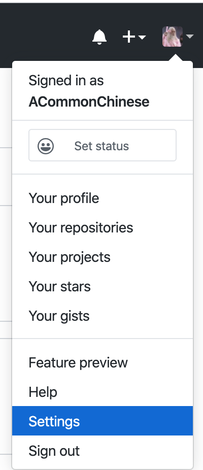
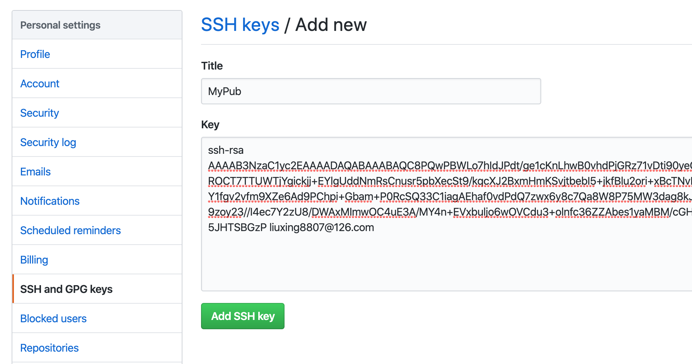

# Firebase

[在 iOS 中开始使用 Firebase Crashlytics](https://firebase.google.cn/docs/crashlytics/get-started-ios?hl=zh_cn)
[官方教程](https://firebase.google.cn/docs/crashlytics/get-started?platform=iOS&hl=zh_cn)  

```
➜  FirebaseDemo pod repo add crashlytics git@github.com:crashlytics/SpecsEAP.git 
Cloning spec repo `crashlytics` from `git@github.com:crashlytics/SpecsEAP.git`
[!] /usr/bin/git clone git@github.com:crashlytics/SpecsEAP.git -- crashlytics

Cloning into 'crashlytics'...
Warning: Permanently added the RSA host key for IP address '13.229.188.59' to the list of known hosts.
git@github.com: Permission denied (publickey).
fatal: Could not read from remote repository.

Please make sure you have the correct access rights
and the repository exists.
```

警告：为IP地址13.229.188.59的主机（RSA连接的）持久添加到hosts文件中，那就来添加吧

解决办法：
```
sudo vim /etc/hosts

13.229.188.59   github.com
```

```
Cloning into 'crashlytics'...
git@github.com: Permission denied (publickey).
fatal: Could not read from remote repository.
```
这个意思是说, 在github上配置的publickey和当前git环境不匹配


解决: 
第一步，git config --global --list 验证邮箱与GitHub注册时输入的是否一致

```
user.name=刘威振
user.email=weizhen.lwz@xxx.com
http.postbuffer=20180000
filter.lfs.clean=git-lfs clean -- %f
filter.lfs.smudge=git-lfs smudge -- %f
filter.lfs.process=git-lfs filter-process
filter.lfs.required=true
```

第二步，通过git config --global user.name “yourname”，git config --global user.email “email@email.com ”（这里得名字和邮箱都是注册github时用的）设置全局用户名和邮箱

```
git config --global user.name "ACommonChinese"
git config --global user.email "liuxing8807@126.com"
```

第三步，ssh-keygen -t rsa -C “这里换上你的邮箱”，一路回车，在出现选择时输入Y，再一路回车直到生成密钥。会在/Users/***/路径下生成一个.ssh文件夹，密钥就存储在其中

```
ssh-keygen -t rsa -C liuxing8807@126.com
Generating public/private rsa key pair.
Enter file in which to save the key (/Users/liuweizhen/.ssh/id_rsa): 
/Users/liuweizhen/.ssh/id_rsa already exists.
Overwrite (y/n)? y
Enter passphrase (empty for no passphrase): 
Enter same passphrase again: 
Your identification has been saved in /Users/liuweizhen/.ssh/id_rsa.
Your public key has been saved in /Users/liuweizhen/.ssh/id_rsa.pub.
The key fingerprint is:
SHA256:GFslSFy93ZHsUKIdOk2/NQ55oDwzAeskXxZLvbjF6DY liuxing8807@126.com
The key's randomart image is:
+---[RSA 2048]----+
|     o.oooo+=-.. |
|      o  o=**=*  |
|      ...o+%**o+.|
|       == ++=+*o.|
|      o So. o .. |
|           E     |
|          . .    |
|                 |
|                 |
+----[SHA256]-----+
```

第四步，到git仓库，添加秘钥(公钥)
找到`/Users/liuweizhen/.ssh/id_rsa.pub`, 里面存储的是RSA公钥, 把它复制进github中:


然后找到 SSH and GPG keys, 并起一个名字, 填入公钥的值



点击 Add SSH key  

第五步, ssh -T git@github.com 测试一下通不通，通了显示如下

```
➜  ssh -T git@github.com
Hi ACommonChinese! You've successfully authenticated, but GitHub does not provide shell access.
```

----------------------------------

对比.ipa的UUID和.dSYM的UUID

查看.ipa的UUID:  
①解压.ipa文件
②你在终端可以使用以下命令打印一个可执行的构建UUID
$ xcrun dwarfdump --uuid  DouBanJiang.app/DouBanJiang

查看.dSYM的UUID:  
①使用终端输入以下命令即可   
$ dwarfdump --uuid  /Users/kimmac/Desktop/DouBanJiang.dSYM