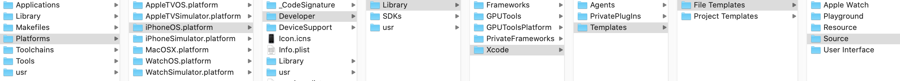
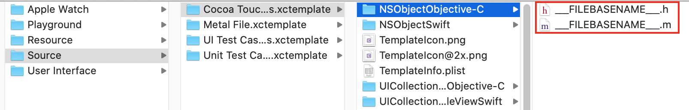

# 源代码说明文档

参考： 
[官方说明](https://help.apple.com/xcode/mac/current/#/devc8a500cb9)
[掘金](https://juejin.im/post/5c190588f265da611801a3fa)

源代码说明文档即源代码上方的说明性文档，形如：

```
//
//                         __   _,--="=--,_   __
//                        /  \."    .-.    "./  \
//                       /  ,/  _   : :   _  \/` \
//                       \  `| /o\  :_:  /o\ |\__/
//                        `-'| :="~` _ `~"=: |
//                           \`     (_)     `/
//                    .-"-.   \      |      /   .-"-.
//.------------------{     }--|  /,.-'-.,\  |--{     }-----------------.
// )                 (_)_)_)  \_/`~====-~`\_/  (_(_(_)                (
//                                                                     
//		File Name:		Test.swift
//		Product Name:	ff
//		Author:			banma-1118@大刘
//		Swift Version:	5.0
//		Created Date:	2020/1/20 4:29 PM
//		
//		Copyright © 2020 大刘.
//		All rights reserved.
// )                                                                  (
//'--------------------------------------------------------------------'
```

这种说明性文档一般是使用Text Macros来做的


Text Macros一般被翻译为文本宏，它是Xcode隐藏的特性，XCode 9.0后，Apple允许开发者进行自定义文本宏。  
文本宏（Text Macro）是一种可以就地展开（expanded in-place）为特定文本的符号。其常见于Xcode文件模板中. 

Xcode在使用文件模板创建文件时，会把文件模板中的文本宏，展开生成特定的文本，比如如使用NSObjectObjective-C文件模板创建一个文件名为MyObject.m的文件时，FILEHEADER会展开生成头部注释信息，FILEBASENAME会展开生成字符串MyObject，FILEBASENAMEASIDENTIFIER会展开生成字符串MyObject

Xcode模板有文件模板和工程模板。模板文件按照开发平台存放，其中每个平台的模板位置如下：

- macOS平台模板：/Applications/Xcode.app/Contents/Developer/Library/Xcode/Templates
- iOS平台模板：/Applications/Xcode.app/Contents/Developer/Platforms/iPhoneOS.platform/Developer/Library/Xcode/Templates
- tvOS平台板：/Applications/Xcode.app/Contents/Developer/Platforms/AppleTVOS.platform/Developer/Library/Xcode/Templates
- watchOS平台模板：/Applications/Xcode.app/Contents/Developer/Platforms/WatchOS.platform/Developer/Library/Xcode/Templates

举个例子：  
通过XCode建立一个基于Objective-C项目，名为TextMacrosDemo，建立一个Person类，生成了Person.h和Person.m这两个文件： 

```Objective-C
//
//  Person.h
//  TextMacrosDemo
//
//  Created by daliu on 2020/1/15.
//  Copyright © 2020 大刘. All rights reserved.
//

#import <Foundation/Foundation.h>

NS_ASSUME_NONNULL_BEGIN

@interface Person : NSObject

@end

NS_ASSUME_NONNULL_END

//
//  Person.m
//  TextMacrosDemo
//
//  Created by daliu on 2020/1/15.
//  Copyright © 2020 大刘. All rights reserved.
//

#import "Person.h"

@implementation Person

@end
```

查看文件模板：  
```
$ open /Applications/Xcode.app/Contents/Developer/Platforms/iPhoneOS.platform/Developer/Library/Xcode/
```

  



打开 `___FILEBASENAME___.h`会看到：   
```Objective-C
//___FILEHEADER___

___IMPORTHEADER_cocoaTouchSubclass___

NS_ASSUME_NONNULL_BEGIN

@interface ___FILEBASENAMEASIDENTIFIER___ : ___VARIABLE_cocoaTouchSubclass___

@end

NS_ASSUME_NONNULL_END
```

而`___FILEBASENAME___.m`对应：  

```Objective-C
//___FILEHEADER___

#import "___FILEBASENAME___.h"

@implementation ___FILEBASENAMEASIDENTIFIER___

@end
```

XCode 就是根据文件模板创建的文件，在文件模板中就是使用的文本宏Text Macros.  
假如我们在`___FILEBASENAME___.m`里添加一些代码：  

```Objective-C
//___FILEHEADER___
___DATE___ 
___FILENAME___ 

#import "___FILEBASENAME___.h"

@implementation ___FILEBASENAMEASIDENTIFIER___

// 我和我的祖国，一刻都不通分割

@end
```

新建类Hello，可见Hell.m内容为：  

```Objective-C
//
//  Hello.m
//  TextMacrosDemo
//
//  Created by daliu on 2020/1/15.
//  Copyright © 2020 大刘. All rights reserved.
//
2020/1/15 
Hello.m 

#import "Hello.h"

@implementation Hello

// 我和我的祖国，一刻都不通分割

@end

```

### 一般做法

在源代码文件头部加上一些信息说明，不推荐上面那种直接修改模板文件。一般是新建名为`IDETemplateMacros.plist`的文件并放入相应位置，比如：  

```plist
<?xml version="1.0" encoding="UTF-8"?>
<!DOCTYPE plist PUBLIC "-//Apple//DTD PLIST 1.0//EN" "http://www.apple.com/DTDs/PropertyList-1.0.dtd">
<plist version="1.0">
<dict>
	<key>FILEHEADER</key>
	<string>/***************************************************************************************
// *
// *  Project:        ___PROJECTNAME___
// *
// *  Copyright ©     2014-___YEAR___ 大刘互联科技 Co.,Ltd
// *                  All rights reserved.
// *
// *  This software is supplied only under the terms of a license agreement,
// *  nondisclosure agreement or other written agreement with 大刘 Technologies
// *  Co.,Ltd. Use, redistribution or other disclosure of any parts of this
// *  software is prohibited except in accordance with the terms of such written
// *  agreement with 大刘 Technologies Co.,Ltd. This software is confidential
// *  and proprietary information of 大刘 Technologies Co.,Ltd.
// *
// ***************************************************************************************
// *
// *  Header Name: ___FILENAME___
// *
// *  General Description: Copyright and file header.
// *
// *  Created by ___FULLUSERNAME___ on ___DATE___.
// *
// ****************************************************************************************/</string>
</dict>
</plist>
```

由于添加了字段：FILEHEADER：`The text placed at the top of every new text file.`  

```
<dict>
	<key>FILEHEADER</key>
	<string>
		the string here
	</string>
</dict>
```

因此`<string>`标签内的内容就会放在相应的代码顶层位置。  

写好后需要把此文件放入相应位置：  

- 只修改 project 中 唯独你 所创建的文件: `<ProjectName>.xcodeproj/xcuserdata/[username].xcuserdatad/`
- 修改 project 中 所有人 创建的文件: `<ProjectName>.xcodeproj/xcshareddata/IDETemplateMacros.plist`
- 修改 worksspace 中 唯独你 所创建的文件: `<WorkspaceName>.xcworkspace/xcuserdata/[username].xcuserdatad/`
- 修改 worksspace 中 所有人 所创建的文件: `<WorkspaceName>.xcworkspace/xcshareddata/`
- 修改此电脑上 Xcode 所创建的 所有文件: `~/Library/Developer/Xcode/UserData/`

右键Demo.xcodeproj > 显示包内容 > 右键project.xcworkspace > 显示包内容 > xcshareddata > 放入IDETemplateMacros.plist文件，这样当新建比如：Person.swift文件时，可以看到头文件生成了：

```Swift
///***************************************************************************************
// *
// *  Project:        Demo
// *
// *  Copyright ©     2014-2020 大刘 Technologies Co.,Ltd
// *                  All rights reserved.
// *
// *  This software is supplied only under the terms of a license agreement,
// *  nondisclosure agreement or other written agreement with 大刘 Technologies
// *  Co.,Ltd. Use, redistribution or other disclosure of any parts of this
// *  software is prohibited except in accordance with the terms of such written
// *  agreement with 大刘 Technologies Co.,Ltd. This software is confidential
// *  and proprietary information of 大刘 Technologies Co.,Ltd.
// *
// ***************************************************************************************
// *
// *  Header Name: Person.swift
// *
// *  General Description: Copyright and file header.
// *
// *  Created by 大刘 on 2020/1/15.
// *
// ****************************************************************************************/
```

### 格式化文本宏的值

一个text macro可以包含任意合法的unicode文本，它也可以包含另一个text macros，如果要包含其他text macro, 需要在这个宏的前和后分别加上三个英文下划线`___`，比如：`___FILENAME___`  
也可以通过添加修饰符修改宏文本，文本宏和修饰符之间用分号（:）分隔。多个修饰符之间可以用逗号（,）分隔。 
格式：`<MACRO>:<modifier>[,<modifier>]…`  
例如:

```
___FILENAME___  被替换为Person.swift
___FILENAME:deletingPathExtension___  被替换为Person
```


### 增加文本宏  

只需要增加key-value即可： 

```
<dict>
<key>AUTHOR</key>
<string>大刘 ___DATE___</string>
</dict>
```

### 给创建的类都添加统一前缀  
Xcode文件模板中，使用`FILEBASENAMEASIDENTIFIER`文本宏来展开生成类名，所以只需要在IDETemplateMacros.plist中重定义`FILEBASENAMEASIDENTIFIER`即可。编辑后的IDETemplateMacros.plist如下:

```
<?xml version="1.0" encoding="UTF-8"?>
<!DOCTYPE plist PUBLIC "-//Apple//DTD PLIST 1.0//EN" "http://www.apple.com/DTDs/PropertyList-1.0.dtd">
<plist version="1.0">
<dict>
	<key>FILEBASENAMEASIDENTIFIER</key>
	<string>DL___FILENAME:deletingPathExtension,identifier___</string>
</dict>
</plist>
```

这时候使用Xcode创建的一个类时，类的前缀都是以DL开头

### 公开可用的文本宏  

- **时间类**
    * DATE   当前的日期，如2018/12/20
    * YEAR   四位数字格式的当前年数，如2018
    * TIME   当前的时间，如20:48
- **开发环境类**
    - RUNNINGMACOSVERSION  当前macOS系统的版本
    - DEFAULTTOOLCHAINSWIFTVERSION  当前工程使用的Swift版本
    - FULLUSERNAME  当前系统用户的全名
    - USERNAME  当前macOS用户的登录名
- **开发工程配置类**
    - ORGANIZATIONNAME  当前工程配置的公司名称
    - WORKSPACENAME  当前Workspace的名称。如果Workspace中只有一个 Project，那么这个宏的值便是当前打开的Project的名称
    - PROJECTNAME  当前工程的名称
    - PACKAGENAME  当前工程Scheme所设置的包名
    - PACKAGENAMEASIDENTIFIER  把不符合C语言标识符规范的字符替换为下划线（_）后的PACKAGENAME
    - PRODUCTNAME  当前工程Scheme设置的应用名称
    - COPYRIGHT  当前工程的版权信息，如Copyright © 2018 DL-Unit. All rights reserved.。需要注意的是，若当前Xcode工程没有配置公司名，该值会是一个空字符串 
- **文本文件信息类**
    - FILENAME  当前文件的完整名称，包括扩展名
    - FILEBASENAME  删除掉扩展名后的FILENAME，如创建一个名为MyObject.m的文件，该值为MyObject
    - FILEBASENAMEASIDENTIFIER  把不符合C语言标识符规范的字符替换为下划线（_）后的FILEBASENAME，如创建一个名为My-Object.m的文件，该值为My_Object 注：C语言标识符规范只允许使用字母（A-Z, a-z）和数字（0-9）以及下划线（_），使用这个宏会把其他的字符自动替换成下划线
    - FILEHEADER  每个文本文件头部的文本. 注：该文本宏其实是由多个文本宏组成，其首先是展开生成以下文本 
```
//  ___FILENAME___
//  ___PACKAGENAME___
//
//  Created by ___FULLUSERNAME___ on ___DATE___.
//  ___COPYRIGHT___
//
```


​       之后Xcode再把上述的宏文本展开生成对应的文本，最后生成的就是我们日常看到的文件头部注释信息了    

- **其他**
    - UUID  使用这个宏的时候，会返回一个唯一ID。具体应用场景待探索。
    - NSHUMANREADABLECOPYRIGHTPLIST  target中的Info.plist 文件中人类可读的版权信息条目的值，该值包括这个条目的key和value以及XML的分隔符, 如：  
    
```
<key>NSHumanReadableCopyright</key>
<string>Copyright © 2017 Apple, Inc. All rights reserved.</string>
```

### 一个示例  

```
<?xml version="1.0" encoding="UTF-8"?>
<!DOCTYPE plist PUBLIC "-//Apple//DTD PLIST 1.0//EN" "http://www.apple.com/DTDs/PropertyList-1.0.dtd">
<plist version="1.0">
<dict>
	<key>FILEHEADER</key>
	<string>
//                         __   _,--="=--,_   __
//                        /  \."    .-.    "./  \
//                       /  ,/  _   : :   _  \/` \
//                       \  `| /o\  :_:  /o\ |\__/
//                        `-'| :="~` _ `~"=: |
//                           \`     (_)     `/
//                    .-"-.   \      |      /   .-"-.
//.------------------{     }--|  /,.-'-.,\  |--{     }-----------------.
// )                 (_)_)_)  \_/`~====-~`\_/  (_(_(_)                (
//                                                                     
//		File Name:		___FILENAME___
//		Product Name:	___PRODUCTNAME___
//		Author:			___AUTHOR___
//		Swift Version:	___DEFAULTTOOLCHAINSWIFTVERSION___
//		Created Date:	___DATETIME___
//		
//		Copyright © ___YEAR___ ___ORGANIZATIONNAME___.
//		All rights reserved.
// )                                                                  (
//'--------------------------------------------------------------------'
	</string>
	<key>AUTHOR</key>
	<string>___USERNAME___@___ORGANIZATIONNAME___</string>
	<key>DATETIME</key>
	<string>___DATE___ ___TIME___</string>
	<key>FILEBASENAMEASIDENTIFIER</key>
	<string>DL___FILENAME:deletingPathExtension,identifier___</string> 
</dict>
</plist>
```
