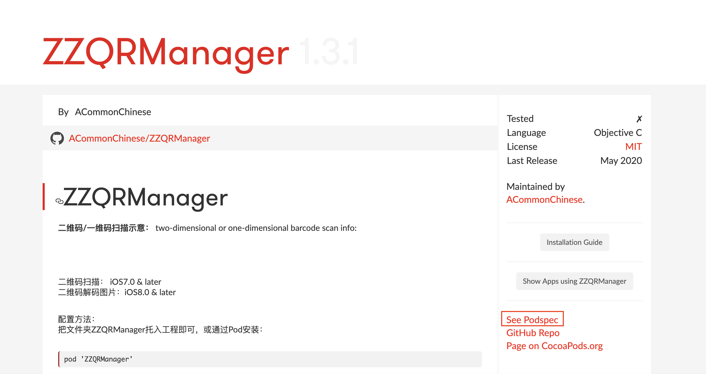

# 提交自己的Pod


参考：    
- [https://www.jianshu.com/p/cbd3cab306cd](https://www.jianshu.com/p/cbd3cab306cd)  
- [https://blog.csdn.net/pangshishan1/article/details/71709271](https://blog.csdn.net/pangshishan1/article/details/71709271)  
- [https://www.jianshu.com/p/e5209ac6ce6b](https://www.jianshu.com/p/e5209ac6ce6b)
- [官网](http://guides.cocoapods.org/making/specs-and-specs-repo.html)底部有一些说明。  

当我们自己写了一个库，可以针对这个库生成一个对应的.podspec文件并上传给CocoaPods官网。

--------------------------------------------------------------------------------------------------

### 示例代码：
`./demos/提交自己的Pod/ZZQRManager`

--------------------------------------------------------------------------------------------------

### 1. 编写podspec文件

假设我们项目和库都写好并已上传到github：

在项目PodTest中添加.podspec文件（在根目录添加）  
`pod spec create 'ZZQRManager'` \# 创建ZZQRManager.podspec文件

以下是我的文件结构：


```Ruby
Pod::Spec.new do |s|
    s.name         = 'ZZQRManager'
    s.version      = '1.3.1'
    s.summary      = 'An easy way to use qr manage and generate'
    s.homepage     = 'https://github.com/ACommonChinese/ZZQRManager'
    s.license      = 'MIT'
    s.authors      = {'ACommonChinese' => 'liuxing8807@126.com'}
    s.platform     = :ios, '9.0' # also ok: s.ios.deployment_target = '9.0'
    s.source   = { :git => 'https://github.com/ACommonChinese/ZZQRManager.git', :tag => s.version }
    s.source_files = 'ZZQRManager/*.{h,m}'
    s.resource     = 'ZZQRManager/ZZQRManager.bundle'
    s.requires_arc = true
end
```

source支持git, hg, http, svn的方式，我们这里使用git. 注意上面的version，这个应和git管理的tag值保持一致，因此我们需要打tag

### 2. 保持tag一致

cd ../ZZQRManager  
git add \*  
git commit -m "add tag example"  
git tag 1.3.1 \# 指定tag为1.3.1，和spec中的version保持一致

关于tag的一些操作：

```
git tag // 列出所有tag
git tag -d 1.2 // 删除本地tag 1.2
git push origin :refs/tags/1.2 // 删除远程tag 1.2
git push --tag 给远程添加tag
```

要上传Podspec到Cocoapod, 重点是tag, 即首先在git上设定tag值用于匹配.podspec文件中的version.

```Bash
git tag 1.0.0    #给源代码打版本标签，与podspec文件中version一致即可
git push --tag
```

--------------------------------------------------------------------------------------------------

### 3. 调用命令上传podspec文件

首先可以使用pod spec lint验证这个podspec文件是否合法：  
`pod spec lint ZZQRManager.podspec` # 如果只有一个podspec，像本例，ZZQRManager.podspec可以省略不写，另外, lint后可以加--allow-warnings忽略警告.

验证通过后就可以上传到CocoasPods, 依次按下面步骤操作：  

**Step 1&gt; 注册trunk \(第一次提交到cocoapod是需要注册trunk的\)**

```
$ pod trunk register liuxing8807@126.com 'ACommonChinese'
pod trunk register liuxing8807@126.com 'ACommonChinese'
[!] Please verify the session by clicking the link in the verification email that has been sent to liuxing8807@126.com
```

**Step 2&gt; 打开邮箱链接并点击链接，然后调用命令查询注册信息\***

```
$ pod trunk me
  - Name:     ACommonChinese
  - Email:    liuxing8807@126.com
  - Since:    April 19th, 2016 21:09
  - Pods:
    ...
```

**Step 3&gt; 发布到CocoaPods**

```
pod trunk push ZZQRManager.podspec # 忽略警告：pod trunk push ZZQRManager.podspec --allow-warnings
```

### 查看和使用自己上传的podspec

审核通过后，可以在命令行通过pod search ZZQRManager查找，另外也可以在[https://cocoapods.org/](https://cocoapods.org/)中搜索： 



注间右下角有一个“See Podspec”，点开后可以找到本地`~/.cocoapods/repos/cocopods/`下对就的JSON文件

--------------------------------------------------------------------------------------------------

### JSON疑惑 

本地的描述清单文件均为xxx.podspec.json，内容是JSON, 并不是.podspec, 关于这个问题可以参见：  
[https://github.com/CocoaPods/CocoaPods/issues/1485](https://github.com/CocoaPods/CocoaPods/issues/1485)  
[https://github.com/CocoaPods/CocoaPods/issues/2313](https://github.com/CocoaPods/CocoaPods/issues/2313)  
Just to clarify, you do not actually need to use JSON specs anywhere other than the master specs repository, and trunk deals with this conversion. You can use the Ruby spec with CocoaPods.  
You can already convert specs from Ruby DSL to JSON:

```Ruby
$ pod ipc spec --help
Usage:

    $ pod ipc spec PATH

      Converts a podspec to JSON and prints it to STDOUT.
$ pod ipc spec QueryKit.podspec
```

即，可以通过命令pod ipc spec xxx.podspec转换成.json，比如：

```Ruby
$ pod ipc spec --help
Usage:

    $ pod ipc spec PATH

      Converts a podspec to JSON and prints it to STDOUT.

Options:

    --silent    Show nothing
    --verbose   Show more debugging information
    --no-ansi   Show output without ANSI codes
    --help      Show help banner of specified command
$ pod ipc spec ZZQRManager.podspec
{
  "name": "ZZQRManager",
  "version": "1.3",
  "summary": "An easy way to use qr manage",
  "homepage": "https://github.com/ACommonChinese/ZZQRManager/",
  "license": "MIT",
  "authors": {
    "ACommonChinese": "liuxing8807@126.com"
  },
  "platforms": {
    "ios": "11.0"
  },
  "source": {
    "git": "https://github.com/ACommonChinese/ZZQRManager.git",
    "tag": "1.3"
  },
  "source_files": "ZZQRManager/*.{h,m}",
  "resources": "ZZQRManager/ZZQRManager.bundle",
  "frameworks": "UIKit",
  "requires_arc": true
}
```

我们向CocoaPods官网提交的文件依然是.podspec, trunk会帮我们转成json的

### 遇到的问题

pod spec lint xxx 遇到的错误：

* ERROR \| \[iOS\] unknown: Encountered an unknown error \(Could not find a `ios` simulator \(valid values: com.apple.coresimulator.simruntime.ios-12-2, com.apple.coresimulator.simruntime.tvos-12-2, com.apple.coresimulator.simruntime.watchos-5-2\). Ensure that Xcode -&gt; Window -&gt; Devices has at least one `ios` simulator listed or otherwise add one.\) during validation.

解决方法：升级CocoaPods:   
`sudo gem install cocoapods`

*pod trunk push xxx.podspec* 时出现错误：`CDN: trunk URL couldn't be downloaded: https://cdn.cocoapods.org/Specs/a/a/a/GDTMobSDK/4.7.2/GDTMobSDK.podspec.json, error: Net::OpenTimeout` 
解决方法：
1. 使用`pod repo list`列出本地所有的repo库地址
2. 删除非官方的repo, 即只保留 `https://github.com/CocoaPods/Specs.git`，使用命令 `pod repo remove NAME`
3. 再次提交
